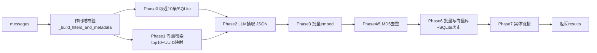

# Rank 41：mem0ai/mem0 源码级调研报告

## 1. 项目概述与定位

- **项目名称**：mem0（GitHub: https://github.com/mem0ai/mem0 ）
- **Star 数**：约 65.2k（数据快照值）
- **主要语言**：Python（另有 TypeScript SDK `mem0-ts/`）
- **一句话定位**：面向 AI Agent 的"drop-in 长期记忆层"——把对话经 LLM 抽取为结构化事实，写入可配置向量库并做去重/更新/失效，再以 API/SDK 形式为 Agent 提供跨会话、跨用户的上下文。

**目标用户/场景**：需要给自研 Agent、聊天应用、Copilot 增加"记住用户"能力的开发者；既支持作为 Python/TS 库内嵌，也支持自托管 FastAPI 服务（`app/routers/memories.py` 等）与 MCP 接入。

**成熟度**：非常成熟。仓库含完整的 `mem0/` SDK、`app/` 服务端、`mem0-ts/` 多语言 SDK、测试与文档；核心 `mem0/memory/main.py` 单文件即约 45k 字符，注释中大量引用 issue 编号（#4490、#6277、#6655）说明经过多轮生产级打磨。

> 注意：mem0 **本身不是编排框架/Agent**，它是 Agent 的"记忆组件"。因此"编排模式"一节描述其内部记忆管线，稳定性/高可用/自我进化章节聚焦记忆子系统本身。

## 2. 源码结构总览

顶层（经 jsDelivr 包清单确认）：

```
mem0/
├── memory/
│   ├── main.py            # Memory 类核心（~45k 字符），add/search/get/delete 主流程
│   ├── base.py            # MemoryBase 抽象基类
│   ├── storage.py         # SQLiteManager：消息与变更历史持久化
│   ├── notices.py         # 用量/性能/规模提示（telemetry 相关）
│   └── telemetry.py       # capture_event 遥测
├── configs/
│   ├── base.py            # MemoryConfig / MemoryItem (pydantic)
│   ├── enums.py           # MemoryType (PROCEDURAL 等)
│   ├── prompts.py         # 抽取/更新/回答全部提示词
│   ├── embeddings/ llms/ vector_stores/   # 各 Provider 配置
├── vector_stores/         # 18+ 向量库实现：qdrant/pgvector/redis/milvus/pinecone/...
│   └── base.py            # VectorStoreBase（含 keyword_search 默认实现）
├── utils/
│   ├── factory.py         # EmbedderFactory/LlmFactory/VectorStoreFactory/RerankerFactory
│   ├── entity_extraction.py# extract_entities / extract_entities_batch
│   ├── scoring.py         # BM25 归一化、混合打分 score_and_rank
│   └── lemmatization.py   # lemmatize_for_bm25
├── exceptions.py          # LLMError / Mem0ValidationError 等
app/                       # FastAPI 服务端：routers/{memories,apps,config,stats}.py
mem0-ts/                   # TypeScript SDK
```

**核心源码文件清单（源码确认）**：
- `mem0/memory/main.py` — `Memory` 类、`add()`、`_add_to_vector_store()`、`search()`、`get_all()`、`_upsert_entity()`、`_build_filters_and_metadata()`
- `mem0/configs/prompts.py` — `FACT_RETRIEVAL_PROMPT`、`USER_MEMORY_EXTRACTION_PROMPT`、`AGENT_MEMORY_EXTRACTION_PROMPT`、`DEFAULT_UPDATE_MEMORY_PROMPT`
- `mem0/memory/storage.py` — `SQLiteManager`（`get_last_messages`/`save_messages`/`batch_add_history`）
- `mem0/utils/factory.py`、`mem0/utils/scoring.py`、`mem0/utils/entity_extraction.py`

**入口**：库模式 `from mem0 import Memory; m = Memory(config); m.add(...)`；服务端入口在 `app/`。

## 3. 系统架构分析

**编排模式（源码确认）**：mem0 不是 LLM 推理循环型 Agent，而是一条**确定性的分阶段记忆管线（Phased Pipeline）**。核心证据在 `Memory._add_to_vector_store()`，注释明确标注 `# === V3 PHASED BATCH PIPELINE ===`：

- **Phase 0 上下文采集**：`session_scope = _build_session_scope(filters)`，从 SQLite 取最近 10 条消息 `self.db.get_last_messages(session_scope, limit=10)`。
- **Phase 1 已有记忆检索**：对新消息 embed 后 `self.vector_store.search(..., top_k=10)`，并做 **UUID→索引映射（anti-hallucination）**：`uuid_mapping[str(idx)] = mem.id`，把真实 UUID 换成 `0..N` 序号交给 LLM，防止 LLM 编造 ID。
- **Phase 2 LLM 抽取（单次调用）**：系统提示取 `ADDITIVE_EXTRACTION_PROMPT`（agent 作用域时追加 `AGENT_CONTEXT_SUFFIX`），用户提示由 `generate_additive_extraction_prompt()` 拼装，要求 `response_format={"type":"json_object"}`。
- **Phase 3 批量嵌入**：`embed_batch(mem_texts, "add")`，失败则降级逐条 `embed()`。
- **Phase 4/5 CPU 处理 + 哈希去重**：`mem_hash = hashlib.md5(text.encode())`，与 `existing_hashes` 和本批 `seen_hashes` 双重比对去重。
- **Phase 6 批量持久化**：`vector_store.insert(vectors, ids, payloads)`，失败回退逐条插入。
- **Phase 7 实体链接**：`extract_entities_batch` 抽取实体，全局去重后批量 embed、`entity_store.search_batch` 匹配（语义阈值 `score >= 0.95`），命中则合并 `linked_memory_ids`，否则批量 insert。
- **Phase 8**：`db.save_messages` + 遥测 `capture_event("mem0.add", ...)`。

**数据流**：原始 messages → 作用域校验（`_build_filters_and_metadata`）→ 取上下文 → 向量检索相似记忆 → LLM 抽取事实（ADD/UPDATE/DELETE/NONE）→ 批量 embedding → MD5 去重 → 写入向量库 + SQLite 历史 → 实体图谱链接 → 返回 `{results:[{id,memory,event}]}`。

**关键类/函数**：`Memory`（main.py）、`MemoryConfig/MemoryItem`（configs/base.py）、`SQLiteManager`（storage.py）、`VectorStoreBase`（vector_stores/base.py）、各 `*Factory`（utils/factory.py）。



## 4. 功能拆解

- **记忆写入 `add()`**：`infer=True` 走 LLM 抽取管线；`infer=False` 把每条消息原样 embed 入库（跳过 system 消息）。
- **三类记忆角色分离**：`FACT_RETRIEVAL_PROMPT` / `USER_MEMORY_EXTRACTION_PROMPT`（仅用户消息）/ `AGENT_MEMORY_EXTRACTION_PROMPT`（仅助手消息）；`_should_use_agent_memory_extraction()` 根据是否有 `agent_id` 且含 assistant 消息自动切换。
- **程序性记忆**：`memory_type="procedural_memory"` 走 `_create_procedural_memory()`（`PROCEDURAL_MEMORY_SYSTEM_PROMPT`）。
- **检索 `search()`**：向量相似度 + BM25 混合（`lemmatize_for_bm25`、`normalize_bm25`、`score_and_rank`、`ENTITY_BOOST_WEIGHT`），支持 reranker、`explain` 打分明细、丰富元数据算子（eq/ne/in/gt/contains/AND/OR/NOT）。
- **向量库插件化**：`VectorStoreFactory.create()` 支持 18+ 后端；不支持 `keyword_search` 的后端会打 warning 并降级为纯语义检索。
- **服务端**：`app/routers/memories.py`（约 21k 字符）暴露 REST，`stats.py` 提供统计。

## 5. 技术亮点与优势

1. **UUID 映射反幻觉（源码确认）**：Phase 1 把真实 UUID 换成 `0..N` 序号交给 LLM，再在输出时映射回真实 ID——避免 LLM 编造不存在的记忆 ID，是工业级记忆系统的关键细节。
2. **批量 + 降级的管线设计（源码确认）**：Phase 3/6/7 一律先 `*_batch` 批量，异常时逐条重试（`except Exception: for ... embed()/insert()`），兼顾吞吐与健壮性。
3. **MD5 哈希 + 语义双重去重（源码确认）**：精确文本用 MD5（快、零成本），跨记忆的实体关系用向量 `score>=0.95` 语义合并——精确与模糊两层。
4. **多租户/多作用域隔离（源码确认）**：`user_id/agent_id/run_id/actor_id` 强制通过 filters 传递，`_strip_identity_keys()` 防止调用方通过 metadata 越权写入他人作用域（注释引用 issue #6655）。
5. **配置深拷贝容错**：`_safe_deepcopy_config()` 对不可序列化对象（如 OpenSearch 的 AWSV4SignerAuth）走 `model_dump()` 重建，并区分"运行时字段（保留）"与"敏感字段（置空）"。

## 6. 稳定性机制【重点】

- **错误分类与显式抛出（源码确认）**：LLM 抽取失败**不再静默返回空**，而是 `raise LLMError(...)`——注释明确说明旧实现会把"LLM 不可用(429/5xx/timeout)"和"确实没抽到事实"都伪装成空列表，导致上层无法区分，故改为显式异常。这是经过踩坑后的稳定性改进。
- **输入校验（源码确认）**：`_validate_and_trim_entity_id()` 把 int 自动转 str、拒绝空串/含空白 ID；`_validate_search_params()` 校验 threshold∈[0,1]、top_k 非负；`_validate_and_trim_search_query()` 拒绝空查询；`_build_filters_and_metadata()` 强制至少提供一个作用域 ID，否则抛 `Mem0ValidationError(VALIDATION_001)`。
- **解析容错（源码确认）**：LLM 返回先 `remove_code_blocks()`，`json.loads(strict=False)`，失败再 `extract_json()` 正则兜底，再失败则 `extracted_memories=[]` 而不崩。
- **降级回退链（源码确认）**：批量 embed→逐条 embed；批量 insert→逐条 insert；`batch_add_history`→逐条 `add_history`；`_existing_entities_by_text` 失败→回退语义去重。每个降级点都 `logger.warning/debug`。
- **边界处理**：`expiration_date` 校验 ISO 格式、`_payload_is_expired()` 过期记忆默认隐藏；实体 embed 数量不匹配时补齐 `None` 并过滤，避免丢链接。
- **崩溃恢复**：消息与每次变更（ADD/UPDATE/DELETE）写入 SQLite（`batch_add_history`/`is_deleted` 软删标记），即历史审计/恢复底座。

## 7. 高可用机制【重点】

- **容错/降级**：如第 6 节，几乎每个外部依赖调用（embed/vector insert/LLM）都包 try/except 并有单条降级路径，单点失败不拖垮整批。
- **并发**：`main.py` 顶部 `import concurrent.futures`；批量处理以批为单位降低 RTT。实体 store 在 Qdrant 嵌入模式下**复用同一 client**（注释：避免 RocksDB lock 争用）——这是明确的并发/锁设计。
- **横向扩展**：记忆数据与作用域元数据完全外置到可替换向量库 + SQLite，`Memory` 对象本身无状态可水平复制；服务端 `app/` 是无状态 REST，适合多实例部署。
- **资源管理**：`DELETE_ALL_BATCH_SIZE = 1000` 分批删除避免一次拉取过大；`list(..., top_k=10000)` 限制单批实体扫描量。
- **可观测性**：`capture_event("mem0.init/add/search/...")` 埋点；`notices.py` 对慢查询（`PERFORMANCE_SLOW_QUERY_THRESHOLD_SECONDS`）、规模阈值、特性误用给运行时提示。

## 8. 自我进化机制【重点】

mem0 的"自我进化"本质是**记忆的自动增删改**，而非 Agent 行为学习：

- **自反馈式记忆更新（源码确认）**：`DEFAULT_UPDATE_MEMORY_PROMPT` 让 LLM 对每条新事实与旧记忆对比，输出四态 `ADD / UPDATE / DELETE / NONE`——矛盾则 DELETE、同义则保留信息更全者、新增则 ADD。这是记忆层的"自我修正"闭环。
- **反幻觉**：UUID 映射保证 UPDATE/DELETE 精确落到既有记忆，不会因为 ID 编造而写错对象。
- **记忆遗忘/失效（源码确认）**：`expiration_date` 让过期记忆自动隐藏；OSS 版 `decay`（记忆衰减）被显式禁用并给出引导文案（`get_decay_feature_error_message`），说明衰减是规划中/平台版能力。
- **实体图谱自组织（源码确认）**：`_upsert_entity`/`_link_entities_for_memory` 把事实中的实体抽出来并维护 `linked_memory_ids`，形成"记忆↔实体"双向索引，检索时 `ENTITY_BOOST_WEIGHT` 提升命中——这是记忆结构的自组织进化。
- **跨会话连续性**：Phase 0 注入近 10 条历史消息，使本次抽取能感知上下文，避免重复记录。

## 9. openmate 可借鉴点【重点】

- **P0｜记忆增删改四态 + 反幻觉 UUID 映射**：openmate 的长期记忆不要只做"追加"。引入 `ADD/UPDATE/DELETE/NONE` 判定（可直接参考 `DEFAULT_UPDATE_MEMORY_PROMPT`），并把内部实体 ID 用序号喂给 LLM、输出再映射回真 ID。预期：记忆不再无限膨胀/自相矛盾，长期对话一致性显著提升。
- **P0｜批量管线 + 单点失败降级**：openmate 写记忆时先批量 embed/批量落库，失败自动逐条重试。预期：批量吞吐高，且单条坏数据不中断整条记忆写入链路。
- **P1｜多租户作用域强制校验 + metadata 越权防护**：`_strip_identity_keys()` 思路可直接用于 openmate 多用户/多端（桌面/手机）记忆隔离——作用域 ID 只能由参数决定，禁止从自由 metadata 注入。
- **P1｜MD5 精确去重 + 语义阈值模糊去重双层**：文本级用 hash 去重（零成本），跨语句同义用向量 score≥0.95 合并。预期：避免记忆库被近似重复刷屏。
- **P2｜混合检索（语义 + BM25 + 实体加权）**：`score_and_rank`/`ENTITY_BOOST_WEIGHT` 思路，让 openmate 检索兼顾语义与关键词命中。
- **P2｜配置深拷贝 + 敏感字段脱敏**：`_safe_deepcopy_config` 区分运行时对象与密钥，对 openmate 多模型/多向量后端配置复用有借鉴意义。

## 10. 源码验证标注

**源码直接阅读（经 jsDelivr CDN 读取 raw 文件）**：
- `mem0/memory/main.py`（分段读取约 16k/41k 字符）：`Memory.__init__`、`add()`、`_add_to_vector_store()` Phase0-8、`get/get_all/search`、`_upsert_entity`、`_strip_identity_keys`、`_build_filters_and_metadata`、各 `_validate_*`、`_safe_deepcopy_config`。
- `mem0/configs/prompts.py`：`FACT_RETRIEVAL_PROMPT`、`USER/AGENT_MEMORY_EXTRACTION_PROMPT`、`DEFAULT_UPDATE_MEMORY_PROMPT`。
- 目录结构：jsDelivr `data.jsdelivr.com/v1/packages/gh/mem0ai/mem0@main`。

**来自文档/推断**：Star 数、版本成熟度、MCP 接入为仓库元信息与 README 层面判断；`mem0-ts/`、`app/` 服务端内部细节未逐行读，仅据目录清单推断职责。

**源码不可得**：`storage.py`、`scoring.py`、`entity_extraction.py` 具体实现未逐行读，仅据 `main.py` 中的调用签名与 import 推断其职责；`app/` 服务端路由逻辑未深入。结论中已对这些做相应标注。
