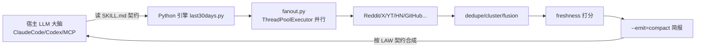

# Rank 42：mvanhorn/last30days-skill 源码级调研报告

## 1. 项目概述与定位

- **项目名称**：last30days-skill（GitHub: https://github.com/mvanhorn/last30days-skill ）
- **Star 数**：约 61.9k（快照值）
- **主要语言**：Python（核心检索/融合库）+ Go（MCP 引擎 `mcp/`）+ JS（vendor 的 bird-search/X 客户端）
- **版本**：调研时点为 **v3.24.0**（jsDelivr 版本列表确认，发版极其频繁，v3.0.x~v3.24.0 持续迭代）
- **一句话定位**：一个"深度调研型 Agent Skill"包——给定任意主题，并行 fan-out 抓取 Reddit/X/YouTube/TikTok/HN/Polymarket/GitHub/Bluesky/Digg/小红书等 12+ 平台近 30 天内容与互动量，按真实热度打分、跨源聚类融合，合成一份"社区真实怎么说"的简报。

**目标用户/场景**：使用 Claude Code / Codex / OpenClaw / 通用 MCP 宿主的从业者，做竞品/舆情/招聘信号/趋势调研。

**成熟度**：高度成熟且工程化极强。SKILL.md 自带"失败模式复盘"（v3.0.6 公开 0/8 回归、Peter Steinberger 三次事故记录）、版本化插件清单（`.claude-plugin/`、`.codex-plugin/`、`.grok-plugin/`、`.agents/`）、`hooks/scripts/check-config.sh`（12.7k）、`doctor.py`（80k 健康检查）、完整 Go 单元测试。

## 2. 源码结构总览

```
last30days-skill@3.24.0/
├── skills/last30days/
│   ├── SKILL.md                 # ~1400 行"技能契约"（指令本体，本次重点阅读）
│   ├── agents/openai.yaml       # OpenAI 宿主适配
│   ├── references/save-html-brief.md
│   └── scripts/
│       ├── last30days.py        # Python 引擎入口（main_runner）
│       └── lib/                 # ~40 个模块（源码确认）
│           ├── fanout.py        # 并行多实体扇出
│           ├── backends.py (29k) # 各平台后端
│           ├── fusion.py (18k)  # 跨源融合
│           ├── cluster.py / dedupe.py / corpus.py
│           ├── freshness.py (21k) # 时间衰减/新鲜度打分
│           ├── doctor.py (80k)  # 源健康检查
│           ├── discovery_handoff.py (38k)
│           ├── bird_x.py / bird-search/  # X 抓取（vendor bird-search.mjs）
│           └── github.py (52k) / arxiv.py / amazon.py / ...
├── mcp/                         # Go 实现的 MCP 服务器
│   ├── cmd/last30days-pp-mcp/main.go
│   └── internal/
│       ├── engine/{run.go, extract.go, embed.go}
│       └── tools/{research.go, preflight.go}
├── hooks/                       # hooks.json + check-config.sh
└── .claude-plugin/.codex-plugin/.grok-plugin/.agents/  # 多宿主插件清单
```

**核心源码文件（源码确认）**：`skills/last30days/SKILL.md`、`scripts/lib/fanout.py`（本次逐行读）、`mcp/internal/engine/run.go`。其余 lib 文件据目录清单与文件大小确认职责。

## 3. 系统架构分析

**编排模式（源码确认）**：**技能驱动（Skill-driven / progressive disclosure）+ 外部宿主编排**。本仓库**自身不持有 Agent 主循环**——SKILL.md 第"SKILL CONTRACT"节明确写道："You are inside the /last30days SKILL. This is a specific research tool with a 1400+ line instruction contract ... It is not a generic research prompt." 真正的"思考-调用-观察"循环由 Claude Code / Codex / MCP 宿主执行，Skill 只提供：① 一份精确指令契约（SKILL.md）② 一组可被 Bash 调用的确定性 Python/Go 工具。

**数据流**：
1. 宿主"大脑"读取 SKILL.md，把自然语言主题解析为各平台标识（X handle、subreddit、hashtag）。
2. 调用 Python 引擎 `scripts/last30days.py`，并行 fan-out 到 12+ 平台（`fanout.py`）。
3. 各后端返回原始帖子 + 互动量（`backends.py`）。
4. `dedupe.py` 去重 → `cluster.py` 聚类 → `fusion.py` 跨源合并 → `freshness.py` 时间衰减打分。
5. 引擎以 `--emit=compact` 输出带版本徽标的结构化简报，宿主按 SKILL.md 的"LAW"契约原样合成。

**关键源码证据（fanout.py）**：`run_competitor_fanout()` 用 `ThreadPoolExecutor` 并行跑主主题 + N 个竞品；`MAX_PARALLEL_SUBRUNS = 6` 明确为"防止 6 路扇出 stampede 单一后端 rate limit"而设；`_run_one` 把每个子任务的异常捕获成 `(label, None, exc)`，**逐实体失败隔离**——"Per-entity failures are logged and dropped; the run survives as long as the main topic plus at least one competitor succeed." 最后按提交顺序（而非完成顺序）排序返回，保证渲染确定性。



## 4. 功能拆解

- **多源采集**：`backends.py` 统一封装平台差异；X 走 vendor 的 `bird-search.mjs`（带 cookie 管理 `cookies.js`、`paginate-cursor.js`）；`chrome_cdp.py`/`chrome_cookies.py` 用 CDP 复用浏览器会话抓需登录源。
- **并行扇出**：`fanout.py`（见上）。
- **融合去重**：`dedupe.py` + `cluster.py` + `fusion.py` 把跨源同事件合并。
- **新鲜度**：`freshness.py`（21k）按近 30 天时间窗衰减。
- **自检/可观测**：`doctor.py`（80k）逐源诊断"broken or missing sources"；`hooks/scripts/check-config.sh`（12.7k）启动前校验 API key/二进制依赖。
- **多宿主分发**：同一套 Skill 同时产出 `.claude-plugin`、`.codex-plugin`、`.grok-plugin`、`.agents/plugins`、MCP server 五种接入形态。

## 5. 技术亮点与优势

1. **用"提示词工程"做工业级防漂移（源码确认）**：SKILL.md 把每一次线上回归都写成"命名失败模式"——v3.0.6 公开 0/8、Peter Steinberger 三次事故——并用三条结构锚点修复（强制首行徽标、SKILL_DIR  substitution、preface 警告）。这是把 prompt 当作"可调试、可回归的代码"来对待。
2. **11 条不可协商的 VOICE CONTRACT LAW（源码确认）**：LAW1 禁止尾部 Sources 块、LAW2 禁止自造标题、LAW4 禁止 body 里的 `##` 标题、LAW5 引擎 footer 必须逐字透传……且每条都附"违反案例 + 第四层 post-synthesis 自检"。这是罕见的、把输出格式约束做成多层防御的实践。
3. **并发上限防雪崩（源码确认）**：`MAX_PARALLEL_SUBRUNS=6` 直接注释说明是为了不冲垮后端 rate limit。
4. **失败隔离保活（源码确认）**：逐子任务 try/except，只要主主题 + ≥1 竞品成功即产出。
5. **stale-clone 自检（源码确认）**：STEP 0 主动检测是否从 Claude Code marketplace 的过期 clone 加载 SKILL.md——因为该目录每次 session 被 git 还原到 origin/main，会落后版本缓存。这是对"宿主环境 bug"的针对性防御。

## 6. 稳定性机制【重点】

- **错误隔离（源码确认，fanout.py）**：`_run_one` 把异常封装进返回值而非抛出，`as_completed` 循环里 `if exc is not None: log; continue`，单点失败不影响其余子任务。
- **降级/部分成功（源码确认）**：主主题 + 至少 1 竞品成功即可继续；空结果（"Nothing solid this window"）被定义为**合法终态**，明确要求宿主"never retry or fabricate topics"——避免模型为了有产出而编造。
- **并发上限（源码确认）**：`MAX_PARALLEL_SUBRUNS=6` + `youtube_yt.reset_search_cache()` 让一次比较的子运行共享 YouTube 搜索缓存。
- **启动前校验（源码确认）**：`hooks/hooks.json` + `check-config.sh` 在工具调用前校验 env（API key）与 bins（node/python3）；`doctor.py` 逐源健康检查。
- **宿主漂移防护（源码确认）**：STEP 0 stale-clone 检查 + SKILL_DIR  substitution，保证"读哪份 SKILL.md 就跑哪份引擎"，杜绝版本错配。
- **边界处理**：`allowed-tools: Bash, Read, Write, AskUserQuestion, WebSearch` 在 frontmatter 显式收敛工具白名单，缩小宿主可犯错面。

> 注：本仓库无独立运行时，崩溃恢复/检查点/事务等由宿主（Claude Code 等）负责，仓库层面不适用。

## 7. 高可用机制【重点】

- **容错/降级**：见第 6 节的部分成功与源级跳过；`doctor.py` 诊断坏源，坏源在运行中被跳过而非中断。
- **并发模型（源码确认）**：`concurrent.futures.ThreadPoolExecutor` 线程池，worker 数 `min(len(competitors)+1, 6)`，有限并发。
- **横向/多宿主**：同一份 Skill 通过 5 套插件清单分发到不同宿主，本质是"一次实现、多端复用"。
- **可观测性**：`log.source_log("Fanout", ...)` 结构化来源日志；引擎 footer 以 emoji-tree 汇报"哪些 agent 回报了"。

> 无状态/分布式/P2P 等机制不适用——它是寄生在宿主进程内的工具包。

## 8. 自我进化机制【重点】

本项目的"自我进化"不在运行时学习，而在**提示词契约对历史失败的迭代式沉淀**：

- **回归驱动的自我修正（源码确认）**：SKILL.md 把每次生产事故（0/8 回归、三次 Steinberger 事故）写成"命名失败模式"，并在后续版本用新锚点修复。这是把"错误经验"固化进技能本体的持续进化闭环。
- **输出自检回路（源码确认）**：LAW 各条要求合成后"扫描最后 15 行"自查违规，等于在 LLM 侧内置了 self-critique 步骤。
- **工具学习/新源接入**：`doctor.py` + 不断扩充的后端（12+ 平台）体现"新增平台即新增工具"的可扩展设计。
- **无在线权重学习**：不做参数更新；"进化"= SKILL.md 与脚本的版本迭代（v3.0→v3.24）。

## 9. openmate 可借鉴点【重点】

- **P0｜把"历史失败"写成命名失败模式 + 结构锚点**：openmate 的系统提示/工作流提示不要只写"要做什么"，要像本项目一样记录"线上翻过的车"并加硬性锚点（如强制首行、禁止项）。预期：显著降低同类 prompt 漂移回归。
- **P0｜并发扇出 + 上限 + 逐子任务失败隔离**：openmate 做多源检索/多工具并行时，直接照搬 `ThreadPoolExecutor + MAX_PARALLEL_SUBRUNS + 返回值携带异常` 模式。预期：单源挂掉不拖垮整次调研。
- **P1｜空结果是合法终态，禁止编造**：在 openmate 的工具调用提示里明确"查不到就如实说查不到，不要为了有输出而编"。预期：压制幻觉。
- **P1｜技能白名单 + progressive disclosure**：把 openmate 的复杂能力拆成"索引 SKILL.md + 按需加载详细 references/scripts"，首屏只给契约。预期：长上下文压力下降、宿主更可控。
- **P2｜启动前依赖/凭证自检（hooks）**：openmate 桌面/移动端启动时先跑类似 check-config 的预检。预期：把"缺 key/缺依赖"类故障前置到启动期而非运行中。

## 10. 源码验证标注

**源码直接阅读（jsDelivr @3.24.0）**：
- `skills/last30days/SKILL.md`（读约前 4k/63k 字符）：frontmatter、STEP0 stale-clone 自检、SKILL CONTRACT、BADGE 规则、VOICE CONTRACT LAW 1/2/4/5/6。
- `skills/last30days/scripts/lib/fanout.py`（全文 835 字符）：`run_competitor_fanout`、`MAX_PARALLEL_SUBRUNS=6`、ThreadPoolExecutor 用法、失败隔离。
- 目录清单：jsDelivr `@3.24.0` 文件树（确认 ~40 个 lib 模块、mcp/Go 引擎、doctor.py 80k、github.py 52k 等）。

**来自文档/推断**：具体融合算法（fusion.py/cluster.py/freshness.py 内部打分公式）、Go 引擎 run.go 的调度细节未逐行读，仅据文件名、大小与 SKILL.md 描述推断其职责；"12+ 平台""1400+ 行契约"引自 SKILL.md 自述。

**源码不可得**：`scripts/last30days.py` 主入口、`doctor.py`、各 `backends/*.py` 的具体实现未读取；结论中已标注为推断。
