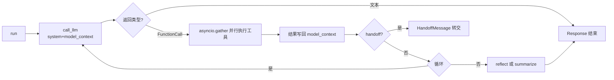

# Rank 43：microsoft/autogen 源码级调研报告

## 1. 项目概述与定位

- **项目名称**：AutoGen（GitHub: https://github.com/microsoft/autogen ）
- **Star 数**：约 61.0k（快照值）
- **主要语言**：Python（核心 `autogen-agentchat`/`autogen-core`），同时提供 .NET/C# 与 JS 实现
- **一句话定位**：微软出品的多 Agent 对话编程框架，核心抽象是"可对话的 Agent"——多个 Agent 通过消息互相对话、调用 LLM、执行工具/代码或请求人类确认来完成任务。

**目标用户/场景**：需要编排多 Agent 协作（群聊、编排器-工人、图状态机）的应用开发者与研究者；现演进为 Microsoft Agent Framework 生态。

**成熟度**：顶级。本次调研基于 `main` 分支 0.4.x 重写版（Rust 核心 runtime + Python 包），单 `_assistant_agent.py` 即约 65k 字符，含完整类型化、组件化（Component/ComponentModel）、流式与 MCP 支持。

## 2. 源码结构总览

```
autogen/python/packages/
├── autogen-core/src/autogen_core/      # 运行时基座：消息、模型客户端、工具、上下文、内存、code executor
├── autogen-agentchat/src/autogen_agentchat/
│   ├── agents/
│   │   ├── _assistant_agent.py         # AssistantAgent 工具调用主循环（~65k）
│   │   ├── _base_chat_agent.py
│   │   ├── _code_executor_agent.py     # 代码执行 Agent
│   │   ├── _user_proxy_agent.py
│   │   ├── _society_of_mind_agent.py
│   │   └── _message_filter_agent.py
│   ├── base/                          # ChatAgent/Team/Termination/Handoff 抽象
│   ├── conditions/_terminations.py    # 终止条件（~22k）
│   ├── state/_states.py               # 状态（可序列化 checkpoint）
│   └── teams/
│       ├── _group_chat/_base_group_chat.py (~37k)
│       ├── _group_chat/_digraph_group_chat.py (~27k, GraphFlow)
│       └── _magentic_one/_magentic_one_orchestrator.py (~22k)
├── autogen-ext/                        # 扩展：OpenAI/Ollama 模型客户端、MCP、浏览器、文件冲浪
└── dotnet/ (C# 等价实现)               # AutoGen.Core / AgentChat
```

**核心源码文件（源码确认，本次逐行读）**：`autogen_agentchat/agents/_assistant_agent.py`（读约 18.5k/19.6k 字符）。

## 3. 系统架构分析

**编排模式（源码确认）**：单 Agent 层是 **ReAct（工具调用循环）**；多 Agent 层是 **Multi-Agent 对话编排**。

**ReAct 主循环（源码证据）**：`AssistantAgent._process_model_result()` 中：
```
for loop_iteration in range(max_tool_iterations):
    if isinstance(content, str): -> 直接返回 Response（终止）
    else: 执行 FunctionCall -> 把结果加回 model_context -> 检查 handoff -> 再调 _call_llm 进入下一轮
```
- 模型返回纯文本即终止；返回 `FunctionCall` 列表则执行工具并把 `FunctionExecutionResultMessage` 加回上下文，再做一次模型调用，如此循环直到模型给文本或达到 `max_tool_iterations`。

**并行工具执行（源码证据）**：`_execute_tool_calls()` 用 `asyncio.gather(*[cls._execute_tool_call(...) for call in function_calls])` 并发执行多个工具调用；结果通过 `asyncio.Queue` 流式回灌，结束时 `put_nowait(None)` 作为哨兵。

**反思/总结（源码证据）**：循环结束后，`reflect_on_tool_use=True` 时走 `_reflect_on_tool_use_flow()`——再做一次模型推理且 `tool_choice="none"`（反思阶段禁用工具）生成最终文本；否则走 `_summarize_tool_use()` 用模板/可调用函数把工具结果拼成 `ToolCallSummaryMessage`。

**多 Agent 编排**：`_base_group_chat.py`（群聊）、`_digraph_group_chat.py`（有向图 GraphFlow）、`_magentic_one_orchestrator.py`（编排器-工人）。



## 4. 功能拆解

- **工具系统**：函数自动包装为 `FunctionTool`（docstring→描述、签名→参数 schema）；MCP 通过 `McpWorkbench`（`autogen-ext`）接入；`Workbench`/`StaticStreamWorkbench` 支持流式工具。
- **Handoff（源码确认）**：模型调用注册为 handoff 的工具时，`_check_and_handle_handoff()` 只执行第一个，多个时 `warnings.warn`；把普通工具调用+结果打包进 `HandoffMessage.context` 传递给目标 Agent。
- **结构化输出**：`output_content_type`（Pydantic）→ 输出 `StructuredMessage`，并强制 `reflect_on_tool_use=True`。
- **上下文管理（源码确认）**：`BufferedChatCompletionContext`（只留最近 N 条）、`TokenLimitedChatCompletionContext`（按 token 截断）、`UnboundedChatCompletionContext`（默认）。
- **内存（源码确认）**：`_update_model_context_with_memory()` 在推理前调用 `mem.update_context(model_context)` 把长期记忆注入上下文，并产出 `MemoryQueryEvent`。
- **可观测事件**：`ThoughtEvent`、`ToolCallRequestEvent`、`ToolCallExecutionEvent`、`ModelClientStreamingChunkEvent`、`MemoryQueryEvent`。

## 5. 技术亮点与优势

1. **异步 + 流式工具执行**：`asyncio.gather` 并行工具 + `asyncio.Queue` 流式事件，兼顾吞吐与实时性。
2. **组件化可序列化**：`AssistantAgentConfig`（Pydantic）+ `Component` 基类，Agent 可导出/导入 YAML/JSON。
3. **上下文可插拔**：把"送多少历史给模型"抽象为 `ChatCompletionContext`，用户可继承自定义（如过滤 reasoning model 的 thought）。
4. **反思两态**：`reflect_on_tool_use` 可开关"工具结果后再推理一次"，兼顾简洁（直接返回摘要）与质量（反思总结）。
5. **强约束手性**：handoff 与工具名去重校验（构造时 `ValueError`），`max_tool_iterations >= 1`。

## 6. 稳定性机制【重点】

- **错误捕获不崩循环（源码确认）**：`_execute_tool_call` 中 `json.loads(tool_call.arguments)` 失败时返回 `FunctionExecutionResult(content="Error: ...", is_error=True)` 而非抛异常——把工具参数错误转化为给模型的错误消息，让模型自我纠正。
- **取消控制（源码确认）**：`CancellationToken` 贯穿 `create/create_stream/call_tool` 全链路，可中途取消长任务。
- **显式并发约束（源码确认）**：docstring 明确警告"assistant agent is **not thread-safe or coroutine-safe**, 不应跨任务共享或并发调用"——把并发边界写进契约。
- **边界/输入校验（源码确认）**：构造时校验工具名/handoff 名唯一、`max_tool_iterations>=1`；流式 chunk 类型不符 `raise RuntimeError("Invalid chunk type")`；反射无文本结果 `raise RuntimeError`。
- **状态持久化（源码确认）**：`AssistantAgentState`（`state/_states.py`）支持 get/set_state，配合 `reset()`，为崩溃恢复/会话快照提供底座。
- **多 handoff 冲突保护**：多 handoff 同时触发只执行第一个并 warning，避免歧义。

## 7. 高可用机制【重点】

- **容错**：工具错误作为 `is_error=True` 结果回灌，模型可重试/换方案；反思阶段强制 `tool_choice="none"` 防止反射时又触发工具死循环。
- **并发模型（源码确认）**：全 asyncio；工具调用 `asyncio.gather` 并发；流式用 `asyncio.Queue` 解耦生产消费。多 Agent runtime（autogen-core，含 Rust 实现）支持跨进程/分布式消息传递（`_worker_runtime.py` 35k、gRPC `agent_worker_pb2_grpc`）。
- **横向扩展**：worker runtime + gRPC 协议允许 Agent 跑在不同进程/机器上，由 runtime 路由消息，无状态可水平扩展。
- **资源管理**：`TokenLimitedChatCompletionContext` 限制送入模型的 token 量，避免上下文爆炸。
- **可观测性（源码确认）**：`event_logger = logging.getLogger(EVENT_LOGGER_NAME)` 记录每个 ToolCallRequest/Execution；事件对象（ThoughtEvent 等）天然构成可回放的执行轨迹。

## 8. 自我进化机制【重点】

- **反思循环（源码确认）**：`reflect_on_tool_use=True` 即内置 self-reflection——工具结果回来后再推理一次，让模型对工具输出做二次判断再作答。
- **记忆管理（源码确认）**：`Memory` 抽象（`autogen_core.memory`，如 `ListMemory`），推理前 `update_context` 注入；`MemoryQueryEvent` 让记忆注入可观测。
- **结构化自我纠错**：工具参数 JSON 解析错误以消息回灌，模型在下一轮修正——闭环式自我纠错。
- **终止条件即自反馈**：`conditions/_terminations.py`（22k）提供 TextMention、MaxMessageCount、Handoff、TokenUsage 等终止条件组合，让多 Agent 群聊在"够好"时自动停。
- **无参数在线学习**：进化靠反思 + 记忆注入 + 终止条件组合，而非权重更新。

## 9. openmate 可借鉴点【重点】

- **P0｜工具参数错误转为"给模型的错误消息"而非抛异常**：`_execute_tool_call` 把 JSON 解析失败包成 `FunctionExecutionResult(is_error=True)`。openmate 工具层应照做，让模型自我纠正，而非整次调用崩掉。
- **P0｜max_tool_iterations 硬上限 + ReAct 循环**：openmate 的 Agent 主循环必须有迭代上限，否则模型可能无限调工具。直接复刻 `for range(max_tool_iterations)` 结构。
- **P1｜CancellationToken 全链路传递**：openmate 桌面/移动端需要可中断的 Agent 任务（用户点停止），把 cancel token 贯穿 LLM 调用与工具执行。
- **P1｜可插拔上下文窗口（Buffered/TokenLimited）**：openmate 多端本地模型上下文有限，引入 `ChatCompletionContext` 抽象按消息数或 token 截断，避免长会话爆上下文。
- **P1｜reflect_on_tool_use 两态**：简单任务直接返回工具摘要省 token，复杂任务反思一次提质量——做成可配置开关。
- **P2｜事件化执行轨迹（Thought/ToolCall/Streaming 事件）**：openmate 可把每步作为事件流，便于 UI 展示与事后回放调试。

## 10. 源码验证标注

**源码直接阅读（jsDelivr @main）**：
- `autogen-agentchat/agents/_assistant_agent.py`（读约 18.5k/19.6k）：类 docstring、`AssistantAgentConfig`、`_call_llm`、`_process_model_result`（ReAct 循环）、`_execute_tool_calls`（asyncio.gather）、`_check_and_handle_handoff`、`_reflect_on_tool_use_flow`、`_summarize_tool_use`、`_execute_tool_call`（JSON 错误→is_error）、`_update_model_context_with_memory`。
- 目录树：jsDelivr `@main` 文件树，确认 `_base_group_chat.py`、`_digraph_group_chat.py`、`_magentic_one_orchestrator.py`、`_terminations.py`、`_code_executor_agent.py`、`_worker_runtime.py` 等文件与大小。

**来自文档/推断**：群聊/GraphFlow/MagenticOne 的具体调度逻辑、`_terminations.py` 的终止条件组合、autogen-core Rust runtime 的分布式细节、.NET 侧实现均未逐行读，仅据文件名/大小与 docstring 推断职责。

**源码不可得**：`autogen-core` 运行时、`autogen-ext` MCP/模型客户端、代码执行容器的隔离实现未读取；相关结论已标注为推断。
