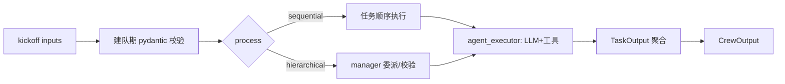

# Rank 44：crewAIInc/crewAI 源码级调研报告

## 1. 项目概述与定位

- **项目名称**：crewAI（GitHub: https://github.com/crewAIInc/crewAI ）
- **Star 数**：约 58.4k（快照值）
- **主要语言**：Python（monorepo：`lib/crewai`、`lib/crewai-tools`、`lib/crewai-devtools`、`lib/crewai-files`）
- **版本**：调研基于 **v1.14.0**（最新 tag 1.15.x；发布极频繁）
- **一句话定位**：轻量、自举、独立于 LangChain 的多 Agent 编排框架——以"角色扮演团队（Crew）"组织带角色/目标/背景故事的 Agent，按 sequential/hierarchical/async 流程执行任务；另提供事件驱动的 Flows 做生产级精确编排。

**目标用户/场景**：需要快速把多个专业角色 Agent 组成"公司式团队"完成研究/报告/运营任务的开发者；企业生产场景用 Flows。

**成熟度**：顶级。pyproject 显示为 uv workspace monorepo；`crew.py` 单文件约 20k 字符，集成 OpenTelemetry 追踪、checkpoint 恢复、评估/训练、知识/RAG、安全指纹。

## 2. 源码结构总览（monorepo，源码在 `lib/crewai/src/crewai/`）

```
lib/crewai/src/crewai/
├── crew.py            # Crew 类（~20k，本次重点读）
├── agent.py           # Agent（角色/goal/backstory）
├── task.py            # Task / TaskOutput
├── process.py         # Process 枚举（sequential/hierarchical）
├── flow/              # Flows：事件驱动、状态管理、条件分支
├── agents/agent_builder/base_agent.py
├── agents/cache/cache_handler.py     # 工具结果缓存
├── memory/unified_memory.py          # Memory/MemoryScope/MemorySlice
├── knowledge/         # RAG 知识源
├── events/            # event_bus / TraceCollectionListener
├── security/          # Fingerprint / SecurityConfig
├── state/             # checkpoint_config / provider / runtime
├── tools/agent_tools/ # 委派工具
└── utilities/
    ├── rpm_controller.py        # 限速
    ├── evaluators/ (crew_evaluator/task_evaluator)  # 评估
    ├── training_handler.py       # 训练数据
    └── planning_handler.py       # CrewPlanner
```

**核心源码文件（源码确认）**：`lib/crewai/src/crewai/crew.py`（读约 7k/20k 字符）；`pyproject.toml` 确认 monorepo 布局。

## 3. 系统架构分析

**编排模式（源码确认）**：**Multi-Agent 角色协作**，两种编排原语：
- **Crew**：`process: Process = Field(default=Process.sequential)`；hierarchical 时 `check_manager_llm` 校验必须提供 `manager_llm` 或 `manager_agent`，由 manager 做委派与结果校验。
- **Flows**：事件驱动、状态安全、条件分支（README 与 `flow/` 目录确认），"把 Crew 的自主性与 Flow 的精确控制结合"。

**关键类（源码确认）**：`Crew(FlowTrackable, BaseModel)`——pydantic 模型，字段包括 `tasks/agents/process/manager_llm/memory/cache/max_rpm/planning/checkpoint/knowledge/skills/security_config` 等。

**数据流**：`crew.kickoff(inputs=...)` → `prepare_kickoff` → 按 process 执行 task → 每个 task 交给 `agent.agent_executor` → Agent 用 LLM + 工具执行 → `TaskOutput` 聚合成 `CrewOutput`。异步任务由 `run_for_each_async` 并发。

**Pydantic 校验网（源码确认，这是 crewAI 架构的一大特色）**：多个 `@model_validator` 在建队时即拦截非法编排：
- `check_manager_llm`：hierarchical 缺 manager 即报错；manager 不能在 agents 列表里。
- `validate_tasks`：sequential 下每个 task 必须有 agent。
- `validate_end_with_at_most_one_async_task`：队尾最多一个异步 task。
- `validate_must_have_non_conditional_task` / `validate_first_task`：至少一个普通 task、首 task 不能是 ConditionalTask。
- `validate_context_no_future_tasks`：task 上下文不能引用未来 task。



## 4. 功能拆解

- **角色化 Agent**：`Agent(role, goal, backstory, tools, ...)`，由 `@CrewBase` 装饰器 + `@agent/@task/@crew` 声明式装配。
- **委派（源码确认）**：`tools/agent_tools/` 提供把"找别的 agent 做"作为工具的能力（层级 process 下 manager/agent 互相委派）。
- **记忆（源码确认）**：`memory=True` 时建 `Memory(embedder, root_scope="/crew/{name}")`，按 crew 名分命名空间组织长期记忆。
- **知识/RAG**：`knowledge_sources` → `Knowledge.add_sources()`，失败仅 warning 不崩。
- **缓存**：`CacheHandler` 缓存工具执行结果。
- **规划**：`planning=True` 时 `CrewPlanner` 先生成执行计划。
- **Skills**：`skills: list[Path | Skill]` 把技能搜索路径应用到全队。
- **可观测**：`crewai_event_bus` + `TraceCollectionListener` + OpenTelemetry baggage/span。

## 5. 技术亮点与优势

1. **建队期强校验（源码确认）**：把编排错误（缺 manager、尾任务多异步、上下文引用未来 task、首任务是条件任务）在建队时用 pydantic validator 拦下，而非运行时才爆。
2. **Checkpoint 断点续跑（源码确认）**：`Crew.from_checkpoint(path, provider=JsonProvider())` + `RuntimeState.from_checkpoint`，`_restore_runtime()` 重建 agent_executor、`_resuming=True`、`_restore_event_scope()` 恢复事件栈与 emission counter——可从上次完成的 task 续跑。
3. **统一事件总线 + OTel 追踪（源码确认）**：`crewai_event_bus` 派发 `CrewKickoffCompleted/Failed`、`TaskStarted` 等事件，`TraceCollectionListener` 收集 trace。
4. **限速 + 缓存**：`RPMController(max_rpm)` 控制每分钟 LLM 请求；`CacheHandler` 复用工具结果。
5. **自举独立**：README 强调"built from scratch, independent of LangChain"，轻量高性能。

## 6. 稳定性机制【重点】

- **配置/编排校验（源码确认）**：见第 3 节一整套 `@model_validator`；`check_config` 要求至少 agents+tasks 或 config。
- **崩溃恢复（源码确认）**：`from_checkpoint` / `RuntimeState.from_checkpoint` / `_restore_runtime` / `_restore_event_scope`——把 crew 序列化到 JSON，重启后从最后完成的 task 续跑，并正确重建运行期对象与事件作用域。`checkpoint: CheckpointConfig` 字段控制自动 checkpoint。
- **降级容错（源码确认）**：知识源初始化失败 `except Exception: self._logger.log("warning", ...)` 不中断建队。
- **安全/身份（源码确认）**：`Fingerprint`/`SecurityConfig`；`_deny_user_set_id` 禁止用户手动设置 crew id。
- **边界**：异步任务拓扑约束（尾端≤1、条件任务不可 async、上下文不能引用未来任务）从语法层防死锁/乱序。
- **回调**：`before_kickoff_callbacks`/`after_kickoff_callbacks`/`task_callback`/`step_callback` 提供钩子点。

## 7. 高可用机制【重点】

- **并发与调度（源码确认）**：`run_for_each_async` 支持异步任务并发；`validate_end_with_at_most_one_async_task` 等规则控制并发拓扑；`concurrent.futures.Future` 在 crew.py 顶部引入。
- **限流（源码确认）**：`RPMController(max_rpm)` 注入每个 agent（`agent.set_rpm_controller`），避免冲爆 LLM 配额——背压式保护。
- **缓存降载（源码确认）**：`CacheHandler` 命中即不重复调工具，降低成本与 QPS。
- **可观测性（源码确认）**：OpenTelemetry `_execution_span`、`attach/detach(baggage)`、`TraceCollectionListener`、`usage_metrics/token_usage` 指标；`execution_logs` 记录任务级日志。
- **扩展点**：事件总线 decouple 执行与观测，便于接外部控制面（Crew Control Plane）。

## 8. 自我进化机制【重点】

- **评估回路（源码确认）**：`CrewEvaluator`/`TaskEvaluator`（`utilities/evaluators/`）对 crew/task 输出打分；事件含 `CrewTestCompleted/Failed`、`CrewTrainCompleted/Failed`。
- **训练/数据沉淀（源码确认）**：`CrewTrainingHandler` + `TRAINING_DATA_FILE`，`_train/_train_iteration` 私有字段——支持训练 Agent 策略并落盘。
- **规划（源码确认）**：`CrewPlanner` 在执行前先规划，属于 plan-and-execute 的自我规划。
- **记忆自组织（源码确认）**：统一 `Memory(root_scope="/crew/{name}")` 跨任务/跨会话沉淀。
- **无在线权重更新**：进化=评估→训练数据沉淀→再训练，而非运行时改参数。

## 9. openmate 可借鉴点【重点】

- **P0｜建队期（构建期）强校验代替运行时崩**：openmate 定义 Agent/任务编排时，应在构建阶段用 pydantic validator 把非法组合（缺工具、环引用、上下文引用未来节点）一次性拦下。预期：把错误前移到开发期，运行更稳。
- **P0｜Checkpoint 断点续跑**：openmate 桌面/手机端长任务（多步 Agent）应像 `from_checkpoint` 那样把"已完成步"序列化，崩溃/中断后从下一步续跑，而非重头再来。预期：长任务可靠性大幅提升。
- **P1｜RPM 限流控制器注入每个 Agent**：openmate 调用 LLM 时用统一 RPMController 做背压，防止并发扇出打爆 key 配额。预期：避免 429。
- **P1｜执行事件总线 + OTel trace**：openmate 把每步（task_started/llm/tool）作为事件发布，便于 UI 展示与事后调试。
- **P1｜工具结果缓存 CacheHandler**：相同工具调用直接命中缓存，省 token 又提速。
- **P2｜CrewEvaluator/TaskEvaluator 自动打分回路**：openmate 可对 Agent 输出自动评分，形成"跑→评→改提示词/流程"的迭代闭环。

## 10. 源码验证标注

**源码直接阅读（jsDelivr @1.14.0）**：
- `pyproject.toml`：确认 uv workspace monorepo 与 `lib/crewai` 布局。
- `lib/crewai/src/crewai/crew.py`（读约 7k/20k 字符）：`Crew` 类字段、`from_checkpoint`/`_restore_runtime`/`_restore_event_scope`、`create_crew_memory`（root_scope）、`check_manager_llm`、`check_config`、`validate_tasks` 等全部 model_validator、`RPMController`/`CacheHandler`/`CrewPlanner`/evaluators/training 的 import。
- `README.md`：确认 Crews/Flows 双模型、独立性。

**来自文档/推断**：`agent.py`、`flow/`、`agents/agent_executor` 的 ReAct 循环细节、`unified_memory` 内部实现、`tools/agent_tools` 委派实现未逐行读，仅据 import 与命名推断；hierarchical manager 的具体委派提示词未读。

**源码不可得**：v1.15.x 最新代码、`lib/crewai-tools`、`lib/crewai-devtools` 未读；相关结论标注为推断。
