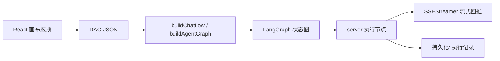

# Rank 46：FlowiseAI/Flowise 源码级调研报告

## 1. 项目概述与定位

- **项目名称**：Flowise（GitHub: https://github.com/FlowiseAI/Flowise ）
- **Star 数**：约 55.5k（快照值）
- **主要语言**：TypeScript/Node.js（React 前端 + Express 后端 + 节点组件库）
- **一句话定位**：低代码可视化拖拽构建 AI Agent / 聊天流的平台——把 LLM、记忆、检索、工具、条件分支拖成一张 DAG，后端 Node 执行，提供 REST API 与嵌入能力。
- **重要状态（源码确认）**：README 顶部标注 **"Flowise has been archived. Refer to Future of Flowise"**——仓库已归档，后续走向见官方讨论。

**目标用户/场景**：非代码/少代码用户把"聊天流 / Agent"变成可编辑图；后端复用 LangChain/LangGraph 组件。

**成熟度**：曾是顶流低代码 Agent 平台；monorepo 四模块（server/ui/components/api-documentation），节点生态极广（ChatOpenAI/Ollama/Vertex/Bedrock 等数十个 LLM 节点），现已归档。

## 2. 源码结构总览（源码确认）

pnpm monorepo，四模块：
```
packages/
├── server/      # Node/Express 后端：API、流程执行、持久化
│   └── src/
│       ├── commands/{base.ts, start.ts, worker.ts}   # start/独立 worker 进程
│       ├── queue/                          # 任务队列
│       ├── SSEStreamer.ts                  # SSE 流式推送
│       ├── Interface/Executions.ts         # 执行记录
│       └── .../agentflow/buildAgentGraph.ts (48k)  # LangGraph 图构建
│       └── .../buildChatflow.ts
├── ui/           # React 前端（拖拽画布、NodeExecutionDetails.jsx）
├── components/   # 第三方节点集成（LLMNode.ts 28k、ExecuteFlow、Loop、Start、State 等）
└── api-documentation/  # 自动 swagger
```

**核心源码文件（源码确认，据文件树）**：`buildAgentGraph.ts`（48k，agentflow 的 LangGraph 图构建）、`buildChatflow.ts`、`queue/`、`SSEStreamer.ts`、`commands/worker.ts`、`components/.../ExecuteFlow.ts`、`LLMNode.ts`。

## 3. 系统架构分析

**编排模式（源码确认）**：**Workflow-DAG 工作流**（可视化图）；agentflow 进一步落到 **LangGraph 状态图**——证据是 `buildAgentGraph.ts`（48k）把画布节点编译成 LangGraph 图。聊天流（chatflow）则走 `buildChatflow.ts`。

**关键组件**：
- **节点**：每个能力是一个节点（LLMNode、ExecuteFlow、Loop、Start、State、条件分支、工具节点）；`components/` 下每个 LLM provider 一个文件（FlowiseChatOpenAI/Ollama/Vertex/Bedrock…）。
- **执行**：画布 DAG 编译为可执行图，由 server 运行；`SSEStreamer.ts` 把节点事件流式推给前端。
- **队列/worker**：`commands/worker.ts` + `queue/` + `docker/worker/`——支持把执行从 HTTP 进程拆到独立 worker。



## 4. 功能拆解

- **可视化编排**：拖节点连线成图；条件分支、Loop、并行。
- **模型抽象**：`FlowiseChat*` 系列统一封装数十家 LLM。
- **Agentflow**：内置 `Agentic RAG`、`Plan and Execute`、`Multi Agents`、`Human In Loop RAG`、`Text to SQL` 等模板 JSON（examples/agentflows/*.json，源码确认存在）。
- **API**：REST 暴露 chatflow/agentflow，支持嵌入与 webhook；`chatflows-streaming/`、`chatflows-uploads/`。
- **持久化**：执行记录（`Executions.ts`）、配置存数据库（Postgres/SQLite，env 配置）。

## 5. 技术亮点与优势

1. **节点生态极广**：数十家 LLM/向量库/工具节点开箱即用，拖拽即得。
2. **双形态**：chatflow（线性对话流）与 agentflow（LangGraph 状态图）并存。
3. **可视化调试**：`NodeExecutionDetails.jsx`（58k）/`PublicExecutionDetails.jsx` 逐节点看输入输出。
4. **流式**：SSE 边跑边推。
5. **低门槛**：非工程师也能编排 Agent。

## 6. 稳定性机制【重点】

- **流程即图，确定性执行**：DAG/LangGraph 显式建模分支与停止条件，运行路径可预测。
- **执行记录与可回放（源码确认）**：`Executions.ts` + `NodeExecutionDetails.jsx` 落库每次执行，便于排错。
- **独立 worker（源码确认）**：`commands/worker.ts` + `docker/worker/` 把耗时执行与 HTTP API 进程隔离，避免长任务拖垮 API。
- **队列（源码确认）**：`queue/` 目录提供任务排队，削峰。
- **构建期保护**：README 给出 OOM（exit 134）时 `NODE_OPTIONS=--max-old-space-size` 指引——工程化常识。

> 注：节点内部的重试/超时多依赖底层 LangChain 组件；本仓库作为编排壳，未在本调研中逐节点读。

## 7. 高可用机制【重点】

- **进程拆分（源码确认）**：server API 与 worker 分离，配合队列，水平扩 worker。
- **持久化选型（源码确认）**：支持 Postgres/SQLite，状态外置，多实例可共享后端。
- **流式（源码确认）**：`SSEStreamer.ts` 长连接推送，客户端可实时看到进度。
- **部署面广**：README 列 AWS/Azure/GCP/DO/阿里云/Railway/Render 等一键部署模板，适合自托管。
- **注意**：仓库已 archived，后续高可用演进停滞。

## 8. 自我进化机制【重点】

- **模板沉淀（源码确认）**：`examples/agentflows/*.json` 把"Plan and Execute""Multi Agents""Human In Loop RAG"等最佳实践固化为可复制模板——进化=模板库积累。
- **人在回路模板**：内置 `Human In Loop RAG` 模板，把人工审批作为流程节点。
- **无运行时自我学习**：不做在线学习；"进化"靠节点/模板生态扩充。

## 9. openmate 可借鉴点【重点】

- **P0｜执行与 API 进程分离 + 队列**：openmate 桌面/手机端长任务应把执行放独立 worker，API/UI 只负责发起与收事件。预期：UI 不被长任务阻塞。
- **P1｜节点化 + 可视化执行轨迹**：openmate 把每步作为带输入/输出的节点事件落库，前端逐节点展示（参考 NodeExecutionDetails）。预期：可调试、可向用户解释。
- **P1｜DAG/状态图显式建模分支**：用 LangGraph 式显式图代替隐式 if-else，让流程可视化、可静态检查。
- **P2｜最佳实践固化为模板**：把跑通的 Agent 流程存成可复用模板，新对话一键套用。
- **P2｜SSE 流式推进度**：用 SSE 把节点进度推给前端，提升长任务体验。

## 10. 源码验证标注

**源码直接阅读（jsDelivr @main）**：
- `README.md`：四模块 monorepo、archived 声明、部署面、构建指引。
- 文件树（`data.jsdelivr.com`）：确认 `buildAgentGraph.ts`(48k)、`buildChatflow.ts`、`queue/`、`SSEStreamer.ts`、`commands/worker.ts`、`LLMNode.ts`(28k)、`examples/agentflows/*.json` 模板、`docker/worker/`。

**来自文档/推断**：`buildAgentGraph.ts` 内部图编译逻辑、`queue/` 具体实现（是否 Redis/Bull）、各 LLM 节点封装细节未逐行读，仅据文件名/大小推断；持久化后端细节据 env 文档推断。

**源码不可得**：`buildAgentGraph.ts`、`SSEStreamer.ts`、`queue/` 正文未读取；结论已标注为推断。
