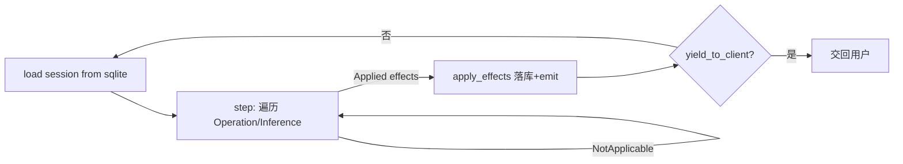

# Rank 47：aaif-goose/goose 源码级调研报告

## 1. 项目概述与定位

- **项目名称**：goose（GitHub: https://github.com/aaif-goose/goose ）
- **Star 数**：约 54.2k（快照值）
- **主要语言**：Rust
- **一句话定位**：Block 出品的原生开源通用 AI Agent——桌面 App（mac/Linux/Windows）+ 完整 CLI + 可嵌入 API；不止写代码，做研究、写作、自动化、数据分析。
- **架构**：Rust workspace（`crates/*`），依赖 `rmcp`（MCP SDK）、`agent-client-protocol`（ACP）。

**目标用户/场景**：本地跑、要终端/桌面/API 三种形态、想接 15+ 模型与 70+ MCP 扩展的开发者与自动化用户。

**成熟度**：高。Cargo.toml 显示拆分出 `goose-agent`、`goose-providers`、`goose-mcp`、`goose-context-management`、`goose-download-manager`、`goose-sdk-types` 等 crate，工程化程度高。

## 2. 源码结构总览（源码确认）

```
crates/
├── goose/                  # 主 crate（CLI/会话/工具/扩展）
│   └── src/
├── goose-agent/            # Agent 推理循环（本次重点）
│   └── src/
│       ├── lib.rs          # pub mod inference / machine / operation / tool
│       ├── machine.rs      # StateMachine 主循环（本次全文读）
│       ├── operation.rs     # Operation/Inference/Effect/Emitter 抽象
│       └── inference.rs / tool.rs
├── goose-providers/        # 15+ 模型 provider
├── goose-mcp/              # MCP 扩展
├── goose-context-management/  # 上下文管理
└── ...
```

**核心源码文件（源码确认，本次全文读 `machine.rs` 1642 字符）**：`crates/goose-agent/src/machine.rs`；模块清单来自 `lib.rs`。

## 3. 系统架构分析

**编排模式（源码确认）**：**ReAct 状态机**，采用"命令-效果分离（command/effect）"设计。

**StateMachine.run() 主循环（源码证据）**：
```rust
loop {
    session = runtime.load(session_id).await?;     // 每步从持久层加载会话
    result  = self.step(&session, emit).await?;     // 跑一遍 step 序列
    self.apply(runtime, &session, &mut result, emit).await?; // 把效果落库
    if result.yield_to_client { break; }            // 需交回用户时让出
}
```
- `step()` 遍历 `Vec<Step>`（`Operation` 或 `Inference`）；每个 step 返回 `NotApplicable` 则跳过，`Applied(effects)` 即命中并返回。
- `Inference` step 先问 `inference.applies(conversation)` 是否适用；再收集所有 operation 的工具（`operation.inference_tools()`）与 prompt 片段，组装 `InferenceInput` 后 `inference.infer(...)`。
- **工具名去重（源码确认）**：`add_tools_to_inference_input` 用 `HashSet` 校验，重复工具名 `anyhow::bail!("multiple operations registered tool '{}'")`，并有对应单元测试。

**数据流**：会话从 sqlite 加载 → 状态机选一个 operation 或做一次推理 → 产出 `ConversationEffect` 列表 → `EffectHandler.apply_effects` 落库 + 通过 `Emitter` 向外发事件 → 循环直到无 step 适用或需交回用户。



## 4. 功能拆解

- **三种形态**：桌面 App、CLI、API（axum）；一套内核多端。
- **Provider 抽象**：`goose-providers` 封装 Anthropic/OpenAI/Google/Ollama/OpenRouter/Azure/Bedrock，及 ACP 订阅。
- **MCP 扩展（源码确认）**：`rmcp::model::Tool` 作为统一工具类型，70+ MCP 扩展接入。
- **会话持久化（源码确认）**：`sqlx + sqlite + migrate`，每步 `runtime.load(session_id)` 重建会话。
- **定时任务（源码确认）**：`tokio-cron-scheduler`——支持周期性/计划任务。
- **代码理解（源码确认）**：`tree-sitter` 多语言 grammar，做代码结构化分析。
- **本地推理**：`candle`/`tokenizers`/`symphonia`（可选 feature）支持本地 Whisper 转录等。

## 5. 技术亮点与优势

1. **命令-效果分离（源码确认）**：step 只产生 `Effect`，由 `EffectHandler` 统一应用——纯计算与副作用解耦，便于测试/回放/撤销。
2. **每步从持久层重建会话（源码确认）**：`run()` 每轮 `runtime.load(session_id)`，天然支持崩溃恢复与跨进程/跨端续接。
3. **结构化取消（源码确认）**：`CancellationToken` 贯穿，`tokio::select!{biased; cancel.cancelled() => return Ok(None)}` 优先响应取消。
4. **Rust 性能与单二进制**：本地优先、跨端、无运行时依赖。
5. **工具名冲突静态拦截**：注册期即拒绝重复工具名。

## 6. 稳定性机制【重点】

- **取消控制（源码确认）**：`self.cancel.is_cancelled()` 在每个 step 前检查；`tokio::select!{biased}` 在收集工具时优先响应对取消；取消后调 `step.cancel()` 收尾。
- **崩溃恢复（源码确认）**：状态外置到 sqlite，`run()` 每步 `load(session_id)`，进程重启后从最后会话继续——天然 checkpoint。
- **错误传播（源码确认）**：`anyhow::Result` 贯穿；`step_fut.await?` 把 step 错误上抛；重复工具名是硬错误。
- **边界处理**：`conversation()` 缺失时 `anyhow!("state-machine session loaded without conversation")`；效果产出后 `effect.ensure_message_ids()` 保证消息 ID 完整。
- **可重入**：`yield_to_client` 让 Agent 在等待用户输入时干净让出。

## 7. 高可用机制【重点】

- **并发模型**：async Rust（tokio），`tokio::select!`、`OperationFuture` 异步步骤。
- **资源管理**：工具收集用 `HashSet` 去重避免重复注册；`Emitter` 异步事件出口。
- **持久化与扩展**：sqlite + migrate 内置会话存储；API（axum）形态可作服务端。
- **可观测性（源码确认）**：`tracing`/`tracing-appender` 依赖，`Emitter` 事件流；opentelemetry 可选。
- **无分布式协调**：本地 Agent，单机模型。

## 8. 自我进化机制【重点】

- **上下文管理（源码确认）**：独立 `goose-context-management` crate——管理送入模型的上下文，做压缩/裁剪，是对"长上下文漂移"的自我维护。
- **会话累积**：每次推理结果作为 effect 落库，跨轮累积 conversation。
- **工具注册而非学习**：新能力靠注册 MCP 工具，而非在线学习。
- **无运行时权重更新**：进化=上下文管理 + 工具/扩展生态。

## 9. openmate 可借鉴点【重点】

- **P0｜命令-效果分离 + 每步从持久层重建会话**：openmate 把 Agent 每步的"计算"与"写库/发事件"分开，主循环每轮从存储 load 会话。预期：天然支持崩溃恢复、跨端（桌面/手机）续接、可回放。
- **P0｜结构化取消（CancellationToken 贯穿 + biased select）**：openmate 长任务要能被用户随时停止，取消信号在每个 await 点优先响应。预期：停止即时、不残留半成品。
- **P1｜yield_to_client 干净让出**：需要用户输入的步骤主动让出主循环，而不是阻塞等待。预期：人在回路更顺滑。
- **P1｜工具名注册期去重**：openmate 注册工具时校验重名并报错。预期：避免两个工具抢同名导致错调。
- **P2｜独立的上下文管理 crate/模块**：把"送多少历史给模型"抽成独立模块（裁剪/压缩）。预期：长会话不爆上下文、成本可控。

## 10. 源码验证标注

**源码直接阅读（jsDelivr @main）**：
- `crates/goose-agent/src/machine.rs`（全文 1642 字符）：`StateMachine`、`Step`、`run()`/`step()`/`apply()`、`add_tools_to_inference_input` 去重、`CancellationToken` 用法、`yield_to_client`。
- `crates/goose-agent/src/lib.rs`：`inference/machine/operation/tool` 模块。
- `crates/goose/Cargo.toml`：sqlx+sqlite+migrate、tokio-cron-scheduler、tree-sitter、rmcp、ACP、tracing 依赖证据。
- `README.md`：三形态、15+ provider、70+ MCP。

**来自文档/推断**：`operation.rs`/`inference.rs` 内部、`goose-providers`、`goose-context-management`、MCP 扩展管理、定时任务的具体实现未逐行读，仅据依赖与模块名推断。

**源码不可得**：`operation.rs`、`inference.rs`、会话存储 schema、CLI/desktop UI 未读取；结论已标注。
