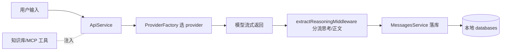

# Rank 49：CherryHQ/cherry-studio 源码级调研报告

## 1. 项目概述与定位

- **项目名称**：Cherry Studio（GitHub: https://github.com/CherryHQ/cherry-studio ）
- **Star 数**：约 52.1k（快照值）
- **主要语言**：TypeScript（Electron 主进程 + React renderer）
- **一句话定位**：跨平台（Win/Mac/Linux）桌面 **LLM 客户端**——一个应用里接入 OpenAI/Gemini/Anthropic 云服务、Poe/Perplexity 网页服务、Ollama/LM Studio 本地模型，提供对话、助手、知识库、MCP 工具。

**目标用户/场景**：想要"一个桌面 App 聚合所有模型"的终端用户；另有企业版做团队私有部署/统一模型与知识库管理。

**成熟度**：高。300+ 预配置助手、多模型同时对话、MCP marketplace、WebDAV 备份、多语言；并有企业版。

> **定位说明**：它本质是 **Chat/Agent 客户端应用**（用户驱动的对话 UI），而非自动运行的 Agent 编排框架。但其 MCP 工具调用、知识库、多模型并发已带轻 agentic 能力。

## 2. 源码结构总览（源码确认）

Electron 双进程：
```
src/
├── main/                # Electron 主进程（系统集成、窗口、托盘）
└── renderer/src/       # React 渲染进程
    ├── pages/settings/  # Assistant{Model,KnowledgeBase,MCP,Messages}Settings
    ├── middlewares/extractReasoningMiddleware.ts  # 流式 reasoning 提取
    ├── provider/.../ProviderFactory.ts             # 模型 provider 工厂
    ├── queue/           # KnowledgeQueue.ts / NotificationQueue.ts
    ├── services/        # 服务层（本次重点）
    │   ├── ApiService.ts (15k)          # 模型 API 调用
    │   ├── AssistantService.ts
    │   ├── MessagesService.ts (8.7k)     # 消息
    │   ├── KnowledgeService.ts / KnowledgeQueue
    │   ├── HealthCheckService.ts (6.7k)  # 健康检查
    │   ├── BackupService.ts (14.5k)      # WebDAV 备份
    │   ├── CacheService.ts / EventService.ts
    │   └── __tests__/ModelMessageService / ShikiStream*
    └── databases/       # 本地持久化
```

**核心源码文件（源码确认，据文件树与大小）**：`services/ApiService.ts`、`services/HealthCheckService.ts`、`services/BackupService.ts`、`middlewares/extractReasoningMiddleware.ts`、`provider/.../ProviderFactory.ts`、`queue/KnowledgeQueue.ts`。

## 3. 系统架构分析

**编排模式（源码确认）**：**ReAct 式多轮对话 + MCP 工具调用**，但由**用户驱动**（每轮用户发消息触发一次模型调用），不是自主循环。
- `ProviderFactory.ts` 按配置创建对应 provider 客户端；`ApiService.ts` 负责实际请求/流式接收。
- `extractReasoningMiddleware.ts`（4.4k）在流式返回中把"思考链（reasoning）"与"正文"分流——对应 OpenAI reasoning model / Claude thinking 等。
- **多模型同时对话**：README 明确"Multi-model Simultaneous Conversations"——同一话题可并发起多个 provider 会话。
- **MCP**：既是 MCP client（调外部工具），也提供 MCP server + MCP marketplace。



## 4. 功能拆解

- **多 provider**：云/网页/本地三类统一接入。
- **助手**：300+ 预置 + 自定义（模型/知识库/MCP/系统提示）。
- **知识库**：文本/图片/Office/PDF，OCR，`KnowledgeService` + `KnowledgeQueue` 异步处理。
- **MCP**：工具调用 + marketplace。
- **实用工具**：全局搜索、话题管理、AI 翻译、Mermaid 渲染、代码高亮、小程序。
- **备份**：`BackupService.ts` + WebDAV。

## 5. 技术亮点与优势

1. **一客户端聚合所有模型**：provider 工厂 + 统一对话模型层。
2. **流式 reasoning 分流中间件**：`extractReasoningMiddleware` 把思考过程单独展示。
3. **本地优先 + 可备份**：本地 databases 持久化，WebDAV 备份迁移。
4. **多模型并排**：同时向多个模型提问对比。
5. **企业版**：私有部署、统一模型/知识库/RBAC。

## 6. 稳定性机制【重点】

- **健康检查（源码确认）**：`HealthCheckService.ts`（6.7k）——主动探测 provider 连通性，配置坏 key/不可达时提前告知。
- **错误隔离**：`ApiService` 单 provider 失败不影响其他 provider（多模型并发天然隔离）。
- **数据安全（源码确认）**：`BackupService.ts`（14.5k）导出/恢复；本地 `databases/` 持久化消息与配置。
- **流式解析容错（源码确认）**：`extractReasoningMiddleware` 处理不同 provider 的 reasoning 格式差异。
- **边界**：知识库走 `KnowledgeQueue` 异步队列，避免阻塞 UI。
- **崩溃恢复**：消息落本地库，重开应用历史仍在（桌面应用天然）。

## 7. 高可用机制【重点】

- **降级**：provider 间互不影响；本地模型（Ollama）作为云端不可用时的备选。
- **并发模型**：多模型同时对话 + `KnowledgeQueue`/`NotificationQueue` 后台队列；React 事件驱动。
- **资源管理**：`CacheService.ts`、`ImageStorage.ts`、`FileManager.ts` 管理缓存与文件。
- **可观测性**：`EventService.ts`、`NotificationService`；`HealthCheckService` 持续探测。
- **无分布式 HA**：单机桌面应用，高可用=本地健壮性与备份。

## 8. 自我进化机制【重点】

- **知识库自组织**：`KnowledgeService` + `KnowledgeQueue` 把用户资料建为可检索语料，注入后续对话——即 RAG 式记忆增强。
- **助手模板沉淀**：300+ 预置助手 + 用户自定义，把有效提示词固化。
- **MCP 工具生态**：能力靠接入 MCP server 扩展。
- **无自主循环/在线学习**：由用户驱动，不做自动迭代。

## 9. openmate 可借鉴点【重点】

- **P0｜provider 工厂 + 统一对话模型层**：openmate 已有 Web 版要做桌面/手机，应把"模型调用"抽象成 ProviderFactory，UI 与具体 provider 解耦。预期：新增模型只加一个工厂分支。
- **P0｜流式 reasoning/正文分流中间件**：openmate 接入 reasoning 模型时，用中间件把思考过程与正文分开渲染。预期：用户可折叠查看思考链。
- **P1｜启动期 provider 健康检查**：openmate 多端启动时先探测各 key 可用性，坏配置提前提示而非对话中才报错。
- **P1｜本地持久化 + 导出备份**：桌面/手机端把会话/配置落本地库并支持导出迁移。
- **P1｜后台队列处理重任务**：知识库解析等放队列异步做，不卡 UI。
- **P2｜多模型并排对比**：同问题并发起多个模型，便于选型。

## 10. 源码验证标注

**源码直接阅读（jsDelivr @main）**：
- `README.md`：定位、多 provider、助手、知识库、MCP、企业版。
- 文件树（`data.jsdelivr.com`）：确认 `services/{ApiService,HealthCheckService,BackupService,KnowledgeService,MessagesService}.ts`、`queue/{KnowledgeQueue,NotificationQueue}.ts`、`middlewares/extractReasoningMiddleware.ts`、`ProviderFactory.ts`、`databases/` 及各文件大小。

**来自文档/推断**：`ApiService.ts` 内部请求/重试/流式解析、provider 适配细节、本地数据库 schema 未逐行读，仅据文件名/大小推断；MCP client/server 实现未读。

**源码不可得**：`src/main` Electron 主进程、`ApiService`、各 provider 适配正文未读取；结论已标注为推断。
