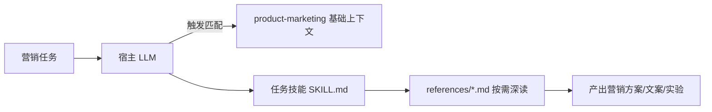

# Rank 50：coreyhaines31/marketingskills 源码级调研报告

## 1. 项目概述与定位

- **项目名称**：marketingskills（GitHub: https://github.com/coreyhaines31/marketingskills ）
- **Star 数**：约 51.3k（快照值）
- **主要语言**：Markdown（纯技能资产，无代码运行时）
- **一句话定位**：面向 AI Agent 的**营销领域技能库**——一套遵循 [Agent Skills spec](https://agentskills.io) 的 Markdown 技能，覆盖 CRO、文案、SEO/AI 搜索、广告、邮件、定价、留存、分析、增长工程等，供 Claude Code/Codex/Cursor/Windsurf 等宿主按需加载。

**目标用户/场景**：技术型营销人、创始人，想让 AI 编码 Agent 按专业营销方法论做转化优化、文案、SEO、增长。

**成熟度**：v2.0，含完整的 v1→v2 重命名迁移指南、6 种安装方式（npx skills / 插件市场 / clone / submodule / fork / SkillKit 多端）、README 中自动生成的技能目录表。

> **定位说明**：这是**技能包/领域知识资产**，不是可独立运行的 Agent——无主循环、无工具执行引擎。宿主 LLM 才是推理与执行主体。

## 2. 源码结构总览（源码确认）

```
marketingskills/
├── README.md                 # 安装/升级/技能目录（本次重点读）
├── skills/                   # 每个技能一个目录
│   ├── product-marketing/     # 基础技能（共享产品上下文）
│   ├── cro/ copywriting/ emails/ cold-email/ ai-seo/ seo-audit/
│   ├── pricing/ popups/ paywalls/ onboarding/ signup/
│   ├── ads/ ad-creative/ analytics/ ab-testing/ churn-prevention/
│   ├── referrals/ launch/ marketing-psychology/ ...
│   │   └── SKILL.md           # 技能本体（frontmatter + 何时用 + 流程）
│   │   └── references/        # 渐进披露的详细知识
│   │       ├── research-methods.md / templates.md / benchmarks.md
│   │       ├── ad-copy-templates.md / audience-targeting.md
│   │       ├── ga4-implementation.md / cancel-flow-patterns.md ...
└── tools/integrations/        # 第三方集成说明（activecampaign.md 等）
```

每个技能 = `SKILL.md`（入口契约）+ `references/*.md`（按需加载的深知识）。

## 3. 系统架构分析

**编排模式（源码确认）**：**技能驱动（Skill-driven / progressive disclosure）**，编排由宿主 Agent 承担。
- **共享上下文基座（源码确认）**：README 明确"`product-marketing` 技能是基础——每个其他技能做事前先查它，理解产品/受众/定位"。即存在一条隐式依赖链：任务技能 → 先加载 product-marketing 上下文 → 再执行。
- **触发式加载**：每个 SKILL.md 用"When the user wants..."描述触发条件（如 cro："优化任何营销页/表单的转化时"），宿主据此选择技能。
- **技能互相引用**：每个 SKILL.md 有 "Related Skills" 节，构成技能依赖图。



## 4. 功能拆解

- **技能分类（源码确认）**：转化优化（cro/signup/onboarding/popups/paywalls）、内容文案（copywriting/cold-email/emails）、SEO 与发现（seo-audit/ai-seo/programmatic-seo）、付费与分发（ads/ad-creative）、度量实验（analytics/ab-testing）、留存（churn-prevention）、增长工程（referrals/free-tools）、策略与变现（pricing/launch/marketing-psychology）、销售 RevOps。
- **渐进披露**：SKILL.md 给入口，references/ 给模板/基准/研究方法（如 benchmarks.md、sample-size-guide.md、ga4-implementation.md）。
- **多宿主分发**：装到 `.claude/skills/`（Claude Code）或 `.agents/skills/`（通用 Agent）。

## 5. 技术亮点与优势

1. **共享上下文基座（源码确认）**：product-marketing 作为全局前提，避免每个技能重复问产品定位——减少歧义、保证一致语气。
2. **触发条件写进 frontmatter**：用 "When the user wants..." 让宿主可靠地选技能。
3. **渐进披露**：SKILL.md 小、references 按需，控制上下文膨胀。
4. **版本迁移工程化**：v1→v2 提供完整重命名映射表 + stale 目录清理命令 + 旧路径 fallback（"技能仍检查 .claude/ 旧名作为 fallback，不迁移也不崩"）。
5. **多安装通道**：npx/插件市场/submodule/fork/SkillKit 覆盖各种宿主。

## 6. 稳定性机制【重点】

**不适用独立运行时**——无代码错误处理。但技能库本身有"内容层稳定性"：
- **向后兼容 fallback（源码确认）**：v2 迁移时旧路径/旧名作为 fallback 读取，避免升级即坏。
- **触发条件精确**：明确的 "When..." 描述降低错选技能概率。
- **共享基座前置**：先读 product-marketing 再做事，减少因缺上下文导致的跑偏。

## 7. 高可用机制【重点】

**不适用**——无服务/并发/持久化。仅作为静态资产，随宿主分发；安装通道冗余（6 种）本身就是一种可用性保障。

## 8. 自我进化机制【重点】

- **技能互引用网络**：Related Skills 依赖图让一个任务串联多个技能，是"知识组合"的自组织。
- **版本迭代**：v1→v2 合并/重命名（page-cro+form-cro→cro）是对技能边界的自我修正。
- **无运行时学习**：进化=技能库内容迭代。

## 9. openmate 可借鉴点【重点】

- **P0｜"共享上下文基座"技能**：openmate 做业务时，设一个"产品/用户/定位"基础文档，所有任务技能先读它。预期：跨任务语气与事实一致，减少反复澄清。
- **P0｜触发条件写进技能 frontmatter**：用明确的 "When the user wants..." 描述，让 openmate 路由层可靠选技能。
- **P1｜渐进披露：入口 SKILL + references 按需**：openmate 复杂业务技能拆成"小入口 + 详细 references"，首屏不塞全量知识。
- **P1｜版本升级做旧路径 fallback**：openmate 配置/技能格式升级时保留旧名 fallback，平滑迁移。
- **P2｜技能互引用依赖图**：用 Related Skills 串联，复杂任务自动组合多个技能。

## 10. 源码验证标注

**源码直接阅读（jsDelivr @main）**：
- `README.md`：定位、product-marketing 基座、技能目录表、6 种安装、v1→v2 迁移、技能分类。
- 文件树（`data.jsdelivr.com`）：确认各技能目录、`references/*.md`（benchmarks/templates/ga4/cancel-flow 等）、`tools/integrations/`。

**来自文档/推断**：单个 SKILL.md 正文未逐行读（pricing-strategy/SKILL.md 路径因 v2 重命名 404，证实已改名 pricing）；技能内部流程据 README 描述与目录推断。

**源码不可得**：各 SKILL.md 与 references 正文未读取；结论已标注。
