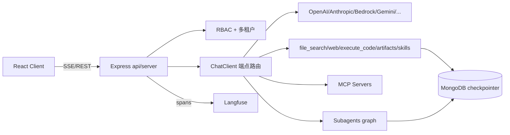

# LibreChat 源码级调研报告（Rank 61）

> 调研对象：`danny-avila/LibreChat`
> 报告日期：2026-09-13　｜　数据基线：GitHub `main` 分支（`librechat.example.yaml` version 1.3.16）

---

## 1. 项目概述与定位

| 项 | 值 |
|---|---|
| 项目名 | LibreChat |
| GitHub | https://github.com/danny-avila/LibreChat |
| Star | 约 4.31w（清单快照 43,083） |
| 主要语言 | TypeScript（Node.js/Express 后端 + React 前端） |
| 许可证 | MIT |
| 一句话定位 | **自托管、可多用户、多模型端点统一接入的"增强版 ChatGPT"聊天平台，并在其上演进为一个无代码 Agent Builder / Agent 运行时（Agents Endpoint + Subagents + MCP + Skills + Code Interpreter）** |

**目标用户/场景**：想自己部署一个"全家桶式"AI 聊天网关的个人、团队与企业——既要 OpenAI/Claude/Gemini/本地模型统一对话，又要把对话升级为可执行工具、子 agent、定时任务的 agentic 工作流。README 将其定位为 "open-source AI chat platform"。

**成熟度**：非常高且活跃。配置 schema 已迭代到 `version: 1.3.16`（`librechat.example.yaml:5`），具备多租户（tenantId）、SAML/OIDC/Social 登录、RBAC、对象存储（local/S3/Firebase/Azure Blob/CloudFront）、Langfuse 可观测、定时任务、agent 管理 API 等企业级能力，是本批样本里"生产化程度最高的对话型 agent 平台"之一。

---

## 2. 源码结构总览

> 说明：本仓库后端位于 `api/`、前端位于 `client/`。受调研窗口网络限制，`.js/.ts` 源文件多次下载失败（见 §10），下面目录划分来自架构清单与 `librechat.example.yaml` 所引用的配置路径，**配置项本身为一手证据**。

```
LibreChat/
├── api/                         # Node.js/Express 后端
│   ├── server/                  # 启动入口、路由注册、限流、鉴权
│   ├── app/
│   │   ├── clients/            # 各端点客户端（OpenAI/Anthropic/Bedrock/...），ChatClient 抽象
│   │   └── ...
│   ├── controllers/            # v1 REST/流式控制器（chat、agents、conversations、files…）
│   ├── services/               # chat 流编排、MCP 管理、文件检索、code interpreter、用户/会话
│   ├── models/                 # MongoDB 数据模型（User/Conversation/Message/Agent/...）
│   └── config/                 # librechat.yaml 解析、端点/agent 能力装配
├── client/                      # React 前端（聊天 UI、Agent Builder、trace viewer）
└── librechat.yaml               # 运行时配置（本报告主要证据来源）
```

**入口/启动**：`api/server/` 起 Express，挂 REST + 流式（SSE/WebSocket）端点；`librechat.yaml` 在启动时被解析为运行时配置（`cache: true`，yaml:8），据此装配各 endpoint、agents、MCP、工具权限。数据持久化默认 MongoDB（yaml:219、711-712 明确 "MongoDB is currently the built-in durable checkpointer"）。

**代码规模**：前后端 monorepo，后端为上千个模块的 TypeScript 服务，前端为大型 React 应用；属于"大而全"型项目，不做轻量内核。

---

## 3. 系统架构分析

### 编排模式：以 function-calling 为核心的 ReAct，并向上封装为 graph/多 agent——配置证据

LibreChat 的 agent 能力不是单一循环，而是分层：

1. **对话层（ReAct）**：前端发消息 → 后端 `ChatClient` 抽象选定端点客户端 → 模型 function calling 决定是否调用 `tools`（file_search/web_search/execute_code/artifacts/mcp/skills）→ 工具结果回灌 → 流式回吐。yaml:272 明确原生工具键为 `artifacts, execute_code, web_search, file_search, skills`。
2. **Agents Endpoint（graph + subagents）**：yaml:630 的能力清单 `["deferred_tools","execute_code","file_search","web_search","artifacts","subagents","actions","context","skills","memory","ask_user_question","tools","chain","ocr"]` 表明 agent 运行时是一个**有环的执行图**（`chain`、`deferred_tools`、`run_in_background`），支持把任务委托给子 agent（`subagents`），并能向用户提问（`ask_user_question`）、调用动作（`actions`）。
3. **子 agent 委托**：yaml:609-611 `maxSubagents`（默认 10，硬上限 50，示例配 20）——支持扁平列表与 graph 两种子 agent 定义。

**数据流**：用户消息 → Express 鉴权/限流 → 选定 endpoint & agent spec → 装配工具目录（含 MCP tools、skills catalog）→ 模型流式决策 → 工具/子 agent 执行（必要时 pause 等人审，见 §6 checkpointer）→ 结果回写 MongoDB 对话 → 流式渲染 + Langfuse span 上报。

**关键抽象**：端点客户端统一在 `api/app/clients/`（`ChatClient` 抽象）；运行时配置在 `api/config/`；agent 持久化用 MongoDB checkpointer。



---

## 4. 功能拆解

- **多端点统一接入**：yaml:541 `endpoints:`，统一 OpenAI/Azure/Anthropic/Bedrock/Google/OpenRouter 等，yaml:554 按端点声明 `capabilities: ["code_interpreter","retrieval","actions","tools","image_vision"]`。
- **Agent Builder（无代码）**：在前端配置 system prompt、模型、能力；yaml:208-212 `agents.use/create/share/public` 细粒度权限。
- **工具系统（一等公民）**：原生工具键见 yaml:272；`actions`（OpenAPI/function actions）与 `mcp` 并列。`tool_intents`（yaml:701）让模型为工具自写标签。
- **MCP 系统**：yaml:294-314、504-509。支持用户 `use/create/share/public` 四级权限；remote transport（SSE/WebSocket/HTTP）有域名白名单与 SSRF 防护（yaml:478、462）；每 server 默认 `timeout: 60000`（yaml:509），可配 outbound proxy。
- **Skills（SKILL.md 渐进式）**：yaml:625-628 `skills.maxCatalogSkills` 控制模型可见目录大小；yaml:117-141 `skillSync.github` 可从 GitHub 仓库按 `SKILL.md` 自动同步、按 `skillDiscoveryDepth` 扫描——与 open Agent Skills 标准对齐。
- **代码解释器/沙盒**：`execute_code` + `statefulCodeSessions`（yaml:635-689），环境分 `user/agent-user/conversation`，可接托管 Code API 或 attached worker（BYOM），`maxCommandTimeoutMs` 默认 30s、硬上限 300s。
- **定时/后台 agent**：yaml:220-240 `schedules`（admission/fire/mcpPreflight 多级并发控制）、yaml:696-699 `backgroundTasks.completionWakeups`。
- **可观测**：Langfuse span + yaml:250-269 `traceViewer`（对话级 waterfall，读 v2 Observations API）。
- **文件/对象存储与检索**：yaml:58-110 多策略文件存储；`file_search` + `fileCitations`（yaml:247）。

---

## 5. 技术亮点与优势

1. **把"对话应用"工程化为"agent 平台"**：从 capabilities 白名单到 checkpointer、toolApproval、managementApi OIDC，整套是面向多租户生产部署设计的，而非玩具 demo。
2. **MCP 安全分层做得极细**：remote MCP 有 SSRF block、域名限制、trust checkbox 警告文案（yaml:305-314，多语言）、每 server timeout/proxy——把第三方工具的供应链风险当成一级公民处理。
3. **子 agent 间文件共享有 TTL 与配额**：yaml:615-620 `fileSharing`：输入只读、输出私有直到显式 publish、`maxFiles:100`、`maxPrivateBytes:256MiB`、`ttlMs` 上限 24h——多 agent 数据交换带生命周期治理。
4. **工具审批（toolApproval）规则引擎**：yaml:703-709，`allow/deny/ask` 三段模式匹配（如 `mcp:trusted-server:read_*` allow、`mcp:*:delete_*` deny、`mcp:*:*` ask），且 **deny 永远优先**——人机协同的权限闸门。
5. **定时任务的 admission 并发模型**：yaml:226-232 `admissionConcurrency/fireConcurrency/mcpPreflightConcurrency/mcpPreflightTimeoutMs` 把"定时触发→MCP 预检→实际执行"拆成三段限流，避免多副本/多 agent 同时点火打爆上游。

---

## 6. 稳定性机制【重点】

- **工具调用审批闸门**：yaml:703-709 `toolApproval`，模式 `default/dontAsk/bypass`，规则 allow/deny/ask 三段且 deny 优先——危险动作（delete_*）默认拦截，必须人审。**配置证据**。
- **断点续跑 checkpointer**：yaml:710-713，`checkpointer.type: mongo`（默认，持久）/ `memory`（仅单进程开发），`ttl: 86400`（审批/ask_user 暂停窗口 24h）。即 agent 在"等待人审/问用户"时状态落 MongoDB，重启可恢复。yaml:217-219 进一步说明可暂停的定时 agent 需要共享 checkpointer 做 graph continuation。**配置证据**。
- **Code API 限流退避**：yaml:621-624 `codeApiUploadConcurrency: 3`、`codeApiMaxRetryWaitMs: 20000`——遇到 Code API 速率限制有最大等待预算，防止无限重试。**配置证据**。
- **命令执行超时**：yaml:675 `maxCommandTimeoutMs` 默认 30s、硬上限 300s——沙盒命令不会挂死。**配置证据**。
- **MCP 连接预检超时**：yaml:229-232 `mcpPreflightConcurrency` 与 `mcpPreflightTimeoutMs: 300000`——定时 agent 点火前先探活 MCP，探活失败有并发与时长上限。**配置证据**。
- **定时任务失败熔断**：yaml:225 `autoDisableAfterFailures: 5`——连续失败 5 次自动禁用该 schedule，避免坏任务反复打挂系统。**配置证据**。
- **多副本写安全**：yaml:213-216 明确"无 Redis 的单进程部署必须设 `SCHEDULES_SINGLE_PROCESS=true`，否则不安全的多副本写会 fail closed"——即默认在不确定环境下**拒绝危险并发**而非侥幸执行。**配置证据**。
- **会话/文件留存清理**：yaml:316-326 提供 temporary/general chat retention（小时级 TTL），过期数据自动下线，含 MongoDB/Meili 索引迁移说明。**配置证据**。
- **检索相关性阈值**：yaml:606-608 `minRelevanceScore: 0.45`，低于阈值的源不进上下文，减少噪声与 token 浪费。**配置证据**。

---

## 7. 高可用机制【重点】

- **Redis 可恢复流式**：yaml:213-218 明确"Redis-backed resumable streams 可在每个副本运行 scheduled chats"——流式跨副本可恢复，靠 Redis 做共享流状态。**配置证据**。
- **多级并发隔离**：定时任务 admission/fire/mcpPreflight 三段并发（yaml:226-232），Code API 上传并发（yaml:621），把不同资源的并发分别限流，避免互相拖垮。
- **无状态横向扩展**：会话/对话/agent 状态全在 MongoDB，流式恢复在 Redis，节点本身可水平扩（注释明确 "can run this on every replica"）。
- **对象存储解耦**：yaml:58-110 文件不绑死本地盘，可 S3/Firebase/Azure/CloudFront，配合 CDN 签名 URL，单节点挂掉不丢文件。
- **多租户隔离**：yaml:98-101、141、728 的 `tenantId` 贯穿存储路径、skill mirror、agent management client，租户间数据隔离。
- **内部事件回退**：yaml:690-693 `eventDriven.selfUrl` 默认用自身绑定监听器，可替换为内部 TLS/前门路由。
- **监控可观测**：Langfuse trace 导出（yaml:10-56）+ traceViewer（yaml:250-269），带 `requestsPerMinute`、`requestTimeoutMs` 保护自身不被 trace 读取打爆。
- **局限（如实）**：checkpointer 与可恢复流依赖 MongoDB/Redis，单机自托管为其高可用上限；多副本需显式配 Redis 否则定时任务 fail closed。

---

## 8. 自我进化机制【重点】

LibreChat 的"进化"偏**配置化/工具目录治理**而非权重学习：

- **Skills 目录自动同步**：yaml:117-141 `skillSync.github` 按 interval（默认 60min）、`runOnStartup` 从 GitHub 仓库拉取 `SKILL.md`，按 `skillDiscoveryDepth` 发现技能并 mirror 进租户——agent 的能力库可随外部仓库持续增量更新。**配置证据**。
- **Skills 目录裁剪防 token 膨胀**：yaml:625-628 `skills.maxCatalogSkills`（示例 20）——模型可见的技能目录有上限，避免技能过多撑爆上下文。这是"工具/技能侧的遗忘与排序"。
- **记忆（memory）能力**：yaml:630 `memory` 为 agent 默认能力之一，`context` 能力管理上下文装配。
- **工具标签自描述（tool_intents）**：yaml:701 让模型实时为原生/opt-in MCP 工具写标签，改善工具被选中的命中率。
- **用户反馈回路**：yaml:248-249 `feedback: true`（thumbs up/down）+ Langfuse feedback score，构成人类显式反馈通道。
- **未发现**：无自动在线权重训练、无自动 A/B 评测 harness；"进化"= Skills 仓库同步 + 目录裁剪 + 反馈收集，是平台化的能力治理。

---

## 9. openmate 可借鉴点【重点】

openmate 背景：Python AI Agent 应用，已有 Web 版，规划桌面/手机多端。

- **【P0】toolApproval 的 allow/deny/ask 三段模式规则引擎**：openmate 多端（尤其手机）做"危险操作二次确认"时直接照搬这套——用 glob 模式（`mcp:*:delete_*`）配 allow/deny/ask，deny 永远优先。比写一堆 if-else 干净，且可配置化。
- **【P0】checkpointer 落盘 + 审批/ask_user 暂停恢复**：手机杀后台、来电、切网极常见。照抄"把暂停等待人审/问用户的 agent 状态持久化（mongo/sqlite）+ TTL"，用户回到 app 能接着审、接着跑，而不是从头再来。openmate 用 SQLite 即可实现 `type:memory`→`type:sqlite` 的等价物。
- **【P0】工具目录按上限裁剪（maxCatalogSkills）**：openmate 若积累大量工具/技能，必须像 LibreChat 一样给"模型可见目录"设上限（如 20）+ 按相关性排序，否则工具一多 token 就爆、命中率反降。
- **【P1】子 agent 间文件共享带 TTL/配额**：openmate 后续做 subagent 时，文件交换要有 manifest、maxFiles、maxBytes、ttl，输入只读、输出显式 publish——避免多 agent 互相乱写、磁盘失控。
- **【P1】外部工具（MCP）的供应链安全三件套**：SSRF block + 域名白名单 + trust checkbox 多语言警告。openmate 桌面/手机端接第三方 MCP/插件时务必前置，否则一个恶意 server 就能拖垮整端。
- **【P1】定时/后台任务的 admission 三段并发**：openmate 若做 cron/后台 agent，把"触发→外部依赖预检→执行"拆成三段限流 + `autoDisableAfterFailures` 熔断，坏任务不会反复打挂 app。
- **【P2】从 GitHub 仓库增量同步 SKILL.md**：openmate 想做技能市场/团队共享时，照 `skillSync.github` 的 interval+runOnStartup+discoveryDepth 做一个技能镜像器，比自建上传流程轻得多。

---

## 10. 源码验证标注

**一手获取（已下载并通读）**：
- `librechat.example.yaml`（partial 41KB，截断于约 730+ 行；证据行号：version:5、cache:8、fileStrategy:58-110、skillSync:117-141、interface/agents/schedules:208-240、defaultPinnedTools:270-278、mcpServers 权限与 trust:294-314、retention:316-329、SSRF/MCP 域名限制:462-509、endpoints/capabilities:541-555、maxCitations/Subagents/fileSharing:600-620、codeApi 并发与重试:621-624、skills catalog:625-628、capabilities 全量:630、statefulCodeSessions:635-689、eventDriven/backgroundTasks:690-699、toolApproval:703-709、checkpointer:710-713、managementApi OIDC:714-728）。**这是权威运行时 schema，配置级结论可视为一手证据。**

**未能获取（如实说明）**：
- `README.md`：raw.githubusercontent.com 两次失败（一次超时 0 字节、一次 connection reset），按规则跳过。
- `api/app/clients/ChatClient.js`、`api/server/index.js`：raw 两次 connection reset，**源码不可得**。
- `api.github.com/repos/.../contents/api`：GitHub API 未鉴权速率限制（403 rate limit）。
- github.com tree 页面：robots.txt 禁止自动抓取。

**文档/架构清单推断**：
- 后端 `api/`（server/controllers/services/models/config）、前端 `client/` 的目录职责、ChatClient 抽象、LangChain.js 依赖、REST+流式接口形态，来自架构清单（architecture_batch3.json rank61）与公开文档认知，**未逐行读 JS 源码确认类名/函数名**，故 §3 的类级描述保持在"配置+公开架构"粒度，不编造具体函数名。
- 星级/活跃度来自清单快照。
