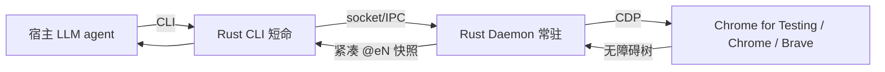

# agent-browser 源码级调研报告（Rank 62）

> 调研对象：`vercel-labs/agent-browser`
> 报告日期：2026-09-13　｜　数据基线：GitHub `main` 分支 README（含官方 Architecture 章节）

---

## 1. 项目概述与定位

| 项 | 值 |
|---|---|
| 项目名 | agent-browser |
| GitHub | https://github.com/vercel-labs/agent-browser |
| Star | 约 4.25w（清单快照 42,479） |
| 主要语言 | Rust（原生 CLI + 常驻 daemon），发布经 npm/Homebrew/Cargo |
| 许可证 | 开源（Vercel Labs） |
| 一句话定位 | **专为 AI agent 设计的浏览器自动化 CLI：单文件原生 Rust 二进制，通过 Chrome DevTools Protocol（CDP）直接驱动浏览器，把整页压缩为带 `@eN` 引用的可交互无障碍树快照，让 LLM 用极少 token 完成点击/填表/导航** |

**目标用户/场景**：编码 agent（Claude Code/Codex/Cursor/Gemini CLI/Copilot/Goose/OpenCode/Windsurf）的宿主开发者，需要一个快、稳、省 token 的"看屏操作"工具。README 明确 "Browser automation CLI for AI agents. Fast native Rust CLI."

**成熟度**：高。跨 macOS ARM64/x64、Linux ARM64/x64、Windows x64 发布原生 Rust 二进制（README Platforms 表）；自动检测已装 Chrome/Brave/Playwright/Puppeteer；自带 `doctor` 自检、`upgrade` 自动检测安装方式升级、`skills get` 运行时加载最新工作流。**daemon 无需 Node.js/Playwright**（README:79 "No Playwright or Node.js required for the daemon"）。

---

## 2. 源码结构总览

> 说明：受调研窗口网络限制，`.rs` 源文件未逐一下载（见 §10）。下面结构来自 README 官方 Architecture 章节与命令面，**架构结论为 README 一手证据**。

```
agent-browser/
├── Rust CLI            # 解析命令、与 daemon 通信（子进程）
├── Rust Daemon         # 纯 Rust，直接走 CDP，常驻、首命令自动拉起
├── Chrome for Testing  # 默认引擎（也可 --engine lightpanda）
└── 可执行命令面          # open/snapshot/click/fill/read/webmcp/mcp/...
```

**官方 Architecture（README:1662-1671，原文）**：
> "agent-browser uses a client-daemon architecture:
> 1. **Rust CLI** - Parses commands, communicates with daemon
> 2. **Rust Daemon** - Pure Rust daemon using direct CDP, no Node.js required"

**入口/启动**：首条命令自动拉起 daemon 并跨命令常驻（省去浏览器冷启动）；daemon socket/pid 走 `AGENT_BROWSER_NAMESPACE` 命名空间。构建侧需 Node 24+/pnpm 11+/Rust（README:45），但运行时 daemon 纯 Rust。

**代码规模**：单二进制原生 Rust，刻意把 Playwright/Node 运行时依赖全部剥掉，是"小而快"的工具型项目。

---

## 3. 系统架构分析

### 编排模式：非 agent 编排，而是 agent 的"执行工具"——客户端-守护进程双层

agent-browser 本身**不做 LLM 编排**，它是被外部 agent 调用的能力层。其内部架构是 client-daemon：

- **Rust CLI（瘦客户端）**：每次 `agent-browser <cmd>` 起一个短命进程，解析命令、把请求转发给 daemon，打印结果。
- **Rust Daemon（常驻服务）**：持有与 Chrome 的 CDP 连接，跨命令复用浏览器实例与 session。

**数据流**：宿主 agent 决定 → `agent-browser open <url>`（CLI→daemon→CDP→Chrome 导航）→ `snapshot`（daemon 经 CDP 取无障碍树，生成带 `@eN` 引用的紧凑树）→ agent 读树决策 → `click @e2` / `fill @e3 "..."`（daemon 用引用回算坐标或语义定位执行）→ 页面变化后重新 snapshot。

**核心交互范式**（README:85-93、1724-1730）：
```
open <url> → snapshot（拿 @e1/@e2/...）→ click @e1 / fill @e2 → 页面变了再 snapshot
```
引用 `@eN` 与截图标注 `[N]` 一一对应（README:980 "Each label [N] corresponds to ref @eN"），文本流与视觉流共用同一套 ref。



---

## 4. 功能拆解

- **快照即接口（snapshot）**：`snapshot` 返回无障碍树 + `@eN` 引用，是"best for AI"的主交互面；`--compact` 去掉空结构（README:974），`diff snapshot --compact` 做范围化差异。
- **语义定位（find）**：`find role/text/label/placeholder/alt/title/testid` + action（README:215-243），不依赖脆弱 CSS 选择器。
- **传统选择器兼容**：仍支持 `#submit`、`@eN`、`--name/--exact`。
- **`read` 无 Chrome 取文**：`read [url]` 不启动 Chrome，默认发 `Accept: text/markdown`、试探 `.md`、沿祖先路径找 `llms.txt`/`llms-full.txt`，再回落到正文提取（README:203）。
- **WebMCP（实验）**：页面 JS 可注册工具，CDP 暴露 `readOnly`/`untrustedContent` 注解，executor 握授权、宿主确认后果动作（README:152-165）。
- **MCP server 形态**：`agent-browser mcp --tools core,webmcp`，每个工具有 `url/selector/text/key/session/allowedDomains` 强类型字段，工具发现分页、带 read-only/open-world 注解（README:599）。
- **会话隔离**：`--session <id>` + `--restore` 自动存/恢复 cookies+localStorage；多 session 共享 Chrome 时按 CDP targetId 记忆各自标签页（README:734）。
- **自动化/可观测**：`batch --bail` 多步串成一轮（README:277）；`network requests --status 2xx`、`console --json`、`eval`、`pdf`、`screenshot --annotate`。

---

## 5. 技术亮点与优势

1. **accessibility-tree 快照 + `@eN` 引用是 token 压缩的关键**：不把整页 DOM 吐给 LLM，而是无障碍语义树 + 短引用，几 MB 页面压到几百 token，LLM 据此操作——比 dump HTML 省一两个数量级 token。
2. **纯 Rust + 直连 CDP，无 Node/Playwright 运行时**：启动快、内存小、跨平台原生单二进制，daemon 常驻避免浏览器冷启动。这是相对 Playwright/Puppeteer 系的核心差异化。
3. **标签句柄永不复用 + targetId 跨重启稳定**：tab id 形如 `t1/t2/t3`，session 内不复用（README:368）；CDP targetId 跨 daemon 重启仍稳定，多 session 协同一个浏览器时用 targetId 而不是 `t<N>`。
4. **点击失败早报遮挡元素**：点击被 consent banner/modal 遮挡时，错误直接告诉你 "covered by `<div#consent-banner>`"，并提示先 dismiss 再重新 snapshot——把常见的"点不动"变成可执行的下一步（README:95、1232）。
5. **`read` 主动适配 agent 友好文档**：优先 markdown、试探 `.md`、沿目录找 `llms.txt`，再回落正文提取——为"agent 读文档"专门设计。

---

## 6. 稳定性机制【重点】

- **idle 超时自动回收 daemon**：daemon 首命令自动起、跨命令常驻；**空闲 1 小时**无命令/dashboard 输入时，自动存 restore state、关浏览器、退出（README:1669）。这样"调用方没调 close"也不会无限泄漏 daemon+浏览器；下次命令全新起 daemon 且 restore 照常。可用 `--idle-timeout`/`AGENT_BROWSER_IDLE_TIMEOUT_MS` 调，`0` 关闭。**README 一手**。
- **`doctor` 自检 +  stale 文件自清**：`doctor` 检查环境、Chrome、daemon state、配置、加密 key、provider、网络可达性，并实跑一次无头 Chrome 启动；**stale socket/pid sidecar 文件自动清理**（README:539-545）。
- **命令级超时与等待语义**：`wait <selector|ms|--text>`；`read --timeout <ms>`；等待优先用 load/domcontentloaded，`networkidle` 仅在"已知会安静"的页面用，并明确警示 SSE/WebSocket/长轮询会让它永不 resolve（README:266）。
- **遮挡即报错、ref 失效引导重拍快照**：overlay 遮挡时不报"点击失败"，而报覆盖元素并要求重新 snapshot——引用是一次性的、页面变了必须重拍，避免 agent 拿过期 ref 瞎点（README:1232）。
- **`batch --bail` 失败即停**：多步批次遇错即停，不会带着错误状态继续跑（README:277）。
- **会话 autosave**：浏览器关闭时、空闲时、以及运行中每 `AGENT_BROWSER_AUTOSAVE_INTERVAL_MS`（默认 30000ms）等命令落定后周期存盘，且会捕获页面自身的 token 刷新/后台请求（README:820）。
- **session 绑定恢复**：daemon 重启后按 CDP targetId 重新 attach 到自己 session 的标签页，而不是抢占当前活跃页；`--pin-tab` 可严格绑定（README:734-751）。

---

## 7. 高可用机制【重点】

- **client-daemon 进程隔离**：短命 CLI 与常驻 daemon 分离，命令崩溃不杀 daemon，daemon 崩溃重启后经 targetId/restore 恢复会话。
- **多 session 复用一个浏览器且互不踩踏**：`--session` 隔离各自 cookies/存储/auth（README:725 每个 session 独立状态）；共享 `--cdp` 时按 targetId 记忆标签页，`--pin-tab` 防止别的 session/人抢标签（README:734-755）。
- **水平/多实例**：`close --all` 收所有 session；provider-owned cloud browser 仍纳入 idle 回收；iOS/Safari/人在用的 headed 浏览器默认不自动关（README:1669）。
- **凭据不落命令行**：provider 凭据由 daemon 直接解析，不出现在进程参数和普通输出里（README:662）。
- **可观测/排障**：`--json` 输出供 agent 解析；`session info --json`、`network requests`、`console --json`、`get cdp-url` 供 DevTools 调试。
- **局限（如实）**：单用户本机工具为主；多副本横向扩展不是其设计目标，横向靠每个 agent 独立 session/profile。

---

## 8. 自我进化机制【重点】

agent-browser 是**工具层**，"自我进化"主要体现在**技能/工作流随版本自更新**：

- **运行时加载最新 SKILL.md，杜绝陈旧指令**：Claude Code 侧只放一个"发现 stub"，真正工作流内容在运行时用 `agent-browser skills get core` 拉取，README 明确"这样指令永远匹配已装 CLI 版本，不会在发版间变陈旧"（README:1713）；并警告不要复制 node_modules 里的 SKILL.md（README:1703）。
- **`--help`/`skills get <name> --full` 自描述**：工具能力随 CLI 版本自描述，宿主 agent 每次运行都能看到最新命令面。
- **WebMCP 渐进式**：页面注册的工具带 read-only/untrustedContent 注解，宿主可增量加载大工具面（README:599 分页发现）。
- **未发现**：无 LLM 在线权重学习、无自动 A/B；"进化"= 工具描述随版本自更新 + 技能运行时拉取，是工具层的 freshness 治理。

---

## 9. openmate 可借鉴点【重点】

openmate 背景：Python AI Agent 应用，已有 Web 版，规划桌面/手机多端。

- **【P0】把"整页/整文件"压成带短引用的紧凑树（accessibility snapshot + @eN）**：openmate 桌面/手机 agent 操作 UI 或读长文档时，绝不要把原始 DOM/全文塞给 LLM。学 agent-browser：语义化、去空结构（`--compact`）、给元素编号引用、引用与视觉标注一一对应。这是省 token、提命中率的核心。
- **【P0】常驻 daemon + 短命 client 的进程模型**：openmate 桌面端做"浏览器/文件/Shell 工具"时，照抄"短命 CLI 转发 + 常驻 daemon 持有资源"——避免每次调用都冷启动浏览器/运行时；再加 idle 超时自动回收（1h），防止调用方崩溃后资源泄漏。
- **【P0】引用一次性、页面一变必须重拍快照**：openmate 做 GUI/web 自动化时，规则化"任何状态变更后强制重取引用"，并把"被遮挡/元素消失"翻译成明确错误+下一步动作，而不是笼统"点击失败"。
- **【P1】空闲 autosave + 周期落盘**：手机切后台、进程被杀极常见。照抄"关闭时存盘 + 运行中每 30s 落定后周期存 + 捕获页面自身后台变更"，恢复时按稳定句柄（targetId）重 attach 而非抢占当前页。
- **【P1】工具/凭据不出现在命令行与普通输出**：openmate 桌面端接外部 API key/登录态时，由常驻 daemon 保管、子进程只传引用名，日志和截图里绝不泄漏。
- **【P2】SKILL/工作流运行时拉取、勿固化**：openmate 写操作指南时，放一个最小发现 stub，真正步骤运行时按版本拉，避免发版后指令与实际能力脱节。

---

## 10. 源码验证标注

**一手获取（已下载并通读）**：
- `README.md`（95KB，完整）。关键证据行：安装/要求:7-81、Quick Start 与遮挡即报错:85-97、命令面:107-150、WebMCP 安全语义:152-173、read/llms.txt 适配:203-205、等待语义 networkidle 警示:266、batch --bail:277、tab id 稳定性:368-382、axe 内嵌离线:494、doctor 自检与 stale 自清:539-545、MCP 强类型字段与分页:599-631、凭据不出命令行:662、state 加密与 autosave:692、820、session 隔离与 pin-tab:725-755、安全三件套（content-boundaries/allowed-domains/max-output）:848-854、1045-1047、`--compact` 与 `@eN=[N]` 标注:974-980、**官方 Architecture client-daemon + idle 1h:1662-1671**、原生二进制平台表:1675-1682、skills 运行时自更新:1703-1713。

**未能获取（如实说明）**：
- 各 `.rs` 源文件（CLI/daemon/CDP 封装具体实现）：raw.githubusercontent.com 在本批次网络下多次 connection reset，按"失败 2 次即跳过"规则未继续。**故类名/函数名/具体 crate 未逐行确认**，架构判断以 README 官方 Architecture 章节为准。

**文档/架构清单推断**：
- "把数 MB 页面压到 200-400 token"的具体 token 数字、`openhuman` 式 TokenJuice 类比，来自架构清单（architecture_batch3.json rank62）与 README 的 compact/read 设计；未在源码中找到精确 token 统计。
- 星级/活跃度来自清单快照。
