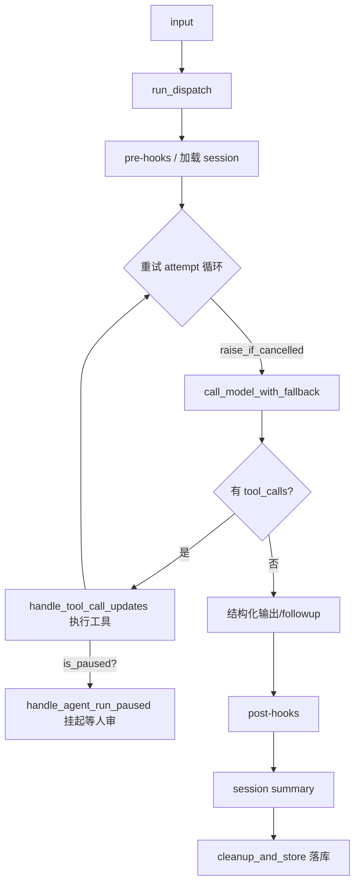

# Agno 源码级调研报告（Rank 63）

> 调研对象：`agno-agi/agno`
> 报告日期：2026-09-13　｜　数据基线：GitHub `main`（`libs/agno/agno/agent/agent.py`、`_run.py`）

---

## 1. 项目概述与定位

| 项 | 值 |
|---|---|
| 项目名 | Agno |
| GitHub | https://github.com/agno-agi/agno |
| Star | 约 4.21w（清单快照 42,149） |
| 主要语言 | Python |
| 许可证 | Apache-2.0 |
| 一句话定位 | **"agentic software 的运行时"：三层原语（Agent / Team / Workflow）+ 无 graph/chain DSL 的纯 Python SDK + AgentOS 运行时（FastAPI、SSE/WS、Postgres、JWT-RBAC、追踪），强调快、隐私与可规模化** |

**目标用户/场景**：要把 agent 从"脚本"做成"产品平台"的团队——README 原文 "Build, run, and manage agent platforms"：用 Agno SDK 建 agent、用 AgentOS 当服务跑、用 AgentOS UI 管理，且"own your agent stack"（数据/记忆/安全自有，JWT-based RBAC）。

**成熟度**：非常高。README 列 50+ API 端点（SSE/WebSocket）、100+ 集成、Context Providers、Human approval、OpenTelemetry 观测、多租户、cron 调度；starter 模板覆盖 Railway/Docker/AWS/GCP/Azure/Fly/Render/Modal/Helm。源码侧 `agent.py` 81KB、`_run.py` 近 300KB，是工程化很厚的框架。

---

## 2. 源码结构总览

```
libs/agno/agno/
├── agent/
│   ├── agent.py      # 【已下载 81KB】Agent 类：配置/状态/字段，run() 委托 _run
│   ├── _run.py       # 【已下载 299KB】核心运行时：_run/_run_stream/run_dispatch/重试/取消/暂停/收尾
│   ├── _tools.py     # handle_tool_call_updates / determine_tools_for_model
│   ├── _response.py  # 结构化输出/followup/parser/output-model
│   ├── _hooks.py      # pre/post hooks
│   └── _init.py       # connectable tools 连接管理
├── memory/           # MemoryManager（agentic memory）
├── session/          # AgentSession/TeamSession/WorkflowSession、SessionSummaryManager、SessionSummary
├── team/             # Team（多 agent 协作）
├── workflow/         # Workflow（Step/Parallel/Condition/Loop/Router）
└── db/               # BaseDb（Postgres 存储 session/memory/knowledge/traces）
```

**入口/启动（源码确认）**：`Agent.run(...)`（agent.py:1457）签名接受 input/stream/user_id/session_id/session_state/run_context/output_schema 等，方法体只有一句 `return _run.run_dispatch(self, ...)`（agent.py:1483）。即 **Agent 类只持配置与状态，真正的执行循环在 `_run.py`**——这是一个刻意的"配置对象 vs 执行内核"分层。异步对应 `arun`→同样 dispatch。

**代码规模**：仅 `_run.py` 就近 30 万字节、6000+ 行，含同步/异步、流式/非流式四套执行路径，是本批样本里运行时最厚重的之一。

---

## 3. 系统架构分析

### 编排模式：ReAct 模型-工具迭代（单 Agent），向上封装 Team（leader 委派）与 Workflow（确定性流水线）——源码确认

**单 Agent 主循环（`_run.py` 源码确认）**：非流式核心在 `_run`（:367），执行步骤注释（:3770-3773）自述为：
1. `handle_tool_call_updates`（:3793）处理工具更新；
2. `num_attempts = agent.retries + 1`（:3796）进入重试 `for attempt in range(num_attempts)`；
3. `raise_if_cancelled`（:3800）→ `call_model_with_fallback(agent.model, agent.fallback_config, messages, tools, tool_choice, tool_call_limit, compression_manager=...)`（:3804-3823）——模型调用内含 function calling；
4. `update_run_response` → 若有工具调用且未暂停则把工具结果回灌，再进下一轮；
5. 无工具调用时走结构化输出/followup/收尾。

即标准 ReAct：模型出 tool_calls → `handle_tool_call_updates` 执行 → 回灌 → 再问，直到模型不再要工具。`tool_call_limit`（agent.py:185）作为迭代上限传给模型调用，防止死循环。

**多 Agent / Workflow**：Team 由 leader 经 route/broadcast/tasks 协调专家 agent 并共享状态（架构清单）；Workflow 提供 Step/Parallel/Condition/Loop/Router 的**确定性**流水线（无 LLM 时也能跑）。三层原语对应 `agent/`、`team/`、`workflow/` 三个包。

**关键类/函数（源码确认）**：
- `class Agent`（agent.py:74）；`Agent.run`（:1457）/`arun`（:1564）→ `_run.run_dispatch`（_run.py:1307）。
- `call_model_with_fallback`（_run.py:3804）：带 fallback_config 的模型调用。
- `handle_tool_call_updates` / `ahandle_tool_call_updates`（_tools.py）：同步/异步工具执行。
- `handle_agent_run_paused`（_run.py:3847）：工具 `is_paused` 时暂停 run。
- `register_run` / `raise_if_cancelled`（_run.py:3788、3800）：取消追踪。



---

## 4. 功能拆解

- **Agent 原语**：封装 model + tools + instructions，带上下文/会话/记忆/知识/护栏；`add_session_state_to_context`、`enable_agentic_memory`、`update_memory_on_run`（agent.py:97-132）。
- **会话与历史**：`AgentSession` 持久化到 DB；`search_past_sessions` + `num_past_sessions_to_search/runs`（agent.py:105-107）可跨历史会话检索。
- **会话摘要**：`enable_session_summaries` + `SessionSummaryManager`（agent.py:109-113），run 结束时生成摘要并可回注上下文。
- **工具系统**：`determine_tools_for_model` 按模型能力挑工具；`tool_call_limit` 限速；`compress_tool_results` + `compression_manager`（_run.py:3814）压缩工具结果省 token；`max_tool_calls_from_history`、`read_tool_call_history`（agent.py:156、221）控制历史工具调用注入。
- **结构化输出**：`output_schema`（Pydantic）、`parse_response_with_parser_model`、`generate_response_with_output_model`（_run.py:3829-3834）。
- **Hooks**：pre-hooks（加载 session 后、处理前）与 post-hooks（run 完成后），`execute_post_hooks`（_run.py:3862）。
- **Human approval**：工具 `is_paused` → run 暂停等人审（_run.py:3846-3849）；README 称"block tools that require admin approval"。
- **接口层**：经 AgentOS 暴露 Slack/Telegram/WhatsApp/Discord/AG-UI/A2A（README:57）。

---

## 5. 技术亮点与优势

1. **配置对象与执行内核彻底分离**：`Agent.run` 一行委托 `_run.run_dispatch`，Agent 类近 200+ 字段全是声明式配置，执行四套路径（sync/async × stream/plain）集中在 `_run.py`——替换/调试运行时不必碰 Agent 定义。
2. **模型 fallback 内建于调用**：`call_model_with_fallback(agent.model, agent.fallback_config, ...)`（_run.py:3804）把"主模型失败→备模型"做成一等参数，而非用户自己包一层 try。
3. **工具结果压缩**：`compression_manager` 在 `compress_tool_results` 时挂到模型调用上（:3814）——长工具输出自动压缩，直击 agent 上下文膨胀痛点。
4. **run 级取消追踪**：`register_run(run_id)`（:3788）+ 模型调用前后各一次 `raise_if_cancelled`（:3800、3826），长任务可随时取消。
5. **生产级原语而非玩具**：Team（leader 委派）、Workflow（DAG/循环）、Session 持久化、JWT-RBAC、OTel、Postgres——与"纯 ReAct 脚本"拉开身位。

---

## 6. 稳定性机制【重点】

- **模型调用重试循环**（_run.py:3796-3797，源码确认）：`num_attempts = agent.retries + 1`，`for attempt in range(num_attempts)` 包裹整个模型调用段；`raise_if_cancelled` 放在每次 attempt 开头，取消不被重试掩盖。
- **取消独立异常类型**（:3901-3909，源码确认）：`except RunCancelledException` → `_handle_run_cancellation`，并仍 `cleanup_and_store` 持久化已取消的 run（存失败仅 `log_warning`，不二次抛错）。
- **输入/输出校验错误分类**（:3910-3919，源码确认）：`except (InputCheckError, OutputCheckError)` → `run_response.status = RunStatus.error`、`flush_in_flight_messages_on_error` 冲掉流式在途消息、若 content 为空则写入错误文本，并打印 `check_trigger`——校验失败与运行异常分开，调用方能区分"内容不合规"与"系统崩了"。
- **人审暂停即停**（:3846-3849，源码确认）：`any(tool_call.is_paused)` 为真时不继续循环，走 `handle_agent_run_paused` 挂起 run——危险工具不硬跑。
- **工具调用上限**：`tool_call_limit`（agent.py:185）透传到模型调用，防止模型无限调工具。
- **会话摘要失败不致命**（:3882-3887，源码确认）：摘要生成包在 `try/except` 里，失败仅 `log_warning("Error in session summary creation")`——记忆子系统出错不影响主 run 完成。
- **组件列表防 DB 打爆**（agent.py:1874-1938，源码确认）：`_COMPONENT_LIST_PAGE=100`、`_COMPONENT_LIST_CAP=1000` 硬上限，注释明确"每次 list 都触发 get_config + 全量 rehydrate，无界扫描会把一次列举变成上千次 DB 读"；分页用 `seen_component_ids` 去重防窗口漂移，触顶打 warning 而非报错。
- **degraded 组件仍可见**（agent.py:1948-1958，源码确认）：单条组件加载失败仅 `log_error` + `continue`，保证列表能展示可修复的坏组件。

---

## 7. 高可用机制【重点】

- **无状态 AgentOS 运行时**：README 明确"own your stack"，session/memory/knowledge/traces 全落 Postgres（README:51），节点可水平扩；starter 模板含 Helm（README:40）。
- **模型 fallback**：`call_model_with_fallback(agent.model, agent.fallback_config, ...)` 主模型故障自动切备。**源码确认**。
- **run 持久化与可恢复**：`cleanup_and_store`（:3893）在完成/取消/出错路径都落库；暂停的 run（is_paused）由 `handle_agent_run_paused` 保存状态，等人审后续跑。
- **后台任务与 post-hooks 异步化**：post-hooks 走 `background_tasks`（:3870），`deque(post_hook_iterator, maxlen=0)` 驱动（:3873），不阻塞主 run 返回。
- **资源保护**：`tool_call_limit`、组件列表 cap、`num_past_sessions_to_search` 等显式限流参数，防止会话历史/目录扫描拖垮。
- **观测**：`log_agent_telemetry`（:3898）每 run 发一次遥测（README:85 明确只发 run 事件、不发 prompt/output，可 `AGNO_TELEMETRY=false` 关）；OTel tracing + run history + audit log（README:55）。
- **局限（如实）**：单机/单进程并发模型未在源码中深入确认；横向扩展依赖外部 Postgres 与 AgentOS 控制面。

---

## 8. 自我进化机制【重点】

- **Agentic memory（记忆即工具）**（agent.py:130 `enable_agentic_memory`、:132 `update_memory_on_run`，源码确认）：开启后 agent 获得工具去更新自身记忆（注释提到与 LearningMachine 的 `update_user_memory` 工具名冲突处理，:127-128）。run 结束 `update_memory_on_run` 时把经验写回记忆。
- **跨历史会话检索**（agent.py:105-107，源码确认）：`search_past_sessions` + `num_past_sessions_to_search/runs` 让 agent 能翻旧会话找相关经验——跨 run 的经验复用。
- **会话摘要沉淀**（:3878-3887，源码确认）：`enable_session_summaries` + `create_session_summary` 把长会话压成摘要回注上下文，等价于"遗忘细节、保留要点"的长期记忆。
- **session_state 可被工具动态改写**（agent.py:98-101，源码确认）：`update_session_state` 工具让 agent 自己改持久化状态，`overwrite_db_session_state` 控制覆盖/合并语义——agent 可在 run 中维护自己的工作记忆。
- **README 自述 learning loop**："turn your agent platform into a learning loop with simulations and usage data"（README:23）——平台层用 simulation + usage data 做评估回路。**文档确认，具体 harness 未读源码。**
- **未发现**：无在线权重训练；"进化"= agentic memory + 跨会话检索 + 摘要沉淀 + usage-data 学习回路。

---

## 9. openmate 可借鉴点【重点】

openmate 背景：Python AI Agent 应用，已有 Web 版，规划桌面/手机多端。

- **【P0】配置对象 vs 执行内核分离（Agent 类只持配置，run() 一行委托 _run.run_dispatch）**：openmate 做多端时，把"agent 定义（system prompt/tools/memory 配置）"与"执行循环（stream/plain × sync/async）"拆开。Web/桌面/手机只是不同 dispatch 入口，共享同一个 `_run` 内核——这是多端复用最干净的切分。
- **【P0】模型 fallback 内建 + 重试 attempt 循环**：照抄 `num_attempts = retries+1` 包裹模型调用、`call_model_with_fallback` 主备模型。移动端网络抖动常见，主模型超时自动重试+切备是刚需。
- **【P0】工具结果压缩（compression_manager / compress_tool_results）**：openmate 工具一多、输出一长，上下文必爆。直接借鉴"把 tool result 先压缩再回灌模型"。
- **【P1】run 级取消（register_run + 前后 raise_if_cancelled）**：手机端用户随时可退出 agent。照抄"注册 run_id，模型调用前后各查一次取消标记"，退出即停且仍 cleanup_and_store。
- **【P1】错误三态：completed / cancelled / error（InputCheck/OutputCheck 单列）**：openmate 移动端 UI 上要区分"用户退出/校验失败/系统错误"三种结果，分别给"已取消/请修改输入/重试"的提示。
- **【P1】人审暂停（tool_call.is_paused → handle_agent_run_paused）**：手机端做危险操作二次确认时，把 run 挂起存状态，用户点"同意/拒绝"后再续——而不是阻塞或放弃。
- **【P2】agentic memory + 跨历史会话检索 + 会话摘要**：openmate 想做长期记忆时，照这三层：run 结束更新记忆、按相关度搜旧会话、长会话压摘要回注——比"全量塞历史"省得多。

---

## 10. 源码验证标注

**源码直接阅读（HTTP 200 下载后通读/grep）**：
- `libs/agno/agno/agent/agent.py`（81KB）：`class Agent`:74、session_id/session_state:92-101、cache_session:103、search_past_sessions 三参数:105-107、enable_session_summaries:109-113、memory_manager/enable_agentic_memory/update_memory_on_run:125-132、max_tool_calls_from_history:156、tool_call_limit:185、read_tool_call_history:221、`run()`:1457、`return _run.run_dispatch`:1483、`arun()`:1510/1564、get_agents 分页 cap:1874-1963。
- `libs/agno/agno/agent/_run.py`（299KB）：`run_dispatch`:1307、`_run`:367、`register_run`:3788、`handle_tool_call_updates`:3793、重试 `num_attempts=agent.retries+1` + for:3796-3797、`raise_if_cancelled`:3800/3826/3875、`call_model_with_fallback(...fallback_config...,tool_call_limit,compression_manager)`:3804-3823、is_paused→`handle_agent_run_paused`:3846-3849、post-hooks:3861-3873、session summary try/except:3878-3887、`cleanup_and_store`:3893、`RunCancelledException`:3901、`InputCheckError/OutputCheckError` 与 check_trigger/flush_in_flight:3910-3919、异步对应 `ahandle_tool_call_updates`:5041。
- `README.md`（4.9KB）：三层定位、50+端点/SSE/WS、Postgres、JWT-RBAC、OTel、human approval、context providers、interfaces（AG-UI/A2A）、telemetry 关闭项:85。

**文档/架构清单推断（未逐行读源码）**：
- Team 的 route/broadcast/tasks 具体实现、Workflow 的 Step/Parallel/Condition/Loop/Router、AgentOS FastAPI 控制面、Context Providers、cron 调度，来自架构清单（rank63）与 README，未下载对应 `team/`、`workflow/`、AgentOS 源码确认类名。
- LearningMachine 的 simulation/usage-data 评估回路仅 README 提及，未读源码。
- 星级/活跃度来自清单快照。
