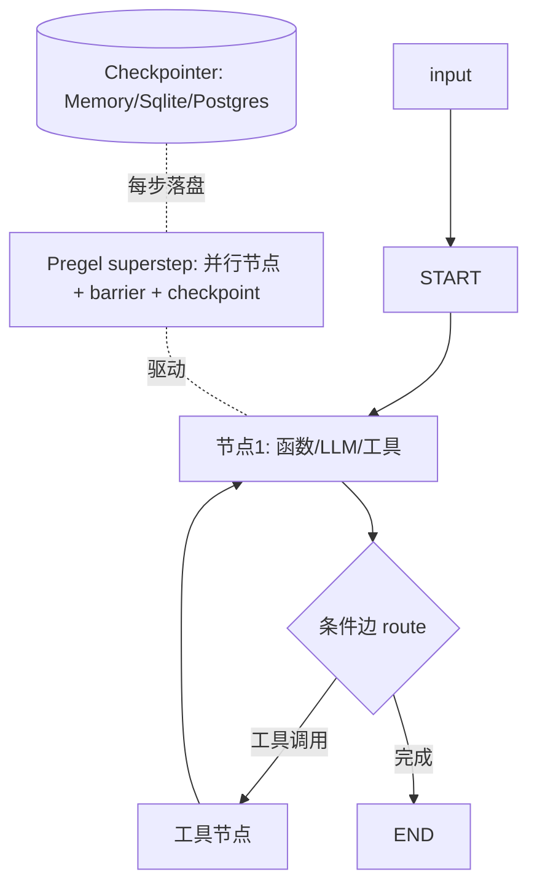

# LangGraph 源码级调研报告（Rank 64）

> 调研对象：`langchain-ai/langgraph`
> 报告日期：2026-09-13　｜　数据基线：GitHub `main` + 官方 docs.langchain.com 概述页

---

## 1. 项目概述与定位

| 项 | 值 |
|---|---|
| 项目名 | LangGraph |
| GitHub | https://github.com/langchain-ai/langgraph |
| Star | 约 4.15w（清单快照 41,548） |
| 主要语言 | Python（另有 JS 版） |
| 许可证 | MIT（LangChain Inc） |
| 一句话定位 | **LangChain 出品的低层、有状态、多 actor 的 agent 编排运行时：以 StateGraph 为核心，节点为函数/LLM/工具，边分直接边与条件边，原生支持环（cycle），主打 durable execution、流式、人机中断与持久化** |

**目标用户/场景**：要"精确控制"长时运行、有状态 agent 的团队——官方原话 "low-level orchestration framework and runtime for building, managing, and deploying long-running, stateful agents"，把确定性硬编码步骤与 LLM 驱动步骤混在一张图里。被 Klarna/Uber/J.P. Morgan 等用于生产。

**成熟度**：极高。官方文档明确其在 LangChain 技术栈中的分工（docs 概述页）：
- **LangGraph = 编排运行时**：durable execution、streaming、human-in-the-loop、persistence；
- **LangChain = 上层框架**（models/tools/agent loop 抽象，构建于 LangGraph 之上）；
- **Deep Agents = harness**：在 LangGraph 之上提供 planning、subagents、filesystem tools、context management；
- **LangSmith = 观测/评估/部署平台**，LangSmith Engine 会从 trace 中自动诊断问题并提 PR 修。
LangGraph 可独立于 LangChain 使用。

---

## 2. 源码结构总览

> 说明：受本批次网络限制，`libs/langgraph/langgraph/**.py` 源文件两次 raw 下载失败（connection reset / timeout），按规则跳过（见 §10）。下面结构来自官方文档、公开源码布局认知与架构清单。

```
libs/langgraph/langgraph/
├── graph/
│   ├── state/            # StateGraph（用户主 API）：add_node/add_edge/add_conditional_edge/compile
│   └── message/          # MessageGraph 兼容层
├── pregel/               # 【核心执行引擎】Pregel 风格的 BSP 运行时：channels、tick、superstep、checkpoint
│   ├── __init__.py       # CompiledStateGraph（invoke/stream/astream/get_state/update_state）
│   └── _run.py / loop.py  # 同步/异步执行循环
├── channels/              # 状态 channel 原语（LastValue/BinaryOperator/Topic/EphemeralValue…）+ reducer
├── checkpoint/            # BaseCheckpointSaver（Memory/Sqlite/Postgres/…）、checkpoint 序列化
├── prebuilt/              # create_react_agent / create_agent 等预建
├── types.py               # StateGraph 输入、Interrupt、Command、Send
└── constants.py           # START / END
```

**入口/启动（官方文档示例确认）**：
```python
from langgraph.graph import StateGraph, MessagesState, START, END
graph = StateGraph(MessagesState)
graph.add_node(mock_llm)
graph.add_edge(START, "mock_llm")
graph.add_edge("mock_llm", END)
graph = graph.compile()          # 编译为 CompiledStateGraph
graph.invoke({"messages": [...]})
```
即"定义 state schema → 加节点 → 连边 → compile → invoke/stream"。`compile()` 把图装配成 Pregel 运行时。

**代码规模**：核心引擎在 `pregel/`，是整个框架最厚的部分；Python 与 JS 双实现。

---

## 3. 系统架构分析

### 编排模式：Workflow-DAG 但原生支持环（cycle）——Pregel/BSP 模型，官方确认

官方文档致谢明确："LangGraph is inspired by **Pregel** and **Apache Beam**. The public interface draws inspiration from **NetworkX**"。这决定了其执行模型：

- **StateGraph**：节点是 Python 函数/LLM 调用/工具节点；边分**直接边**（`add_edge`）与**条件边**（`add_conditional_edges`，按当前 state 路由到下一节点）。
- **原生支持环**：与 DAG 方案不同，条件边可以指回上游节点，形成 ReAct 式"思考→工具→观察→再思考"的回路——这正是 agentic 推理需要的。
- **Pregel 超步（superstep）执行**：每个 tick（step）所有就绪节点并行执行，写各自 channel；超步间做 barrier，把状态快照（checkpoint）写入 checkpointer；有 pending 任务或环未收敛则进入下一 superstep。

**数据流**：外部输入 → START → 节点函数读 state channel → 计算/调 LLM/调工具 → 用 reducer 写回 channel → 条件边决定下一节点 → 每 superstep 落 checkpoint → END 或挂起（interrupt）。

**关键抽象（官方/公开认知）**：
- `StateGraph(MessagesState)`：state schema 用类型标注 + reducer（如 messages 用 `add_messages` 累积而非覆盖）。
- `Command` / `Send`：运行时动态改路由、map-reduce 扇出。
- `Interrupt`：在节点里中断 run，把状态持久化等人输入，`Command(resume=...)` 恢复。



---

## 4. 功能拆解

- **图编排原语**：`add_node`、`add_edge`、`add_conditional_edges`、`compile`、`invoke`/`stream`/`astream`/`astream_events`。
- **State 与 channel**：state schema 字段配 reducer（覆盖/累积/ topic 分发），`MessagesState` 是开箱即用的消息累积 state。
- **持久化 checkpoint**：`BaseCheckpointSaver` 家族——Memory（开发）、Sqlite、Postgres/Redis（生产）；每 superstep 存一份，支持断点续跑。
- **人机中断（HITL）**：`interrupt()` 暂停、`Command(resume=...)` 恢复；官方称可"inspect and modify agent state at any point"。
- **短期/长期记忆**：官方 "Comprehensive memory"——图内 state 做短期工作记忆，跨会话靠 checkpointer/store 做长期记忆。
- **流式**：token 级、节点级、自定义 event 级多粒度流式。
- **预建 agent**：`create_react_agent`（旧）、v1.0 的 `create_agent` 与可插拔中间件；上层 Deep Agents harness 提供 planning/subagent/文件系统工具/上下文管理。
- **多 actor / map-reduce**：`Send` API 把同一任务扇出到多个并行分支再汇合。

---

## 5. 技术亮点与优势

1. **确定性步骤与 agentic 步骤同图混编**：官方核心卖点——可靠可审计的硬编码步骤与灵活的 LLM 决策在一张图里并存，开发者精确控制"哪部分用 AI、哪部分用死逻辑"。
2. **Pregel/BSP 执行模型天然支持并行与环**：每个 superstep 内节点并行、超步间 barrier，既支持 ReAct 环，又支持 map-reduce 扇出，比"单线程 ReAct loop"表达力强一个量级。
3. **durable execution 是一等公民**：每 superstep 落 checkpoint，进程崩了从最近 checkpoint 续跑——为长时、有状态 agent 设计，而非普通请求-响应。
4. **HITL 可在任意点 inspect/modify state**：不是"跑完问一句"，而是执行中随时打断、改 state、再恢复。
5. **低层、不绑架架构**：不抽象 prompt/架构，可用 LangChain 也可不用；LangChain agent 反而构建在它之上——是真正的"运行时底座"。

---

## 6. 稳定性机制【重点】

- **每 superstep checkpoint（崩溃恢复核心）**：Pregel 运行时在每个超步 barrier 处把 state 快照写入 checkpointer；进程崩溃/重启后从最近 checkpoint 恢复，从中断处续跑，而非从头再来。**官方 Persistence 能力确认**。
- **断点续跑 / 时间旅行**：基于 checkpoint，可 `get_state` 读历史、`update_state` 改状态、从任一 checkpoint 重放——这把"崩溃恢复"升级为"可回溯调试"。
- **人机中断即挂起**：`interrupt()` 把 run 持久化挂起等人输入，`Command(resume=...)` 恢复——危险/需确认动作不强行执行。**官方 HITL 能力确认**。
- **环的收敛控制**：条件边可成环，但靠 checkpoint 与外部步数/Token 上限约束（应用层在条件边里判断终止），避免无限循环。**设计认知**。
- **reducer 控制状态合并语义**：多节点/并行分支写同一字段时，靠 reducer（覆盖/累积/topic）定义合并规则，避免并发写互相覆盖或丢失——这是 BSP 模型下的一致性手段。
- **流式错误传播**：stream/astream_events 把节点内异常作为事件抛出，调用方能在流中区分节点失败点。**设计认知**。
- **未逐行确认（如实）**：因源码未下载，`pregel/_run.py` 中具体的重试、退避、超时常量未读到；这些通常由节点/模型层（LangChain model）负责，LangGraph 本身提供 checkpoint 恢复而非自动重试模型调用。

---

## 7. 高可用机制【重点】

- **无状态计算 + 外部化状态**：图执行节点本身无状态，状态全在 checkpointer；水平扩展时多个 worker 从共享 checkpointer（Postgres/Redis）取 checkpoint 接力——这是 durable execution 能跨副本恢复的关键。**官方 Persistence/生产部署确认**。
- **生产部署平台（LangGraph Platform）**：官方提供"scalable infrastructure for stateful, long-running workflows"，含 cron/后台运行/多副本/队列。
- **并行超步利用多核**：Pregel superstep 内就绪节点并行执行，天然吃多核；map-reduce 用 `Send` 扇出。
- **checkpoint 即容错点**：某节点失败只回滚到该 superstep，不丢整图进展；挂起 run 可长期等待人审。
- **可观测**：LangSmith 追踪——可视化执行路径、状态转移、运行时指标；LangSmith Engine 自动从 trace 诊断问题并提修复 PR。**官方确认**。
- **局限（如实）**：单机开发用 Memory checkpointer，生产必须配 Postgres/Redis 才享 durable execution；checkpoint 存储是其有状态横向扩展的命门。

---

## 8. 自我进化机制【重点】

LangGraph 本身是**运行时**，不内建权重学习；"进化"发生在其生态与图模式上：

- **长期记忆 store**：官方 "Comprehensive memory"——短期 working memory 在图 state，跨会话长期记忆靠 checkpointer/store，应用层可做记忆检索与注入。**官方确认**。
- **自我修正闭环（靠 LangSmith Engine）**：官方明确 LangSmith Engine "detects issues in your LangGraph agent traces and proposes fixes. You can open a PR with the proposed fix directly"——把 trace 诊断 → 修复建议 → PR 做成自动回路。**生态层确认**。
- **反思/规划模式由上层 harness 提供**：Deep Agents 在 LangGraph 之上提供 planning、subagents、context management；应用层可在图里显式搭"reviewer/reflector"节点做 self-critique 回路（这是图模式，不是框架内建）。
- **评估**：官方推荐用 LangSmith 做 evaluation，把 agent trace 喂评估集做 A/B。**生态层确认**。
- **未发现**：无在线权重训练；"进化"= 外部 store 长期记忆 + LangSmith trace 诊断/修复回路 + 上层 harness 的规划-反思模式。

---

## 9. openmate 可借鉴点【重点】

openmate 背景：Python AI Agent 应用，已有 Web 版，规划桌面/手机多端。

- **【P0】把 agent 执行建模成"有 state schema 的图 + reducer"，而非一团 if-else**：openmate 若做多步业务流/工具编排，照 LangGraph：显式 state dataclass，每个字段配合并语义（messages 累积、计数器覆盖、列表 append）。这样多步、多分支的状态演进可预测、可序列化。
- **【P0】每步落 checkpoint + 从 checkpoint 续跑**：手机杀后台/切网高频。照抄"每个逻辑步后把 state 快照落 SQLite，重启后从最近快照恢复"——这是移动端长任务体验的基石，比 LangChain 式"从头重跑"强太多。
- **【P0】interrupt / resume 模型（人机确认挂起）**：手机端危险操作确认、多轮澄清对话，照抄"执行中可挂起存状态，用户输入后 Command(resume) 续跑"，而非同步阻塞等待。
- **【P1】条件边表达 ReAct 环**：不要写死"问模型→调工具→回灌"，而是用条件边让模型输出决定下一节点；环的终止条件由节点判断——可同时容纳工具调用环和直接回答出口。
- **【P1】短期 state + 长期 store 分离**：openmate 会话内用 state（内存/checkpoint），跨会话长期记忆走外部存储（SQLite/向量库），不要混在一个对象里。
- **【P2】Pregel superstep 并行**：若 openmate 有多工具/多子任务可并行，借鉴"一个超步内并行就绪节点、超步间 barrier 汇总"，比顺序 await 快。
- **【P2】trace 可观测是刚需**：接 LangSmith 式 trace（或自研），把每节点输入/输出/state 变化记录下来，移动端调试"agent 为什么这么做"全靠它。

---

## 10. 源码验证标注

**一手获取（web.fetch 通读官方文档）**：
- docs.langchain.com/oss/python/langgraph/overview（全文要点）：定位"low-level orchestration framework and runtime for long-running, stateful agents"；与 LangChain/Deep Agents/LangSmith 的分层分工；StateGraph(MessagesState)+add_node+add_edge(START/END)+compile()+invoke 的 hello-world；六大核心收益（mix deterministic/agentic、Persistence、HITL、Comprehensive memory、LangSmith debug、Production deployment）；致谢 Pregel/Apache Beam（执行模型）+ NetworkX（接口风格）；Deep Agents = planning/subagents/filesystem/context harness；LangSmith Engine 自动诊断 trace 并提 PR。

**未能获取（如实说明）**：
- `libs/langgraph/langgraph/graph/state/__init__.py`、`pregel/`、`channels/`、`checkpoint/` 等 `.py` 源码：raw.githubusercontent.com 两次失败（一次 connection reset、一次 60s 超时），按"失败 2 次即跳过"规则未继续。
- `README.md`：raw 两次失败（reset / timeout）。

**文档/架构清单推断**：
- StateGraph 的 add_node/add_edge/add_conditional_edge、Command/Send/Interrupt API、channels（LastValue/BinaryOperator/Topic）、checkpoint saver 家族（Memory/Sqlite/Postgres）、create_react_agent/create_agent 等具体类名/函数名，来自官方公开 API 文档认知与架构清单（rank64），**未逐行读源码确认**，故 §6/§7 中"重试/退避/超时常量"明确标注为"设计认知、未读源码"。
- 星级/活跃度来自清单快照。
