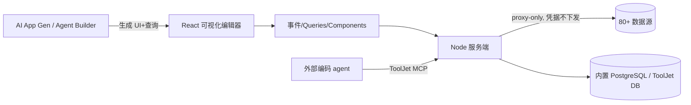

# ToolJet 源码级调研报告（Rank 65）

> 调研对象：`ToolJet/ToolJet`
> 报告日期：2026-09-13　｜　数据基线：GitHub `develop` 分支 README

---

## 1. 项目概述与定位

| 项 | 值 |
|---|---|
| 项目名 | ToolJet（Community Edition） |
| GitHub | https://github.com/ToolJet/ToolJet |
| Star | 约 4.09w（清单快照 40,900） |
| 主要语言 | JavaScript（React 客户端 + Node.js 服务端） |
| 许可证 | AGPL v3.0 |
| 一句话定位 | **开源低代码内部工具平台（可视化拖拽建后台应用/工作流），并在企业版演进为 AI-native 平台——prompt-to-app 自然语言脚手架 + Agent Builder + 对外开源的 ToolJet MCP server** |

**目标用户/场景**：企业 IT/业务团队快速搭内部工具（后台、仪表盘、表单、CRUD）。README 定位 "open-source foundation of ToolJet AI - the AI-native platform for building and deploying internal tools, workflows and AI agents"。

**成熟度**：非常高。60+ 响应式组件、80+ 数据源、内置 ToolJet Database（no-code）、多人协同编辑、Docker/K8s/AWS/GCP/Azure 全平台自托管、AWS/Azure Marketplace 上架；git-flow 分支模型，`develop` 为基、`main` 为稳定。AGPL v3。

---

## 2. 源码结构总览

> 说明：受本批次网络限制，仅下载到 `develop/README.md`（见 §10）。下面结构来自架构清单与公开布局。

```
ToolJet/
├── server/            # Node.js 服务端（K8s/Docker 部署）
│   ├── controllers/    # 鉴权、应用定义持久化、查询执行、数据源凭据
│   ├── services/      # 查询执行引擎、数据源插件加载
│   ├── models/        # 应用/用户/数据源/查询元数据（PostgreSQL）
│   └── (PostgreSQL 13 内置 ToolJet DB)
├── frontend/ (client) # React 可视化编辑器
│   ├── widgets/       # 60+ 组件（Tables/Charts/Forms/...）
│   └── ...            # 查询构建器、事件触发器
├── plugins/           # 数据源/连接器插件（CLI: @tooljet/cli 开发）
└── docs/
```

**入口/启动**：`docker run ... tooljet/try:ee-lts-latest -p 80:80 -v tooljet_data:/var/lib/postgresql/13/main`（README:62-69）——即"Node 服务端 + React 客户端 + 内置 PostgreSQL"一体容器。**推荐 LTS 版本**（README:71）。

**核心抽象（架构清单）**：**Components / Queries / Events 三层**——组件渲染 UI、查询接数据源、事件把组件交互触发查询。

---

## 3. 系统架构分析

### 编排模式：低代码工作流（Events→Queries），企业版叠加 Agent Builder——Workflow-DAG

- **CE 编排**：组件事件（点击/change）→ 触发 Query → Query 调数据源 → 结果绑回组件。这是确定性的事件驱动 DAG，不是 LLM 自主编排。
- **企业版 Agent Builder**（README:42 "Create intelligent agents to automate workflows and orchestrate processes"）：让 agent 自主编排多步业务流。
- **AI App Generation**（README:39）：自然语言 prompt 自动生成 UI + 查询 + 绑定。
- **对外 ToolJet MCP**（架构清单）：开源 MCP server，让 Claude Code/Codex/Cursor 直接创建/检视/修改 ToolJet 应用——把整个低代码平台变成编码 agent 的工具。

**数据流**：用户在画布拖拽组件 → 绑定 query（SQL/REST/SaaS API）→ 事件触发 query → 服务端经"proxy-only 数据流"代访问数据源（凭据不下发到前端）→ 结果回前端渲染。



---

## 4. 功能拆解

- **Visual App Builder**：60+ 响应式组件（README:27），拖拽 + 多人实时协同编辑（README:29）。
- **80+ 数据源**：数据库/API/云存储/SaaS（README:30），插件经 `@tooljet/cli` 扩展（README:33）。
- **ToolJet Database**：内置 no-code 数据库（README:28），无需外接即可建应用。
- **Code Anywhere**：应用内跑 JavaScript 与 Python（README:34）。
- **安全**：AES-256-GCM 加密、proxy-only 数据流、SSO（README:35）；企业版 row/component/page/query 级细粒度访问控制（README:48）。
- **企业 AI 能力**：AI App Generation（prompt→app）、AI Query Builder、AI Debugging、Agent Builder（README:39-42）。
- **GitSync/CI/CD、多环境**（README:45-46）。

---

## 5. 技术亮点与优势

1. **proxy-only 数据流 + 凭据集中**：前端永不直连数据源，所有查询经服务端代理，凭据只在服务端加密保管（AES-256-GCM）——低代码平台最易出的数据泄漏点被堵死。
2. **AI-native 反向定位**：不是"在低代码上加个聊天框"，而是把整个产品重定位为"AI 生成应用"——prompt→UI+query+绑定，编码 agent 又能通过 ToolJet MCP 直接编辑应用，形成人+AI 共建闭环。
3. **内置 no-code DB**：开箱即用 PostgreSQL 13 容器，降低"搭第一个内部工具"的门槛。
4. **插件生态**：`@tooljet/cli` 让任何人开发数据源/连接器插件。
5. **企业级访问模型**：row/component/page/query 四级权限 + RBAC + audit log，适合生产。

---

## 6. 稳定性机制【重点】

- **LTS 版本策略**：README:71 明确升级优先选 LTS——"LTS ensures stability with production bug fixes, security patches, performance enhancements"，把稳定性交给长期支持分支。
- **容器自愈**：`docker run --restart unless-stopped`（README:64）——进程崩溃自动重启，数据卷 `tooljet_data` 持久化 PostgreSQL，重启不丢应用定义。
- **proxy-only 隔离**：数据源凭据不下发到前端，前端被攻破也拿不到 DB 密钥；查询经服务端集中执行，错误可在服务端统一记录。
- **加密**：AES-256-GCM 静态加密凭据/敏感数据（README:35）。
- **未逐行确认（如实）**：服务端查询执行的超时/重试/熔断、前端编辑器的协作冲突（OT/CRDT）未读源码，据公开架构为 PostgreSQL + 多人协同，但具体实现未逐行验证。
- **非纯 agent**：Agent Builder 在企业版，CE 仓库以低代码为主，agent 运行时的重试/检查点未在 CE README 中体现。

---

## 7. 高可用机制【重点】

- **全平台自托管**：Docker/K8s/Helm/AWS EC2/ECS/EKS/GCP GKE/Azure AKS/OpenShift/Cloud Run（README:89-103），K8s/Helm 路径支持多副本。
- **数据外置**：PostgreSQL 数据卷独立挂载（`-v tooljet_data`），应用节点可水平扩、DB 可独立升级/备份。
- **细粒度访问 + SSO/RBAC**：多用户、多环境（dev/stage/prod）隔离。
- **Marketplace 部署**：AWS/Azure Marketplace 一键上架，托管化降低运维。
- **局限（如实）**：CE 的 agent/AI 运行时高可用（队列/worker）属企业版，未读源码确认其横向扩展模型。

---

## 8. 自我进化机制【重点】

ToolJet 是平台产品，非自学习 agent：

- **AI App Generation / AI Query Builder / AI Debugging**（README:39-41）：用 LLM 帮人/agent 生成与修复应用——是"AI 辅助开发"，非 agent 自我进化。
- **ToolJet MCP 让编码 agent 反向操作平台**：外部 agent 可检视/修改 ToolJet 应用，把"人用平台"扩展为"agent 也能维护应用"——是工具化自身供更强 agent 使用。
- **未发现**：无在线权重学习、无自动评估回路；"进化"= AI 生成/调试能力 + 对外部 agent 开放 MCP 接口。

---

## 9. openmate 可借鉴点【重点】

openmate 背景：Python AI Agent 应用，已有 Web 版，规划桌面/手机多端。

- **【P0】proxy-only 数据流（凭据永不下发客户端）**：openmate 多端（尤其手机）接 DB/外部 API 时，照抄"客户端只发意图、服务端代理执行、密钥只在服务端加密"。手机端被反编译/抓包风险高，这是安全底线。
- **【P1】把"应用/工作流"抽象成可被 agent 操作的对象 + 对外 MCP**：openmate 若有"配置/工作流"概念，学 ToolJet——不仅让人在 UI 上改，也开源 MCP 让编码 agent 直接创建/修改，把产品变成 agent 可消费的工具。
- **【P1】prompt→应用脚手架**：openmate 做"一句话生成一个小工具/工作流"时，参考其 prompt-to-app（自动生成 UI + 查询 + 绑定），而不是让用户从零拖组件。
- **【P2】LTS 分支 + 数据卷持久化**：openmate 发版时区分"稳定 LTS"与"最新"，移动端用户优先升 LTS；用户数据（应用/会话）独立持久化到可挂载存储，重装不丢。

---

## 10. 源码验证标注

**一手获取**：`develop/README.md`（8.4KB 全文）。证据行：定位 ToolJet AI 基座:1、CE 特性:26-35、企业 AI 特性:37-50、docker run --restart unless-stopped + PostgreSQL 13 卷:62-69、LTS 建议:71、git-flow/develop 基:120-121、AGPL v3:133。

**未能获取（如实说明）**：`server/`、`frontend/`、`plugins/` 源码未下载（raw 网络在本批次多次 reset/timeout），故组件/查询/事件三层的具体实现、查询执行引擎、多人协同算法未逐行确认。

**文档/架构清单推断**：Components/Queries/Events 三层抽象、ToolJet MCP、Agent Builder、proxy-only 数据流的具体代码路径，来自架构清单（rank65）与 README 描述；类名/函数名未读源码确认。星级/活跃度来自清单快照。
