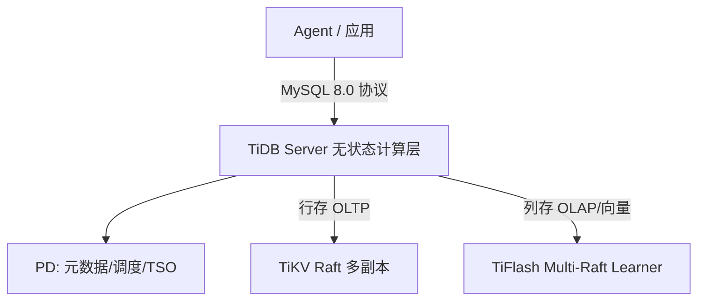

# TiDB 源码级调研报告（Rank 66）

> 调研对象：`pingcap/tidb`
> 报告日期：2026-09-13　｜　数据基线：GitHub `master` 分支 README

---

## 1. 项目概述与定位

| 项 | 值 |
|---|---|
| 项目名 | TiDB |
| GitHub | https://github.com/pingcap/tidb |
| Star | 约 4.05w（清单快照 40,522） |
| 主要语言 | Go |
| 许可证 | Apache 2.0 |
| 一句话定位 | **开源云原生分布式 SQL 数据库（MySQL 8.0 兼容），新定位是 agentic workloads 的数据/记忆底座：把 OLTP 行存、OLAP 列存与原生向量检索统一在一个引擎里，一次 SQL 做过滤+向量/混合检索** |

**目标用户/场景**：需要"既能高并发事务、又能实时分析、还要向量检索"的应用与 agent 平台。README 定位 "open-source, cloud-native, distributed SQL database ... high availability, horizontal/vertical scalability, strong consistency, high performance"。

**成熟度**：极高。PingCAP 旗舰项目，Prow CI、Go Report Card、持续发版、AWS/Cloud 全托管、TiDB Operator for K8s；Apache 2.0 含企业级特性全部开源。**对 agent 的意义**：作为 Dify 等 agent 平台的统一后端，承载 agent 的记忆、中间输出、长任务进度。

---

## 2. 源码结构总览

> 说明：本仓库为超大规模分布式数据库（Go，数百万行），受网络与效率约束，仅读 README（见 §10）。下面为公开架构。

```
tidb/                 # TiDB Server（计算层，无状态 SQL 解析/优化/调度）
  ├── planner/        # SQL 优化器
  ├── executor/        # 执行器
  └── infoschema, table, ...
TiKV (独立仓库)        # 行存（OLTP），Raft 多副本
TiFlash (独立仓库)     # 列存（OLAP/HTAP），Multi-Raft Learner 实时同步自 TiKV
PD  (独立仓库)        # Placement Driver：元数据/Raft 调度/TSO
```

**架构核心（README:31-39）**：计算与存储分离——TiDB Server 无状态，可独立水平扩；TiKV 行存 + TiFlash 列存；PD 做元数据与调度。**入口**：MySQL 8.0 协议直连，用 MySQL driver/ORM 即可（README:41、57）。

---

## 3. 系统架构分析

### 编排模式：不适用（分布式数据库，非 agent 编排）

TiDB 不做 LLM/工具编排。其"架构"是数据库层：

- **两阶段提交（2PC）**：跨节点分布式事务保证 ACID 强一致（README:31）。
- **Raft 共识**：数据多副本，多数派写成功才提交，节点故障自动 failover（README:35）。
- **HTAP**：TiKV 行存 + TiFlash 列存，TiFlash 用 **Multi-Raft Learner** 从 TiKV 实时同步，TiDB Server 跨两者协同执行查询（README:37）。
- **对 agent 的接口**：SQL 协议 + 原生向量检索（README:59 vector search）。文本、向量、元数据同表存储，一次 SQL 即可做"SQL 过滤 + 向量/混合（BM25+向量）检索"，免去独立向量库同步。



---

## 4. 功能拆解

- **分布式事务**：2PC、ACID、网络分区/节点故障下仍正确（README:31）。
- **水平/垂直扩展**：计算存储分离，加节点或加资源不停机（README:33）。
- **高可用**：Raft 多副本、多数派提交、地理副本布局容灾（README:35）。
- **HTAP**：行+列双引擎实时一致（README:37）。
- **云原生**：公有云/本地/K8s（TiDB Operator）/全托管 TiDB Cloud（README:39）。
- **MySQL 8.0 兼容**：几乎零改码迁移（README:41）。
- **向量检索**：README:59 列为核心能力之一，是 agent RAG/记忆的关键。

---

## 5. 技术亮点与优势（对 agent 场景）

1. **单一引擎同时扛 OLTP + 向量检索**：agent 的"记忆/中间输出/进度"要事务可靠写，又要语义检索查历史——传统方案要 Postgres + 向量库两套并做同步，TiDB 同表同 SQL 解决。
2. **HTAP 实时一致**：行存最新写与列存分析通过 Multi-Raft Learner 实时同步，agent 写入即可被分析，无需 ETL 延迟。
3. **MySQL 兼容**：openmate 这类 Python 应用用现成 MySQL driver/ORM 即可接，零学习成本。
4. **Raft 多副本自带高可用**：agent 记忆丢了是事故，数据库层多数派提交保证不丢。

---

## 6. 稳定性机制【重点】（数据库原生，非 agent 机制）

- **2PC 分布式事务**：跨节点 ACID，网络分区/节点故障下仍正确（README:31）。
- **Raft 多数派提交**：事务需写多数副本才提交，少数副本故障不影响强一致与可用（README:35）。
- **自动 failover**：Raft 共识 + 自动副本切换（README:35）。
- **地理容灾**：副本可按地理位置布局不同灾备级别（README:35）。
- **对 agent 的启示**：agent 状态持久化选 TiDB，等于白拿分布式事务 + 多副本不丢——比单机 SQLite/本地文件可靠一个量级。
- **不适用（如实）**：TiDB 无 agent 层的重试/检查点/工具调用恢复概念；其稳定性是数据库级，agent 侧稳定性需应用层另做。

---

## 7. 高可用机制【重点】

- **计算存储分离、无状态 TiDB Server**：TiDB Server 可水平扩，状态全在 TiKV/TiFlash/PD（README:33）。
- **Raft 多副本**：数据冗余 + 自动故障转移（README:35）。
- **K8s Operator / 全托管**：TiDB Operator 自动化集群运维；TiDB Cloud 全托管 serverless（README:39、53）。
- **Multi-AZ**：多可用区部署（README:35）。
- **不适用（agent 编排层）**：TiDB 不提供 agent 任务队列/调度/熔断；这些由上层 agent 框架负责。

---

## 8. 自我进化机制【重点】

**不适用**。TiDB 是数据库，无 LLM 推理、无记忆自我提炼、无在线学习。它对 agent 的"进化"是被动的：作为可靠、可检索的存储底座，让 agent 框架能把记忆/经验持久化并语义检索——进化逻辑在上层 agent，不在 TiDB。

---

## 9. openmate 可借鉴点【重点】

openmate 背景：Python AI Agent 应用，已有 Web 版，规划桌面/手机多端。

- **【P0】记忆/中间输出优先选"事务可靠 + 可语义检索"的存储，而非只向量库**：openmate 做长期记忆时，别只上独立向量库（会丢事务性、要同步）。若服务端化，用 TiDB 这类"行存事务 + 原生向量"同一引擎——一次 SQL 既能可靠写进度、又能按语义查历史。桌面版可先用 SQLite+本地向量，服务端版迁 TiDB。
- **【P1】计算存储分离的无状态节点思路**：openmate 多端/多副本时，把应用层做成无状态、状态外置到数据库——这样加副本即水平扩，重启不丢会话。
- **【P2】MySQL 兼容降低迁移成本**：选存储优先选 MySQL 协议兼容的，openmate 用现成 SQLAlchemy/aiomysql 即可，不绑死某 ORM。

---

## 10. 源码验证标注

**一手获取**：`master/README.md`（10.8KB 全文）。证据：定位:18、分布式事务 2PC:31、计算存储分离水平扩:33、Raft 多副本高可用:35、HTAP TiKV+TiFlash Multi-Raft Learner:37、云原生/K8s/TiDB Cloud:39、MySQL 8.0 兼容:41、向量检索列于核心能力:59、Apache 2.0:100。

**未能获取（如实说明）**：`tidb/` 源码（planner/executor 等 Go 文件）未下载——本仓库为数百万行分布式数据库，且本批次 raw 网络不稳，按效率约束只读 README。其向量检索（HNSW）、Multi-Raft Learner 的具体实现未逐行确认。

**文档/架构清单推断**：HNSW 向量索引、BM25+向量混合检索、被 Dify 用作统一后端、作为 agent 记忆/中间输出/进度持久层，来自架构清单（rank66）与 README vector search 条目；具体 SQL 语法未读源码确认。星级/活跃度来自清单快照。
