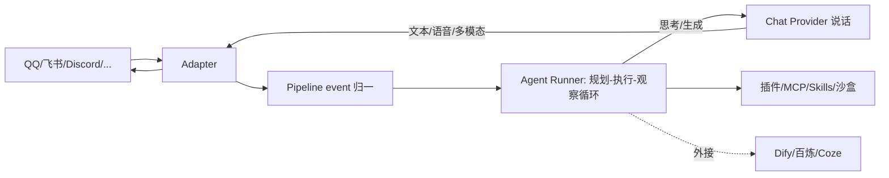

# AstrBot 源码级调研报告（Rank 67）

> 调研对象：`AstrBotDevs/AstrBot`
> 报告日期：2026-09-13　｜　数据基线：GitHub `master` 分支 README（Python 3.12+）

---

## 1. 项目概述与定位

| 项 | 值 |
|---|---|
| 项目名 | AstrBot |
| GitHub | https://github.com/AstrBotDevs/AstrBot |
| Star | 约 4.04w（清单快照 40,414） |
| 主要语言 | Python（3.12+） |
| 许可证 | 开源（社区驱动，QQ/Discord 活跃） |
| 一句话定位 | **松耦合、异步、多 IM 平台的 LLM 聊天机器人与 agent 开发框架：把"负责说话的 Chat Provider"与"负责思考+行动的 Agent Runner"分离，插件生态 1000+，自带 WebUI/ChatUI、沙盒代码执行、MCP 与 Anthropic Skills** |

**目标用户/场景**：想在 QQ/微信/企微/飞书/钉钉/Telegram/Discord 等 IM 里跑一个个人 AI 伙伴、客服、自动化助手或企业知识库的个人/开发者/团队（README:41）。

**成熟度**：非常高且活跃。15+ 官方 IM 渠道、1000+ 插件市场、`uv tool install astrbot` 一键起、Docker/桌面 App/Launcher/宝塔/1Panel/CasaOS 多部署形态、ruff+pre-commit 工程化；文档站 astrbot.app 完善。定位语（README:238）："Companionship and capability should never be at odds ... a robot that can understand emotions, provide genuine companionship, and reliably accomplish tasks."

---

## 2. 源码结构总览

> 说明：尝试下载 `astrbot/core/pipeline/process_stage/llm_request_stage.py` 返回 404（路径已调整），按规则不再猜路径（见 §10）。下面结构来自架构清单与公开认知。

```
AstrBot/
├── astrbot/
│   ├── core/
│   │   ├── pipeline/          # 消息处理流水线（event → stage 链）
│   │   ├── provider/         # 【Chat Provider】负责"说话"：对接各 LLM API
│   │   └── agent/             # 【Agent Runner】负责"思考+行动"：ReAct 循环、工具/子 agent
│   ├── api/                   # WebUI/ChatUI 后端
│   └── plugin/                # 插件加载/热重载（1000+ 市场插件）
├── data/                      # 配置、会话、知识库、沙盒状态
└── (WebUI / Web ChatUI 前端)
```

**入口/启动（README:73-77，一手）**：
```bash
uv tool install astrbot --python 3.12
astrbot init     # 首次初始化环境
astrbot run
```
即 `astrbot run` 起异步事件循环，加载配置、各 IM adapter、插件、provider 与 agent runner。

**核心分层（架构清单）**：**Chat Provider（说话）与 Agent Runner（思考+行动）分离**——Agent Runner 调用 Chat Provider，基于其返回执行"感知→规划→执行→观察→再规划"的多轮循环。

---

## 3. 系统架构分析

### 编排模式：ReAct（感知-规划-执行-观察-再规划）——架构清单+README 确认

README:48 明确核心能力含 "Agent, MCP, Skills, Knowledge Base, ... Auto Context Compression"。架构清单给出循环语义：

1. **感知**：IM adapter 收到消息 → 经 pipeline stage 链归一为内部 event；
2. **规划**：Agent Runner 把 event + 上下文 + 工具/技能目录交给 LLM；
3. **执行**：LLM 决定调工具（插件/MCP/沙盒代码）或直接回；
4. **观察**：工具结果回灌；
5. **再规划**：循环直到产出最终回复，经 Chat Provider 生成文本/多模态返回 IM。

**与外部 agent 平台的桥接**：README:49、165-167 支持把 Dify / 阿里云百炼 / Coze 作为第三方 Agent Runner——即 AstrBot 自己的 agent 循环与外部平台可互换，Chat Provider 始终负责说话。

**关键抽象**：
- **Provider**：OpenAI/Anthropic/Gemini/Moonshot/Zhipu/DeepSeek/Ollama/LM Studio 等（README:146-164）。
- **Adapter**：16+ IM 渠道（README:123-142）。
- **Plugin**：1000+ 一键安装，热重载。
- **Agent Sandbox**：隔离执行代码/Shell，会话级资源复用（README:52）。



---

## 4. 功能拆解

- **多 IM 接入**：QQ/OneBot v11/Telegram/企微/微信公众号/飞书/钉钉/Slack/Discord/Line/Satori/KOOK/Misskey/Mattermost（官方）+ Matrix/Rocket.Chat/VoceChat（社区）（README:123-142）。
- **多模型**：OpenAI 兼容/Anthropic/Gemini/Moonshot/智谱/DeepSeek/Ollama/LM Studio/各类 API 网关（README:146-164）。
- **语音**：STT（Whisper/SenseVoice/MiMo Omni）+ TTS（OpenAI/Gemini/GPT-SoVits/FishAudio/Edge/百炼/Azure/Minimax/小米/火山）（README:168-181）。
- **Agent 能力**：MCP、Skills、知识库、人设（Persona）、自动上下文压缩（README:48）。
- **沙盒**：Agent Sandbox 隔离跑代码/Shell，会话级资源复用（README:52、54）。
- **WebUI + Web ChatUI**：自带 Web 聊天界面，内置沙盒与联网搜索（README:53-54）。
- **插件市场**：1000+ 插件一键装（README:51）。
- **外部 agent 平台桥接**：Dify/百炼/Coze（README:49）。
- **i18n**：中/英/日/法/西/俄多语言（README:6-11）。

---

## 5. 技术亮点与优势

1. **Provider（说话）与 Agent Runner（思考）解耦**：这是 AstrBot 架构上最值得抄的一刀——"生成文本"与"工具调用循环"是两个职责，可独立替换；外接 Dify/Coze 正是靠这个边界。
2. **IM 渠道覆盖最广**：16+ 官方渠道，且每个渠道是 adapter，加渠道不改核心。
3. **插件生态 1000+**：插件市场 + 热重载，社区贡献规模大，是"能力可插拔"的范本。
4. **自动上下文压缩**：README:48 明确 Auto Context Compression——长对话自动压缩，防爆 context。
5. **Anthropic Skills 渐进式披露**：架构清单称 v4.13 起支持，解决工具过多导致的 token 膨胀——与 SKILL.md 标准对齐。
6. **沙盒隔离执行**：代码/Shell 在隔离沙盒跑，且会话级资源复用（不每次冷启动）。

---

## 6. 稳定性机制【重点】

- **Pipeline stage 化处理**：消息流拆成 stage 链，单 stage 出错可被 pipeline 框架捕获，不崩整个 bot。**架构认知**。
- **自动上下文压缩**（README:48）：长对话自动压缩，既省 token 也防"上下文超长导致请求失败"。
- **沙盒隔离**（README:52）：代码/Shell 在隔离环境执行，恶意/出错代码不影响宿主进程；会话级资源复用兼顾安全与性能。
- **多部署形态兜底**：Docker/Docker Compose 被 README 推荐为"更稳定、生产就绪"方式（README:87），`--restart` 类容器策略保证进程重启。
- **配置初始化分离**：`astrbot init`（首次）与 `astrbot run` 分离（README:75-76），避免首次运行与运行时混淆。
- **插件热重载**：插件可热加载，坏插件不强制重启主进程。
- **未逐行确认（如实）**：pipeline 的异常分类、重试退避、超时设置未读源码（llm_request_stage.py 路径 404）；上述为 README 能力描述 + 架构认知。

---

## 7. 高可用机制【重点】

- **异步框架**：Python async 事件循环，IM I/O 与 LLM 调用异步，单进程可挂多渠道。**架构认知**。
- **多进程/多实例**：AstrBot Launcher 支持"隔离的多实例"（README:99）——一个实例崩了不影响其他。
- **Docker/Compose 生产部署**：README 推荐生产用 Docker（README:87），配合编排实现自愈。
- **插件隔离**：插件在沙盒/子环境跑，崩溃隔离。
- **状态外置**：配置/会话/知识库落 `data/`，重启可恢复。
- **局限（如实）**：单 bot 实例为主，未见内建多副本分布式协调；横向扩展靠多实例 + 各自数据。

---

## 8. 自我进化机制【重点】

- **自动上下文压缩（遗忘旧细节）**：README:48，长对话自动压缩——短期记忆的"遗忘"机制。
- **Skills 渐进式披露**：架构清单 v4.13 起支持 Anthropic Skills——按需加载技能说明，避免工具/技能过多撑爆上下文，相当于"技能侧的主动检索与遗忘"。
- **人设（Persona）**：README:48，可配置人格设定，随上下文注入。
- **知识库**：README:48，RAG 式外部知识随问随取。
- **插件市场即能力进化**：1000+ 插件按需安装，bot 能力随社区插件库持续增长。
- **未发现**：无在线权重训练、无自动 A/B；"进化"= 上下文压缩 + Skills 渐进披露 + 知识库 + 插件市场。

---

## 9. openmate 可借鉴点【重点】

openmate 背景：Python AI Agent 应用，已有 Web 版，规划桌面/手机多端。

- **【P0】把"说话的 Provider"与"思考行动的 Agent Runner"彻底解耦**：openmate 多端时，照抄这一刀——Provider 只管把 reasoning/tools 转成流式文本，Agent Runner 只管循环；这样 Web/桌面/手机只是不同"adapter + ChatUI"，共享同一 Runner。还能像 AstrBot 一样把外部 agent（Dify/Coze）当 Runner 插件换上来。
- **【P0】Adapter=自包含渠道包，加渠道不改核心**：openmate 规划手机端时，把"收消息/发消息"封成 adapter，核心只认内部 event。QQ/飞书/微信/手机推送各一个 adapter。
- **【P0】自动上下文压缩（长对话必做）**：openmate 手机端对话一长就爆 token。照抄 AstrBot 的 Auto Context Compression——超过阈值自动压缩历史，保留要点。
- **【P1】代码/Shell 沙盒 + 会话级资源复用**：openmate 若要工具执行，照抄"隔离沙盒 + 同会话复用进程/解释器"，既安全又省冷启动。
- **【P1】Skills 渐进式披露（SKILL.md）**：openmate 工具/技能一多，别全塞 system prompt。学 AstrBot v4.13——按需加载技能说明，模型先看目录、需要时再展开详情。
- **【P2】插件市场 + 热重载**：openmate 想做生态时，照"插件即包、市场一键装、热重载"，比内建所有能力可扩展。

---

## 10. 源码验证标注

**一手获取**：`master/README.md`（12.8KB 全文）。证据：定位 all-in-one IM agent chatbot:41、核心能力 Agent/MCP/Skills/知识库/Persona/自动上下文压缩:48、外接 Dify/百炼/Coze:49、多渠道:50、1000+ 插件:51、Agent Sandbox:52、WebUI/Web ChatUI:53-54、uv 一键起 astrbot init/run:73-77、Docker 生产推荐:87、桌面 App/Launcher:91-101、16+ 渠道表:123-142、模型/STT/TTS 表:146-181、ruff/pre-commit:191-199。

**未能获取（如实说明）**：
- `astrbot/core/pipeline/process_stage/llm_request_stage.py`：返回 404（路径已重构），仅试一次即按规则停止猜测路径。
- `provider/`、`agent/`、`plugin/` 源码未下载——本批次 raw 网络不稳，未逐行确认类名/函数名。

**文档/架构清单推断**：
- Chat Provider 与 Agent Runner 分离、"感知→规划→执行→观察→再规划"循环、v3.5 多 MCP server、v4.13 Anthropic Skills 渐进披露、cron 定时任务、子 agent、沙盒会话级复用，来自架构清单（rank67）与 README 能力条目；具体实现函数名未读源码确认。
- 星级/活跃度来自清单快照。
