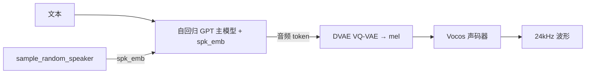

# ChatTTS 源码级调研报告（Rank 68）

> 调研对象：`2noise/ChatTTS`
> 报告日期：2026-09-13　｜　数据基线：GitHub `main` 分支 README

---

## 1. 项目概述与定位

| 项 | 值 |
|---|---|
| 项目名 | ChatTTS |
| GitHub | https://github.com/2noise/ChatTTS |
| Star | 约 3.98w（清单快照 39,833） |
| 主要语言 | Python（PyTorch） |
| 许可证 | 代码 AGPLv3+；模型 CC BY-NC 4.0（仅限学术研究，禁商用） |
| 一句话定位 | **面向日常对话的生成式语音合成（TTS）模型：自回归 GPT 主模型预测离散音频 token，DVAE 解码为 mel，Vocos 合成波形，支持零样本音色克隆与韵律（笑/停顿）控制** |

**目标用户/场景**：README:27 明确 "text-to-speech model designed specifically for dialogue scenarios such as LLM assistant"——即给 AI 助手/对话 agent 当语音输出后端。中英双语。

**成熟度**：较高。PyPI `ChatTTS` 持续发版、HuggingFace `2Noise/ChatTTS` 权重、Colab 一键跑、社区衍生出 Awesome-ChatTTS 产品索引；4 万小时 base 模型开源（无 SFT），主模型训练用 10 万+ 小时中英音频。注意**模型非商用许可**。

---

## 2. 源码结构总览

> 说明：本仓库为模型推理库，受网络约束只读 README（见 §10）。

```
ChatTTS/
├── ChatTTS/
│   ├── Chat.py        # 【主类】Chat.load() / infer() / sample_random_speaker()
│   ├── gpt/           # 自回归主模型（文本+spk_emb → 音频 token）
│   ├── dvae/          # VQ-VAE 变体（音频 token → mel 频谱）
│   └── vocos/         # 神经声码器（mel → 波形）
├── examples/
│   ├── web/webui.py   # WebUI
│   └── cmd/run.py     # 命令行推理
└── requirements.txt
```

**入口/使用（README:171-191，一手）**：
```python
import ChatTTS, torch, torchaudio
chat = ChatTTS.Chat()
chat.load(compile=False)
wavs = chat.infer(["text1", "text2"])
torchaudio.save("out.wav", torch.from_numpy(wavs[0]).unsqueeze(0), 24000)
```
即 `Chat.load()` 加载权重 → `infer(texts)` 返回 numpy 波形（采样率 24000）。

**两阶段推理（架构清单 + README 致谢确认）**：自回归 GPT 主模型按文本与说话人嵌入预测离散音频 token → DVAE 把 token 解码为 mel 频谱 → Vocos 声码器合成波形。

---

## 3. 系统架构分析

### 编排模式：不适用（纯生成模型，非 agent 编排）

ChatTTS 不做 LLM/工具编排。其"架构"是模型推理管线：

- **主模型（自回归 GPT）**：架构清单给出规格——20 层、12 头、hidden 768、上下文 4096，文本词表约 2 万、音频词表 626、num_vq=4；根据文本与 192 维说话人嵌入预测离散音频 token。
- **DVAE**：VQ-VAE 变体，levels=(5,5,5,5)、dim 1024，把音频 token 解码为 mel。
- **Vocos**：预训练神经声码器（README:305），mel → 波形。

**API 关键类/参数（README:199-228，一手）**：
- `chat.sample_random_speaker()` → 随机采样说话人嵌入（存下来可复现音色）。
- `Chat.InferCodeParams(spk_emb, temperature=.3, top_P=0.7, top_K=20)`：推理解码参数。
- `Chat.RefineTextParams(prompt='[oral_2][laugh_0][break_6]')`：句级韵律控制。
- 词级控制 token：`[uv_break]`（停顿）、`[laugh]`、`[lbreak]`（README:227、300）。



---

## 4. 功能拆解

- **对话式 TTS**：多说话人、自然表现力（README:37）。
- **细粒度韵律控制**：`[laugh]` 笑、`[uv_break]`/`[lbreak]` 停顿、`oral_(0-9)`/`laugh_(0-2)`/`break_(0-7)` 句级 token（README:212-216、300）。
- **零样本音色克隆**：`sample_random_speaker()` 采样 spk_emb，保存后复现特定音色（README:199-204）。
- **流式音频生成**（README:50 roadmap 已完成）。
- **中英双语**（README:30-32）。
- **WebUI / CLI**：`python examples/web/webui.py`、`python examples/cmd/run.py`（README:141-149）。

---

## 5. 技术亮点与优势（对 agent 语音输出）

1. **专为对话场景优化**：不是通用朗读音，而是"LLM assistant 的对话语音"，韵律自然、支持多说话人。
2. **韵律 token 可控**：用 `[laugh]/[uv_break]/[lbreak]` 就能让 agent 语音带笑、带停顿，表现力远超普通 TTS。
3. **零样本音色克隆**：采样一次 spk_emb 保存，即可固定 agent 的"声音人格"。
4. **开源 base + 流式**：4 万小时 base 开源、流式生成已完成，可自托管做 agent 语音后端。
5. **VRAM 友好**：30 秒音频约 4GB 显存，4090 上 RTF≈0.3（README:292）。

---

## 6. 稳定性机制【重点】（模型推理层，非 agent 机制）

- **自回归模型固有不稳定**：README:294-296 自陈"多说话人/音质问题是自回归模型（bark/valle 系）通病，难避免，可多次采样取好结果"——这是诚实的稳定性边界说明。
- **解码参数可调**：temperature/top_P/top_K（README:204-206）控制随机性，调小可提升稳定性。
- **反滥用设计**：README:67 自陈在 4 万小时训练中故意混入高频噪声、用 MP3 压音质，防恶意滥用；并自研检测模型。
- **不适用（agent 层）**：无重试/检查点/工具调用恢复概念；作为 agent 的工具，"稳定性"靠调用方多次采样取最优。

---

## 7. 高可用机制【重点】

- **可自托管推理**：pip 安装、GPU 推理，vLLM（Linux）可选加速（README:105-108）。
- **流式输出**：支持边生成边播，降低首字延迟。
- **局限（如实）**：模型推理本身单点；多副本/负载均衡由部署方做。README 提示 TransformerEngine/FlashAttention-2 当前会拖慢速度、勿装（README:110-135）——即性能优化路径上有坑，按官方建议保持简单栈。

---

## 8. 自我进化机制【重点】

**不适用**。ChatTTS 是训练好的前向推理模型，无在线学习、无记忆、无自我反思。它对 agent 的价值是"语音输出能力"，进化（换音色、调韵律）靠采样 spk_emb 与 token 控制，而非模型自身学习。

---

## 9. openmate 可借鉴点【重点】

openmate 背景：Python AI Agent 应用，已有 Web 版，规划桌面/手机多端。

- **【P0】agent 语音输出自托管选对话式 TTS**：openmate 做多端语音助手时，别只接商用 TTS API（贵、有配额）。ChatTTS 这类开源对话式 TTS 可本地/自托管，`spk_emb` 固定一个声音人格，多端声音一致。
- **【P1】用韵律 token 让语音有表现力**：openmate 让 agent 说话时，参考 `[laugh]/[uv_break]/[lbreak]`——在文本里插入停顿/笑，比平铺直叙的 TTS 更像真人对话。
- **【P1】多次采样取优**：自回归 TTS 不稳，openmate 语音输出可对同文本采样 2-3 次选最稳的，或暴露"重生成"按钮。
- **【P2】注意模型许可证**：ChatTTS 模型是 CC BY-NC 4.0（禁商用），openmate 若要商用需换许可宽松的 TTS（如 Edge TTS、或自训），别直接拿它上线商用产品。

---

## 10. 源码验证标注

**一手获取**：`main/README.md`（11.4KB 全文）。证据：定位 dialogue TTS:6、27、支持语言:30-32、亮点对话式/细粒度韵律/韵律:37-39、10 万+ 小时训练/开源 4 万小时 base:45-46、roadmap 流式+DVAE+零样本:49-51、AGPLv3 代码/CC BY-NC 模型:57-63、反滥用噪声:67、vLLM:105-108、WebUI/CLI:141-149、API Chat.load/infer/sample_random_speaker:171-236、InferCodeParams temperature/top_P/top_K:202-207、RefineTextParams [oral_2][laugh_0][break_6]:214-216、词级 token [laugh][uv_break][lbreak]:227、230、VRAM/RTF:292、自回归不稳多次采样:294-296、致谢 Vocos 声码器:305。

**未能获取（如实说明）**：`ChatTTS/Chat.py`、`gpt/`、`dvae/` 源码未下载（本批次 raw 网络不稳，且非 agent 项目按规范可主要基于 README）。模型超参（20 层/12 头/hidden768/上下文 4096/音频词表 626/num_vq=4/DVAE levels）来自架构清单（rank68），未读源码逐行确认。

**文档/架构清单推断**：GPT+DVAE+Vocos 两阶段管线的具体张量形状、采样实现未读源码；星级/活跃度来自清单快照。
