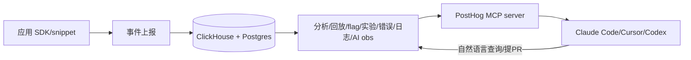

# PostHog 源码级调研报告（Rank 69）

> 调研对象：`PostHog/posthog`
> 报告日期：2026-09-13　｜　数据基线：GitHub `master` 分支 README

---

## 1. 项目概述与定位

| 项 | 值 |
|---|---|
| 项目名 | PostHog |
| GitHub | https://github.com/PostHog/posthog |
| Star | 约 3.98w（清单快照 39,769） |
| 主要语言 | Python（Django 后端）+ TS（前端） |
| 许可证 | MIT expat（`ee/` 目录另有商业许可；纯净 FOSS 见 posthog-foss） |
| 一句话定位 | **"build self-driving products"的开源开发者平台：把产品分析、会话回放、feature flag、A/B 实验、错误追踪、日志、AI observability 统一在同一用户模型下，并新策略是把自己变成 agent 可读的上下文源（托管 MCP server）** |

**目标用户/场景**：要在一个平台上完成"测用户行为→看会话→灰度→实验→排错→分析 LLM 成本"的产品团队；新定位下，也是给 agent 提供产品上下文、让 agent 自己诊断问题并提 PR 的数据源。

**成熟度**：极高。PostHog Cloud US/EU 全托管 + 开源自托管；覆盖几乎所有语言/框架 SDK；开源 hobby 部署约可扛 10 万事件/月（README:71）；monorepo，`docs/internal/monorepo-layout.md` + `products/` 子产品划分（README:106）。

---

## 2. 源码结构总览

> 说明：受网络约束只读 README（见 §10）。

```
posthog/  (monorepo)
├── products/            # 各子产品（analytics/replay/flags/experiments/error-tracking/logs/...）
├── ee/                  # 企业版（另有商业许可）
├── common/              # Django 后端公共层
├── frontend/            # React/TS 前端
└── docs/internal/       # monorepo-layout、架构内部文档
```

**架构（架构清单）**：Python/Django 服务端 + ClickHouse 数仓 + Postgres。README 明确"capture all the context agents need"（README:24）。**入口**：JS snippet / 各语言 SDK / API 上报事件（README:77-88）。

---

## 3. 系统架构分析

### 编排模式：不适用（产品分析平台），新策略是"为 agent 提供上下文与工具"

PostHog 自身不是 agent，但它把自己**重构为 agent 的上下文层**：

- **Self-driving mode**（README:26）：把产品数据里的信号（错误、rage clicks、失败查询）自动变成"研究报告 + 待你审阅合并的 PR"——即 agent 读 PostHog 上下文后自主产出诊断与修复建议。
- **MCP 接口**（README:40、77）：提供免费托管 MCP server，让 Claude Code/Cursor/Codex/Windsurf 直接用自然语言跑 HogQL 查询、拉 session、下 flag、查 stack trace 并直接提 PR；可从 Slack/Web/桌面端驱动。
- **AI observability**（README:37）：专门捕获 LLM 应用的 traces、generations、latency、cost——这是 agent 应用自身的可观测。

**数据流**：应用埋点/SDK 上报事件 → ClickHouse 数仓统一存储 → 各产品查询（分析/回放/flag/实验）→ MCP server 暴露给外部 agent → agent 自然语言查询 → 产出报告/PR。



---

## 4. 功能拆解

- **产品/网页分析**（README:27-28）：autocapture 事件分析 + SQL + GA-like 网页看板。
- **会话回放**（README:29）：录真实用户会话诊断问题。
- **Feature flag + 实验**（README:30-31）：灰度 + A/B 统计显著性，no-code。
- **错误追踪 + 日志**（README:32-33）：alert + 排错，日志与产品数据同查。
- **AI observability**（README:37）：traces/generations/latency/cost。
- **数据仓库/管道/CDP**（README:35-36）：同步 Stripe/Hubspot，25+ 工具实时/批量导出。
- **Workflows + Surveys**（README:34、38）：自动化动作、no-code 问卷。
- **多入口**：Slack/Web/桌面/自有编辑器经 MCP（README:40）。

---

## 5. 技术亮点与优势（对 agent）

1. **把自己变成 agent 可读上下文（托管 MCP）**：不是"agent 调 PostHog API"，而是 PostHog 主动暴露 MCP，让编码 agent 用自然语言完成"查数据→下 flag→提 PR"全链路——把产品平台从"人看的看板"变成"agent 用的数据源"。
2. **同一用户模型统一所有工具**：分析/回放/flag/实验/错误/日志/AI obs 共用一套用户/事件模型，agent 查一次就能跨工具关联，不用在多个平台间跳。
3. **Self-driving mode 闭环**：信号→研究报告→PR，人只审阅合并——是"数据驱动自动修复"的产品化范式。
4. **AI observability 内置**：agent 应用的 traces/cost/latency 原生可观测，不必另接 Langfuse。
5. **MIT 开源 + 多 SDK**：几乎所有语言/框架都有 SDK，接入成本低。

---

## 6. 稳定性机制【重点】（平台级，非 agent）

- **云/自托管分离**：PostHog Cloud 全托管最稳；自托管 hobby 约 10 万事件/月，超出建议迁云（README:65-71）——对自托管的能力边界诚实。
- **不承诺自托管支持**：README:73 明确开源部署不提供客户支持/保证，并给 troubleshooting/disclaimer 文档。
- **事件流式管道**：CDP/数据管道支持实时或批量导出（README:36），可解耦吞吐。
- **不适用（agent 编排层）**：PostHog 无 agent 重试/检查点；其稳定性是数据平台层。作为 agent 的上下文源，它的稳定性决定 agent 诊断质量。

---

## 7. 高可用机制【重点】

- **Cloud US/EU 双区域**（README:42）：跨区域托管。
- **ClickHouse + Postgres**：架构清单，分析型负载走列存 ClickHouse，元数据走 Postgres。
- **自托管 Docker 一键**：`bin/deploy-hobby` 一行起（README:68），约 4GB 内存。
- **免费额度 generous**：100 万事件/5k 录制/100 万 flag 请求等每月免费（README:61）。
- **局限（如实）**：开源 hobby 部署无 SLA，生产靠 Cloud。

---

## 8. 自我进化机制【重点】

- **Self-driving mode（agent 诊断闭环）**（README:26）：产品数据信号自动变成研究报告 + PR，人审阅合并——这是"用 agent 自己改进产品"的回路，也是 PostHog 把自身定位为 agent 上下文源的核心。
- **AI observability 反馈**：捕获 LLM 应用 traces/cost，用于评估与优化 agent 自身。
- **未发现**：无模型在线学习；"进化"= 数据信号→agent 诊断→PR 的产品化回路。

---

## 9. openmate 可借鉴点【重点】

openmate 背景：Python AI Agent 应用，已有 Web 版，规划桌面/手机多端。

- **【P0】把自己的可观测做成 agent 可读的 MCP/上下文源**：openmate 做 agent 产品，别只给人看后台。学 PostHog——把 traces、错误、用户行为通过 MCP 暴露，让编码 agent（或 openmate 自己的诊断 agent）用自然语言"查数据→定位问题→提修复"，而不是让开发自己翻日志。
- **【P1】AI observability 原生内置**：openmate 多端 agent 的每次 LLM 调用，原生记录 traces/latency/cost，统一用户模型——调试"agent 为什么慢/贵/错"全靠它，别等上线后再补。
- **【P1】feature flag + 灰度**：openmate 桌面/手机多端发新功能时，学 PostHog flag——按用户分群灰度、出问题秒关，不发版就能回滚。
- **【P2】self-driving 闭环**：长期看，openmate 可学"错误/异常信号 → 自动诊断报告 → 修复建议"，人只审阅。

---

## 10. 源码验证标注

**一手获取**：`master/README.md`（11.4KB 全文）。证据：self-driving products 定位:22、captures context agents need:24、self-driving mode 信号→报告→PR:26、12 项产品能力:27-38、Slack/web/desktop/MCP 多入口:40、Cloud 免费额度:61、自托管 hobby 10 万事件/月+不提供支持:65-73、SDK 矩阵:81-88、MCP 接 Claude Code/Cursor:77、monorepo products/:106、MIT + ee/ 商业许可:110。

**未能获取（如实说明）**：`products/`、`ee/`、Django 后端源码未下载——本仓库为大型 monorepo 且本批次 raw 网络不稳，按规范（非 agent 项目可基于 README）未逐行读源码。ClickHouse+Postgres 数仓、HogQL、MCP server 的具体实现未读源码确认。

**文档/架构清单推断**：Python/Django + ClickHouse + Postgres、托管 MCP server 让 agent 跑 HogQL/拉 session/下 flag/查 stacktrace/提 PR，来自架构清单（rank69）与 README MCP 条目；具体代码路径未读源码。星级/活跃度来自清单快照。
