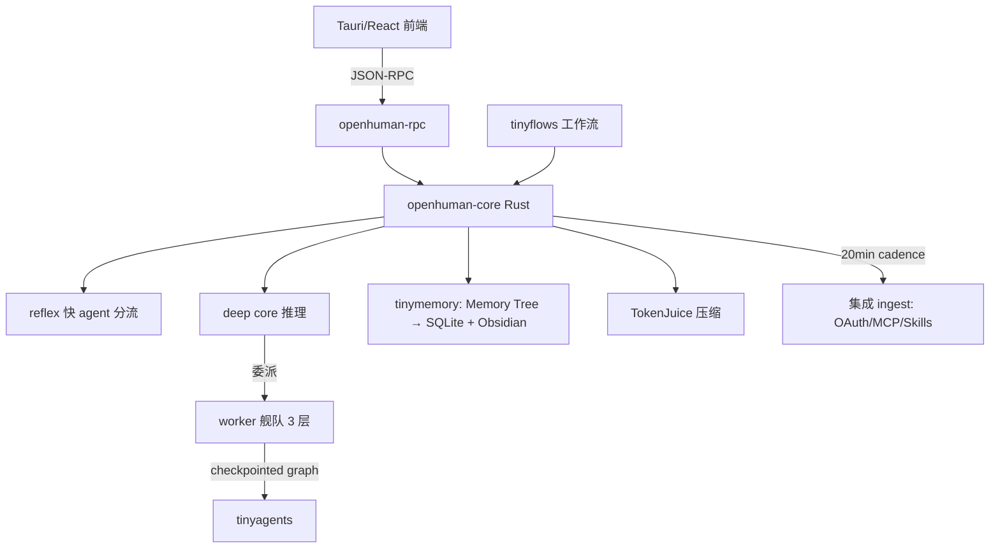

# OpenHuman 源码级调研报告（Rank 70）

> 调研对象：`tinyhumansai/openhuman`
> 报告日期：2026-09-13　｜　数据基线：GitHub `main` 分支 README（含贡献者架构拆分）

---

## 1. 项目概述与定位

| 项 | 值 |
|---|---|
| 项目名 | OpenHuman |
| GitHub | https://github.com/tinyhumansai/openhuman |
| Star | 约 3.97w（清单快照 39,726） |
| 主要语言 | Rust（核心）+ Tauri（桌面壳）+ React/TS（前端） |
| 许可证 | GNU（README 对比表标注 "GNU"） |
| 一句话定位 | **本地优先的个人 AI super-intelligence：一个记住你一切的"大脑"（Memory Tree）、一个在持久化图上跑 agent 舰队的"编排器"、一个深度研究员；Rust 核心 + Tauri 桌面壳，所有数据本地 SQLite 加密** |

**目标用户/场景**：想要一个"装到电脑上、几分钟就懂你、本地隐私、能跑多 agent 工作流"的个人 agent 的用户。README:28 定位 "your personal AI super intelligence: a brain that remembers everything, a fantastic orchestrator, a deep researcher. Local-first, simple, powerful."

**成熟度**：Early Beta（README:45、51 "Under active development. Expect rough edges"），但发布一周连续 9 天登顶 GitHub Trending（README:55）。工程化完整：Node 24+/pnpm 10.10/Rust 1.96.1/Cmake/Ninja 工具链、`pnpm typecheck`/`cargo check`、vendored Rust 子模块。**与 openmate 技术栈最接近（桌面 + Rust 核心 + Web 前端），是本批最值得深读的对标。**

---

## 2. 源码结构总览

**Rust workspace 拆分（README:164-168，一手）**：
```
crates/
├── openhuman-core/   # 包名 openhuman：核心 + openhuman-core CLI
├── openhuman-app/    # Tauri 桌面壳（独立 Cargo world）
├── openhuman-embed/  # 嵌入核心的 library facade
├── openhuman-rpc/    # 共享 RPC 契约与 client
└── openhuman-tui/    # 终端客户端
```

**vendored Rust 依赖（README:161，一手）**：`vendor/` 下 vendored 了 `tinyagents`、`tinyflows`、`tinychannels`、`tinymemory`、`motosan-ai-oauth` 等——即**核心能力被拆成独立开源 crate**，openhuman 是它们的桌面集成层。

**入口/启动（README:156-162，一手）**：
```bash
git submodule update --init --recursive   # 拉 vendored Rust 依赖
pnpm install
pnpm dev                                   # 仅 web UI
pnpm --filter openhuman-app dev:app        # macOS 桌面壳
pnpm dev:app:win                           # Windows 桌面壳
```
桌面壳经 Tauri 起，Rust 核心跑 memory ingest、调度、provider 路由、TokenJuice、原生工具；前端 React/TS 经 `openhuman-rpc`（JSON-RPC）与核心通信。

**核心数据流（架构清单 + README）**：Tauri 壳负责窗口/OS 集成/IPC/WebView；Rust 核心负责 memory ingest 流水线、集成适配器、~20 分钟 cadence 自动抓取、provider 路由、TokenJuice 压缩、原生工具。

---

## 3. 系统架构分析

### 编排模式：Graphs, not loops（checkpointed graph）+ 分裂脑（reflex + deep core）——README 一手

README:110、118 明确："Most agent harnesses run one agent in one loop. OpenHuman is an **orchestrator**"，"**Graphs, not loops**: turns run as checkpointed graphs on [tinyagents]"。

- **分裂脑（split brain, always on）**（README:78）：一个**快速 reflex agent** 分流入站流量，一个**深度推理核心**把任务委派给 worker 舰队，由"潜意识（subconscious）"引导。即快/慢双系统。
- **checkpointed graph**（README:77、118）：对话轮次作为带 checkpoint 的图在 tinyagents 上跑——可暂停等人、可跨重启存活、可中途恢复。
- **子 agent 舰队**（README:119）：专家 agent 可派生**三层深**；卡住的 agent 变成 root-cause 报告。
- **A2A 加密**（README:120）：实例间经 Signal 协议 E2E 会话互相编排，带 x402 支付，服务器永不看明文。

**关键抽象（README 一手）**：
- **tinyagents**：开源 agent harness，跑 checkpointed graph。
- **tinyflows**：开源工作流引擎，agent 提议的自动化在可视化 canvas 上由人审阅后保存。
- **tinymemory**：记忆后端。
- **Memory Tree / NeoCortex**：把 Gmail/文档/日历等 118+ 服务数据规范化为 ≤3k token 的 Markdown chunk，按重要性打分折叠成层次化摘要树，存本地 SQLite，并镜像为 Obsidian vault。



---

## 4. 功能拆解

- **Memory Tree + Obsidian Wiki**（README:69）：数据压成带打分的 Markdown 树存 SQLite，镜像为可编辑 Obsidian vault，"No vector-soup black box"。
- **集成**（README:70）：100+ OAuth、5000+ MCP server、90000+ Skills；auto-fetch 每 20 分钟喂脑。
- **Goals & Todos**（README:71）：长期目标、per-thread 持久目标、对话级共享 kanban。
- **TokenJuice**（README:72）：工具输出进模型前压缩，同信息省至多 80% token。
- **Workflows**（README:76、122-132）：agent 提议自动化 → 人在 canvas 审阅 → 保存；durable、trigger-driven（schedule/webhook/channel event）、approval-gated。
- **原生工具**（README:82）：托管 web search（Exa）、scraper、coder 工具集、真浏览器、in-process Whisper 语音、模型路由。
- **17 消息渠道**（README:84）：Telegram/Discord/Slack/WhatsApp/Signal/iMessage + 原生邮件（IMAP IDLE + SMTP）。
- **隐私**（README:89）：设备端加密、approval gate、OS keyring 存密钥、opt-in 沙盒、Privacy Mode（一个开关，Rust 核心强制推理不出本机）。
- **Mascot**（README:88）：会说话、会反应、记得你的桌面形象。

---

## 5. 技术亮点与优势

1. **Memory Tree 而非向量黑盒**：把数据压成"带打分的层次化 Markdown 树"，存 SQLite 并镜像 Obsidian vault，人可直接看/改——这是对"向量库一坨 embedding 不可解释"的直接反叛，透明度极高。
2. **TokenJuice 工具输出压缩**：工具结果进模型前压缩，省至多 80% token——支撑"一个大脑这么大还负担得起"（README:72）。
3. **Graphs not loops + checkpoint**：对话轮次是带 checkpoint 的图，可暂停/跨重启/中途恢复——比单 loop 健壮。
4. **分裂脑（reflex + deep core）**：快 agent 分流、慢核心委派 worker 舰队，是双系统认知架构的工程化。
5. **Rust 核心 + Tauri 壳 + 独立 crate**：核心能力拆成 tinyagents/tinyflows/tinymemory 等独立开源 crate，openhuman 是集成层——可复用、可替换。
6. **Privacy Mode 在 Rust 核心强制**：一个开关让推理不出本机，且强制在 Rust 核心层（而非前端软约束），可信。

---

## 6. 稳定性机制【重点】

- **checkpointed graph（崩溃恢复核心）**（README:77、118，一手）：图运行带 checkpoint，"pause for a human, survive a restart, and resume mid-run"——agent 跑到一半重启，能从 checkpoint 续跑。这是长任务/桌面应用的关键。
- **卡住 agent → root-cause 报告**（README:77、119，一手）："Stuck agents get steered, halted ones return a root cause"——agent 卡死不是静默失败，而是被引导或返回根因报告。
- **approval gate**（README:89、132，一手）：副作用（workflow 触发、危险动作）挂在审批门后，人确认才执行。
- **可回放 run journal + 每次调用真实成本**（README:77、151，一手）："every run replays with real per-call costs"——运行可回放、每次调用成本可核算，调试与成本治理一体。
- **auto-fetch 周期落盘**（README:70、102）：每 20 分钟抓一次，数据本地 SQLite，进程崩了已抓数据不丢。
- **OS keyring 存密钥**（README:89）：凭据交操作系统钥匙串，不裸存配置文件。
- **未逐行确认（如实）**：Rust 核心的 checkpoint 序列化、重试退避、超时具体实现未读源码（crates/openhuman-core 未下载）；上述为 README 一手能力描述。

---

## 7. 高可用机制【重点】

- **本地优先 + 数据外置 SQLite**：所有记忆/会话/工作流本地 SQLite，桌面应用重启即恢复，不依赖云。
- **分裂脑 always-on**（README:78）：reflex agent 常驻分流，inbound 流量不丢。
- **durable workflow**（README:132）：保存的工作流 durable、trigger-driven，"survive restarts"。
- **A2A E2E + x402**（README:120）：实例间加密编排，无服务器看明文，去中心化协作。
- **模型路由**（README:82）：按 workload 选合适 LLM，一个订阅默认、可 BYO key/本地 Ollama 混用——主模型挂了可路由到备。
- **可观测**：replayable run journal + per-call cost accounting（README:151）。
- **局限（如实）**：Early Beta，单用户桌面应用为主；未见内建多副本/分布式协调。

---

## 8. 自我进化机制【重点】

OpenHuman 在"记忆沉淀"上做得最激进，是本批样本里自我进化最完整的之一：

- **Memory Tree 自动 ingest + 压缩**（README:69、100-104，一手）：auto-fetch 每 20 分钟把 Gmail/文档/日历/repo/消息拉到本地，Memory Tree 压成带打分的层次化 Markdown 树——"一次同步，agent 就有你收件箱/日历/repo/文档的完整（压缩）上下文，无需训练期"。
- **重要性打分 + 层次折叠**：chunk 按重要性打分，折叠成树——等价于"自动遗忘不重要细节、保留要点"的长期记忆。
- **Obsidian vault 人可编辑**：记忆不黑盒，人能直接改 Markdown——人机共同维护记忆。
- **Goals & Todos 长期目标**（README:71）：长期目标 + per-thread 持久目标，跨 run 保持方向。
- **subconscious 引导**（README:78）：潜意识层引导 deep core 的委派方向。
- **agentmemory 后端可插拔**（README:106）：`memory.backend = "agentmemory"` 可代理到开源 agentmemory，与 Claude Code/Cursor/Codex/OpenCode 共享同一持久存储——跨工具的记忆统一。
- **未发现**：无在线权重训练；"进化"= auto-fetch ingest + Memory Tree 打分折叠 + 长期目标 + 可插拔记忆后端。

---

## 9. openmate 可借鉴点【重点】

openmate 背景：Python AI Agent 应用，已有 Web 版，规划桌面/手机多端。**OpenHuman 是本批与 openmate 最同构的项目（桌面个人 agent），借鉴价值最高。**

- **【P0】记忆用"带打分的层次化 Markdown 树 + 本地 SQLite"，而非向量黑盒**：openmate 做长期记忆时，别只上向量库。照抄 Memory Tree——把数据压成 ≤3k token 的 Markdown chunk、按重要性打分、折叠成树、存 SQLite、镜像成可人工编辑的文件。透明、可调试、离线友好，移动端也能跑。
- **【P0】Graphs not loops + checkpoint 续跑**：openmate 桌面/手机做长任务时，照抄"对话轮次是带 checkpoint 的图，可暂停等人、跨重启存活、中途恢复"。手机杀后台是常态，这是体验基石。
- **【P0】Rust/Tauri 壳 + 核心独立 crate 的分层**：openmate 规划桌面端时，学 openhuman——把"窗口/OS 集成/IPC"（Tauri 壳）与"agent 核心"（可独立 CLI/嵌入的 core）分开，前端经 RPC 与核心通信。这样核心可同时给桌面壳、TUI、嵌入库用。
- **【P0】TokenJuice：工具输出进模型前压缩**：openmate 工具一多，上下文必爆。直接借鉴"工具结果先压缩再回灌模型，省至多 80% token"。
- **【P1】分裂脑（快 reflex + 慢 deep core）**：openmate 多端响应要快——入站消息先用小模型 reflex 分流（要不要回、是不是简单问题），复杂的才交给大模型 deep core 委派 worker。省钱又快。
- **【P1】卡住 agent → root-cause 报告 + 可回放 run journal**：openmate 移动端别让 agent 卡死无反应。照抄"卡住的 agent 要么被 steer、要么返回根因报告；每次 run 可回放、每次调用成本可核算"。
- **【P1】隐私在核心层强制（Privacy Mode）**：openmate 桌面/手机接 OAuth/本地数据时，学"一个开关让推理不出本机，且强制在 Rust/核心层而非前端软约束"，凭据交 OS keyring。
- **【P2】auto-fetch 定时 ingest**：openmate 想让 agent"主动懂用户"，学 20 分钟 cadence 自动拉邮箱/日历/文档进记忆，而不是等用户手动喂。
- **【P2】工作流 agent 提议 + 人 canvas 审阅**：openmate 做自动化时，让 agent 提议工作流、人在可视化 canvas 上确认保存，durable + trigger + approval-gated。

---

## 10. 源码验证标注

**一手获取**：`main/README.md`（19.3KB 全文）。证据：定位 brain/orchestrator/researcher/local-first:28、Early Beta + 登顶:45-55、三分解读 brain/orchestrator/researcher:65、Memory Tree+Obsidian/SQLite/非向量黑盒:69、100+OAuth/5k+MCP/90k+Skills/20min auto-fetch:70、Goals&Todos:71、TokenJuice 省80%:72、Workflows agent提议+canvas审阅+tinyflows:76、122-132、harness checkpointed graph on tinyagents/卡住steer/root-cause/可回放成本:77、分裂脑 reflex+deep core:78、原生工具 Exa/Whisper/browser/模型路由:82、17渠道+IMAP/SMTP:84、隐私/Privacy Mode Rust强制/OS keyring:89、一次同步即全量上下文:100-104、agentmemory 后端:106、Graphs not loops 暂停/存活/恢复:118、子agent三层/根因:119、A2A Signal E2E+x402:120、对比表(开源/记忆/auto-fetch/编排/workflows/local-only/observability):138-154、构建工具链:160、vendored tinyagents/tinyflows/tinychannels/tinymemory:161、**crates 五拆分 openhuman-core/app/embed/rpc/tui:164-168**。

**未能获取（如实说明）**：
- `crates/openhuman-core/`、`crates/openhuman-rpc/` 等 Rust 源文件未下载（本批次 raw 网络不稳，且按效率约束每项目至多 5 文件）。checkpoint 序列化、TokenJuice 压缩算法、Memory Tree 打分函数的具体 Rust 实现未逐行确认。
- `tinyagents`/`tinyflows`/`tinymemory` 作为独立 vendored crate，其内部实现未读。

**文档/架构清单推断**：
- NeoCortex/Memory Tree 把 118+ 服务数据规范为 ≤3k token Markdown chunk、按重要性打分折叠、TokenJuice token 压缩引擎、~20 分钟 cadence、provider 路由的具体实现，来自架构清单（rank70）与 README 对应条目；Rust 函数名/类型未读源码确认。
- 星级/活跃度来自清单快照。
