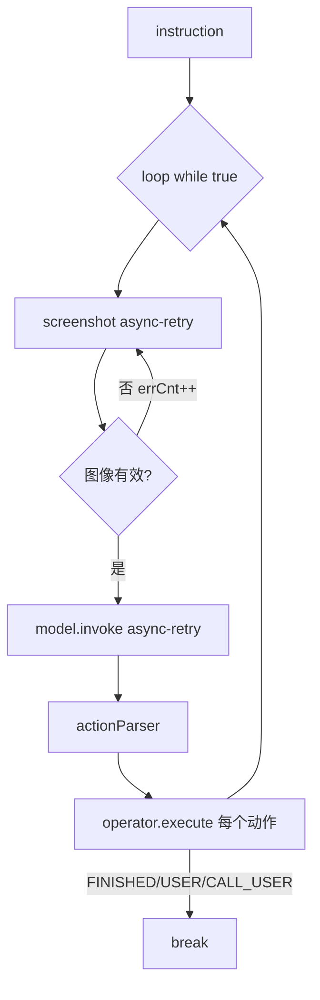

# Rank 72：bytedance/UI-TARS-desktop 源码级调研报告

## 1. 项目概述与定位

- **项目名称**：UI-TARS-desktop（GitHub: https://github.com/bytedance/UI-TARS-desktop ）
- **Star 数**：约 38.9k（快照值）
- **主要语言**：TypeScript（monorepo）
- **一句话定位**：字节开源的多模态 GUI 操作 Agent 栈——核心循环是"截图 → VLM 预测动作 → Operator 执行"，可操作本地/远程电脑与浏览器，含 Agent TARS（CLI/Web）与 UI-TARS Desktop（Electron 原生 GUI agent）两条产品线。
- **目标用户/场景**：想让 VLM agent 像人一样看屏、点击、输入、操作跨应用界面；开发者想在此之上构建桌面/浏览器自动化 agent。
- **项目成熟度**：高。Apache-2.0（Copyright 2025 Bytedance），pnpm monorepo（changeset/electron-builder/playwright/vitest），`packages/ui-tars` 提供可复用 SDK，配套 `multimodal/`（592 文件，模型训练/评测）。

> **定性说明**：这是一个**货真价实的 Agent**——`packages/ui-tars/sdk/src/GUIAgent.ts` 实现了完整的 VLM 驱动 ReAct 循环。它是本批次中"编码/操作 agent 稳定性机制"的最佳样本，第 6/7/8 章将基于源码重点展开。

## 2. 源码结构总览（源码确认 @main）

```
apps/
├── agent-tars/        # Agent TARS：CLI/Web 通用多模态 agent（Electron + vite）
└── ui-tars/           # UI-TARS Desktop：Electron 原生 GUI agent
packages/
└── ui-tars/           # ★ 共享原子能力包
    ├── sdk/src/
    │   ├── GUIAgent.ts        # ★ ReAct 主循环（本次全文读）
    │   ├── core.ts / Model.ts / base/index.ts / types.ts
    │   ├── constants.ts       # MAX_LOOP_COUNT / MAX_SNAPSHOT_ERR_CNT / SYSTEM_PROMPT
    │   └── utils.ts           # toVlmModelFormat / processVlmParams（滑动图像窗）
    ├── action-parser/src/actionParser.ts   # VLM 输出 → 结构化动作解析
    ├── operators/             # ★ 动作执行器抽象
    │   ├── adb/               # Android
    │   ├── browser-operator/   # 浏览器（key-map/shortcuts/ui-helper）
    │   ├── nut-js/            # 桌面键鼠
    │   └── browserbase/       # 云浏览器
    ├── electron-ipc/          # Electron main/renderer IPC
    └── shared/               # types/constants（StatusEnum/ErrorStatusEnum）
multimodal/            # 视觉语言模型训练/评测（TARS 模型侧）
```

**核心源码文件（源码确认，本次全文读）**：`packages/ui-tars/sdk/src/GUIAgent.ts`（4314 字符）。其余路径来自 jsDelivr 扁平清单（1522 文件）。

**入口**：`packages/ui-tars/cli/src/cli/start.ts`（CLI）；`apps/agent-tars`、`apps/ui-tars` 为应用壳。

**代码规模**：`packages/ui-tars/sdk` 是核心 SDK；整个 monorepo 1522 文件，其中 `multimodal/` 占 592（模型侧）。

## 3. 系统架构分析

**编排模式（源码确认）**：**VLM 驱动的 ReAct 循环**——`GUIAgent.run()` 是一个 `while(true)` 主循环，每轮：截图 → 调 VLM → 解析动作 → Operator 执行，直到 `FINISHED/CALL_USER` 或出错。

**核心组件（源码确认）**：
- **GUIAgent（`sdk/src/GUIAgent.ts`）**：主循环，持有 `operator` 与 `model`，维护 `loopCnt/snapshotErrCnt/totalTokens/totalTime/previousResponseId`。
- **Model（`sdk/src/Model.ts` = UITarsModel）**：封装 VLM 调用，`model.invoke(vlmParams)`，带 `factors`（动作空间参数）。
- **Operator 抽象（`operators/*`）**：统一接口 `operator.screenshot()` 与 `operator.execute({...})`；实现分 adb/browser/nut-js/browserbase。
- **Action Parser（`action-parser/src/actionParser.ts`）**：把 VLM 文本输出解析为 `parsedPredictions[]{action_type, action_inputs, thought, reflection}`。
- **Shared types**：`StatusEnum`（INIT/RUNNING/PAUSE/END/ERROR/CALL_USER/USER_STOPPED）、`ErrorStatusEnum`、`Message`。

**数据流（源码确认）**：`run(instruction)` → 初始化 `GUIAgentData.conversations`（注入 human 指令）→ 循环：`operator.screenshot()`（async-retry）→ Jimp 校验图像 → 推入 conversation（image placeholder）→ `toVlmModelFormat`+`processVlmParams`（滑动图像窗）→ `model.invoke`（async-retry）→ 推入 gpt 预测 → 逐个 `operator.execute` → 遇到 FINISHED/CALL_USER break → 可选 `loopIntervalInMs` sleep。

**关键类/函数（源码确认）**：`GUIAgent.run/pause/resume/stop/guiAgentErrorParser/buildSystemPrompt`；常量 `MAX_LOOP_COUNT`、`MAX_SNAPSHOT_ERR_CNT`、`INTERNAL_ACTION_SPACES_ENUM`（ERROR_ENV/MAX_LOOP/CALL_USER/FINISHED）。



## 4. 功能拆解

- **截图→VLM→执行闭环（源码确认）**：`run()` 主循环即全部。
- **可插拔 Operator（源码确认）**：`operators/{adb,browser-operator,nut-js,browserbase}`，同一 SDK 跑手机/桌面/浏览器/云浏览器。
- **动作解析（源码确认）**：`actionParser.ts` 把 VLM 自然语言动作转结构化动作列表。
- **会话/分享协议（源码确认）**：`GUIAgentData`（version/systemPrompt/conversations/timing/costTokens）即分享/回放格式，`ShareVersion.V1`。
- **可暂停/恢复/停止（源码确认）**：`pause()` 置 `isPaused` 并建 `resumePromise`；循环内检测到 pause 时 `await this.resumePromise`；`resume()` resolve；`stop()` 置 `isStopped`；另支持 `AbortSignal.signal.aborted`。
- **Electron IPC（源码确认）**：`electron-ipc` 的 main `registerIpcMain`/renderer `createClient` 桥接。
- **系统提示模板（源码确认）**：`buildSystemPrompt()` 从 `operator.constructor.MANUAL.ACTION_SPACES` 动态注入动作空间。

## 5. 技术亮点与优势

1. **三段式 async-retry 覆盖全链路（源码确认）**：screenshot、model.invoke、operator.execute 各用 `async-retry`，且分别配置 `minTimeout`（截图 5s、模型 30s、执行 5s）与 `retries`——按环节差异给退避参数。
2. **可中断的暂停/恢复（源码确认）**：`pause/resume` 用 Promise 挂起主循环而非 busy-wait；`finally` 里 `model.reset()` 并对 USER_STOPPED 发一次 `user_stop` 动作做收尾。
3. **滑动图像窗控成本（源码确认）**：`processVlmParams` 对历史图片做滑动窗口，避免随轮次增长把上下文塞满截图。
4. **内建动作空间控制流（源码确认）**：VLM 可输出 `FINISHED/CALL_USER/MAX_LOOP/ERROR_ENV` 等内部动作，直接映射为循环终止/人机交接——让模型自己决定何时收工或求助。
5. **错误不抛给调用方（源码确认）**：`finally` 中仅通过 `onError` 回调派发错误，注释明确 "we will not throw error to the caller"，保证上层不会因未捕获异常崩溃。

## 6. 稳定性机制【重点】

- **循环上限（源码确认）**：`loopCnt >= maxLoopCount`（默认 `MAX_LOOP_COUNT`）→ `StatusEnum.ERROR` + `REACH_MAXLOOP_ERROR`，防止 agent 死循环烧 token。
- **截图失败计数熔断（源码确认）**：`snapshotErrCnt >= MAX_SNAPSHOT_ERR_CNT` → `SCREENSHOT_RETRY_ERROR`；单张截图无效时 `loopCnt -= 1; snapshotErrCnt += 1; await sleep(1000); continue`，不计入正常轮次。
- **截图有效性校验（源码确认）**：用 `Jimp.fromBuffer` 解析 base64 拿 width/height/mime，`isValidImage = !!(base64 && width && height)`；解析失败 catch 后返回 `width:null` 触发计数，避免把坏图送进 VLM。
- **分段重试退避（源码确认）**：`asyncRetry` + `minTimeout`（截图 5000ms、模型 30000ms、执行 5000ms），`onRetry` 回调可注入自定义逻辑。
- **中止即 bail（源码确认）**：模型调用遇 `APIUserAbortError`/`aborted` 时 `bail(error)` 不再重试；循环开头每轮检查 `signal?.aborted`/`isStopped`，置 `USER_STOPPED` break。
- **错误分类（源码确认，`guiAgentErrorParser` + `ErrorStatusEnum`）**：`InternalServerError → MODEL_SERVICE_ERROR`，另有 REACH_MAXLOOP / SCREENSHOT_RETRY / INVOKE_RETRY / EXECUTE_RETRY / ENVIRONMENT / UNKNOWN；环境错（`ERROR_ENV` 内部动作）单独成类。
- **资源清理（源码确认，`finally`）**：`this.model.reset()`；USER_STOPPED 时补一次 `user_stop` 动作；最后 `onData` 推终态、`onError` 派发错误。
- **边界处理**：空预测 `if(!prediction) continue`（不计错误）；`responseId` 空则不覆盖 `previousResponseId`，保证会话连续性。

## 7. 高可用机制【重点】

- **并发/异步模型（源码确认）**：全 async/await，`async-retry` + Promise；`setContext`（async_hooks 风格 `useContext`）把 config 注入 operator，避免跨层透传。
- **可插拔执行后端（源码确认）**：Operator 接口抽象，adb/browser/nut-js/browserbase 可换——桌面坏了可切云浏览器（browserbase），不绑死单一执行环境。
- **运行时观测流（源码确认）**：`onData` 回调持续推送增量 conversation（`.slice(-1)` 只推最新一条），`onError` 推错误——流式 UI/远程可控，不用等整轮结束。
- **会话连续性（源码确认）**：`X-Session-Id` header + `previousResponseId` 透传，多轮请求在服务端可关联。
- **横向扩展**：SDK 本身无状态，可在 CLI/桌面/Web/远程任意宿主跑；browserbase 提供云端执行池。
- **无单点**：VLM 可接多家（`UITarsModel` 封装），Operator 多实现，故障可切换后端。

## 8. 自我进化机制【重点】

- **无在线权重学习**：模型不微调，智能来自 VLM。
- **反思式动作（源码确认）**：`parsedPrediction` 结构含 `thought` 与 `reflection` 字段——VLM 每步先想再动，并在动作里带反思，这是 ReAct 的"思考-观察"内建。
- **模型自报终止（源码确认）**：`FINISHED`/`CALL_USER` 由模型输出，agent 据此收工或求助，而非固定脚本——agent 能根据屏幕观察决定何时完成。
- **上下文压缩（源码确认）**：`processVlmParams` 滑动图像窗 + `getSummary` 对预测取摘要，控制送入 VLM 的上下文增长。
- **经验沉淀**：`GUIAgentData.conversations` 完整记录每步截图/预测/动作/耗时，可用于事后回放与评测（`multimodal/` 评测侧），但运行时不自学习。

## 9. openmate 可借鉴点【重点】

- **P0｜三段式重试：截图/模型/执行分别配退避参数**：openmate 的 agent 主循环里，每个外部调用环节（截图、调模型、执行工具）单独用 async-retry，并按环节性质设 `minTimeout`（IO 快退避、模型长退避）。预期：各环节故障独立恢复，不会一处慢拖垮全局。
- **P0｜循环上限 + 某类错误计数熔断**：openmate 给主循环设 `maxLoopCount`；对"截图失败/工具返回空"这类可恢复错误设独立计数器，超阈值熔断并报错，而非无限重试。预期：防死循环、防烧 token。
- **P0｜可暂停/恢复/停止：Promise 挂起 + AbortSignal 双通道**：openmate 长任务用 `pause()` 挂起（Promise）、`stop()` 置标志位、同时支持外部 `AbortSignal.aborted`；每轮开头检查。预期：用户随时可控、取消即时。
- **P0｜错误不抛给调用方，走 onError 回调**：主循环 catch 后不 rethrow，把结构化错误经 `onError` 派发，`finally` 里 `model.reset()` 收尾。预期：上层 UI 不崩、资源释放干净。
- **P1｜内建"完成/求助"动作空间**：让模型能输出 FINISHED/CALL_USER，agent 据此收工或转人工。预期：agent 会自己判断何时求助，而非跑满上限。
- **P1｜滑动图像/历史窗控成本 + 增量流式回调**：上下文只保留最近 N 张图/消息；`onData` 只推增量。预期：长任务成本可控、UI 实时。
- **P2｜Operator/执行器接口抽象，可切换执行后端**：openmate 把"如何执行动作"抽接口（桌面/浏览器/远程），一套 agent 逻辑多后端复用。预期：环境故障可切换、跨端复用。

## 10. 源码验证标注

**源码直接阅读（jsDelivr @main）**：
- `packages/ui-tars/sdk/src/GUIAgent.ts`（前 4000/共 4314 字符）：`GUIAgent` 类、`run()` while 主循环、`loopCnt/snapshotErrCnt`、三段 `async-retry`、`Jimp` 校验、`processVlmParams` 滑动窗、`pause/resume/stop`、`guiAgentErrorParser` 错误分类、`finally` 清理、`StatusEnum/ErrorStatusEnum`、`INTERNAL_ACTION_SPACES_ENUM`。
- jsDelivr 扁平清单：确认 `operators/{adb,browser-operator,nut-js,browserbase}`、`action-parser`、`electron-ipc`、`apps/{agent-tars,ui-tars}`、`multimodal/` 存在。

**来自文档/推断**：
- `Model.ts`/`UITarsModel` 的具体 VLM 请求构造、`actionParser.ts` 的解析正则、`browser-operator` 的键鼠映射细节未逐行读，依据文件名与 `run()` 中的调用推断。
- `apps/agent-tars`、`apps/ui-tars` 的 Electron 壳与 MCP 挂载细节未读；"内核基于 MCP、可挂 filesystem/github/postgresql MCP server"来自 architecture_notes。

**源码不可得部分**：`constants.ts` 中 `MAX_LOOP_COUNT`/`MAX_SNAPSHOT_ERR_CNT` 的确切数值、`multimodal/` 模型训练侧、`actionParser.ts` 的完整解析规则未逐行展开；如需 openmate 复刻动作解析，建议读 `packages/ui-tars/action-parser/src/actionParser.ts` 与 `sdk/src/constants.ts`。
