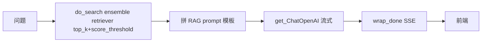

# Rank 73：chatchat-space/Langchain-Chatchat 源码级调研报告

## 1. 项目概述与定位

- **项目名称**：Langchain-Chatchat（前 Langchain-ChatGLM，GitHub: https://github.com/chatchat-space/Langchain-Chatchat ）
- **Star 数**：约 38.6k（GitHub API 实测 38628）
- **主要语言**：Python
- **一句话定位**：面向中文场景与开源模型的**本地 RAG 知识库问答 + Agent 应用**——文档分块、embedding、入向量库、检索链、LLM 生成全管线，并经 FastAPI 暴露对话/知识库接口，主打全离线、私有部署。
- **目标用户/场景**：想在内网/本地用 ChatGLM/Qwen/Llama 等开源模型搭一个可对话、可挂知识库的私有问答系统的开发者与团队。
- **项目成熟度**：高。Apache-2.0，6268 forks；本次分析 master（已重构为 `libs/chatchat-server` + `libs/python-sdk` monorepo，`langchain-chatchat` 0.3.1.3），依赖 `langchain 0.1.17`、`langchain-openai`、`fastapi~0.109`、`sse_starlette`、`unstructured`、`nltk`、`mcp>=1.4.1`。

> **定性说明**：这是一个**领域应用型 Agent（RAG 问答）**而非通用 agent 框架。其"agent"能力较弱（可选的工具调用/搜索 agent 模式），核心价值是**生产可用的本地 RAG 工程**。第 8 章"自我进化"仅在 RAG 上下文/记忆层讨论，不夸大其 agent 智能。

## 2. 源码结构总览（源码确认 @master）

仓库已从早期 `server/` 扁平布局重构为 Poetry workspace：
```
.
├── pyproject.toml            # 根 workspace（package-mode=false）
├── libs/
│   ├── chatchat-server/       # 主服务（包名 langchain-chatchat）
│   │   └── chatchat/         # Python 包
│   │       ├── cli.py        # ★ click CLI：init / start / kb（本次读）
│   │       ├── startup.py    # ★ FastAPI 启动装配（本次读）
│   │       ├── init_database.py
│   │       ├── settings.py   # ★ Settings（44KB，集中配置/模板）
│   │       └── server/
│   │           ├── utils.py  # ★ get_ChatOpenAI/缓存/prompt模板（本次读，34KB）
│   │           ├── chat/      # 各对话链（含 knowledge_base_chat/agent_chat）
│   │           └── knowledge_base/
│   │               ├── kb_service/
│   │               │   ├── base.py            # KBService 抽象 + SupportedVSType
│   │               │   └── faiss_kb_service.py # ★ FAISS 实现（本次全文读）
│   │               └── kb_cache/faiss_cache.py # ThreadSafeFaiss + kb_faiss_pool
│   └── python-sdk/          # open_langchain_chatchat SDK
└── docs/ markdown_docs/ docker/ tools/
```

**核心源码文件（源码确认，本次读）**：`chatchat/cli.py`、`chatchat/server/utils.py`（grep 关键函数）、`chatchat/server/knowledge_base/kb_service/faiss_kb_service.py`（全文）。

**入口/启动流程（源码确认）**：`chatchat.cli:main`（poetry script `chatchat`）；`init` 命令建目录/建表/`folder2db` 重建知识库；`start` 来自 `chatchat.startup:main`。

**代码规模**：`chatchat/server/utils.py` 单文件 32KB；整个 chatchat-server 为中型 Python 工程（另有 webui 前端与 docs）。

## 3. 系统架构分析

**编排模式（源码确认）**：**RAG 检索链（LCEL/链式）**为主，Agent 模式（工具调用搜索/知识库）为辅。不是 ReAct 状态机，而是"检索 → 拼 prompt → LLM 流式生成"。

**核心组件（源码确认）**：
- **KBService 抽象（`kb_service/base.py`）**：定义 `do_search/do_add_doc/do_delete_doc/do_create_kb` 等模板方法；`SupportedVSType` 区分 FAISS/Milvus。`FaissKBService` 继承之并实现各 `do_*`。
- **ThreadSafeFaiss 池（`kb_cache/faiss_cache.py`）**：`kb_faiss_pool` 是向量库实例池；`load_vector_store(...)` 加载/复用，每次操作 `with vs.acquire() as vs:` 串行化访问，`do_clear_vs` 用 `kb_faiss_pool.atomic` 保护。
- **模型工厂（`server/utils.py`）**：`get_ChatOpenAI/get_Embeddings/get_OpenAI` 按 `Settings.model_settings.MODEL_PLATFORMS` 构造 LLM/嵌入；`get_default_llm()` 找不到默认模型时**回退到第一个可用模型并 warning**。
- **Prompt 模板（`server/utils.py`）**：`get_prompt_template(type,name)` 从 `Settings.prompt_settings`（YAML）加载，RAG 模板与模型类别解耦。

**数据流（源码确认）**：用户问题 → `do_search(query, top_k, score_threshold)` 经 `get_Retriever("ensemble").from_vectorstore(vs, top_k, score_threshold)` 检索 → 文档+问题+历史拼 RAG prompt → `get_ChatOpenAI` 流式生成 → `wrap_done(ait, event)` 经 SSE 推前端。

**关键类/函数（源码确认）**：`FaissKBService(KBService)`、`ThreadSafeFaiss`/`kb_faiss_pool`、`get_Retriever("ensemble")`、`get_ChatOpenAI`、`@cached(LRU, max_size=10, ttl=60) detect_xf_models`、`MakeFastAPIOffline`。



## 4. 功能拆解

- **RAG 管线（源码确认）**：文档加载→分块→embedding→FAISS/Milvus→ensemble 检索→LLM 生成。
- **向量库可插拔（源码确认）**：`KBService` 基类 + `SupportedVSType`，FAISS 为默认，Milvus 可换。
- **多模型平台接入（源码确认）**：`get_config_models` 支持 llm/embed/rerank/speech 等类型，经 Xinference/Ollama/FastChat 接 ChatGLM/Qwen/Llama。
- **离线部署（源码确认）**：`MakeFastAPIOffline` 重写 swagger/redoc 路由为本地静态，断外网仍可用文档页。
- **对话/文件/搜索引擎三类页面**：FastAPI 路由 + Web UI（历史架构，前端未读）。
- **Agent 模式（架构说明/文档）**：可选调用搜索、知识库工具（基于 LangChain agent）。
- **MCP（依赖确认）**：`pyproject.toml` 含 `mcp>=1.4.1,<1.5`。

## 5. 技术亮点与优势

1. **线程安全的向量库池（源码确认）**：`ThreadSafeFaiss` + `kb_faiss_pool`，每次向量操作 `with acquire()` 串行化、`do_clear_vs` 用 `.atomic` 保护，避免多请求并发写坏 FAISS 索引。
2. **检索质量双控（源码确认）**：`ensemble` retriever 同时按 `top_k` 与 `score_threshold`（`Settings.kb_settings.SCORE_THRESHOLD`）过滤，低分文档直接丢弃，减少噪声。
3. **配置中心化（源码确认）**：`Settings`（YAML：model_settings/prompt_settings/kb_settings）一处改全系统生效；prompt 模板外置，不改代码改文案。
4. **模型发现带缓存（源码确认）**：`detect_xf_models` 用 `@cached(LRU, max_size=10, ttl=60)` 缓存 Xinference 模型探测结果，注释明确"避免频繁探测，1 分钟失效"。
5. **默认模型回退（源码确认）**：`get_default_llm` 找不到配置默认模型时自动用第一个可用模型并 `logger.warning`，不直接崩。

## 6. 稳定性机制【重点】

- **默认模型缺失回退（源码确认）**：`get_default_llm` 中 `if DEFAULT_LLM_MODEL not in available_llms: logger.warning(...); return available_llms[0]`——配置错配时降级而非异常。
- **向量库并发互斥（源码确认）**：所有读/写/删向量操作都 `with self.load_vector_store().acquire() as vs:`，`do_clear_vs` 用 `kb_faiss_pool.atomic`——FAISS 非线程安全，这里用池化 + 锁包住，是其最关键的稳定性设计。
- **快照落盘可控（源码确认）**：`do_add_doc`/`do_delete_doc` 默认 `vs.save_local(self.vs_path)`，但 `not_refresh_vs_cache` 参数可抑制即时落盘（批量导入时避免反复写盘）。
- **资源清理容错（源码确认）**：`do_drop_kb`/`do_clear_vs` 的 `shutil.rmtree` 均 `except Exception: pass/...`——删除失败不阻塞流程。
- **异步流式收尾（源码确认）**：`wrap_done(fn, event)` 包装协程，`run_async`/`iter_over_async` 把 async 迭代桥接，结束时 set event 通知收尾。
- **边界处理**：`exist_doc` 返回 `in_db`/`in_folder`/False 三态，区分"在向量库"与"仅在文件夹"。

## 7. 高可用机制【重点】

- **单实例 FastAPI（源码确认）**：`startup.py` 装配 FastAPI + uvicorn，`MakeFastAPIOffline` 重写文档路由；本地优先、非分布式。
- **异步流式（源码确认）**：`sse_starlette` + `wrap_done`/`iter_over_async` 做 SSE 流式，请求间不互相阻塞等待整段生成。
- **模型探测缓存（源码确认）**：LRU 缓存 Xinference 模型列表，减少对模型服务的重复探测压力。
- **无横向扩展设计**：FAISS 索引存本地文件、`kb_faiss_pool` 是进程内池——单机内存模型，多实例需各持独立索引，不原生支持分布式横向扩展。
- **可观测性**：`build_logger()` 统一日志；配置 warning 提示。无内置 metrics/tracing。
- **离线韧性（源码确认）**：`MakeFastAPIOffline` 与全本地模型/向量库设计，使其在断外网环境仍可用——"高可用"在这里体现为不依赖外部服务。

## 8. 自我进化机制【重点】

- **无运行时自学习**：RAG 系统不改权重，智能来自 LLM。
- **Prompt 模板外置迭代（源码确认）**：`get_prompt_template` 从 YAML 加载，调优 RAG 效果=改模板文件，无需改代码——是"提示工程驱动的经验沉淀"。
- **知识库即记忆（架构说明）**：长期知识靠文档入向量库，无用户级长期记忆/画像；对话历史按 `get_history_len()` 截取送入，不跨会话沉淀。
- **检索参数可调**：`top_k`/`score_threshold` 经 Settings 调，可依据反馈收紧；但无自动评估闭环。
- **结论**：自我进化能力弱，是一个"静态知识库 + 模板化 prompt"系统，无反思/自动评分/工具学习。

## 9. openmate 可借鉴点【重点】

- **P0｜非线程安全组件（向量库/外部句柄）用"池 + acquire 互斥"包住**：openmate 操作 FAISS/向量库/共享外部资源时，用一个进程内池管理实例，每次 `with acquire()` 串行化访问。预期：并发请求不 corrupt 索引。
- **P0｜检索双控 top_k + score_threshold**：openmate RAG 检索时既限条数又按相似度阈值过滤，低分结果不进上下文。预期：减少噪声、降幻觉。
- **P1｜默认模型/配置缺失时回退 + warning 而非崩溃**：openmate 找不到配置模型时自动降级到可用模型并告警。预期：部署错配不宕、易排查。
- **P1｜模型发现/探测结果加短 TTL LRU 缓存**：openmate 探测可用模型/工具列表时缓存 1 分钟。预期：减少对模型服务的重复压力。
- **P1｜prompt 模板集中外置（YAML），与代码解耦**：openmate 把各场景 prompt 放配置文件，`get_template(type,name)` 取用。预期：调优文案不动代码。
- **P2｜批量导入时抑制即时落盘**：openmate 批量写向量时先攒内存、最后一次落盘（`not_refresh_vs_cache` 思路）。预期：批量入库快、少 IO。
- **P2｜离线化文档/静态资源**：openmate 私有化部署时把 API 文档等静态资源本地化。预期：内网可用。

## 10. 源码验证标注

**源码直接阅读（经 ghproxy 代理 raw @master）**：
- `libs/chatchat-server/pyproject.toml`：依赖 langchain 0.1.17、fastapi 0.109、mcp>=1.4.1、nltk、unstructured；packages `chatchat`；script `chatchat=chatchat.cli:main`。
- `libs/chatchat-server/chatchat/cli.py`（全文 3192 字节）：click init/start/kb 命令、`folder2db`、`create_tables`、Xinference/默认模型配置注入。
- `chatchat/server/knowledge_base/kb_service/faiss_kb_service.py`（全文 4417 字节）：`FaissKBService(KBService)`、`kb_faiss_pool`、`acquire()` 互斥、`get_Retriever("ensemble")`、`score_threshold`、`save_local`、`atomic` 清理。
- `chatchat/server/utils.py`（grep 关键函数）：`@cached(LRU,ttl=60)` `detect_xf_models`、`get_default_llm` 回退 warning、`get_ChatOpenAI`、`get_prompt_template`、`MakeFastAPIOffline`、`wrap_done`/`run_async`。

**来自文档/推断**：
- 早期"server/chat/agent_chat.py、knowledge_base_chat.py"等具体对话链实现，因仓库已重构且网络限制未逐行读到新路径；其 RAG/agent 行为依据 architecture_notes 与上述 KBService/模型工厂推断。
- Web UI、Milvus 后端细节、MCP 具体用法未读源码。

**源码不可得部分**：`KBService` 基类全部模板方法、`ThreadSafeFaiss` 内部实现、`chat/` 下各对话链（含 agent_chat）未逐行读取（GitHub API 限流 + jsDelivr 因整包 >50MB 拒绝缓存，raw 直连偶发超时，最终经 ghproxy 代理才取得上述文件）。如需 openmate 复刻 RAG 链，建议补读 `chatchat/server/chat/` 与 `kb_cache/faiss_cache.py`。
