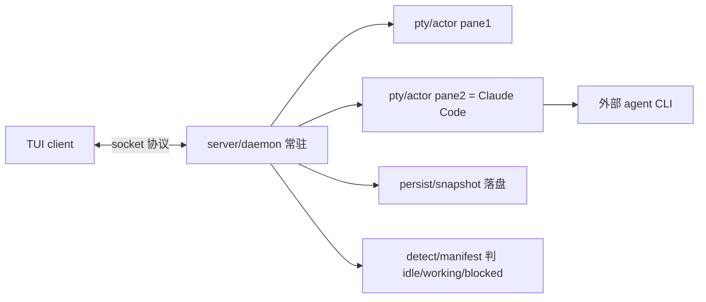

# Rank 74：herdrdev/herdr 源码级调研报告

## 1. 项目概述与定位

- **项目名称**：herdr（GitHub: https://github.com/herdrdev/herdr ）
- **Star 数**：约 38.1k（快照值）
- **主要语言**：Rust（单二进制）
- **一句话定位**："the runtime your coding agents live on"——一个后台常驻 server + TUI 客户端的终端工作区多路复用器，让 Claude Code / Codex / Gemini CLI / Cline 等编码 agent 在你合上笔记本、断网、重启后仍继续工作，并可从任意终端或 SSH 重新 attach。
- **目标用户/场景**：同时并行编排多支编码 agent、需要长时间无人值守跑任务、需要跨机器（本地 + 远程/SSH）统一 attach 的开发者。
- **项目成熟度**：高。语义化版本已迭代到 0.9.0（本次分析基线），CHANGELOG 达 12 万字符，CI/发布/preview 工作流齐全，跨平台（含 Windows arm64）构建，Apache-2.0。

> **定性说明**：herdr **本身不是一个 LLM agent**——它不做推理、不调模型、不做工具调用决策。它是**编码 agent 赖以生存的"运行时/宿主"**：通过 PTY 把外部编码 agent CLI 当子进程托管，并在其上提供会话持久化、远程 attach、agent 状态识别、工作区/git worktree 管理。因此第 8 章"自我进化机制"中，agent 的"思考进化"不适用，但 herdr 自身有值得借鉴的"远程 manifest 热更新能力库"设计。

## 2. 源码结构总览（源码确认 @0.9.0）

```
src/
├── main.rs / cli.rs            # 入口 + clap 命令解析
├── server/                     # 后台常驻 server
│   ├── mod.rs / client_accept.rs / clients.rs
│   ├── handoff.rs              # live handoff
│   ├── headless/               # 无 TUI 的 server 生命周期
│   └── socket_paths.rs         # unix socket / IPC 路径
├── client/                     # TUI 客户端（ratatui）
│   ├── mod.rs / attach.rs / transport.rs / handshake.rs
│   └── shell/                  # TUI 界面层（渲染/输入/侧边栏）
├── remote/                     # 远程/重连
│   ├── attach.rs / process.rs
│   └── restart_policy.rs       # ★ server 重启策略（本次全文读）
├── persist.rs + persist/       # ★ 会话快照持久化
│   ├── snapshot.rs             # ★ SessionSnapshot（本次全文读）
│   ├── restore.rs / io.rs
├── pty/                        # 终端伪终端进程
│   ├── actor.rs / backend.rs / fd.rs
├── detect/                     # ★ agent 状态智能检测
│   ├── manifest.rs            # ★ 21 个 agent 的 TOML 规则引擎（本次读）
│   ├── manifest_update.rs
│   └── manifests/*.toml       # claude/codex/gemini/cursor... 规则
├── api/                        # socket API（JSON-RPC 风格）
│   ├── server.rs / event_hub.rs / schema/
├── workspace.rs + workspace/  # 工作区（repo 级容器）+ git worktree
├── worktree.rs
├── integration/                # 各 agent 的集成资产（herdr-agent-state.sh/ps1）
└── protocol/                  # 线协议 + 协议代次版本
```

**核心源码文件（源码确认，本次阅读）**：`Cargo.toml`、`src/remote/restart_policy.rs`、`src/persist/snapshot.rs`、`src/detect/manifest.rs`。其余路径来自 jsDelivr 扁平文件清单。

**入口/启动流程（源码确认）**：`main.rs` → `cli.rs`（clap 子命令 `server`/`attach`/`pane`/`workspace`/`worktree`/`agent`/`machine` 等）；`herdr server` 常驻后台（unix/命名管道 socket），`herdr attach` 起 TUI 客户端连上去。

**代码规模**：大型 Rust 工程，`src/` 下约 300+ `.rs` 文件，仅 `detect/manifest.rs` 一个文件就 1.2 万字符，`persist/snapshot.rs` 1.1 万字符；`Cargo.lock` 6.4 万字符。

## 3. 系统架构分析

**编排模式（源码确认：不适用本系统做 LLM 编排）**：herdr 是**宿主/运行时**，真正的 agent 编排发生在被托管的外部 CLI 内部。herdr 自身的架构是经典的 **server/daemon + client/TUI 分离**，配合 PTY actor 模型。

**核心组件划分（源码确认）**：
- **Server（`src/server/`）**：常驻后台，持有全部 PTY 与工作区状态，接受 client 连接（`client_accept.rs`），维护 client 列表（`clients.rs`）。
- **PTY Actor（`src/pty/actor.rs`）**：每个 pane 对应一个真实终端子进程（`portable-pty`），server 侧用 actor 模型管理其输入输出。
- **Client/TUI（`src/client/`、`client/shell/`）**：纯渲染层，通过 socket 协议拉取 surface 帧并回传输入；可断开重连（`attach.rs`）。
- **Persist（`src/persist/`）**：把工作区/tab/pane 结构与终端历史序列化为快照文件。
- **Detect（`src/detect/`）**：根据屏幕内容 + OSC 序列判断当前 agent 处于 Idle/Working/Blocked。
- **API（`src/api/`）**：对外 socket API，schema 由 `schemars` 生成 JSON Schema（`docs/next/api/herdr-api.schema.json`）。

**数据流**：客户端 keypress → socket → server → 写入对应 PTY 的 master → agent CLI 输出 → PTY slave 读取 → server 抓帧 → 经 `render_stream` 推给所有 attached client → TUI 渲染。断开只是 client 退订，server 与 PTY 继续。

**关键类/函数（源码确认）**：
- `restart_policy.rs`：`remote_server_restart_reason(...) -> Option<RemoteServerRestartReason>`、`remote_install_running_server_plan(...) -> RemoteInstallRunningServerPlan{KeepRunning|LiveHandoff|StopRequired}`。
- `persist/snapshot.rs`：`SessionSnapshot{capture()} / parse_snapshot() / migrate_snapshot()`，常量 `SNAPSHOT_VERSION: u32 = 3`。
- `detect/manifest.rs`：`detect_with_osc(agent, DetectionInput{screen, osc_title, osc_progress})`、`reload_manifests()`、`evaluate_loaded_manifest()`。



## 4. 功能拆解

- **工作区/标签/窗格模型（源码确认）**：Workspace（repo 级容器）→ Tab（布局）→ Pane（真实 PTY）→ Agent。`WorkspaceSnapshot.tabs[].panes` 与 BSP 布局树 `LayoutSnapshot::{Pane, Split}` 序列化保存。
- **Agent 托管与 resume（源码确认）**：`PaneSnapshot.agent_session: PaneAgentSessionSnapshot{source, agent, kind, value}` 记录 agent 会话引用，重启后据此 resume；`src/agent_resume.rs`、`src/app/agent_resume.rs`。
- **Agent 状态检测（源码确认）**：`detect/manifest.rs` 用 TOML 规则（`contains`/`regex`/`line_regex` + `all/any/not` 嵌套 gate + `priority`）匹配屏幕最近区域，输出 Idle/Working/Blocked/Unknown。
- **集成资产（源码确认）**：`src/integration/assets/<agent>/herdr-agent-state.sh|.ps1` 为每种 agent 注入状态查询脚本，跨 shell（bash/powershell）。
- **git worktree 支持（源码确认）**：`src/workspace/git/*`、`src/app/worktrees.rs`、`WorktreeSpaceMembership`。
- **插件（源码确认）**：`src/app/api/plugins/*`、`src/persist/plugin_registry.rs`、`plugin_command.rs`，带 manifest/context/runtime。
- **可观测 API（源码确认）**：`schemars` 自动生成 `herdr-api.schema.json`（275KB），暴露完整 socket API 契约。

## 5. 技术亮点与优势

1. **会话与渲染彻底分离（源码确认）**：TUI 是无状态渲染器，server 持有 PTY 与状态；client 断连/SSH 重连不影响 agent 继续跑。这是"合上盖也能干活"的根本。
2. **快照带版本与迁移（源码确认）**：`SNAPSHOT_VERSION=3`，`parse_snapshot` 遇到 `raw.version > SNAPSHOT_VERSION` 直接拒绝；`migrate_snapshot` 把旧版 `LegacyWorkspaceSnapshot` 自动转换为新结构。持久化向前/向后兼容工程做得扎实。
3. **数据驱动的 agent 检测引擎（源码确认）**：21 个 agent 各一份 TOML 规则，规则可远程热更新（`manifest_update.rs`），不必发版即可适配新版 agent 的 UI 变化；并设了 `MAX_RULES_PER_MANIFEST=128`、`MAX_GATE_DEPTH=8`、`MAX_TOTAL_MATCHERS=1024`、`MAX_MATCHER_CHARS=512` 等安全上限防滥用。
4. **协议代次 + live handoff（源码确认）**：`ENDPOINT_PROTOCOL_GENERATION` 代次不一致即触发重启；升级 server 时若支持 live handoff 则平滑移交而非打断会话。
5. **Rust 单二进制 + portable-pty + interprocess**：跨 unix socket / Windows 命名管道，无 Node/外部运行时。

## 6. 稳定性机制【重点】

- **崩溃恢复/检查点（源码确认，`persist/snapshot.rs`）**：整个会话结构（工作区、tab、BSP 布局、每个 pane 的 cwd/label/agent_session/launch_argv）序列化为 `SessionSnapshot`，另有 `capture_history()` 单独把每 pane 的 ANSI 屏幕历史存为 `PaneHistorySnapshot{ansi, lines}`。重启后 `restore.rs` 读取快照重建——这是 herdr 最重要的稳定性设计。
- **快照版本守卫（源码确认）**：`parse_snapshot` 对未来版本号 `raw.version > SNAPSHOT_VERSION` 返回错误而非乱解析；`migrate_workspace` 区分当前格式 / legacy 格式，`LegacyWorkspaceSnapshot.into()` 做老结构迁移，`legacy_identity_cwd` 兜底取 cwd（最后回退 `std::env::current_dir()`，再退 `"/"`）。
- **server 重启判定（源码确认，`remote/restart_policy.rs`）**：`remote_server_restart_reason` 枚举四种原因 `EndpointProtocol / SurfaceInterest / HealthCheck / DaemonDetach`，逐项判定是否需要重启；`remote_install_running_server_plan` 在可 live handoff 时选 `LiveHandoff` 而非硬停。
- **错误/锁处理（源码确认）**：读 `RwLock` 均用 `lock.read().unwrap_or_else(|poisoned| poisoned.into_inner())`，即**锁中毒后不 panic、继续取内部数据**——避免因一个线程 panic 拖垮整个 server。`OnceLock` + `Mutex` 双重初始化保护 manifest 重载。
- **边界处理（源码确认）**：检测引擎对缺省字段用 `#[serde(default)]`、`skip_serializing_if`；`serde(deny_unknown_fields)` 拒绝 TOML 里未知字段，配置错误尽早暴露。
- **取消/信号（源码确认）**：依赖 `ctrlc`（termination feature）处理 Ctrl-C；`tokio` multi-thread runtime。

## 7. 高可用机制【重点】

- **Server/Client 解耦 + 重连（源码确认）**：server 常驻（`src/server/headless/lifecycle.rs`），client 通过 `client/attach.rs`、`handshake.rs` 重连；断线只是渲染层事件。这是高可用的核心——agent 任务不绑终端生命周期。
- **健康检查驱动重启（源码确认）**：`remote_server_restart_reason` 把 `health_check: bool` 作为重启依据之一，daemon detach（`detached_server_daemon=false`）也会触发重启，保证后台进程不僵尸化。
- **并发模型（源码确认，`Cargo.toml`）**：`tokio` 启用 `rt-multi-thread` + `sync/time/process/io-util`；PTY 用 actor（`pty/actor.rs`）每进程独立；TUI 与 server 通过 `interprocess`（unix domain socket / Windows 命名管道）通信，`bincode` 做紧凑序列化。
- **资源/安全上限（源码确认）**：检测规则设多道 `MAX_*` 上限，防止恶意/庞大 manifest 撑爆内存或正则回溯。
- **可观测性（源码确认）**：`tracing` + `tracing-subscriber`（env-filter）；`api/event_hub.rs`、`api/subscriptions.rs` 提供事件订阅流；`render_prof.rs` 渲染性能统计。
- **无分布式单点**：server 本地常驻，但可经 SSH/远程 attach（`remote/attach.rs`、`remote/host_unix.rs`），多 client 可同时看同一 server。

## 8. 自我进化机制【重点】

- **被托管 agent 的"进化"不适用**：herdr 不做模型层自学习，agent 的智能来自外部 CLI。
- **能力库远程热更新（源码确认，`detect/manifest.rs`）**：这是 herdr 自身最接近"自我进化"的设计——对每个 agent 的识别规则（`AgentManifest`）支持 `ManifestSource::Remote{path, version}`，可在不发版的情况下从远端拉取新版规则更新识别能力；本地 `Override` 可覆盖远端，`local_override_shadowing_remote` 标记本地遮蔽远端；`reload_manifests_for_agents()` 按 agent 增量重载。即"识别能力"这一知识资产可在线迭代。
- **行为可解释（源码确认）**：`explain()`/`DetectionExplain` 把每条规则是否命中、命中证据（`RuleEvidence` 的 contains/regex 计数、region 预览）暴露出来，便于迭代规则——相当于自反馈调优的观测面。
- **无运行时权重/经验学习**：进化 = 远程规则 manifest 更新 + 用户集成脚本（`integration/assets`）扩充，而非在线学习。

## 9. openmate 可借鉴点【重点】

- **P0｜把"执行内核"与"UI/客户端"彻底分离，内核常驻、UI 可断开重连**：openmate 规划桌面/手机多端时，应让 agent 执行循环跑在一个常驻后台进程（daemon）里，桌面/Web/手机只是 attach 的渲染客户端，断线、关 App、切设备都不中断正在跑的任务。预期：任务真正"7×24"，多端体验一致。
- **P0｜会话快照带版本号 + 迁移层 + 拒绝未来版本**：openmate 持久化 agent 会话/工作区状态时，存 `version` 字段；读取时对更高版本号拒绝、对旧版本跑 `migrate` 函数升级。预期：版本迭代不会读崩旧存档，崩溃恢复可靠。
- **P0｜锁中毒后 `poisoned.into_inner()` 兜底而非 panic**：openmate 用 Rust/异步多线程时，共享状态读写锁统一采用"中毒后继续用内部数据"的兜底，避免单线程 panic 拖垮常驻 daemon。预期：服务长期不宕。
- **P1｜把"识别/适配外部 agent"做成数据驱动规则 + 远程热更新**：openmate 若需适配多种模型/外部工具，把适配规则写成可远程下发的数据（带版本、本地 override、加载上限），而非硬编码。预期：适配新 agent/模型不必发版。
- **P1｜能力暴露 JSON Schema（schemars）+ 事件订阅流**：openmate 的内部 API 用 `schemars` 自动生成契约、用 event_hub/subscription 向外推事件。预期：多端/插件对接有契约、事件可观测。
- **P2｜把终端历史(ANSI)与结构快照分开存**：布局结构与屏幕回滚历史分别序列化，恢复时各取所需。预期：恢复快、内存省。

## 10. 源码验证标注

**源码直接阅读（jsDelivr @0.9.0）**：
- `Cargo.toml`：依赖 ratatui/crossterm/tokio(rt-multi-thread)/portable-pty/interprocess/bincode/tracing/schemars/ctrlc，单二进制 Apache-2.0。
- `src/remote/restart_policy.rs`（全文）：`RemoteServerRestartReason` 四枚举、`remote_server_restart_reason`、`remote_install_running_server_plan`（KeepRunning/LiveHandoff/StopRequired）及单测。
- `src/persist/snapshot.rs`（前 4000 字符）：`SessionSnapshot`、`SNAPSHOT_VERSION=3`、`capture/capture_history/parse_snapshot/migrate_snapshot/LegacyWorkspaceSnapshot`、版本守卫、BSP `LayoutSnapshot`。
- `src/detect/manifest.rs`（前 4000 字符）：`DetectionInput`、TOML `AgentManifest`/`ManifestRule`/gate 嵌套、`BUNDLED_MANIFESTS`（21 agent）、`detect_with_osc`、`reload_manifests`、`OnceLock<RwLock>`、`MAX_*` 上限、`ManifestSource::Remote`。

**来自文档/推断**：
- "server 常驻、SSH 重连、git worktree、并行编排多支 agent"的产品行为依据 architecture_notes 与文件命名（`server/`、`remote/attach.rs`、`workspace/git/*`）推断，未逐行读完 `server/headless/lifecycle.rs` 与 `remote/attach.rs`。
- TUI 渲染细节（kitty_graphics、surface patch）仅从文件名确认存在。

**源码不可得部分**：PTY  actor 的具体事件循环、socket 线协议字节格式、插件 runtime 实现未逐行展开；如需 openmate 复刻 daemon，建议进一步读 `src/server/headless/lifecycle.rs`、`src/protocol/wire.rs`、`src/pty/actor.rs`。
