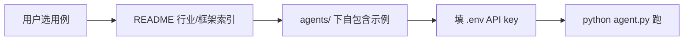

# Rank 75：ashishpatel26/500-AI-Agents-Projects 源码级调研报告

## 1. 项目概述与定位

- **项目名称**：500-AI-Agents-Projects（GitHub: https://github.com/ashishpatel26/500-AI-Agents-Projects ）
- **Star 数**：约 37.7k（快照值）
- **主要语言**：Python（标签），主体为 Markdown 索引 + 可运行示例脚本
- **一句话定位**：一个策展型（curated）AI agent 用例合集——跨行业、跨框架收录 500+ agent 项目/教程/可运行实现，并为每个用例给出可实现的开源项目链接。
- **目标用户/场景**：入门者想跑通第一个 agent、研究者调研 agent 全景、团队选型对比框架（LangGraph/CrewAI/AutoGen/Agno/LlamaIndex）、学生从真实案例学架构。
- **项目成熟度**：中高。MIT，all-contributors 友好，持续收录新案例；含 `agents/` 自包含示例与 `crewai_mcp_course/` 课程。

> **定性说明**：本仓库主体是**案例索引（awesome-list 性质）**，但比纯链接列表更进一步——`agents/` 目录下是一批自包含、可 `python agent.py` 直接运行的示例。它**没有一个统一的、本仓库自研的 agent 运行时/编排引擎**，每个示例各自基于 LangGraph/CrewAI/AutoGen/Agno。因此第 6/7/8 章（稳定性/高可用/自我进化的系统级机制）标注为"不适用"，调研重点放在其**作为选型与学习图谱的参考价值**。

## 2. 源码结构总览

```
.
├── README.md                 # 主索引：按行业 + 按框架两张大表
├── CONTRIBUTION.md           # 贡献指引
├── agents/                   # 自包含可运行示例（如 01-web-research-agent/）
│   └── 01-web-research-agent/
│       ├── agent.py          # 示例 agent 入口
│       ├── requirements.txt
│       └── .env.example
├── crewai_mcp_course/        # 配套 CrewAI + MCP 课程
├── images/                   # 行业思维导图等配图
└── LICENSE
```

**核心"源码"**：无统一源码。真正的代码分散在 `agents/*/agent.py`（每个示例一份）和 `crewai_mcp_course/`。本次未逐一打开每个示例 agent.py（数量众多且彼此独立），结构依据 README 的 Quick Start 与目录说明。

**入口/运行流程（源码/README 确认）**：`git clone` → `cd agents/01-web-research-agent` → `pip install -r requirements.txt` → `cp .env.example .env`（填 API key）→ `python agent.py`。每个示例自包含，无需 monorepo 装配。

**代码规模**：无统一代码库；索引 README 约 9k 字符，示例为数十个小型单文件 agent。

## 3. 系统架构分析

**编排模式（源码确认：本仓库不自持编排）**：无统一编排。示例分散采用 LangGraph（有状态图/RAG）、CrewAI（角色团队/Flow）、AutoGen（代码生成/自修复）、Agno（轻量单 agent）、LlamaIndex（RAG 管线）。README 给出一张**框架选型对照表**：

| 框架 | 最适合 | 复杂度 |
|------|--------|--------|
| LangGraph | 有状态工作流、RAG、复杂图 | 高 |
| CrewAI | 角色团队、业务自动化、快速原型 | 中 |
| AutoGen | 代码生成、研究、自修复工作流 | 高 |
| Agno | 轻量单 agent、工具集成、快速迭代 | 低 |
| LlamaIndex | 文档问答、企业 RAG、数据管线 | 中 |

**数据流（以 web-research-agent 示例推断）**：用户输入目标 → 示例 agent 调用搜索/工具 → 各框架自带的循环/图 → 输出研究结果。具体数据流因示例而异，非本仓库统一抽象。

**关键类/函数**：无跨示例统一类。各示例 `agent.py` 中使用对应框架的 agent/crew/graph 抽象。



## 4. 功能拆解

- **按行业索引（源码/README 确认）**：医疗、金融、教育、零售、网络安全、制造、法律、HR、游戏、物流、农业等 20+ 行业，每行给"用例—行业—描述—外部 GitHub 链接"。
- **按框架索引（源码/README 确认）**：CrewAI/AutoGen/LangGraph 等分组，展示每类框架的典型用例（邮件自动回复、会议助手、自我评估 Flow、线索打分等）。
- **自包含可运行示例（源码/README 确认）**：`agents/*/` 每个带 `requirements.txt` + `.env.example`，5 分钟跑通。
- **配套课程（源码/README 确认）**：`crewai_mcp_course/` 系统讲 CrewAI + MCP。
- **框架决策指南（源码/README 确认）**："刚入门→Agno/CrewAI；要状态图+RAG→LangGraph；代码/研究 agent→AutoGen；企业文档管线→LlamaIndex"。

## 5. 技术亮点与优势

1. **真·可运行而非死链接**：相比纯 awesome-list，`agents/` 提供能直接 `python agent.py` 的最小骨架，降低上手门槛。
2. **双维度检索（行业 × 框架）**：既按"我要做什么行业"找，也按"我用什么框架"找，选型友好。
3. **覆盖面与时效性**：收录了 OWASP agent-memory-guard、Citadel（Claude Code 舰队编排）、PII Sanitization 等较新的安全/工程化用例，反映 agent 生态前沿。
4. **框架选型对照表**：直接给复杂度/多 agent/流式/本地 LLM 维度的横向比较。

## 6. 稳定性机制【重点】

**不适用**。本仓库无统一运行时，不存在跨项目的错误处理/重试/超时/崩溃恢复机制。每个示例的稳定性由其底层框架（LangGraph checkpoint、CrewAI 等）决定，仓库本身不提供统一保障。唯一可借鉴的"工程纪律"是 README 要求每个示例自带 `requirements.txt` 与 `.env.example`，保证环境可复现——这是一种**可运行性护栏**而非运行时稳定性。

## 7. 高可用机制【重点】

**不适用**。无服务端、无并发调度、无横向扩展。示例多为单进程脚本。仓库层面的"高可用"仅是内容外链的冗余（同一用例多处索引），与系统高可用无关。

## 8. 自我进化机制【重点】

**不适用（无运行时自学习）**。其"进化"体现为**社区持续收录新用例**（PR 流程 + CONTRIBUTION.md），是内容侧的滚动更新，而非 agent 在线学习。对 openmate 的参考意义仅在于：可以建立一个"用例/最佳实践库"作为团队的知识资产，持续沉淀。

## 9. openmate 可借鉴点【重点】

- **P1｜自包含示例的标准结构（agent.py + requirements.txt + .env.example）**：openmate 沉淀内部最佳实践/模板 agent 时，每个模板做到"clone 后填 key 即跑"，附依赖与环境样例。预期：团队复用零配置、新人快速上手。
- **P1｜双维度索引（场景 × 技术栈）**：openmate 的案例库同时按"业务场景"和"所用能力/框架"组织。预期：选型与检索效率高。
- **P2｜一张框架/能力选型对照表**：openmate 在内部沉淀一张"需求→推荐技术"决策表（复杂度、多 agent、流式、本地模型维度）。预期：减少重复技术选型讨论。
- **P2｜把"安全/合规用例"单列**：该合集收录了 memory poisoning 防护、PII 脱敏等安全 agent。openmate 设计 agent 时应把"记忆投毒防护、出站 PII 脱敏"列为一等考虑。

## 10. 源码验证标注

**源码直接阅读（jsDelivr @main）**：`README.md` 全文（框架对照表、行业用例表、Quick Start 运行方式、agents/ 与 crewai_mcp_course/ 目录说明）。

**来自文档/推断**：
- `agents/` 下具体每个示例 `agent.py` 的内部实现未逐一阅读，仅从 README 确认其"自包含、可运行"的组织方式。
- `crewai_mcp_course/` 课程内容未逐课阅读。

**源码不可得部分**：仓库无统一核心源码文件可深挖；如需分析某一具体示例的稳定性/记忆机制，应单独打开对应 `agents/*/agent.py`。
