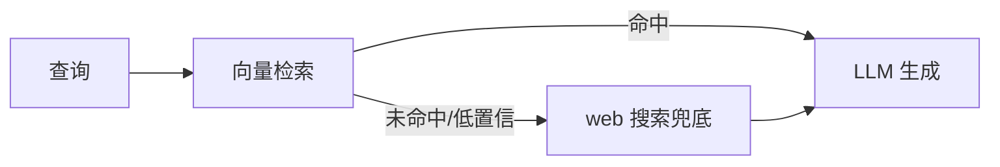

# Rank 76：patchy631/ai-engineering-hub 源码级调研报告

## 1. 项目概述与定位

- **项目名称**：ai-engineering-hub（GitHub: https://github.com/patchy631/ai-engineering-hub ）
- **Star 数**：约 37.5k（快照值）
- **主要语言**：Jupyter Notebook（Python）
- **一句话定位**：面向 AI 工程学习者的教程/示例合集——93+ 个从入门到生产的可运行 Notebook/项目，覆盖 LLM、RAG、Agent、MCP、微调。
- **目标用户/场景**：从初学者到从业者，按难度（Beginner 22 / Intermediate 48 / Advanced 23）递进学习并直接复用到自己项目。
- **项目成熟度**：高。MIT，登过 TrendShift trending，持续更新，配套 newsletter 与 roadmap。

> **定性说明**：这是**教学资源集合**，不是一个可独立运行的 Agent 系统，也没有统一的运行时或编排引擎。每个子目录是一个独立小教程（基于 LangChain/LlamaIndex/CrewAI/MCP 等）。因此第 6/7/8 章标注"不适用"，重点分析其**教程组织方式与可借鉴的 Agent/RAG 工程范式示例**。

## 2. 源码结构总览

```
.
├── README.md            # 主目录：按难度三档 + 主题分组
├── ai-engineering-roadmap/   # 学习路线
├── <项目名>/            # 每个子目录一个独立教程
│   ├── simple-rag-workflow/
│   ├── agentic_rag/
│   ├── mcp-agentic-rag/
│   ├── agent-with-mcp-memory/   # Graphiti + Opik
│   ├── zep-memory-assistant/
│   ├── Multi-Agent-deep-researcher-mcp-windows-linux/
│   └── ... (93+)
├── resources/           # 配图/营销素材
└── LICENSE
```

**核心"源码"**：无统一核心。真正代码分散在各子目录的 `.ipynb` 与脚本中（如 `agentic_rag/`、`mcp-agentic-rag/`、`zep-memory-assistant/`）。本次未逐本 Notebook 打开，依据 README 的项目清单与描述。

**运行方式（README 确认）**：进入某子目录，按其 README 装依赖跑 Notebook（多为 Streamlit/LlamaIndex/CrewAI）。

**代码规模**：93+ 个独立小项目，总体量很大但无统一框架代码。

## 3. 系统架构分析

**编排模式（源码确认：本仓库不自持）**：不适用。教程示例覆盖多种范式——
- **ReAct/Agentic RAG**：`agentic_rag`（文档检索 + web 兜底）、`firecrawl-agent`（Corrective RAG + web 搜索兜底）。
- **Multi-Agent**：`Multi-Agent Deep Researcher`（MCP 驱动）、`web-browsing-agent`（CrewAI + Stagehand 浏览器自动化）、`paralegal-agent-crew`。
- **Workflow/Flow**：`book-writer-flow`、`content_planner_flow`（CrewAI Flow）。
- **MCP**：一大批 `*-mcp-*` 项目（LlamaIndex MCP client、Graphiti MCP 记忆、Firecrawl MCP、MindsDB MCP）。
- **记忆**：`zep-memory-assistant`、`agent-with-mcp-memory`（Graphiti 持久记忆）。

**数据流（典型 RAG 教程范式，README 确认）**：文档加载 → embedding → 向量库（Qdrant/Milvus）→ 检索 → LLM 生成；agentic RAG 在此基础上加"检索失败→web 搜索兜底"的回退分支。



**关键类/函数**：跨教程无统一抽象；分别用 LlamaIndex、CrewAI、LangGraph、MCP SDK、Zep/Graphiti、Opik 等。

## 4. 功能拆解

- **按难度分级（README 确认）**：Beginner（OCR、本地 chat、基础 RAG）→ Intermediate（agentic workflow、voice、advanced RAG、MCP、模型对比评估）→ Advanced（微调、多 agent deep research、生产系统、NotebookLM 克隆）。
- **Agentic RAG 范式库（README 确认）**：多个变体——基础 RAG、Agentic RAG、DeepSeek 企业版、deploy 版（LitServe 私有 API）、SQL Router（RAG + SQL 路由）。
- **MCP 生态示例（README 确认）**：LlamaIndex MCP client、Cursor Linkup MCP、Graphiti MCP 持久记忆、KitOps MCP（ML 模型管理）、Ultimate AI Assistant（多 MCP server 接口）。
- **记忆系统示例（README 确认）**：Zep Memory Assistant（拟人记忆）、Graphiti MCP（持久记忆）、Context Engineering Workflow（TensorLake + Zep）。
- **评估与可观测（README 确认）**：`eval-and-observability`（CometML Opik E2E RAG 评估）、一系列模型对比 Notebook。
- **语音 agent（README 确认）**：实时 voicebot、RAG voice agent（Cartesia）、meeting notes 自动生成。

## 5. 技术亮点与优势

1. **难度递进清晰**：从单组件 OCR 到多 agent + MCP + 微调，学习路径平滑。
2. **紧跟生态热点**：MCP、Graphiti/Zep 记忆、agentic RAG、deep research、模型对比评估——都是 2025–2026 主流工程实践。
3. **真可跑**：每个项目独立目录、依赖明确，可直接复用到生产。
4. **含"评估/可观测"专题**：不只是搭 agent，还教 E2E 评估（Opik）与模型对比，工程闭环意识强。

## 6. 稳定性机制【重点】

**不适用**（教学集合，无统一运行时）。但其中个别教程体现了可借鉴的稳定性范式：
- **检索兜底分支**：`agentic_rag` / `firecrawl-agent` 的"向量检索未命中→web 搜索兜底"是一种降级设计；`trustworthy-rag` 强调复杂文档下的可信检索。这些是**单教程内的容错范式**，而非仓库级机制。

## 7. 高可用机制【重点】

**不适用**。无服务端集群。仅教程层面提到部署形态（如 `deploy-agentic-rag` 用 LitServe 起私有 API、`fastest-rag-milvus-groq` 追求 <15ms 检索延迟），反映"低延迟检索、API 化部署"的工程取向，但非仓库级高可用设计。

## 8. 自我进化机制【重点】

**不适用**（无运行时自学习）。可借鉴的范式来自教程内容：
- **持久记忆**：Zep/Graphiti 教程演示"把对话历史沉淀为可检索的长期记忆图"。
- **Corrective RAG**：firecrawl-agent 演示"自检检索质量、不置信则回退外部源"的反思式 RAG。
- **评估回路**：Opik 教程演示对 RAG 输出做 E2E 自动评分。

## 9. openmate 可借鉴点【重点】

- **P0｜Agentic RAG 的"检索→置信判定→web 兜底"降级链**：openmate 做知识库问答时，向量检索低置信不要硬答，自动回退到联网搜索再答。预期：减少幻觉、提升覆盖率。
- **P1｜把"记忆系统"作为独立可插拔组件（Zep/Graphiti 范式）**：openmate 的长期记忆不要内联在对话历史里，而用可检索的外部记忆库（图/向量）按需召回。预期：长会话不爆上下文、记忆可维护。
- **P1｜E2E 评估/可观测从第一天接入（Opik 范式）**：openmate 从早期就把每次 RAG/工具调用的 trace 与评分接进可观测平台。预期：能量化改进、回归对比。
- **P2｜教程式内部知识库结构**：openmate 沉淀内部最佳实践时，按"难度/场景"分目录、每个可独立运行。预期：团队知识复用。

## 10. 源码验证标注

**源码直接阅读（jsDelivr @main）**：`README.md` 全文（项目清单、难度分级、各主题简介、roadmap 入口）。

**来自文档/推断**：
- 各子目录 Notebook 的具体实现（用了哪些类、如何调 MCP）未逐本打开，依据 README 一行简介判断其范式。
- "agentic RAG 回退链""Graphiti 记忆"等机制细节为 README 描述 + 领域常识推断。

**源码不可得部分**：未逐项目阅读 `.ipynb`；若需把某一范式（如 corrective RAG、Graphiti 记忆）落到 openmate，建议单独精读对应子目录。
