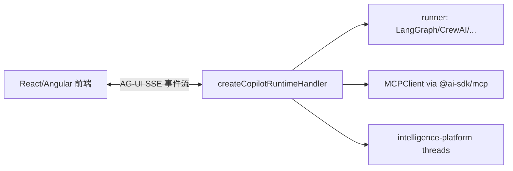

# Rank 77：CopilotKit/CopilotKit 源码级调研报告

## 1. 项目概述与定位

- **项目名称**：CopilotKit（GitHub: https://github.com/CopilotKit/CopilotKit ）
- **Star 数**：约 37.3k（快照值）
- **主要语言**：TypeScript（npm monorepo）
- **一句话定位**：面向 Agent 与生成式 UI 的**前端集成栈**——自研 AG-UI（Agent-User Interaction）协议，把任意后端 agent（LangGraph/Mastra/CrewAI/Pydantic AI）通过 SSE 事件流接到 React/Angular 前端，强调前后端解耦与 Generative UI。
- **目标用户/场景**：想在自己的 Web 应用里嵌入"带工具调用、带生成式 UI 的 AI 助手"的全栈开发者。
- **项目成熟度**：高。MIT，最新 1.71.x；已完成 v1→v2 架构迁移，runtime 现支持 express/hono/node 多运行时，并有 CopilotKit Intelligence（托管 threads/智能平台）。

> **定性说明**：CopilotKit **本身不实现 agent 的推理/规划**，它是"**agent 前后端之间的协议 + 中间层 runtime + 前端组件**"。真正的 agent 跑在用户自己的后端。它对 openmate 的价值在于：多端（Web/桌面/手机）之间如何用一套**事件流协议**把 agent 实时状态推给 UI，这是其最值得借鉴之处。

## 2. 源码结构总览（源码确认 @main，v2）

```
packages/
├── runtime/                     # ★ @copilotkit/runtime（本次重点）
│   └── src/
│       ├── index.ts             # v1 兼容入口（已废弃，指向 v2）
│       ├── v2/
│       │   ├── index.ts        # ★ export runtime/runner/transcription/intelligence-platform
│       │   └── runtime/
│       │       ├── core/runtime.ts        # runtime 核心
│       │       ├── core/fetch-handler.ts # ★ createCopilotRuntimeHandler 框架无关
│       │       ├── core/hooks.ts         # ★ CopilotRuntimeHooks（前/后/错误钩子）
│       │       ├── core/channel-manager.ts # Channels 控制面
│       │       ├── endpoints/
│       │       ├── runner/                # agent runners
│       │       ├── transcription-service/  # 语音转写
│       │       └── intelligence-platform/ # 托管 threads/智能平台
│       └── (v1-deprecated-compatibility)
├── core/                        # @copilotkit/core（前端核心）
└── (react / angular / ag-ui 协议等包)
```

**核心源码文件（源码确认，本次读）**：`packages/runtime/package.json`（exports）、`packages/runtime/src/index.ts`（v1→v2 迁移说明）、`packages/runtime/src/v2/index.ts`、`packages/runtime/src/v2/runtime/index.ts`（导出清单）。

**入口/启动流程（源码确认）**：`@copilotkit/runtime/v2` 导出 `createCopilotRuntimeHandler`（直接吃 `Request` 的框架无关 fetch handler），用户在 `./v2/express`、`./v2/hono`、`./v2/node` 任一适配器中挂载；前端 `<CopilotKit>` 组件连该 runtime。

**代码规模**：monorepo，runtime 单包即含 core/endpoints/runner/intelligence-platform 多子模块，中大型 TS 工程。

## 3. 系统架构分析

**编排模式（源码确认：非 agent 编排，是协议/中间层）**：CopilotKit 不做任务规划。其核心是 **AG-UI 事件流协议**：runtime 作为中间层，向后调用用户的 agent runner，向前把 agent 的状态变化封装为标准事件推给前端。

**核心组件划分（源码确认）**：
- **Runtime 中间层（`packages/runtime`）**：`createCopilotRuntimeHandler` 接收前端请求，代理鉴权、路由到对应 agent runner，把执行过程转成事件流。
- **Runner（`runner/`）**：对接后端 agent 框架（LangGraph 等；package.json 导出 `./langgraph`）。
- **前端组件层（`packages/core` + react/angular）**：消费事件流渲染聊天、生成式 UI。
- **Intelligence Platform（`intelligence-platform/`）**：托管 threads（CreateThreadRequest/ThreadSummary/ListThreads/Subscribe/Update）。
- **MCP（源码确认）**：`export type { MCPClient, MCPTransport } from "@ai-sdk/mcp"`——运行时通过 AI SDK 的 MCP 客户端接线工具。

**数据流**：前端发请求 → runtime fetch handler → 路由到 agent runner → runner 执行（可挂 MCP 工具）→ 每步产出 AG-UI 事件（消息增量、工具调用、状态更新、生命周期）经 SSE 推回 → 前端流式渲染。

**关键导出（源码确认）**：`createCopilotRuntimeHandler`、`CopilotRuntimeHooks`（`HookContext/HandlerHookContext/ResponseHookContext/ErrorHookContext`）、`CopilotCorsConfig`、`ChannelsControl/ChannelStatus`、`MCPClient/MCPTransport`。



## 4. 功能拆解

- **AG-UI 协议（架构文档/源码确认）**：基于 SSE 的双向事件流，定义消息/状态/工具调用/agent 生命周期等事件；前后端解耦。
- **框架无关 fetch handler（源码确认）**：`createCopilotRuntimeHandler` 直接吃 Web `Request`，上层用 express/hono/node/bun/deno/workers 任一适配器包。
- **多运行时适配器（源码确认，package.json exports）**：`./v2/express`、`./v2/hono`、`./v2/node`，外加 `./langgraph`。
- **Hooks 拦截（源码确认）**：`CopilotRuntimeHooks` 提供 handler/response/error 三类钩子上下文，可在请求处理前后注入鉴权、日志、改写。
- **生成式 UI（架构文档）**：A2UI/Open-JSON-UI/MCP Apps，让 agent 返回结构化 UI 组件。
- **MCP 工具（源码确认）**：经 `@ai-sdk/mcp` 的 `MCPClient`/`MCPTransport` 接线。
- **Threads/会话托管（源码确认）**：`intelligence-platform` 的 Create/List/Subscribe/Update Thread。
- **Channels 控制面（源码确认）**：`channel-manager.ts` 的 `ChannelsControl/ChannelStatus`。

## 5. 技术亮点与优势

1. **协议先行（AG-UI）**：把"agent↔UI 如何通信"抽象成标准事件流，换 agent 框架不用改前端，换前端框架不用改 agent。
2. **框架无关 fetch handler（源码确认）**：runtime 核心只依赖 Web `Request`，一套逻辑适配 express/hono/bun/edge。
3. **v1→v2 平滑迁移（源码确认）**：v1 入口加 deprecation 注释与 IDE 警告，`v1-deprecated-compatibility` 保留兼容，避免破坏存量。
4. **Hooks 可观测/可拦截（源码确认）**：error/response/handler 钩子让中间层能插鉴权、审计、错误归一。
5. **MCP 一等公民（源码确认）**：直接 re-export `@ai-sdk/mcp` 类型，工具生态即插即用。

## 6. 稳定性机制【重点】

- **错误钩子归一（源码确认）**：`CopilotRuntimeHooks` 含 `ErrorHookContext`，中间层可在错误冒泡到前端前统一捕获/改写，前端拿到的是结构化错误事件而非裸异常。
- **请求-响应钩子（源码确认）**：`HandlerHookContext`/`ResponseHookContext` 包住请求生命周期，便于注入超时/鉴权/限流逻辑（机制已留，具体策略在用户侧）。
- **CORS 显式配置（源码确认）**：`CopilotCorsConfig` 显式管理跨域，避免默认放开。
- **版本兼容层（源码确认）**：`v1-deprecated-compatibility` 把破坏性变更隔在兼容层后，运行时不因升级崩。
- **框架无关降级**：同一 handler 在不同运行时/edge 都能跑，部署环境故障可换适配器。
- **边界**：`createCopilotRuntimeHandler` 直接吃 `Request`，输入契约明确，避免包装层歧义。

## 7. 高可用机制【重点】

- **无状态中间层（架构/源码推断）**：runtime 是请求代理，会话状态在后端 agent 与 intelligence-platform（threads），本身无状态、可水平扩。
- **异步 SSE 流（架构确认）**：事件流异步推送，长任务不阻塞；前端断线靠事件重连语义。
- **多运行时部署（源码确认）**：express/hono/node/bun/edge 适配器，可按环境选最优（edge 低延迟、node 生态全）。
- **Channels 控制面（源码确认）**：`channel-manager` 管理通道状态，便于多连接/多端的连接生命周期治理。
- **托管 threads（源码确认）**：会话持久化在 intelligence-platform，runtime 重启不丢会话。
- **可观测（源码确认）**：hooks 天然是埋点点（handler/response/error），用户可挂 metrics。

## 8. 自我进化机制【重点】

- **非 agent，无运行时自学习**：CopilotKit 不改变模型权重。
- **工具生态（MCP，源码确认）**：agent 的能力靠挂 MCP 工具（`MCPClient`）扩展，能力增长来自工具生态而非在线学习。
- **Threads 会话沉淀（源码确认）**：`CreateThread/SubscribeToThread` 把对话会话结构化托管，可作为后续个性化/历史上下文的底座。
- **Generative UI 的反馈闭环（架构）**：agent 产出结构化 UI，用户交互回流为事件——这是"界面层的自反馈"，但非模型自改进。
- **结论**：自我进化不在此层；它提供的是让 agent 进化的"管道"（事件流 + 工具 + 会话）。

## 9. openmate 可借鉴点【重点】

- **P0｜定义一套"agent↔UI"事件流协议（AG-UI 思路）**：openmate 规划桌面/手机多端时，不要把 agent 内部状态直接耦合到某个 UI 框架，而是定义一组标准事件（消息增量、工具调用开始/结束、状态、生命周期），经 SSE/WebSocket 推给各端。预期：换端/加端只写消费层，agent 内核不动。
- **P0｜中间层 runtime 框架无关（直接吃 Request）**：openmate 的 agent 服务用一个"吃标准 Request 的 handler"实现，上层用 FastAPI/任意框架包一层。预期：同一内核可跑 Web/桌面/edge。
- **P0｜handler/response/error 三钩子**：在 runtime 的请求前/后/错误三处留 hook，注入鉴权、限流、日志、错误归一。预期：横切能力不污染 agent 主逻辑。
- **P1｜会话(threads)结构化托管 + Subscribe**：openmate 把会话建成可 List/Subscribe/Update 的资源，多端订阅同一会话。预期：手机接着桌面继续聊。
- **P1｜MCP 作为工具供给侧**：openmate 直接复用 MCP（`@ai-sdk/mcp` 范式）接工具，不自造工具协议。预期：工具生态现成。
- **P2｜v1→v2 兼容层 + IDE 废弃警告**：openmate 做不兼容升级时留兼容入口并标 deprecated。预期：存量用户不被炸。

## 10. 源码验证标注

**源码直接阅读（经 ghproxy 代理 raw @main）**：
- `packages/runtime/package.json`：exports（`./`、`./langgraph`、`./v2`、`./v2/express`、`./v2/hono`、`./v2/node`）、version 1.71.1、license MIT。
- `packages/runtime/src/index.ts`：v1 入口废弃声明、"新代码必须 import /v2"。
- `packages/runtime/src/v2/index.ts`：`./runtime`、`../agent`、`AgentFactoryContext` 重导出。
- `packages/runtime/src/v2/runtime/index.ts`：导出 `createCopilotRuntimeHandler`、`CopilotRuntimeHooks`（Hook/Handler/Response/Error HookContext）、`CopilotCorsConfig`、`ChannelsControl`、`MCPClient/MCPTransport(from @ai-sdk/mcp)`、intelligence-platform threads 类型。

**来自文档/推断**：
- "AG-UI 协议定义 16 类事件、双向 SSE"来自 architecture_notes 与官方文档（docs.copilotkit.ai），未逐行读 AG-UI 事件定义文件。
- 前端 `packages/core`、react/angular 组件层、runner 的 LangGraph 适配实现未读。

**源码不可得部分**：因仓库 >50MB，jsDelivr 拒绝列目录；AG-UI 事件枚举、runtime/core/runtime.ts 的具体事件分发逻辑、fetch-handler 的 SSE 实现未逐行展开；如需 openmate 复刻事件协议，建议读 `packages/runtime/src/v2/runtime/core/` 与 AG-UI 协议包（经 ghproxy 定位）。
