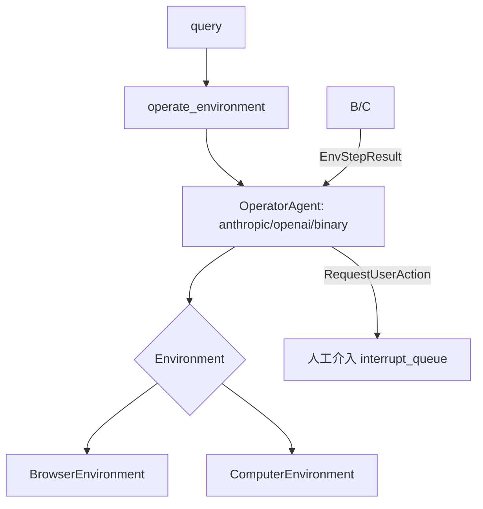

# Rank 78：khoj-ai/khoj 源码级调研报告

## 1. 项目概述与定位

- **项目名称**：khoj（GitHub: https://github.com/khoj-ai/khoj ）
- **Star 数**：约 37.3k（快照值）
- **主要语言**：Python
- **一句话定位**：开源的"个人 AI 助手"平台——多端（Web/桌面/移动端/Obsidian/Emosaic/电话）接入，把用户的文档、笔记、邮件、日历索引为可检索记忆，并具备对话问答、联网搜索、代码执行、浏览器/电脑操作（operator）等能力。
- **目标用户/场景**：想有一个跨设备、连接自己全部个人数据、可私有部署的个人知识库型 AI 助手。
- **项目成熟度**：高。AGPL-3.0（Copyright 2024-2025 Khoj AI），FastAPI+Django 全栈，语义化版本到 2.0.0-beta.x，提供 Docker/桌面/移动多端分发。

> **定性说明**：khoj 是一个**完整的应用型 Agent 系统**，含 RAG 记忆、对话、工具调用、浏览器/电脑操作 operator。它对 openmate 规划桌面/手机多端、个人记忆、人工介入操作环境的场景参考价值高。第 6/7/8 章基于源码重点展开。

## 2. 源码结构总览（源码确认 @master）

```
src/khoj/
├── main.py                 # ★ 入口：FastAPI+Django+APScheduler（本次读）
├── configure.py            # 路由/中间件装配
├── processor/
│   ├── conversation/        # 对话/RAG
│   │   ├── openai/utils.py  # LLM 调用
│   │   ├── prompts/  utils.py  # 消息构造/OperatorRun
│   ├── operator/           # ★ 操作环境 agent（本次读）
│   │   ├── __init__.py      # operate_environment 主入口
│   │   ├── operator_agent_base.py      # OperatorAgent 基类
│   │   ├── operator_agent_anthropic.py # Anthropic 实现
│   │   ├── operator_agent_openai.py   # OpenAI 实现
│   │   ├── operator_agent_binary.py   # Binary 实现
│   │   ├── operator_actions.py        # RequestUserAction（人工介入）
│   │   ├── operator_environment_base.py # Environment/EnvStepResult
│   │   ├── operator_environment_browser.py
│   │   └── operator_environment_computer.py
│   ├── tools/              # online_search / run_code
│   ├── embeddings/         # 个人数据索引
│   ├── image/ speech/      # 多模态
├── routers/               # FastAPI 路由
│   ├── api_chat.py        # ★ 对话主流程（本次读，70KB）
│   ├── api_agents.py api_automation.py api_memories.py api_phone.py
│   └── email.py research.py storage.py helpers.py
├── database/              # Django models + adapters（ProcessLock/AgentAdapters）
└── utils/                 # config/helpers/rawconfig
```

**核心源码文件（源码确认，本次读）**：`src/khoj/main.py`、`src/khoj/routers/api_chat.py`（70KB，grep）、`src/khoj/processor/operator/__init__.py`（operate_environment）。

**入口/启动流程（源码确认）**：`main.py` 起 FastAPI + Django ASGI，启动时 `call_command("migrate","--noinput")` + `collectstatic`，注册 CORS，起 `BackgroundScheduler`（apscheduler），由 `ProcessLock.Operation.SCHEDULE_LEADER` 做调度主选。

**代码规模**：中大型 Python 全栈；仅 `api_chat.py` 即 70KB，`operator/` 一整套 agent 子系统。

## 3. 系统架构分析

**编排模式（源码确认）**：分两层——
1. **RAG 对话层**：个人数据 embedding 索引（`processor/embeddings`）+ 检索拼上下文 + LLM 流式生成（`api_chat.py`）。
2. **Operator 操作层**（`processor/operator/`）：agent 在"环境"中走"观察→思考→动作"循环（Computer/Browser environment），由不同模型后端（Anthropic/OpenAI/Binary）驱动。

**核心组件（源码确认）**：
- **OperatorAgent 抽象**：`operator_agent_base.py` 定义基类，`operator_agent_anthropic/openai/binary` 三实现——同一循环、不同模型后端。
- **Environment 抽象**：`operator_environment_base.py` 的 `Environment/EnvironmentType/EnvStepResult`，`BrowserEnvironment`/`ComputerEnvironment` 两实现。
- **operate_environment()**：主入口，校验视觉模型、构造 chat history、跑循环、支持 `previous_trajectory` 续跑、`cancellation_event` 取消、`interrupt_queue` 中断注入。
- **工具（`processor/tools/`）**：`online_search`、`run_code`。
- **数据库适配层（`database/adapters.py`）**：`AgentAdapters`/`ConversationAdapters`/`ProcessLockAdapters`，把数据访问从路由层抽离。

**数据流（operator，源码确认）**：用户 query → `operate_environment` 选视觉模型 → `construct_chat_history_for_operator` → 初始化 agent → 循环：agent 决策动作 → `Environment.step()` 执行（browser/computer）→ `EnvStepResult` 回灌 → 直到完成/需人工（`RequestUserAction`）→ 产出 `OperatorRun`。

**关键函数/类（源码确认）**：`operate_environment`、`OperatorAgent`（+3 实现）、`Environment`（+2 实现）、`RequestUserAction`、`OperatorRun`、`ProcessLock.Operation.SCHEDULE_LEADER`。



## 4. 功能拆解

- **多端接入（源码确认）**：CORS 白名单含 `app://obsidian.md`、`capacitor://localhost`、`app://khoj.dev`——明确服务 Obsidian 桌面/iOS/Android/Khoj 桌面。
- **个人记忆/RAG（源码确认）**：`processor/embeddings` + `api_memories`、`UserMemory`、`relevant_memories`。
- **对话流式（源码确认）**：`read_chat_stream`、WebSocket 循环 `while client_state==CONNECTED and not cancellation_event`、`StreamingResponse` 语音 TTS。
- **Operator 操作（源码确认）**：浏览器/电脑环境操作，`operator_results: List[OperatorRun]`，访问过的网页加入 references。
- **工具调用（源码确认）**：`online_search`、`run_code`。
- **自动化/电话（源码确认）**：`api_automation`、`api_phone`、Twilio、邮件路由。
- **数据库迁移启动（源码确认）**：启动自动 `migrate` + `collectstatic`。

## 5. 技术亮点与优势

1. **Agent/环境/模型三抽象正交（源码确认）**：`OperatorAgent`（模型）× `Environment`（动作环境）× 任务，换模型或换环境各改一侧，复用性强。
2. **轨迹续跑与中断（源码确认）**：`previous_trajectory`、`cancellation_event`、`interrupt_queue`、`RequestUserAction`——长任务可续、可被用户打断/介入。
3. **启动即迁移（源码确认）**：FastAPI 启动时跑 Django migrate/collectstatic，部署自愈。
4. **调度主选锁（源码确认）**：`ProcessLock.SCHEDULE_LEADER` 防止多实例重复跑定时任务。
5. **多端一等公民（源码确认）**：CORS 白名单直接为桌面/移动/WebView 客户端设计。

## 6. 稳定性机制【重点】

- **启动自愈迁移（源码确认，`main.py`）**：启动即 `call_command("migrate","--noinput")`、`collectstatic`，避免漏迁移导致启动失败；输出用 `redirect_stdout` 捕获不污染。
- **取消/中断双通道（源码确认，operator + api_chat）**：`cancellation_event: asyncio.Event` 在 operator 循环与 WebSocket 循环 `while ... not cancellation_event.is_set()` 每轮检查；`interrupt_queue: asyncio.Queue` 注入用户打断；`abort_message` 定义结束事件。
- **依赖校验前置（源码确认）**：`operate_environment` 校验视觉模型——无可用视觉模型时 `raise ValueError("No vision enabled chat model found...")` 明确报错，而非跑半程失败。
- **轨迹续跑保护（源码确认）**：`if previous_trajectory and previous_trajectory.response: previous_trajectory = None`——已有响应的旧轨迹不盲目复用，避免脏续跑。
- **错误抑制（源码确认，`main.py`）**：`warnings.filterwarnings("ignore", ...)` 屏蔽 HF/解析器的非 actionable 警告。
- **生产关闭文档（源码确认）**：`FastAPI(docs_url=None)` 生产关 Swagger，减少暴露面。
- **调度主选（源码确认）**：`ProcessLock.Operation.SCHEDULE_LEADER` + `shutdown_scheduler`（atexit）——单实例跑定时任务，退出时优雅停调度器。

## 7. 高可用机制【重点】

- **分布式调度主选（源码确认）**：`ProcessLock`（Django DB 锁）+ `BackgroundScheduler`——多实例部署时仅 leader 跑定时任务，避免重复索引/自动化。
- **异步流式（源码确认）**：`StreamingResponse`、WebSocket 长连接循环、`asyncio.Event`/`asyncio.Queue`，长任务不阻塞 worker。
- **优雅关停（源码确认）**：`atexit` + `shutdown_scheduler()`，关服时停调度器。
- **多环境/多模型后端（源码确认）**：operator 可切 Browser/Computer 环境、Anthropic/OpenAI/Binary 模型——单点不可用可切换。
- **数据访问层隔离（源码确认）**：`database/adapters.py`（AgentAdapters/ConversationAdapters）封装 DB，便于替换/缓存。
- **可观测**：`rich.logging.RichHandler(rich_tracebacks=True)` 结构化日志；`routers/helpers` 的 `ChatEvent`、`get_message_from_queue` 做事件流。

## 8. 自我进化机制【重点】

- **个人记忆沉淀（源码确认）**：`UserMemory`、`relevant_memories`——从对话中沉淀用户级长期记忆，operator 调用时可带入相关记忆。
- **Operator 轨迹复用（源码确认）**：`OperatorRun` + `previous_trajectory`——同一任务的操作轨迹可作为下次上下文续跑，是经验复用。
- **人工介入反馈（源码确认）**：`RequestUserAction` + `interrupt_queue`——agent 不确定时求助用户，用户输入回流为下一步观测，形成"人在回路"的纠错闭环。
- **数据持续索引（源码确认）**：`BackgroundScheduler` 定时重索引个人数据，记忆随用户数据增长而更新。
- **无在线权重学习**：进化=记忆/轨迹沉淀 + 人工介入纠正，非模型自学习。

## 9. openmate 可借鉴点【重点】

- **P0｜Agent × Environment × Model 三抽象正交**：openmate 把"用哪个模型驱动"和"在哪里执行动作（桌面/浏览器/远程）"拆成两层抽象，新增环境或模型各实现一个接口。预期：跨端/跨模型复用同一 agent 逻辑。
- **P0｜长任务：取消事件 + 中断队列 + 轨迹续跑**：openmate 长任务用 `asyncio.Event` 做取消、`Queue` 注入用户打断、`previous_trajectory` 支持断点续跑。预期：用户可随时叫停/介入，任务不丢。
- **P0｜人在回路 RequestUserAction**：agent 不确定/高风险动作时暂停并请求用户输入，回流为下一步。预期：操作电脑/浏览器这类高风险场景安全。
- **P1｜多实例调度主选锁**：openmate 部署多实例时用 DB 选主锁保证定时任务只跑一份。预期：不重复索引、不重复自动化。
- **P1｜启动即迁移 + 健康前置校验**：openmate 启动时自动跑 schema 迁移，并前置校验依赖（如视觉模型可用）否则明确报错。预期：部署自愈、失败早暴露。
- **P2｜CORS/白名单为多端设计**：openmate 桌面/WebView/手机接入时，显式声明各端 origin（含 capacitor/app://）。预期：多端联调顺畅。
- **P2｜生产关闭调试文档**：生产环境关掉 Swagger/docs。预期：缩小攻击面。

## 10. 源码验证标注

**源码直接阅读（经 ghproxy 代理 raw @master）**：
- `src/khoj/main.py`（前 3500 字符）：FastAPI+Django ASGI、启动 `migrate`/`collectstatic`、生产 `docs_url=None`、CORS 多端白名单、`BackgroundScheduler`、`ProcessLock.SCHEDULE_LEADER`、`shutdown_scheduler`。
- `src/khoj/routers/api_chat.py`（下载后 grep）：`operate_environment`、`is_operator_enabled`、`OperatorRun`、`online_search`/`run_code`、WebSocket 取消循环、TTS StreamingResponse。
- `src/khoj/processor/operator/__init__.py`（前 3000 字符）：`operate_environment` 签名、`OperatorAgent` 三实现、`Environment` 两实现、`RequestUserAction`、视觉模型校验、`previous_trajectory`/`cancellation_event`/`interrupt_queue`。

**来自文档/推断**：
- "个人数据索引/embeddings、RAG 检索细节"依据文件名与 architecture_notes 推断，未逐行读 `processor/embeddings` 与 `conversation/openai/utils.py`。
- `operator_agent_*.py` 各模型循环的具体 step/parse 实现未读。
- 自动化、电话、Twilio、邮件路由仅从路由文件名确认存在。

**源码不可得部分**：仓库 >50MB 无法用 jsDelivr 列目录；operator 循环主逻辑（step→act→observe 的 while 体，在 `operator/__init__.py` 后半段）、`Environment.step` 的浏览器/电脑操作细节、RAG 检索打分未逐行展开；如需 openmate 复刻 operator 循环，建议续读 `processor/operator/__init__.py` 后半段与 `operator_environment_browser.py`。
