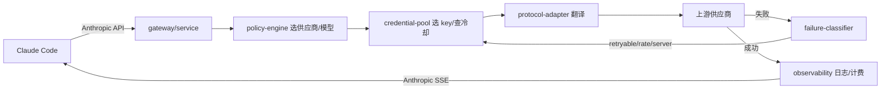

# Rank 79：musistudio/claude-code-router 源码级调研报告

## 1. 项目概述与定位

- **项目名称**：claude-code-router（CCR，GitHub: https://github.com/musistudio/claude-code-router ）
- **Star 数**：约 37.2k（快照值）
- **主要语言**：TypeScript（Node.js monorepo）
- **一句话定位**：面向编码 Agent 的本地模型网关/控制平面——通过劫持 Claude Code 的 `ANTHROPIC_BASE_URL`，把 Anthropic Messages API 请求拦截、翻译、按策略路由到任意供应商（OpenAI/DeepSeek/Gemini/Ollama/OpenRouter 等），并做故障转移、账户轮换、用量与计费观测。
- **目标用户/场景**：想在 Claude Code 里混用多家模型/多把 key、做成本与限流控制、需要故障自动切换的个人与团队开发者。
- **项目成熟度**：高且快速演进。本次分析基线 v3.0.22（npm dist-tag 最新），已从早期单一 Fastify 代理演进为 `packages/core`（193 个 TS 文件）+ cli + electron 桌面 + ui 的多包架构，并自带桌面 GUI。

> **定性说明**：CCR **不是一个 Agent**——它不做任务规划、不持有对话记忆、不生成答案。它是 Agent（Claude Code）与模型供应商之间的**中间层网关（LLM gateway / control plane）**。它对 openmate 的价值在于：当 openmate 未来要做多模型接入、成本控制、故障转移时，CCR 的网关层设计是极好的参考。第 8 章"自我进化"中，模型层学习不适用，但 CCR 有"按用量/失败自动调整路由"的运营反馈闭环。

## 2. 源码结构总览（源码确认 @3.0.22）

```
packages/
├── core/                     # 核心网关（193 个 .ts，本次重点）
│   └── src/
│       ├── entrypoints/server.ts      # 服务入口
│       ├── gateway/                   # 网关服务
│       │   ├── service.ts             # 主服务
│       │   ├── claude-code-router-plugin.ts
│       │   ├── limits/window-limiter.ts   # 窗口限流
│       │   ├── runtime-change.ts / runtime-config-control.ts
│       │   ├── model-catalog.ts / context-archive.ts
│       │   └── existing-gateway-probe.ts
│       ├── routing/                   # ★ 路由/协议翻译
│       │   ├── policy-engine.ts       # 策略引擎
│       │   ├── config-compiler.ts     # 配置编译
│       │   ├── execution-plan.ts
│       │   ├── model-resolution.ts / model-registry.ts
│       │   ├── protocol-adapter.ts / protocol-endpoints.ts  # ★ Anthropic↔OpenAI 翻译
│       │   ├── failure-classifier.ts   # ★ 失败分类（本次读）
│       │   ├── rewrite.ts
│       │   └── route-script-runtime.ts / worker.ts
│       ├── providers/                # ★ 供应商/账户/凭据
│       │   ├── credential-pool.ts     # ★ 凭据池（本次读）
│       │   ├── account-service.ts / account-webcontent.ts
│       │   ├── oauth-plugin.ts / probe.ts / runtime-topology.ts
│       │   └── new-api.ts / openrouter-provider-catalog.ts
│       ├── observability/             # ★ 可观测/日志
│       │   ├── request-log-*.ts        # 请求日志（store/worker/limits/admission）
│       │   ├── route-trace.ts / raw-trace-sync.ts / sensitive-headers.ts
│       ├── profiles/                  # 模型 profile / 白名单 / 启动
│       ├── mcp/                       # 内置 MCP（toolhub/fusion/media/browser-search）
│       ├── proxy/                    # 系统代理/证书/undici agent
│       └── storage/migration.ts, sqlite-native.ts
├── cli/                       # @ccr/cli（ccr 命令）
├── electron/                  # 桌面壳
└── ui/                        # 管理 UI（web-client-bridge）
```

**核心源码文件（源码确认，本次阅读）**：`packages/core/src/routing/failure-classifier.ts`、`packages/core/src/providers/credential-pool.ts`。其余路径来自 jsDelivr 扁平清单。

**入口/启动流程**：`packages/core/src/entrypoints/server.ts` 起本地 Fastify 服务（默认 `127.0.0.1:3456`）；`packages/cli/src/cli.ts` 提供 `ccr code/start` 等命令；Claude Code 经 `ANTHROPIC_BASE_URL` 指向本地服务。

**代码规模**：`packages/core` 单包 193 个 TS 文件，加 cli/electron/ui 共约 256 个 TS 文件，属中大型 TypeScript 工程。

## 3. 系统架构分析

**编排模式（源码确认：非 Agent 编排）**：CCR 自身是**请求代理/路由层**，不做 LLM 推理编排。其内部"编排"是把一次上游请求编译为**执行计划（execution plan）**：按 `routing/execution-plan.ts`、`policy-engine.ts` 选定逻辑供应商 → 凭据 → 具体端点 → 协议翻译。

**核心组件划分（源码确认）**：
- **protocol-adapter / endpoints（`routing/`）**：把 Anthropic Messages 请求 schema 翻译成 OpenAI/DeepSeek/Gemini 等格式，再把响应（含流式 chunk、tool-use、reasoning token）翻译回 Anthropic 流式格式。
- **policy-engine / model-resolution**：按配置（background/reasoning/long-context 等场景）把请求路由到不同供应商/模型。
- **providers/credential-pool + account-service**：管理同一供应商下多把 key/账户的选择、限流与冷却。
- **gateway/service**：主服务，串起接收→翻译→路由→重试→回退→日志。
- **observability/**：全量请求日志、路由 trace、敏感头脱敏、原始 trace 同步。

**数据流**：Claude Code → `ANTHROPIC_BASE_URL=http://127.0.0.1:3456` → server 接收 Anthropic Messages 请求 → `config-compiler`/`policy-engine` 选供应商+凭据 → `protocol-adapter` 翻译 → 转发上游 → 上游返回 → 失败时按 `failure-classifier` 判定是否切换凭据/供应商 → 成功则记用量/清冷却 → 流式翻译回 Anthropic SSE → Claude Code。

**关键函数（源码确认）**：
- `classifyRouteFailure(statusCode, mode): {failureClass, shouldFallback}`（`routing/failure-classifier.ts`）。
- `recordProviderCredentialOutcome(...)` / `readProviderCredentialCooldown(...)` / `providerCredentialLimitState(...)`（`providers/credential-pool.ts`）。



## 4. 功能拆解

- **协议翻译（源码确认）**：`routing/protocol-adapter.ts` + `protocol-endpoints.ts` 承担 Anthropic↔OpenAI/DeepSeek/Gemini 双向 schema 与流式格式转换，处理 tool-use schema、reasoning token 差异。
- **场景化路由（源码确认）**：`routing/policy-engine.ts`、`execution-plan.ts`、`rewrite.ts` 按请求场景（后台/推理/长上下文）路由到不同模型。
- **账户/凭据轮换（源码确认）**：`providers/credential-pool.ts` + `account-service.ts` 管理多 key，`oauth-plugin.ts` 支持 OAuth 类供应商。
- **限流与配额（源码确认）**：`gateway/limits/window-limiter.ts` 的 `readWindowCounter`/`limitRules` 做按窗口计数；`usage/normalization.ts`、`usage/store.ts`、`usage/billing-sync.ts` 做用量归一与计费同步。
- **可观测（源码确认）**：`observability/request-log-*`（store/worker/limits/admission）+ `route-trace.ts` + `sensitive-headers.ts`（脱敏）。
- **内置 MCP（源码确认）**：`mcp/toolhub-mcp.ts`、`mcp/fusion-*-mcp.ts`、`mcp/browser-web-search-proxy-mcp.ts` 等把能力以 MCP 形式暴露。
- **桌面管理端（源码确认）**：`packages/electron` + `ui/web-client-bridge.ts`，远程控制服务 `gateway/remote-control-service.ts`、`runtime-change.ts`。
- **系统代理/证书（源码确认）**：`proxy/certificates.ts`、`system-proxy.ts`、`undici-proxy-agent.ts`。

## 5. 技术亮点与优势

1. **故障分类驱动的智能回退（源码确认）**：`classifyStatus` 把错误精确分为 `rate-limit(429) / retryable(408,409) / server(5xx) / client(其他)`，并区分 fallback 模式——`model-chain` 模式下 ≥400 即链上下一个，其余模式只对可重试类回退。避免把 400 参数错误无谓重试。
2. **凭据级滑动窗口限流 + 冷却（源码确认）**：`credential-pool` 为每把 key 维护窗口计数器（`windowStart = floor(now/windowMs)*windowMs` 的定窗计数），超阈值 `blocked`；遇 401/403/429/5xx 给该 key 打 60s 冷却，成功则清零冷却——实现"坏 key 自动临时剔除、好 key 正常计入配额"。
3. **协议适配与路由解耦（源码确认）**：`protocol-adapter`（格式）与 `policy-engine`（选路）分离，新增供应商=加一个 adapter + 一条策略。
4. **全链路可观测 + 敏感信息脱敏（源码确认）**：`request-log-*` 流水线 + `sensitive-headers.ts`，日志不泄漏 key。
5. **本地优先 + 桌面 GUI**：监听 127.0.0.1，同时提供 electron 管理端与 remote-control。

## 6. 稳定性机制【重点】

- **错误分类与是否重试/回退（源码确认，`failure-classifier.ts`）**：
  - `429 → rate-limit`；`408/409 → retryable`；`>=500 → server`；其余 `client`。
  - `model-chain` 模式：`statusCode >= 400` 即触发 fallback；其他模式仅 `retryable/rate-limit/server` 触发。即 400/401/403 这类客户端错误不盲目换供应商重试。
- **凭据冷却（源码确认，`credential-pool.ts`）**：`providerCredentialCooldownMs = 60_000`，对 401/403/429/5xx 的凭据 `setProviderCredentialCooldown`，冷却期内 `readProviderCredentialCooldown` 返回 until 时间；成功响应（2xx–4xx 且非 401/403/429）才 `clearProviderCredentialCooldown` 并累计用量。
- **配额硬限制（源码确认）**：`providerCredentialLimitState` 用定窗计数器 `counter.value + requested > limit` 判定 `blocked`，请求被拒绝而非打满上游。
- **边界处理（源码确认）**：`recordProviderCredentialOutcome` 对缺 `logicalProvider/credentialChain`、找不到 provider/credential 均 early-return，不抛错；`readProviderCredentialCooldown` 过期即从 map 删除（防内存泄漏）。
- **协议/上游探活（源码确认）**：`providers/probe.ts`、`gateway/existing-gateway-probe.ts` 探测已有网关与供应商可用性。
- **存储迁移（源码确认）**：`storage/migration.ts` + `sqlite-native.ts`，配置/日志持久化带迁移。

## 7. 高可用机制【重点】

- **故障转移/多供应商（源码确认）**：失败分类 + 凭据冷却 + 策略引擎共同构成"主供应商/主 key 失败 → 自动切下一个"的容错链；`model-chain` fallback 模式即串行尝试模型链。
- **账户池轮换（源码确认）**：`providers/account-service.ts` + `credential-pool` 的多凭据并行维护，单 key 限流/封禁不影响整体服务。
- **并发/异步（源码确认）**：Node.js 事件循环 + undici（`undici-proxy-agent.ts`）做 HTTP 连接；`observability/request-log-worker.ts` 把日志落盘异步化，不阻塞主请求路径。
- **无状态/可重启（源码确认）**：配置与用量存 SQLite（`storage/sqlite-native.ts`），进程重启后配额与日志可恢复；`runtime-change.ts`/`runtime-config-control.ts` 支持运行时热改路由配置。
- **系统代理与证书（源码确认）**：`proxy/system-proxy.ts`、`certificates.ts` 处理企业网络/自签证书环境，提升在受限网络下的可达性。
- **可观测性（源码确认）**：`route-trace.ts`、`raw-trace-sync.ts`、`request-log-admission-store.ts` 提供每次请求的路由 trace 与受控留存。

## 8. 自我进化机制【重点】

- **模型智能层进化不适用**：CCR 不改模型权重、不做推理反思。
- **基于真实成败的路由自调（源码确认，运营反馈闭环）**：`recordProviderCredentialOutcome` 把每次上游成败回流为两类状态——(1) 配额计数器、(2) 凭据冷却。系统据此自动"避开刚失败的 key/供应商、把流量导向健康凭据"。这是一种**基于失败信号的在线路由自适应**，虽不是学习，但效果上是"路由策略自进化"。
- **模型目录自动刷新（源码确认）**：`providers/model-auto-refresh.ts`、`models/catalog-file.ts` 定期刷新供应商可用模型清单，无需手动维护。
- **配置即代码**：路由策略写在配置里，用户可依据日志迭代策略，而非模型自己学。

## 9. openmate 可借鉴点【重点】

- **P0｜错误分类器：先分类再决定是否重试/回退**：openmate 调用 LLM/工具时，不要对所有异常一刀切重试。按状态码/错误类型分 `rate-limit/retryable/server/client`，仅对可重试类做回退或换供应商，客户端错误直接上抛。预期：省成本、避免把 400 当限流瞎重试。
- **P0｜凭据/账户池 + 定窗限流 + 失败冷却**：openmate 多模型 key 接入时，为每个 key 维护"滑动窗口计数 + 失败 N 秒冷却"；单 key 429/401 时临时摘除、冷却后再用。预期：多 key 高可用、不被单 key 限流拖垮。
- **P0｜协议适配与选路解耦**：openmate 接入新模型时，把"格式翻译（request/response/流式）"和"选哪个模型"拆成两层。预期：新增供应商改动小、可测试。
- **P1｜异步日志 worker + 敏感头脱敏**：请求日志用独立 worker 落盘、主路径不阻塞；落盘前 `sensitive-headers` 去掉 Authorization/api key。预期：可观测且不泄漏密钥。
- **P1｜运行时热改路由（runtime-change）**：openmate 支持不重启调整"哪个场景走哪个模型"。预期：线上调优不停服。
- **P2｜模型目录自动刷新**：定期拉供应商可用模型清单并缓存。预期：新模型上线即可用。

## 10. 源码验证标注

**源码直接阅读（jsDelivr @3.0.22）**：
- `packages/core/src/routing/failure-classifier.ts`（全文 222 字符）：`RouteFailureClass` 四类、`classifyStatus` 状态码映射、`classifyRouteFailure` 的 model-chain vs 其他模式判定。
- `packages/core/src/providers/credential-pool.ts`（全文 1277 字符）：`providerCredentialCooldownMs=60000`、定窗计数 `readWindowCounter`、`recordProviderCredentialOutcome` 的成功/失败分支、`providerCredentialLimitState` 配额判定、cooldown 增删清。
- jsDelivr 扁平清单：确认 `routing/`、`providers/`、`observability/`、`gateway/`、`mcp/`、`proxy/`、`storage/` 等目录与关键文件名存在。

**来自文档/推断**：
- "本地 Fastify 监听 127.0.0.1:3456、劫持 ANTHROPIC_BASE_URL、命名 transformer 管道"来自 architecture_notes 与项目常识；本次未逐行读 `entrypoints/server.ts` 与 `protocol-adapter.ts` 的翻译细节。
- electron/ui 桌面端、remote-control-service 的具体交互未读源码。

**源码不可得部分**：`protocol-adapter.ts` 的具体 schema 映射表、`policy-engine.ts` 的策略求值细节、`route-script-runtime` 的脚本沙箱未逐行展开；如需 openmate 复刻协议翻译层，建议进一步精读这三个文件。
