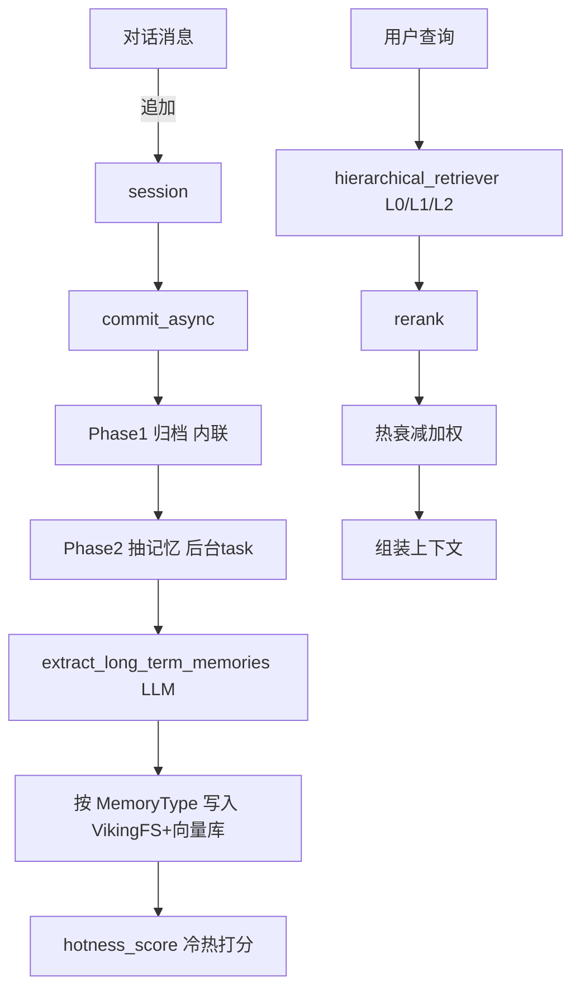

# Rank 80：volcengine/OpenViking 源码级调研报告

## 1. 项目概述与定位

- **项目名称**：OpenViking（GitHub: https://github.com/volcengine/OpenViking ）
- **Star 数**：约 36.9k（快照值）
- **主要语言**：Python
- **一句话定位**：火山引擎开源的 **Agent 上下文/记忆数据库**——统一管理 Memory、Resource、Skill 三类上下文，以"目录结构 + 语义检索 + 渐进式加载（L0/L1/L2）"组织，并内置"session.commit 后自动抽取/更新长期记忆"的自迭代闭环。
- **目标用户/场景**：需要给 agent 一个可持久、可检索、会自我维护的长期记忆与上下文层的开发者；配套 `bot/`（VikingBot）作为参考实现。
- **项目成熟度**：高。AGPL-3.0（Copyright 2026 Beijing Volcano Engine），语义化版本到 0.4.x，`tests/` 覆盖单元/集成/事务/向量库压测/eval（ragas），工程化程度高。

> **定性说明**：OpenViking **不是一个自主 Agent**，而是 Agent 的"**记忆/上下文底座**"——它被 Agent 调用（提供 AGFS URI 接口 + MCP），自身不做任务规划。它对 openmate 的价值极高：openmate 规划桌面/手机多端、需要长期记忆时，OpenViking 的"两层存储 + 两阶段 commit + 记忆生命周期 + 事务 redo-log"是直接可借鉴的范式。第 8 章"自我进化机制"正是 OpenViking 的核心卖点，将重点展开。

## 2. 源码结构总览（源码确认 @main）

```
openviking/
├── client.py / async_client.py / session.py / agfs_manager.py   # 对外 SDK
├── core/                  # context / directories / building_tree / mcp_converter / skill_loader
├── session/               # ★ 会话与记忆自迭代
│   ├── session.py / compressor.py / compressor_v3.py
│   ├── memory_extractor.py / memory_archiver.py / memory_deduplicator.py
│   └── memory/ (memory_type_registry.py)
├── service/               # ★ 服务层
│   ├── session_service.py       # ★ create/commit/extract/auto-commit（本次读）
│   ├── resource_service.py / search_service.py / fs_service.py
│   ├── pack_service.py / relation_service.py / task_tracker.py
├── retrieve/              # ★ 检索
│   ├── hierarchical_retriever.py  # L0/L1/L2 层级检索 + rerank
│   ├── intent_analyzer.py
│   └── memory_lifecycle.py        # ★ 冷热记忆热衰减打分（本次读）
├── storage/               # 双层存储
│   ├── viking_fs.py          # VikingFS / AGFS URI 抽象
│   ├── vikingdb_manager.py   # 向量库后端
│   ├── local_fs.py / collection_schemas.py
├── resource/              # 资源接入与 watch
│   ├── watch_manager.py / watch_scheduler.py
├── parse/                # 文档解析（pdf/html/code/url）
├── server/               # FastAPI 服务（auth/api_keys/identity/telemetry）
├── telemetry/            # 执行/操作/请求级遥测
└── utils/                # embedding/rerank/summarizer/process_lock
openviking_cli/           # CLI（http client / rust_cli / rerank / uri）
bot/vikingbot/            # VikingBot 参考实现
tests/                    # 单元+集成+事务+向量库压测+eval
```

**核心源码文件（源码确认，本次阅读）**：
- `openviking/service/session_service.py`（commit/create/extract/auto-commit）
- `openviking/retrieve/memory_lifecycle.py`（全文，热衰减打分）
- 目录结构来自 jsDelivr 扁平清单（1612 文件）。

**入口**：`openviking/server/app.py`（FastAPI）+ `openviking_cli/server_bootstrap.py`；SDK 经 `client.py`/`async_client.py` 调用。

**代码规模**：`openviking/` 下约 90+ Python 模块，`tests/` 下 100+ 测试文件，中大型 Python 工程。

## 3. 系统架构分析

**编排模式（源码确认：非 Agent 编排，是记忆/上下文存储与检索层）**：OpenViking 不做 LLM 任务循环，其"编排"发生在**会话 commit 流水线**与**层级检索**两处。

**核心组件划分（源码确认）**：
- **存储双层（`storage/`）**：`VikingFS`（AGFS URI 抽象层，映射内容与目录结构）+ `VikingDBManager`（向量索引后端，`viking_vector_index_backend.py`）。
- **会话服务（`service/session_service.py`）**：`SessionService` 管理 `session/create/add_message/commit/extract/delete`。
- **会话对象（`session/session.py` + compressor）**：`Session` 持有 messages，`SessionCompressorV3` 负责归档与长期记忆抽取。
- **检索（`retrieve/`）**：`hierarchical_retriever` 做 L0/L1/L2 渐进式召回 + rerank；`intent_analyzer` 分析检索意图；`memory_lifecycle` 做冷热记忆打分。
- **资源接入（`resource/` + `parse/`）**：watch 文件变化（`watch_scheduler`）、目录扫描、pdf/html/code 解析。

**数据流（commit 自迭代闭环，源码确认）**：
1. 对话进行中，消息追加到 session。
2. 触发 `session.commit`（手动 / auto-commit 阈值）。
3. `commit_async`：**Phase 1 归档内联执行**（把消息打包到 `archive_uri`）；**Phase 2 记忆抽取在后台 task 跑**，返回 `task_id` 供轮询（`get_commit_task`）。
4. `SessionCompressorV3.extract_long_term_memories(...)` 调用 LLM 从归档中抽取长期记忆，按 `MemoryTypeRegistry` 的记忆类型（User/Agent profile、preferences、identity、soul、events 等）写入。
5. 检索时 `hierarchical_retriever` 按 L0/L1/L2 召回 + rerank + 热衰减加权。

**关键类/函数（源码确认）**：
- `SessionService.commit_async` / `maybe_schedule_auto_commit` / `run_auto_commit`。
- `hotness_score(active_count, updated_at, half_life_days=7.0)`（`retrieve/memory_lifecycle.py`）。
- `AutoCommitPolicy`、`MemoryPolicy.from_dict(...).validate_memory_types(...)`、`MemoryTypeRegistry`。



## 4. 功能拆解

- **三类上下文统一（源码确认）**：Memory（长期记忆）、Resource（文档/数据源）、Skill（技能），都挂在 AGFS 目录树下。
- **AGFS URI 抽象（源码确认）**：`storage/viking_fs.py` + `pyagfs/` 把"内容 + 索引"映射为 URI，MCP converter（`core/mcp_converter.py`）对外暴露 MCP。
- **两阶段 commit（源码确认）**：归档同步、记忆抽取异步，前台不阻塞。
- **自动提交策略（源码确认）**：`service/session_auto_commit.py` 提供 token 阈值、消息数阈值、idle 超时、最小提交间隔、`next_check_at` 下次检查点。
- **层级检索 + rerank（源码确认）**：`hierarchical_retriever`（L0/L1/L2 渐进式加载）、`openviking_cli/utils/rerank*.py`。
- **资源 watch（源码确认）**：`resource/watch_manager.py`/`watch_scheduler.py`，源变化自动重索引（有 `test_watch_recovery`）。
- **多租户/鉴权（源码确认）**：`server/auth.py`、`api_keys.py`、`identity.py`（RequestContext 含 account_id/user_id）。
- **遥测（源码确认）**：`telemetry/`（execution/operation/request/runtime/snapshot），`server/telemetry.py`。
- **eval（源码确认）**：`tests/eval/test_ragas_*.py`，RAGAS 评估。

## 5. 技术亮点与优势

1. **两阶段 commit：归档同步、记忆抽取异步（源码确认）**：`commit_async` docstring 明确"Phase 1 archive always runs inline; Phase 2 memory extraction runs in a background task, returning task_id for polling"。用户提交即返回，昂贵的 LLM 记忆抽取在后台。
2. **冷热记忆生命周期打分（源码确认）**：`hotness_score = sigmoid(log1p(active_count)) * exp(-ln2/7d * age_days)`——访问频次经 sigmoid 饱和、新鲜度按半衰期 7 天指数衰减，再与语义相似度混合提升检索。纯函数、可单测、可注入 `now`。
3. **记忆类型注册表 + 策略校验（源码确认）**：`MemoryTypeRegistry().list_names()` 与 `MemoryPolicy.validate_memory_types(...)`，非法记忆类型在建策略时即报错，避免脏类型。
4. **防重复自动提交的 in-flight 守卫（源码确认）**：`_auto_commit_inflight: set` + `asyncio.Lock`，并持有 task 强引用防 GC——"bursts don't spawn duplicate commit tasks"。
5. **事务/redo-log 工程（源码确认，测试证据）**：`tests/transaction/` 覆盖 `test_lock_manager`、`test_concurrent_lock`、`test_redo_log`、`test_path_lock`、`test_e2e`；`tests/vectordb/test_crash_recovery.py`、`test_stale_lock.py`。

## 6. 稳定性机制【重点】

- **commit 两阶段隔离（源码确认）**：归档（确定性 IO）同步、记忆抽取（LLM 调用、易失败）异步后台——即使记忆抽取失败，归档已完成，不影响对话继续。
- **自动提交幂等与去重（源码确认）**：`maybe_schedule_auto_commit` 用 `(account_id, user_id, session_id)` 作为 claim 放入 `_auto_commit_inflight` set 加 `asyncio.Lock` 防并发重复；`run_auto_commit` finally 释放 claim；且"misses are acceptable，下次消息写入或 idle scan 自然重触发"，不做硬轮询。
- **后台任务防 GC（源码确认）**：`_auto_commit_tasks: set[asyncio.Task]` 强引用，"so spawned tasks aren't GC'd mid-await"。
- **指标上报绝不影响主流程（源码确认）**：`_record_lifecycle_metric` / `_record_archive_metric` 均 `try/except` 包裹，注释 "Best-effort ... should never break the main flow"，失败仅 debug 日志。
- **未初始化守卫（源码确认）**：`_ensure_initialized` 在 `viking_fs` 缺失时抛 `NotInitializedError("VikingFS")`，依赖缺失尽早暴露。
- **并发锁与崩溃恢复（源码确认，测试证据）**：`tests/transaction/test_concurrent_lock.py`、`test_redo_log.py`、`tests/vectordb/test_crash_recovery.py`、`tests/storage/test_stale_lock.py`——有 redo-log、路径锁、stale lock 清理、向量库崩溃恢复。
- **配置校验（源码确认）**：`AutoCommitPolicy.from_dict`、`MemoryPolicy.from_dict` + validate；`test_config_validation`。
- **watch 恢复（源码确认）**：`service/test_watch_recovery.py`、`resource/test_watch_manager.py`。

## 7. 高可用机制【重点】

- **异步化关键路径（源码确认）**：记忆抽取、指标、日志均后台化，主请求路径只做确定性 IO；`task_tracker`（`service/task_tracker.py`）+ `get_commit_task(task_id)` 支持异步任务轮询查询。
- **多租户隔离（源码确认）**：`RequestContext`（account_id/user_id）贯穿，任务查询 `get_commit_task` 带 `account_id, user_id` 过滤，用户只能看自己的任务。
- **可恢复的后台调度（源码确认）**：自动提交不依赖进程内常驻状态——`next_check_at`、idle scan 由 AGFS 扫描驱动（`viking_fs` property 供 idle scheduler 扫描），进程重启后仍可继续。
- **存储后端可替换（源码确认）**：`storage/local_fs.py` 与 `viking_fs.py`、`vikingdb_manager.py` 分层，`tests/vectordb/mock_backend.py` 表明后端可 mock/替换；AGFS 可接 S3（`tests/agfs/test_fs_binding_s3.py`）。
- **可观测性（源码确认）**：`telemetry/` 分层（runtime/request/operation/execution/snapshot）+ metrics datasource（`SessionLifecycleDataSource`）。
- **限流/资源（源码确认，推断）**：自动提交有 `get_min_commit_interval_seconds`、token/message 阈值，避免频繁昂贵抽取。

## 8. 自我进化机制【重点】

- **★ 提交即记忆自迭代闭环（源码确认）**：`session.commit` 后，`SessionCompressorV3.extract_long_term_memories(messages, user, session_id, ctx, archive_uri, agent_evolution_enabled=...)` 用 LLM 从对话中抽取长期记忆，写入 User/Agent 的 profile、preferences、identity、soul、events 等类型——**这是 OpenViking 最核心的"自我进化"**：每轮对话结束自动沉淀对用户/对 agent 自身的认知。
- **★ 按账户开关的"Agent Evolution"（源码确认）**：`AgentEvolutionConfig().enabled` 全局开关 + `AgentEvolutionConfigProvider` 按 account 覆盖（`get_agent_evolution_enabled(account_id)`），即记忆自迭代可逐租户启停。
- **★ 记忆冷热生命周期（源码确认）**：`hotness_score` 综合访问频次（sigmoid(log1p(active_count))）与新鲜度（半衰期 7 天指数衰减），混合语义相似度——高频、近期访问的记忆在检索中被加权，冷门记忆自然降权，实现"记忆遗忘/强化"。
- **记忆去重与归档（源码确认）**：`session/memory_deduplicator.py`、`memory_archiver.py`——新抽取的记忆与既有记忆去重、历史归档，避免记忆膨胀与重复。
- **检索意图分析（源码确认）**：`retrieve/intent_analyzer.py` 分析查询意图，选择检索策略，是对"如何取上下文"的自适应。
- **评估回路（源码确认）**：`tests/eval/test_ragas_*.py` 用 RAGAS 评估检索质量，支持离线迭代抽取/检索策略。
- **工具/Skill 进化（源码确认）**：`core/skill_loader.py`、`utils/skill_processor.py` 把技能作为可加载上下文，新能力靠挂载 skill 而非在线学权重。

## 9. openmate 可借鉴点【重点】

- **P0｜两阶段 commit：归档同步、记忆抽取异步 + task_id 轮询**：openmate 的"保存会话/沉淀记忆"应拆成：(1) 同步把消息落盘归档（快、不阻塞）；(2) 后台 LLM 抽取长期记忆，立即返回 task_id 让前端轮询。预期：保存快、长会话不卡 UI、记忆抽取失败不丢对话。
- **P0｜记忆冷热打分 = 频次 sigmoid × 时间指数衰减**：openmate 长期记忆检索时，给每条记忆算 `score = sigmoid(log1p(访问次数)) * exp(-ln2/半衰期*天数)`，与向量相似度混合。预期：高频/近期记忆优先、陈旧记忆自然淡化，无需手写复杂遗忘策略。
- **P0｜记忆类型注册表 + 建策略时校验类型**：openmate 定义 User profile/preferences/identity、Agent soul 等记忆类型，建用户记忆策略时校验只允许合法类型。预期：记忆结构规整、不会抽出垃圾类型。
- **P1｜自动提交的 in-flight 守卫 + 强引用 task + "错过可接受，自然重触发"**：openmate 自动沉淀记忆时用 (user, session) 做去重锁、持有 task 强引用、不做硬轮询，靠下次消息/idle 扫描自然补触发。预期：不重复抽取、进程重启可续、不占额外调度线程。
- **P1｜best-effort 指标 try/except 包裹，绝不影响主流程**：openmate 的埋点/遥测全部 try/except，失败只记日志。预期：观测系统故障不会拖垮主对话。
- **P1｜事务 redo-log + 并发路径锁 + stale lock 清理**：openmate 写记忆/向量库时用 redo-log 与路径锁，启动时清理 stale lock。预期：崩溃后可恢复、并发写不 corrupt。
- **P2｜多租户 RequestContext 贯穿，任务按 account/user 过滤**：openmate 未来多端/多用户时，所有任务与记忆查询都带用户域，只返回自己的数据。预期：数据隔离安全。

## 10. 源码验证标注

**源码直接阅读（jsDelivr / raw @main）**：
- `openviking/retrieve/memory_lifecycle.py`（全文 522 字符）：`hotness_score` 公式、`DEFAULT_HALF_LIFE_DAYS=7.0`、sigmoid(log1p) 与指数衰减实现。
- `openviking/service/session_service.py`（snippet）：`SessionService`、`commit_async` 两阶段注释、`maybe_schedule_auto_commit`/`run_auto_commit`、`_auto_commit_inflight` 锁与 task 强引用、`_record_*_metric` best-effort 包裹、`MemoryPolicy.validate_memory_types`、`AgentEvolutionConfigProvider` 按账户开关。
- jsDelivr 扁平清单：确认 `session/`、`retrieve/`、`storage/`、`transaction/`（测试）、`service/`、`telemetry/` 等目录与关键文件名。

**来自文档/推断**：
- "L0/L1/L2 三级渐进式加载、VikingFS 双层存储、向量召回 + Rerank 两阶段"依据 architecture_notes 与文件名（`hierarchical_retriever.py`、`viking_fs.py`、`vikingdb_manager.py`、`rerank*.py`）推断，未逐行读检索算法。
- `bot/vikingbot/` 参考实现、`mcp_converter` 的具体协议未读。
- `session/memory_extractor.py` 经 raw/cdn 两次均 link dead（可能已重构到 `session/memory/` 目录），其内部抽取 prompt 与字段映射未直接读到，仅从 `session_service.extract()` 调用 `SessionCompressorV3.extract_long_term_memories` 确认入口。

**源码不可得部分**：`SessionCompressorV3` 的抽取 prompt 与记忆合并/更新具体规则、`hierarchical_retriever` 的 L0/L1/L2 切分阈值、`transaction/redo_log` 的具体 WAL 格式未逐行展开；如需 openmate 复刻记忆合并逻辑，建议进一步读 `openviking/session/compressor_v3.py` 与 `openviking/session/memory/` 目录。
