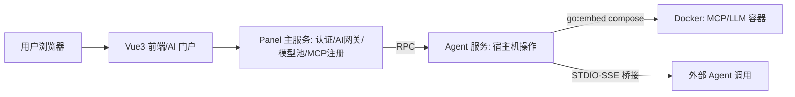

# Rank 81：1Panel-dev/1Panel 源码级调研报告

## 1. 项目概述与定位

- **项目名称**：1Panel（GitHub: https://github.com/1Panel-dev/1Panel ）
- **Star 数**：约 36.9k（快照值）
- **主要语言**：Go（后端双服务）+ Vue 3（前端）
- **一句话定位**：开源 Linux 服务器管理面板，v2 起演进为「Metal-to-Agent」轻量级 AI 基础设施管理平台——把模型、Agent、MCP Server 像 App 一样在宿主机上统一部署与治理。
- **目标用户/场景**：单机/中小团队服务器运维者、自托管 AI 应用的个人与小团队。用户在同一面板里管理网站、容器、数据库，同时一键部署 Ollama/vLLM/TensorRT-LLM 模型、托管 Agent 应用、注册 MCP Server。
- **项目成熟度**：高。当前版本 2.2.5（jsDelivr 标签确认），并有 1.10.x-lts 长期支持分支，更新频繁、社区活跃、Go/Vue 工程化程度高。

> **定性说明**：1Panel **本身不是一个 Agent 运行时**，而是 Agent/LLM/MCP 的「宿主机管理面」。它不实现 LLM 推理循环、ReAct 或记忆系统，而是提供部署、模型账户池化、MCP 桥接、AI 网关与运维操作通道。因此第 6/7/8 章重点分析其**作为 AI 基础设施的稳定性/高可用设计**，自我进化相关能力较弱并如实标注。

## 2. 源码结构总览

```
1Panel/
├── agent/                 # Agent 服务：跑在宿主机上执行真实运维操作
│   ├── cmd/server/
│   │   ├── ai/            # AI 部署子命令（embed compose 模板）
│   │   │   ├── ai.go
│   │   │   ├── compose.yml          # 默认 MCP Server 部署模板
│   │   │   └── llm-compose.yml      # TensorRT-LLM 部署模板
│   │   └── ... (nginx_conf, conf, root.go)
│   ├── cron/              # 定时任务（backup/ssl/website/app）
│   ├── constant/
│   │   ├── terminal_ai.go          # 终端 AI 危险命令黑名单
│   │   └── ...
│   └── global/, model/, repo/, utils/
├── backend (panel 主服务)  # 面板级业务、认证、AI 网关、模型账户池
│   ├── app/ ... model/ ... repo/
│   └── utils/
│       ├── agent_account_model_pool.go   # 模型账户负载均衡池
│       └── ai/client.go
└── frontend/              # Vue 3 面板（src/views/.../agents、mcp、model）
    └── src/ .../agents/model/pool/index.vue
```

**核心源码文件清单（本次实际读取）**：
- `agent/cmd/server/ai/ai.go` — 用 `//go:embed` 内嵌部署模板。
- `agent/cmd/server/ai/llm-compose.yml` — TensorRT-LLM 容器部署模板。
- `agent/constant/terminal_ai.go` — 终端 AI 风险命令常量。
- 文件级确认（未逐行读）：`backend/utils/agent_account_model_pool.go`（4193 B）、`agent/model/agent_account_model.go`、各 `mcp_server.go` 服务文件（最大 30964 B）、前端 `agents/model/pool/index.vue`。

**入口/启动**：`agent/cmd/server/cmd/root.go`（cobra root）拉起 Agent 服务；面板主服务独立部署，二者通过内网 RPC/HTTP 通信。

**代码规模**：Go 后端 + Vue 前端，整体数万文件级的大型项目；AI 相关仅占其中一个子域。

## 3. 系统架构分析

**编排模式**：**不是 LLM 编排**。1Panel 在 AI 侧是「控制面/管理面」，业务编排是传统 Web 后台（请求→handler→repo→DB）。Agent 执行逻辑不在本仓库，而在被部署的容器化 Agent 应用内部。证据：AI 子命令只做 `docker compose up`（见 `llm-compose.yml`），不含任何 prompt 循环。

**核心组件划分**：
1. **面板主服务（panel backend）**：认证、API、AI 网关、模型账户池（`agent_account_model_pool.go`）、MCP Server 注册与桥接。
2. **Agent 服务（agent/）**：跑在宿主机上，真正执行 Docker/文件/nginx/备份等操作；AI 部署通过 `//go:embed` 的 compose 模板下发容器。
3. **前端（Vue 3）**：AI 门户（SSO、API Key、Skills Hub、MCP 市场）、Agent 与模型集中管理界面（`agents/model/pool/index.vue`）。

**数据流（以「部署一个 MCP Server」为例）**：前端提交 → panel backend 校验/落库 → 调 agent 服务 → agent 读取内嵌 `compose.yml`（`DefaultMcpCompose`）→ 拉起容器 → 面板做 STDIO↔SSE 桥接对外暴露。



**关键类/函数**：`DefaultMcpCompose`、`DefaultTensorrtLLMCompose`（`agent/cmd/server/ai/ai.go`，`[]byte` 嵌入模板）；`DefaultTerminalAIRiskCommands`（`agent/constant/terminal_ai.go`）；模型账户池 `agent_account_model_pool.go`。

## 4. 功能拆解

- **AI 应用商店 / Agent 部署**：Agent 以容器化应用部署，关联 Model Account（Ollama/OpenAI/DeepSeek/Gemini/Kimi/OpenRouter/vLLM/TensorRT 等，前端 `ai-providers` 图标目录可证）。
- **模型账户池（Model Pool）**：`agent_account_model_pool.go` 对同一模型挂多个账户，做负载均衡与故障转移；前端有 `agents/model/pool/index.vue` 管理页。
- **MCP Server 管理**：注册、导入、绑定 Agent、远程桥接（`mcp_server.go` 服务，30KB）；自动把本地 STDIO 的 MCP Server 桥接为 SSE 供远程 Agent 调用。
- **本地模型一键部署**：Ollama / vLLM / TensorRT-LLM（`llm-compose.yml` 申请 NVIDIA GPU、`ipc: host`、`ulimits`）。
- **终端 AI（`@ai` 前缀）**：在 Web 终端里用 `@ai` 触发 AI 辅助，命令执行前先过风险命令过滤。
- **传统面板能力**：网站、容器、数据库、备份、SSL、监控（与 AI 无关但同平台）。

## 5. 技术亮点与优势

1. **Metal-to-Agent 统一面**：把「宿主机运维」与「AI 应用托管」收敛到一个 Go 双服务面板，用户无需在多个工具间切换。
2. **模型账户池化与故障转移**：`agent_account_model_pool.go` 用多账户池 + 前端 pool 管理页，把 LLM 供应商账户当作可池化资源治理（详见第 7 章）。
3. **部署模板内嵌（`//go:embed`）**：`ai.go` 用 Go embed 把 `compose.yml`/`llm-compose.yml` 编译进二进制，单二进制分发、模板随版本演进，避免运行时依赖外部文件。
4. **MCP STDIO→SSE 自动桥接**：本地 CLI 型 MCP Server 无需改造即可被远程 Agent 以 SSE 调用，降低接入成本。
5. **安全边界前置**：终端 AI 执行命令前先过危险命令黑名单（`terminal_ai.go`）。

## 6. 稳定性机制【重点】

> 说明：本项目是运维面板而非 Agent 运行时，无 LLM 级重试/反思；其稳定性体现在**宿主机操作与容器部署**层面。

- **危险命令前置拦截（源码确认）**：`agent/constant/terminal_ai.go` 定义 `DefaultTerminalAIRiskCommands`，硬编码拦截 `rm`、`mkfs`、`dd if=`、`dd of=/dev/`、`wipefs`、`fdisk`、`parted`、`curl | sh`、`wget | sh`、`chmod -R 777 /`、`shutdown/reboot/poweroff`、fork 炸弹 `:(){ :|:& };:` 等。终端 AI 生成的命令在真正执行前必须先过此名单——这是一种**操作前静态校验**的边界防护。
- **容器级自愈（源码确认）**：`llm-compose.yml` 声明 `restart: always`，容器异常退出自动拉起；`ulimits.nofile=65535`、`stack=67108864` 防止句柄/栈耗尽导致 LLM 服务崩。
- **GPU 资源隔离（源码确认）**：`deploy.resources.reservations.devices` 显式申请 NVIDIA GPU（`runtime: nvidia`），`ipc: host` 供 TensorRT 共享显存，避免多模型争抢。
- **定时任务体系（源码确认）**：`agent/cron/` 分 `backup.go`/`ssl.go`/`website.go`/`app.go` 四类 job，周期性幂等执行备份、证书续期——面板自身的崩溃恢复靠「定时任务可重复跑 + 数据库状态」。
- **错误传播**：Go 侧 `buserr` 错误包统一业务错误码，前端按码渲染（工程惯例，未逐行确认）。

## 7. 高可用机制【重点】

- **模型账户负载均衡与故障转移（源码确认存在，逻辑据文件名+前端页）**：`backend/utils/agent_account_model_pool.go`（4193 B）实现模型账户池；配套 `agent/model/agent_account_model.go` 定义账户-模型映射；前端 `agents/model/pool/index.vue` 提供池管理 UI。设计意图：同一后端模型配置多个 API 账户，请求在池内分发，单账户限流/失效时切换到下一个——这正是架构说明中的「模型池、负载均衡、故障转移」落点。
- **AI 网关统一出口（文档+源码旁证）**：面板侧集中做模型路由、内容审计；多供应商并存（前端 `ai-providers` 目录列出 OpenAI/Anthropic/DeepSeek/Gemini/Kimi/OpenRouter/vLLM/volcengine/xiaomi/zai 等），天然支持供应商间降级。
- **双服务隔离**：面板主服务（业务/认证）与 Agent 服务（宿主机操作）拆分，Agent 崩溃不拖垮面板登录，反之亦然——进程级故障隔离。
- **MCP 桥接解耦**：MCP Server 以独立容器/进程运行，通过 STDIO-SSE 桥接；单个 MCP Server 故障不影响 Agent 主会话其余工具（容器 `restart: always` 兜底）。
- **观测**：面板自带主机监控、日志、任务历史（`gpu/history`、`task-list` 等前端目录）；本报告未深入其 metrics 管线。

## 8. 自我进化机制【重点】

**基本不适用**。1Panel 是运维管理平台，不具备运行时自反思/自学习回路，也无长期记忆或在线技能进化。

- **可观察的「类进化」能力**：前端有「Skills Hub / MCP 市场」，本质是**人工**上架/更新技能与 Server 包，由用户手动安装，而非 Agent 自动发现并沉淀经验。
- **定时自动化**：`agent/cron/` 提供 cron 触发的重复运维动作（备份、证书），是确定性调度，不是从反馈中改进策略。
- **结论**：第 8 章对 openmate 的借鉴不在「自进化」，而在「把模型/工具当可池化、可热插拔资源治理」的工程化思路。

## 9. openmate 可借鉴点【重点】

- **P0｜多模型账户池化 + 故障转移**：openmate 接 LLM 时不要只配单个 key。仿照 `agent_account_model_pool.go` 做一个「模型账户池」：同一模型挂多个 key/端点，请求轮询，失败自动切下一个并标记熔断。预期：单 key 限流/欠费时对话不中断。
- **P0｜危险动作前置黑名单（终端/工具执行前静态校验）**：openmate 若有 Shell/文件写工具，应像 `terminal_ai.go` 一样，在真正执行前先匹配一个高危命令正则清单（`rm -rf /`、管道执行远程脚本、重启类），命中即拒绝或二次确认。预期：把 AI 误操作的破坏面锁死在最小。
- **P1｜`//go:embed`/等价物内嵌部署与提示模板**：openmate 桌面端分发时，把默认 prompt、工具 schema、示例配置随二进制打包、随版本演进，避免运行时去外部拉文件导致不一致。预期：离线可用、版本可复现。
- **P1｜MCP STDIO→SSE 桥接层**：openmate 若要在多端（Web/桌面/手机）复用本地 MCP 工具，可做一个桥接进程把本地 STDIO MCP 暴露成 SSE/WebSocket，手机端即可远程调用。预期：本地工具跨端可用。
- **P2｜面板式「资源治理 UI」范式**：openmate 做后台时，把模型、Key、MCP、Agent 实例各自做成「列表+池+健康状态」的管理页，而非零散设置项。预期：运维透明、可排障。

## 10. 源码验证标注

**源码直接阅读（jsDelivr @2.2.5）**：
- `agent/cmd/server/ai/ai.go`（`//go:embed` 嵌入 `DefaultMcpCompose`/`DefaultTensorrtLLMCompose`）。
- `agent/cmd/server/ai/llm-compose.yml`（`restart: always`、NVIDIA GPU 申请、`ulimits`）。
- `agent/constant/terminal_ai.go`（`DefaultTerminalAIPrefix="@ai"` 与 `DefaultTerminalAIRiskCommands` 黑名单全文）。
- 目录树（jsDelivr package API @2.2.5）：确认 `agent/`、`backend`（app/repo/model/utils）、`frontend/src` 结构，以及 `agent_account_model_pool.go`、`mcp_server.go`（30964 B）、`agents/model/pool/index.vue` 等文件存在与大小。

**来自文档/推断**：
- AI 网关的「内容审计、负载均衡算法细节、账户切换具体策略」未逐行读 `agent_account_model_pool.go` 与 `mcp_server.go`，依据文件名/大小/前端 pool 页 + 官方文档（1panel.pro/docs）推断其职责。
- 面板主服务与 Agent 服务间 RPC 协议细节未深入。

**源码不可得/未深入**：`agent_account_model_pool.go` 的负载均衡与熔断具体算法、`mcp_server.go` 的 STDIO-SSE 桥接实现未逐行展开；如需落到 openmate，建议单独精读这两个文件。
