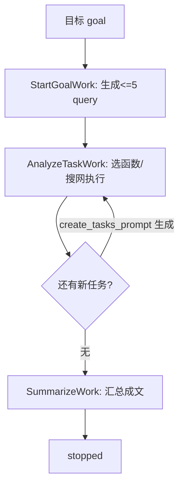

# Rank 82：reworkd/AgentGPT 源码级调研报告

## 1. 项目概述与定位

- **项目名称**：AgentGPT（GitHub: https://github.com/reworkd/AgentGPT ）
- **Star 数**：约 36.3k（快照值）
- **主要语言**：TypeScript（Next.js 前端 `next/`）+ Python（FastAPI 后端 `platform/`）
- **一句话定位**：AutoGPT 浪潮期的浏览器端自主 Agent 平台——给 Agent 起个名、设个目标，它自动拆解任务并迭代执行。
- **目标用户/场景**：想在浏览器里零代码体验"自主 Agent 自动上网搜资料→汇总成文"的普通用户与早期 Agent 概念验证者。
- **项目成熟度**：高知名度但**维护活跃度已明显下降**，当前版本停留在较早期架构（Next.js 13 Pages Router + LangChain + FastAPI-template），主要具有**历史演示与教学价值**，不建议作为生产蓝本。

> **定性说明**：AgentGPT 是典型的 Plan-and-Execute 自主 Agent，但其工程实现偏向"演示级"——循环跑在浏览器前端，LLM 调用经 Python 后端代理。本报告据此分析其循环设计，同时指出其稳定性/高可用在今天的标准下已过时。

## 2. 源码结构总览

```
AgentGPT/
├── next/                 # Next.js + TypeScript 前端（T3 Stack）
│   └── src/
│       ├── services/agent/
│       │   ├── autonomous-agent.ts      # ★ 自主 Agent 主循环（worklog 队列）
│       │   ├── agent-run-model.tsx      # Agent 运行状态模型
│       │   ├── agent-api.ts             # 调后端 API
│       │   ├── message-service.ts       # 消息构造
│       │   └── agent-work/              # 工作项（职责链）
│       │       ├── agent-work.ts        # 抽象基类
│       │       ├── start-task-work.ts   # StartGoalWork：生成初始任务
│       │       ├── analyze-task-work.ts # AnalyzeTaskWork：分析当前任务→选函数
│       │       ├── chat-work.ts         # ChatWork：插入对话
│       │       └── summarize-work.ts    # SummarizeWork：汇总成文
│       ├── server/api/routers/agentRouter.ts   # tRPC 路由
│       ├── stores/taskStore.ts          # 前端任务状态
│       └── types/errors.ts              # isRetryableError 错误分类
├── platform/             # FastAPI Python 后端
│   └── reworkd_platform/web/api/agent/
│       ├── prompts.py                   # ★ 全部提示词模板
│       ├── task_output_parser.py        # 任务输出解析
│       ├── helpers.py
│       ├── agent_service/
│       │   ├── open_ai_agent_service.py # OpenAI 工具调用
│       │   └── mock_agent_service.py    # 无 Key 演示用 mock
│       └── tools/open_ai_function.py
├── db/ (MySQL, setup.sql)、cli/ (交互式环境生成)、docs/
└── docker-compose.yml
```

**核心源码文件（本次实际读取）**：`next/src/services/agent/autonomous-agent.ts`、`platform/.../web/api/agent/prompts.py`、`README.md`。

**入口/启动**：`setup.sh` 起 MySQL + FastAPI(`platform`) + Next.js(`next`)；浏览器 → tRPC `agentRouter` → 前端 `AutonomousAgent.run()` 驱动循环，逐步经 `agent-api.ts` 调 Python 后端做 LLM 推理。

## 3. 系统架构分析

**编排模式：Plan-and-Execute（源码确认）**。证据链：
- `prompts.py` 的 `start_goal_prompt` 明确注释 *"Create initial tasks using plan and solve prompting (Plan-and-Solve-Prompting)"*，要求 LLM 把目标拆成**最多 5 条搜索 query**。
- `create_tasks_prompt` 在每完成一个任务、拿到结果后，让 LLM **再生成一个新任务**逼近目标（"create a single new task…If no more tasks, return nothing"）——这是"执行→根据结果再规划"的迭代闭环。
- `analyze_task_prompt`：给定目标+当前任务，让模型"use the best function to make progress"。

**核心组件（职责链/工作队列模式）**：`AutonomousAgent` 维护一个 `workLog: AgentWork[]` 队列。构造时压入 `StartGoalWork`；`run()` 是一个 `while (this.workLog[0])` 循环，逐个 `runWork` → `conclude` → `work.next()` 追加后继工作项；`workLog` 空了且还有未完成任务时，`addTasksIfWorklogEmpty()` 压入 `AnalyzeTaskWork`。这是把"规划/执行/分析/汇总"建模成可串联的**工作项职责链**。

**数据流**：用户设目标 → `StartGoalWork`(LLM 生成≤5 条 query) → 逐条作为任务 `AnalyzeTaskWork`（选工具/搜网）→ `create_tasks_prompt` 视结果补新任务 → 任务队列清空 → `SummarizeWork` 汇总所有 snippet 成文。



**关键类/函数（源码确认）**：`AutonomousAgent`（`autonomous-agent.ts`），`run()`、`runWork()`、`addTasksIfWorklogEmpty()`、`pauseAgent()`、`stopAgent()`、`summarize()`、`chat()`；提示词模板 `start_goal_prompt`/`analyze_task_prompt`/`create_tasks_prompt`/`execute_task_prompt`/`summarize_prompt`（`prompts.py`）。

## 4. 功能拆解

- **任务规划（Plan）**：`start_goal_prompt` 一次性生成至多 5 条搜索 query；`create_tasks_prompt` 执行后增量补任务。
- **工具/函数调用（Execute）**：后端 `open_ai_agent_service.py` + `tools/open_ai_function.py` 用 OpenAI function calling；工具集为 Serper 网页搜索、Replicate、Wikipedia、Sid 等（前端 `next/public/tools/` 图标目录佐证）。
- **对话插话（Chat）**：`chat()` 可在运行中暂停 Agent、插入一条用户消息（`ChatWork`），再恢复。
- **汇总（Summarize）**：`summarize_prompt`/`summarize_with_sources_prompt` 把所有 snippet 合并成带引用链接的成文（"cite sources via markdown links"）。
- **前后端划分**：前端跑 Agent 状态机与循环，后端只做无状态 LLM 推理代理；MySQL(Prisma/SQLModel) 持久化 agent/任务/消息；NextAuth 鉴权。

## 5. 技术亮点与优势

1. **工作项职责链（AgentWork）抽象**：把规划/分析/对话/汇总建模成统一接口的 `AgentWork`，每个有 `run/next/conclude/onError`，循环引擎只认队列——解耦清晰、易扩展新工作项。
2. **可暂停/恢复的生命周期状态机**：`running/pausing/paused/stopped` 四态，`chat()` 运行中插入消息、`pauseAgent()` 优雅暂停，`lastConclusion` 记录"暂停前未 conclude 的工作项"以便恢复后补完。
3. **Plan-and-Solve 提示工程**：用固定 few-shot 例子把"目标→查询列表"的 JSON 数组结构化，早期就算力/模型弱也能稳定出任务。
4. **可插拔后端**：`agent_service` 目录下 `open_ai_agent_service` 与 `mock_agent_service` 并存，无 API Key 也能跑 mock 演示——降低体验门槛。

## 6. 稳定性机制【重点】

- **重试机制（源码确认）**：`runWork()` 用 `withRetries()` 包裹每个工作项；`RETRY_TIMEOUT = 2000`（毫秒）退避等待后重试；`shouldRetry = work.onError?.(e) || true`，即工作项可自定义是否重试。
- **错误分类（源码确认）**：`isRetryableError(e)`（`types/errors.ts`）判定错误是否可重试；**不可重试错误直接 `this.stopAgent()` 停掉整个 Agent**——即把致命错误（如鉴权失败）与瞬态网络错误区分开。
- **优雅暂停（源码确认）**：循环每步检查 `model.getLifecycle()`，遇 `pausing` 转 `paused` 并 `return`；退出前把当前工作项的 `conclude` 存进 `lastConclusion`，恢复时先补完——避免状态悬空。
- **边界控制**：任务数上限由 `start_goal_prompt` 的"max 5 queries"提示词约束（软性，非代码强约束）；`createTaskMessages` 用 `TIMOUT_SHORT=150ms` 在任务间制造可见间隔，让前端消息渲染不被刷屏。
- **不足（源码/推断）**：无检查点持久化到可恢复运行——刷新页面即丢运行态；无 token 级预算/熔断；重试无指数退避（固定 2s）。

## 7. 高可用机制【重点】

- **前后端解耦**：LLM 推理集中在无状态 FastAPI 后端（`platform/`），前端崩溃不影响已发出的请求；但前端持有循环状态，**刷新即丢**，故无真正的崩溃恢复。
- **Mock 降级**：无 API Key 时用 `mock_agent_service.py`/`stream_mock.py`，保证演示链路不断。
- **并发模型**：单用户单 Agent，浏览器内单循环 `while`，无任务队列/分布式调度；不具备横向扩展能力（这是演示项目，非服务端多租户设计）。
- **可观测性**：仅前端消息流（`MessageService`），无结构化 trace/指标。

## 8. 自我进化机制【重点】

- **增量任务生成（源码确认，唯一的"自进化"痕迹）**：`create_tasks_prompt` 让 LLM 根据"刚完成的任务 + 结果"自动追加新任务，使 Agent 能在执行中动态调整计划——这是早期的"执行反馈→再规划"闭环，但**不沉淀经验、不评估、不跨会话记忆**。
- **无长期记忆**：向量记忆（Weaviate/Pinecone）在更晚/文档版提及，当前 main 代码未见持久化记忆模块；每轮从零规划。
- **无自我反思/评分回路**：无 LLM-as-judge、无基准测试、无用户反馈驱动的行为调整。`summarize_prompt` 强调"只使用给定信息、不编造"，是防幻觉约束而非进化机制。
- **结论**：自我进化能力弱，仅"边执行边补任务"这一原始闭环。

## 9. openmate 可借鉴点【重点】

- **P0｜AgentWork 职责链 + 队列化主循环**：openmate 的 Agent 不要写成一坨 if-else，而把"规划/执行/工具/汇总/对话"建模成统一接口的工作项，主循环只驱动队列（`while work: run→conclude→next`）。预期：每步可单独测试、可插入新步骤、可暂停恢复。
- **P0｜可暂停/恢复的生命周期状态机 + lastConclusion**：openmate 长任务应支持用户随时暂停/继续。关键技巧：暂停时把"未完成步骤的收尾动作"保存下来，恢复时先补做，避免半拉子状态。预期：长任务不丢、交互可控。
- **P1｜错误二分法：可重试 vs 致命，致命即停**：openmate 对 LLM/工具错误先分类——瞬态（网络/限流）退避重试，致命（鉴权/参数）立即停止并报错，不要无脑重试烧钱。预期：成本可控、排障清晰。
- **P1｜Plan-and-Solve 的"先规划固定 N 步再执行"**：openmate 做复杂任务时，先让模型一次性产出≤5 个可执行子目标，再逐项执行，避免边想边做的漂移。预期：任务完成度更稳。
- **P2｜Mock 后端降级**：openmate 开发/演示期提供一个 mock LLM/工具层，无 Key 也能跑通 UI 与流程。预期：联调不依赖外部 API。

## 10. 源码验证标注

**源码直接阅读（raw.githubusercontent.com @main）**：
- `next/src/services/agent/autonomous-agent.ts` 全文（`AutonomousAgent`、`workLog` 队列、`run()`/`runWork()`、`RETRY_TIMEOUT=2000`、`withRetries`、`isRetryableError`、`lastConclusion`、生命周期四态）。
- `platform/reworkd_platform/web/api/agent/prompts.py` 全文（`start_goal_prompt` Plan-and-Solve、`create_tasks_prompt` 增量任务、`analyze_task_prompt`、`summarize_prompt` 等）。
- `README.md` 全文（T3 Stack、Next.js13+FastAPI+Prisma/SQLModel+MySQL+NextAuth+LangChain 技术栈）。
- GitHub tree API 确认 `next/src/services/agent/agent-work/` 与 `platform/.../agent_service/` 目录及文件存在。

**来自文档/推断**：
- 工具集（Serper/Replicate/Wikipedia）依据 `next/public/tools/` 图标文件名推断；Weaviate/Pinecone 向量记忆来自架构说明文档，当前 main 未在源码中直接确认。
- `open_ai_agent_service.py` 的 function calling 具体 schema 未逐行读。

**源码不可得/未深入**：`open_ai_agent_service.py`、`task_output_parser.py`、`chat-work.ts`/`analyze-task-work.ts` 单个工作项内部实现未逐行展开；如需复刻其工具调用细节，建议单独精读。
