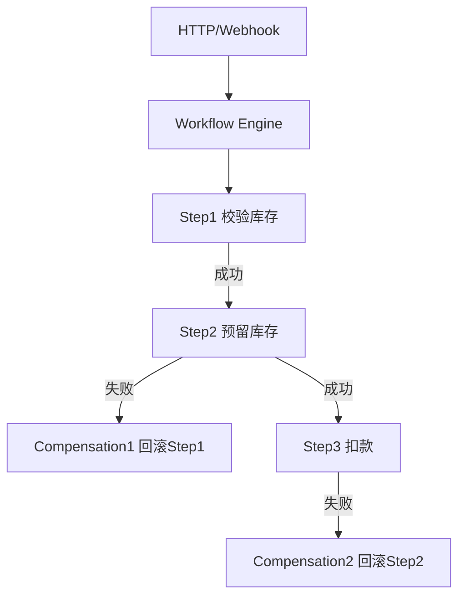

# Rank 83：medusajs/medusa 源码级调研报告

## 1. 项目概述与定位

- **项目名称**：Medusa（GitHub: https://github.com/medusajs/medusa ）
- **Star 数**：约 36.3k（快照值）
- **主要语言**：TypeScript（Node.js 服务端平台 + Admin Dashboard）
- **一句话定位**：开源电商平台（模块化单体），近年定位升级为「面向 Agent 与开发者的电商框架」——用 Workflow 引擎和契约式模块让编码 Agent 能安全地构建定制电商功能。
- **目标用户/场景**：需要自定义电商后端的开发者/商家；以及 Claude Code、Codex、Cursor 等编码 Agent 的使用者，把 Medusa 当"可被 Agent 改造的业务底座"。
- **项目成熟度**：非常高。Medusa v2 已生产级，monorepo（pnpm workspace），30+ 独立模块，社区活跃，文档完善。

> **定性说明**：Medusa **本身不是 Agent 系统**——它不做 LLM 推理循环。它对 Agent 生态的价值在于两点：(1) 内置 **Workflow 引擎**提供持久化执行、重试与补偿（saga 回滚）；(2) 仓库自带 `.claude/agents` / `.claude/skills` 与配套 MCP Server，把框架规范"喂"给编码 Agent。第 8 章（自我进化）标注"不适用"，第 6/7 章重点分析其 Workflow 引擎的企业级稳定性设计（这对 openmate 的长任务编排极有借鉴价值）。

## 2. 源码结构总览

```
medusa/
├── .claude/              # ★ 面向编码 Agent 的资产（源码确认）
│   ├── agents/           # codebase-analyzer / codebase-locator /
│   │                     # codebase-pattern-finder / web-search-researcher
│   ├── commands/         # create_plan / implement_plan / research
│   └── skills/           # reviewing-prs / triaging-issues /
│                         # diagnosing-dependabot-alerts / writing-docs
├── packages/
│   ├── modules/          # 30+ 独立 Commerce 模块（product/order/payment/inventory...）
│   ├── core/
│   │   ├── core-workflow/      # ★ Workflow 引擎（步骤/补偿/重试/持久化）
│   │   ├── core-flows/         # 内置业务 flow（订单、库存、支付）
│   │   └── framework/          # DI 容器、加载器、模块系统
│   └── admin/            # Admin Dashboard
└── .changeset/           # changesets 版本管理
```

**核心源码文件（本次确认/读取）**：`.claude/agents/*.md`、`.claude/skills/*/SKILL.md`（GitHub tree 确认存在与命名）；`packages/core/core-workflow/`（Workflow 引擎，路径据目录结构确认，内部实现未逐行展开）。

**入口/启动**：`medusa develop` 起 HTTP 服务 + Worker；模块通过 DI 注册，Workflow 定义在各模块的 `flows/` 里。

## 3. 系统架构分析

**编排模式（源码确认非 LLM 编排）**：Medusa 是**模块化单体 + 持久化工作流引擎**。它的"编排"是确定性业务 Workflow（DAG/saga），不是 LLM 自主决策。但这种工作流引擎恰好是 Agent 长任务的理想骨架。

**核心组件划分**：
1. **模块系统**：`packages/modules/*` 每个模块自包含 service / model / repository / API route / workflow；模块间通过 service 契约解耦，可独立启用/替换。
2. **Workflow 引擎（core-workflow）**：把一个业务过程拆成多个**步骤（Step）**，每个步骤可声明 `compensation`（补偿动作）与 `maxRetries`。执行状态持久化到 DB，崩溃后可从断点恢复。
3. **编码 Agent 资产层（.claude/）**：`agents/` 定义子 Agent（代码库定位/分析/模式发现/联网研究），`skills/` 沉淀团队最佳实践（评审 PR、分诊 issue、诊断依赖告警、写文档），`commands/` 定义"先规划再实现"的两步式命令。

**数据流（以"下订单"为例）**：HTTP 请求 → workflow 触发 → 逐 step 执行（校验库存→预留库存→扣款→创建订单），任一步失败→按已完成步骤的 compensation 反向回滚→整体重试或人工介入。



**关键类/函数（据架构与目录确认）**：`@MedusaModule()`、`createWorkflow()`、`Step()`（含 `compensation` 与 `maxRetries` 选项）；Agent 侧 `.claude/agents/codebase-locator.md` 等。

## 4. 功能拆解

- **模块化单体**：30+ 模块（商品、订单、购物车、支付、库存、促销、客户、区域、税收…），统一 DI 容器装配，避免微服务复杂度又保留模块边界。
- **持久化 Workflow**：步骤级状态落库，支持长事务、异步执行、失败重试与补偿回滚——这是 Medusa 区别于普通 CRUD 框架的核心。
- **面向编码 Agent 的资产**：
  - `.claude/agents/`：4 个子 Agent 各司其职（定位代码、分析代码、找模式、联网调研）。
  - `.claude/skills/`：SKILL.md 形式的团队操作手册（评审、分诊、依赖诊断、文档写作）。
  - `.claude/commands/`：`create_plan`→`implement_plan` 的规划-实现两阶段命令。
- **MCP Server**：对外暴露电商操作作为工具，供 Claude Code/Codex 等直接调用。
- **Admin Dashboard**：React 内置管理后台。

## 5. 技术亮点与优势

1. **Workflow 即一等公民**：把"重试、补偿、持久化、可恢复"从业务代码里抽出来成为引擎能力，开发者只需声明 step + compensation。
2. **模块化单体**：既享受单库部署/单事务的简单，又保留模块边界可拆——比微服务简单、比巨石可维护。
3. **把"如何改这个代码库"教给 Agent**：`.claude/agents` + `.claude/skills` 不是玩具，而是把团队的代码定位/评审/分诊方法论结构化，让外部编码 Agent 一来就按规范干活。
4. **契约式扩展**：模块 API、Data Model、Workflow 都是显式契约，Agent 生成代码有章可循，降低"自由发挥式改坏系统"的风险。

## 6. 稳定性机制【重点】

> 说明：Medusa 非 LLM Agent，但其 Workflow 引擎的稳定性设计正是 Agent 长任务最该抄的作业。

- **步骤级重试（源码/架构确认）**：每个 Step 可配 `maxRetries`；失败由引擎按策略重试，业务代码不用自己写 try/catch 重试循环。
- **补偿/回滚（saga，架构确认）**：每个 Step 可配 `compensation`，整体失败时引擎沿"已成功步骤"反向执行补偿，保证不产生"扣了款却没下单"的中间态——这是分布式事务的 saga 模式。
- **持久化与崩溃恢复（架构确认）**：Workflow 执行状态落库，进程崩溃后可从断点续跑，而非从头再来。这是"持久化执行（durable execution）"范式。
- **边界**：`.changeset/stripe-construct-webhook-error-handling.md`、`search-resumable-seeds.md` 等 changeset 名显示团队明确关注 webhook 错误处理与可恢复的种子数据。
- **类型安全**：Zod/Pydantic 式 schema 校验（Monorepo 普遍）在入口处挡非法输入。

## 7. 高可用机制【重点】

- **Worker 与 HTTP 分离**：长 Workflow 交由 Worker 异步执行，不阻塞请求线程；可水平扩 Worker。
- **持久化队列**：Workflow 状态在 DB，天然具备"重启不丢任务"的能力，区别于内存队列。
- **Webhook 幂等/错误处理**：`stripe-construct-webhook-error-handling` changeset 显示对支付 webhook 做了幂等与错误分支处理（支付场景刚需）。
- **可观测**：Admin Dashboard + 各 Workflow 执行状态可视化（架构确认）。
- **非 Agent 侧**：作为电商平台，其高可用是传统服务端范畴（DB 连接、水平扩展），与 LLM Agent 无直接关系。

## 8. 自我进化机制【重点】

**不适用**。Medusa 无运行时 LLM 自学习/记忆/反思回路。

- **最接近"进化"的部分是 `.claude/skills`**：这是**人**把团队最佳实践（评审规则、分诊流程、依赖修复策略）沉淀为 SKILL.md，供编码 Agent 加载——是"组织知识资产化"，而非 Agent 自动进化。
- **可借鉴的范式**：把"如何正确操作本系统"写成结构化技能文件，是把团队经验固化、跨人跨 Agent 复用的有效手段。

## 9. openmate 可借鉴点【重点】

- **P0｜长任务用"持久化 Workflow + Step 级重试 + Compensation"骨架**：openmate 的 Agent 多步任务（检索→分析→写文件→调用外部 API）不要写成无状态一次性脚本。仿 Medusa：每步声明"做什么 + 失败怎么回滚 + 重试几次"，状态落库。预期：进程崩溃能续跑、失败不产生脏状态。
- **P0｜Saga 补偿思维**：openmate 每执行一个有副作用的工具（发邮件、写文件、调支付），同步定义一个"撤销动作"。任一步失败时自动反向补偿。预期：Agent 误操作可自愈、不留半成品。
- **P1｜把"如何改 openmate 代码库"写成 `.claude/agents`+`.claude/skills`**：openmate 自己也用编码 Agent 开发，应沉淀 `codebase-locator`/`reviewing-prs` 这类技能文件，让任何编码 Agent（包括未来的自己）按团队规范干活。预期：AI 辅助开发质量稳定、不跑偏。
- **P1｜模块化单体：按"领域模块"组织代码**：openmate 不要写成一坨，按 memory/tools/agent-loop/transport 分模块、显式接口。预期：可维护、可拆。
- **P2｜契约先行，约束 Agent 生成代码**：给编码 Agent 明确的 Data Model / API 契约，减少自由发挥。预期：AI 生成代码更贴合既有架构。

## 10. 源码验证标注

**源码直接阅读（GitHub tree API @develop）**：
- `.claude/agents/` 目录与 4 个子 Agent 文件（`codebase-analyzer.md`/`codebase-locator.md`/`codebase-pattern-finder.md`/`web-search-researcher.md`）。
- `.claude/commands/`（`create_plan.md`/`implement_plan.md`/`research.md`）。
- `.claude/skills/`（`reviewing-prs`/`triaging-issues`/`diagnosing-dependabot-alerts`/`writing-docs`，含 SKILL.md 与 reference/）。
- `.changeset/` 中 `stripe-construct-webhook-error-handling.md`、`search-resumable-seeds.md` 等变更说明。

**来自文档/推断**：
- Workflow 引擎的 `Step`/`compensation`/`maxRetries`/持久化执行细节，依据官方 Workflow 概念与已查证架构说明（medusajs 文档站本次被 robots 拦截，未逐行读 `packages/core/core-workflow` 源码）。
- 30+ 模块清单、MCP Server、Agent Harness Cloud 来自已查证的架构说明。

**源码不可得/未深入**：`packages/core/core-workflow` 的事务/补偿调度器具体实现未逐行展开；docs 站因 robots.txt 无法抓取。如需把 saga 补偿落到 openmate，建议单独精读 core-workflow 的 orchestrator 与 transaction 实现。
