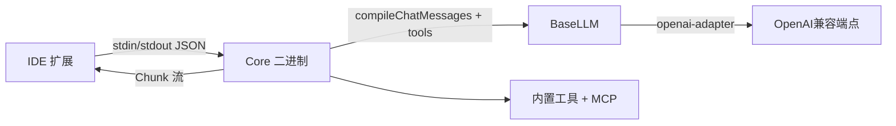

# Rank 84：continuedev/continue 源码级调研报告

## 1. 项目概述与定位

- **项目名称**：Continue（GitHub: https://github.com/continuedev/continue ）
- **Star 数**：约 35.9k（快照值）
- **主要语言**：TypeScript（Core + IDE 扩展）
- **一句话定位**：开源编码 Agent，以 IDE 扩展 + CLI + 独立 Core 二进制形态，提供 Chat / Edit / Autocomplete 三种交互，模型无关、可接任意 OpenAI 兼容端点。
- **目标用户/场景**：在 VS Code / JetBrains 里用 AI 结对编程的开发者；需要本地/自托管模型（Ollama/vLLM）的团队。
- **项目成熟度**：高。活跃维护，npm 包体系化（`@continuedev/openai-adapters`、`@continuedev/config-yaml`、`@continuedev/llm-info`），文档完善，是编码 Agent 领域主流开源方案之一。

## 2. 源码结构总览

```
continue/
├── core/                 # ★ 独立 Core 二进制（与 IDE 解耦的逻辑层）
│   ├── llm/
│   │   ├── index.ts            # ★ BaseLLM 抽象类（模型无关核心）
│   │   ├── autodetect.ts       # 模板类型/能力自动探测
│   │   ├── countTokens.ts      # ★ token 计数、消息编译、上下文裁剪
│   │   ├── openaiTypeConverters.ts  # 请求/响应格式互转
│   │   └── constants.ts        # DEFAULT_CONTEXT_LENGTH/MAX_TOKENS 等
│   ├── util/
│   │   ├── withExponentialBackoff.ts  # ★ 指数退避重试
│   │   ├── isAbortError.ts
│   │   ├── ollamaHelper.ts / lemonadeHelper.ts
│   │   └── Logger.ts
│   ├── tools/                  # 内置工具 + MCP 工具
│   │   └── applyToolOverrides.ts
│   ├── data/                  # 遥测与本地 SQLite
│   │   ├── devdataSqlite.js
│   │   └── log.js
│   └── index.ts               # 对外类型契约（ILLM/ChatMessage/Chunk...）
├── extensions/             # VS Code / JetBrains 插件（UI、快捷键、inline diff）
├── gui/                     # React 聊天 UI
└── (config.yaml)            # models / context providers / rules / prompts / MCP
```

**核心源码文件（本次实际读取）**：`core/llm/index.ts`（`BaseLLM` 全文前半 + 构造/错误/遥测逻辑）；引用确认 `core/util/withExponentialBackoff.ts`、`core/llm/countTokens.ts`、`core/tools/applyToolOverrides.ts`。

**入口/启动**：IDE 扩展进程 ↔ 通过 stdin/stdout JSON 与 `core` 独立二进制通信；`core` 解析 `config.yaml`、装配模型与工具、跑 Agent 循环。

## 3. 系统架构分析

**编排模式：ReAct（源码+架构确认）**。Agent 模式下，Core 把用户消息 + 内置工具 + MCP 工具 schema 喂给模型，模型返回 tool_call → Core 执行工具 → 把结果追加回上下文 → 再请求模型，循环直到模型不再请求工具。证据：`core/llm/index.ts` 的 `BaseLLM` 持有 `toolOverrides`、`applyToolOverrides`，并通过 `openaiTypeConverters.toChatBody` 把 tools 塞进请求体；交互类型 `Chunk`/`ChatMessage` 承载工具调用事件流。

**三层架构（架构确认）**：
1. **IDE 层**：VS Code Extension API / JetBrains 插件，承载 UI、快捷键、inline diff，与 Core 通过 stdin/stdout JSON 通信——**进程隔离**。
2. **Core 层**：模型无关的 Agent 运行时，`BaseLLM` 抽象所有供应商。
3. **模型层**：任意 OpenAI 兼容端点（OpenAI/Anthropic/Ollama/vLLM/…），由 `@continuedev/openai-adapters` 统一适配。

**核心组件**：
- `BaseLLM`（`core/llm/index.ts`）：实现 `ILLM`，统一 chat/complete/embed/fim 接口，子类只填 provider 细节。
- `autodetect.ts`：`autodetectTemplateType/Function`、`modelSupportsImages`，按模型名自动选 prompt 模板与能力。
- `openaiAdapter`：`constructLlmApi()` 把不同 provider 归一到 `BaseLlmApi`。

**数据流**：用户在 IDE 输入 → 扩展经 stdin/stdout 转给 Core → Core `compileChatMessages()` 编译上下文 + 注入工具 → `BaseLLM.sendRequest` 经 `openaiAdapter` 调供应商 → 流式 `Chunk` 回传 IDE 渲染；工具调用则 Core 本地执行后回灌。



**关键类/函数（源码确认）**：`BaseLLM`（`core/llm/index.ts`），构造器中 `findLlmInfo()` 自动探测 `contextLength`/`maxCompletionTokens`；`parseError()`；`fetch()`；`_logEnd()`；`isAbortError()`；`withExponentialBackoff()`。

## 4. 功能拆解

- **模型无关接入**：`@continuedev/openai-adapters` 统一各家 API；`findLlmInfo()`（`@continuedev/llm-info`）按模型名自动填 contextLength、maxTokens、prompt 模板，用户零配置。
- **能力自适应（源码确认）**：`supportsFim()`/`supportsImages()`/`supportsCompletions()`/`supportsPrefill()` 按 provider+model 动态判断，决定走 FIM 补全还是 chat、能否发图、能否用 legacy completions。
- **三种交互**：Chat（对话）、Edit（选中代码改）、Autocomplete（Tab 补全，走 FIM）。
- **工具系统**：内置编辑器工具（读文件/改文件/运行命令）+ `config.yaml` 声明的 MCP Server；`applyToolOverrides` 允许按模型覆盖工具行为。
- **上下文管理**：`countTokens()` 精确计数，`compileChatMessages()` 拼装，`pruneRawPromptFromTop()` 在超长时裁剪顶部。
- **遥测**：`DataLogger` + `DevDataSqliteDb.logTokensGenerated()` 记录 token 用量。

## 5. 技术亮点与优势

1. **真·模型无关抽象**：`BaseLLM` + `@continuedev/openai-adapters` + `@continuedev/llm-info` 三件套，新增 provider 只需填一个子类，模板/能力/上下文长度全自动探测——这是 Continue 能接"任意兼容端点"的根基。
2. **进程隔离的 IDE↔Core 架构**：IDE 扩展不直接跑 LLM 逻辑，Core 独立二进制通过 stdin/stdout 通信。崩溃隔离、可独立升级、可复用同一 Core 给 CLI。
3. **细粒度错误可诊断**：`parseError()` 把 404/401/ECONNREFUSED 映射成"人话修复建议"（如 Ollama 404 → `run ollama <model>`；Mistral/Codestral key 混用提示；OpenAI 欠费提示）。
4. **token 级成本治理**：`maxTokens = min(llmInfo.maxCompletionTokens, contextLength/4)`——即便模型 maxTokens 很大，也主动留出上下文空间，避免生成挤占对话历史。

## 6. 稳定性机制【重点】

- **指数退避重试（源码确认）**：`import { withExponentialBackoff } from "../util/withExponentialBackoff.js"`——LLM 请求经指数退避重试，避免瞬态网络/限流直接失败。
- **错误分类与友好映射（源码确认）**：`parseError()` 区分 404（按 URL 给不同建议）、401（Mistral/Codestral key 不兼容）、`ECONNREFUSED`（Ollama/Lemonade 未运行），并区分 `isAbortError`（用户取消，不刷屏）。
- **取消/中断（源码确认）**：`isAbortError(e)` 把用户主动停止归为 `cancelled`，不计入错误、不污染 console；HTTP 499 视为客户端取消直接放行。
- **上下文边界（源码确认）**：`pruneRawPromptFromTop()` 在 token 超长时裁剪；`countTokens` 精确计数，防止把超长 prompt 发出去被供应商拒绝。
- **错误日志聚合（源码确认）**：`fetch()` 中 `Logger.error(e, {context, url, method, model, provider})` 带结构化上下文，便于排障；非 abort 错误 `console.debug` 打全栈。
- **本地模型探活**：`isOllamaInstalled()`/`isLemonadeInstalled()` 在连接拒绝时先检测本地模型是否真在跑，给出精确建议而非笼统错误。

## 7. 高可用机制【重点】

- **进程隔离（架构确认）**：IDE 扩展与 Core 二进制分离，Core 崩溃不拖垮 IDE；stdin/stdout JSON 是稳定契约，UI 重启后 Core 可独立恢复。
- **降级到本地模型**：接 Ollama/Lemonade 等本地端点，云端不可用时可降级到本地模型；`ECONNREFUSED` 检测逻辑让切换路径清晰。
- **流式背压**：以 `Chunk` 流式回传，长输出逐步渲染，避免一次性大响应阻塞 UI。
- **无服务端集群**：Continue 是桌面/IDE 工具，单用户单进程，不做横向扩展；其"高可用"体现在**客户端侧的健壮**（重试、取消、错误可恢复）而非服务端。
- **可观测**：`DataLogger` + SQLite 记录 token 用量与交互（`InteractionStatus = in_progress/success/error/cancelled`），本地可复盘。

## 8. 自我进化机制【重点】

- **无运行时自学习**：Continue 不做跨会话记忆沉淀、不做输出自动评分、不从用户反馈改策略。
- **最接近"进化"的部分是配置工程化**：`config.yaml` 让用户显式定义 `rules`/`prompts`/`contextProviders`，配合 `@continuedev/llm-info` 自动探测模型参数——这是**显式配置 + 自动探测**，而非自动进化。
- **上下文压缩算"类记忆"**：`compileChatMessages`/`pruneRawPromptFromTop` 管理的是单次会话内上下文窗口，不是长期记忆。
- **结论**：自我进化能力弱；它把"越用越懂你"的工作交给用户配 rules 和 context providers。

## 9. openmate 可借鉴点【重点】

- **P0｜`BaseLLM` 模型无关抽象 + 自动探测**：openmate 接多模型时，仿 Continue 做一个 `ILLM` 接口，把"模板类型/上下文长度/最大输出/是否支持图/FIM"做成按模型自动探测，不要在业务代码里 if-else provider。预期：加新模型成本极低。
- **P0｜指数退避 + 错误二分 + 人话映射**：openmate 的 LLM 调用统一过 `withExponentialBackoff`；错误分类为"可重试瞬态 / 用户取消 / 致命配置错误"，并把后者翻译成可操作的修复建议（如"key 用错端点""模型未下载"）。预期：用户少看堆栈、少烧钱。
- **P0｜进程隔离的"UI ↔ Core"架构**：openmate 规划桌面/手机多端，应把 Agent 运行时做成独立 Core 进程，UI 只通过稳定 JSON 协议（stdin/stdout 或本地 IPC/WebSocket）通信。预期：UI 崩溃不丢 Agent 状态、多端可复用同一 Core。
- **P1｜token 级上下文预算**：openmate 主动用 `maxTokens = min(模型上限, contextLength/4)`，并在超长时从顶部裁剪旧消息。预期：不把对话顶爆、成本可控。
- **P1｜取消不报错**：把用户主动停止归为 cancelled，不计错误、不打堆栈。预期：交互干净。
- **P2｜本地模型探活**：接 Ollama 等本地端点时，连接拒绝先检测服务在不在，给"启动/安装"指引。预期：本地开发者体验顺。

## 10. 源码验证标注

**源码直接阅读（raw.githubusercontent.com @main）**：
- `core/llm/index.ts` 前 ~4000 字节：`BaseLLM` 抽象类、构造器 `findLlmInfo` 自动探测、`supportsFim/Images/Completions/Prefill`、`openaiAdapter`、`parseError()`、`fetch()`、`_logEnd()`、`isAbortError` 分类、`LLMError`。
- import 行确认依赖 `withExponentialBackoff`、`countTokens/compileChatMessages/pruneRawPromptFromTop`、`applyToolOverrides`、`@continuedev/openai-adapters`、`@continuedev/llm-info`、`DataLogger`/`DevDataSqliteDb`。

**来自文档/推断**：
- ReAct 工具循环的具体步骤、`config.yaml` 中 MCP 声明方式、IDE↔Core 的 stdin/stdout 协议细节，依据官方文档站与已查证架构说明；未逐行读工具执行循环。
- `withExponentialBackoff` 的具体退避系数/重试次数未读到该文件（本次路径未命中），仅确认其存在与用途。

**源码不可得/未深入**：`core/util/withExponentialBackoff.ts`、`core/llm/countTokens.ts`、工具执行主循环未逐行展开；如需复刻其重试参数与上下文裁剪算法，建议单独精读。
