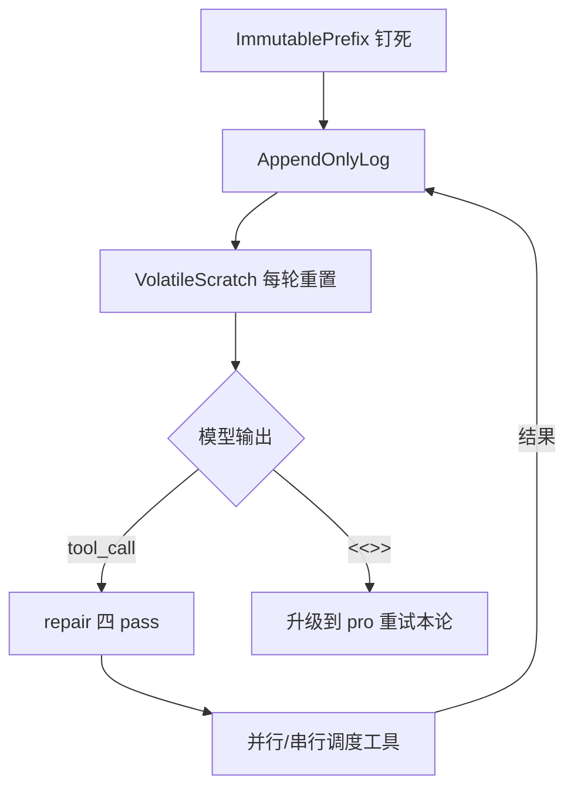

# Rank 85：esengine/DeepSeek-Reasonix 源码级调研报告

## 1. 项目概述与定位

- **项目名称**：DeepSeek-Reasonix（npm 包名 `reasonix` / 别名 `dsnix`；GitHub: https://github.com/esengine/DeepSeek-Reasonix ）
- **Star 数**：约 35.5k（快照值）
- **主要语言**：TypeScript（legacy 0.x 线，本次 main 分支）；**Go 重写版在 `main-v2` 分支**（新默认，活跃开发）
- **一句话定位**：DeepSeek 原生的终端编码 Agent，整个循环围绕"前缀缓存字节级稳定"设计，目标是"便宜到可以一直挂着跑"。
- **目标用户/场景**：用 DeepSeek API 写代码、希望长会话低成本挂机跑任务的开发者；CLI/TUI 为主，附 Tauri 桌面端（prerelease）。
- **项目成熟度**：活跃、迭代极快（v0.3.x→v0.6 演进清晰），MIT 协议，社区开发；但 main 已是维护态，Go 重写在 main-v2。

> **定性说明**：这是一个**观点极强、极其专一**的编码 Agent——只服务 DeepSeek，所有抽象都为"前缀缓存命中率"服务。它的价值不在通用，而在把"缓存经济"这件事做到了工程极致。本报告以 main（TS）线源码/架构文档为准，并标注 Go 重写分支。

## 2. 源码结构总览

```
src/
├── client.ts          # DeepSeek client（fetch + SSE）
├── loop.ts            # ★ CacheFirstLoop（Pillar 1+3）
├── memory.ts          # ★ ImmutablePrefix / AppendOnlyLog / VolatileScratch
├── repair/            # ★ Pillar 2 工具调用修复流水线
│   ├── scavenge.ts   # 从 reasoning_content 里捞回漏掉的 tool call
│   ├── flatten.ts    # 复杂 schema 拍平成 dot-notation
│   ├── truncation.ts # 截断 JSON 修复
│   └── storm.ts      # 相同参数重复调用抑制
├── tools/             # filesystem/shell/jobs/memory/skills/subagent/plan/web
├── mcp/               # MCP client + bridge（stdio + SSE）
├── session.ts         # JSONL 会话持久化
├── telemetry.ts       # 成本 + 缓存命中记账 + SessionSummary
├── tokenizer.ts       # DeepSeek V3 tokenizer（移植）
└── cli/ui/            # Ink TUI（App/StatsPanel/EditConfirm/PlanConfirm...）
```

**核心源码文件（架构文档确认路径与职责）**：`loop.ts`（CacheFirstLoop）、`memory.ts`（三区上下文）、`repair/{scavenge,flatten,truncation,storm}.ts`、`tools/shell.ts`+`jobs.ts`（后台任务 JobRegistry）、`session.ts`、`telemetry.ts`。

**入口/启动**：`cli/index.ts`（commander）→ `reasonix code` 起 Ink TUI；`resolve.ts` 合并 config.json 与 CLI flag。

## 3. 系统架构分析

**编排模式：ReAct（但被缓存不变式深度改造）**。标准 ReAct 是"模型决策→执行工具→回灌结果→再决策"，Reasonix 在此之上加了一条硬约束：**不能为了"整洁"而重排/改写/注入时间戳，否则前缀缓存全废**。

**核心设计——三区分隔上下文（源码确认，`memory.ts`）**：
```
IMMUTABLE PREFIX   会话级固定：system + tool_specs + few_shots   ← 缓存命中候选
APPEND-ONLY LOG     单调增长：[assistant1][tool1][assistant2]... ← 保留前轮前缀
VOLATILE SCRATCH    每轮重置：R1 思考、临时计划状态              ← 永不送上游
```
三条不变式：① prefix 会话级只算一次、哈希后钉死；② log 严格 append、不重写；③ scratch 内容必须先经 Pillar 2 蒸馏才能折进 log。

**关键类/函数（架构文档确认）**：`CacheFirstLoop`（`loop.ts`）；`ImmutablePrefix`/`AppendOnlyLog`/`VolatileScratch`（`memory.ts`）；`ToolRegistry.register()`/`dispatch()`（`repair/flatten`）。



## 4. 功能拆解

- **代码编辑**：`edit_file` 用 SEARCH/REPLACE，**磁盘上不落盘**，直到 `/apply` 经 `EditConfirm` 逐处确认（代码模式独有）。
- **工具系统**：只读文件系统工具（read/list/search/tree）、shell（`run_command` + `run_background`，经 `ShellConfirm`/权限白名单）、web（多引擎：Bing/Baidu/SearXNG/Metaso/Tavily/Exa）、`recall_memory`/`semantic_search`、`run_skill`/`spawn_subagent`。
- **MCP**：`mcp/` client + bridge，支持 stdio / SSE / Streamable HTTP。
- **Skills**：Markdown playbook，`inline` 或 `runAs: subagent`（spawn 隔离子循环）；兼容 Claude 格式 SKILL.md。
- **Memory**：`remember`/`recall_memory`，分 user/feedback/project/reference 类型，**钉进 immutable prefix**。
- **Hooks**：`PreToolUse`（门控）/`PostToolUse`/`UserPromptSubmit`/`Stop` 生命周期 shell 钩子。
- **会话持久化**：`session.ts` 写 JSONL，支持 `replay`/`events`/`stats` 复盘。

## 5. 技术亮点与优势

1. **把"缓存经济"做成架构不变式**：大多数 Agent 框架每轮重排上下文/注入时间戳，缓存命中率 <20%；Reasonix 三区分隔做到实测 **99.82% 命中**（单日 435M input token，$12 vs 无缓存 $61）。
2. **工具调用修复四 pass（Pillar 2）**：针对 DeepSeek 的经验性失败模式（think 里漏 tool call、>10 参数 schema 丢参、call-storm、JSON 截断）逐一打补丁。
3. **分层默认 + 模型自报升级**：flash-first，子任务硬编码 flash+high；模型自己发 `<<<NEEDS_PRO>>>` 才升级到 pro，且每次升级都向用户可见。
4. **并行工具调度的正确性**：`parallelSafe` 标记，`Promise.allSettled` 跑 chunk，但**结果按声明顺序回灌**——并行提速又不破坏 read-after-write。
5. **意见化、不做通用**：明确非目标（不做多 Agent 编排、不做 RAG、不接非 DeepSeek），专注把一件事做到极致。

## 6. 稳定性机制【重点】

- **工具调用修复流水线（源码确认，`repair/`）**：
  - `flatten`：>10 叶参数或深度>2 的 schema 自动拍平为 dot-notation，`dispatch()` 调用前再嵌回——治"参数被丢"。
  - `scavenge`：正则+JSON 解析扫 `reasoning_content`，捞回模型漏在思考里的 tool call——治"think 里调用、最终消息没有"。
  - `truncation`：检测不平衡 JSON，补闭括号或请求续作——治 max_tokens 截断。
  - `storm`：滑动窗口内相同 `(tool,args)` 重复调用→抑制并插入一轮反思——治 call-storm。
- **写入前确认（源码确认）**：`edit_file` SEARCH/REPLACE 不落盘，经 `EditConfirm`；`run_command` 经 `ShellConfirm` + 工作区 shell 白名单（exact-prefix）；`submit_plan` 经 `PlanConfirm` 评审门。
- **权限门控**：`PreToolUse` hook 可拦截工具调用。
- **不变式防错**：append-only 设计本身避免了"改写历史导致前后不一致"。

## 7. 高可用机制【重点】

- **并行调度 + 串行屏障（源码确认）**：每工具声明 `parallelSafe`（默认 false）；连续安全调用合并 chunk 用 `Promise.allSettled` 竞速；遇到第一个非安全调用结束 chunk、单独串行（保 read-after-write）。`REASONIX_PARALLEL_MAX=3`（硬上限 16），`REASONIX_TOOL_DISPATCH=serial` 可强制串行兜底。
- **结果顺序不依赖完成顺序**：无论哪个调用先 settle，工具结果与历史追加仍按声明顺序落地，模型看到的形状与纯串行一致——**并行而不引入竞态**。
- **后台任务（`jobs.ts`/JobRegistry）**：`run_background` 跑长命令，`job_output`/`list_jobs` 查询，长任务不阻塞主循环。
- **崩溃恢复**：`session.ts` JSONL 持久化会话；`replay`/`events` 可复盘；auto-checkpoints（架构确认）。
- **降级开关**：`REASONIX_TOOL_DISPATCH=serial`、`/model` 显式切换、`reasonix doctor` 健康检查（Node/key/MCP）。
- **成本侧高可用**：`telemetry.ts` 逐轮/逐会话成本记账，StatsPanel 按绿/黄/红着色，防"悄悄烧钱"。

## 8. 自我进化机制【重点】

- **模型自报升级（源码确认）**：模型判断任务超出当前档，在回复首行发 `<<<NEEDS_PRO>>> [原因]`，系统中止当前 flash 调用、用 pro 重试本论——这是**模型驱动的自我升级**，但是纯自报、无失败计数阈值。
- **Memory 固化（源码确认）**：`remember` 把用户知识（user/feedback/project/reference）钉进 immutable prefix，跨会话沉淀——这是最接近长期记忆的部分，但是**显式写入**而非自动提取。
- **无自动评估回路**：无 LLM-as-judge、无基准回归、无从错误自动沉淀策略（`storm` 抑制是规则，不是学习）。
- **子 Agent 是省钱手段非进化**：`spawn_subagent` 硬编码 flash+high，文档明确"subagents are a cost-reduction mechanism, not a coordination primitive"。
- **结论**：自我进化弱，核心是"缓存优化 + 成本控制"，不是自学习。

## 9. openmate 可借鉴点【重点】

- **P0｜把"上下文分区 + append-only"当一等设计**：openmate 长会话应明确分"系统/工具/ few-shot（钉死）"+"对话日志（只追加不改写）"+"临时态（每轮重置）"。尤其**不要每轮注入时间戳、不要重排历史**——这是多模型通用的上下文卫生，直接降本减幻觉。预期：上下文稳定、缓存友好、跨模型都受益。
- **P0｜工具调用修复流水线**：openmate 用 function calling 时，务必加"漏调用扫描（扫 reasoning）""截断 JSON 补全""相同参数重复调用抑制"这三个兜底。预期：模型 tool call 故障率大幅下降。
- **P0｜写操作必须"先提案、后落盘" + 权限白名单**：openmate 改文件/跑 shell 时，先 SEARCH/REPLACE 提案给用户确认再落盘；shell 按工作区前缀白名单门控。预期：把 AI 误操作锁死。
- **P1｜并行工具调度"竞速但保序"**：只读工具并行 `Promise.allSettled`，但结果按声明顺序回灌；写工具串行屏障。预期：提速且不引入 read-after-write 竞态。
- **P1｜分层模型默认 + 自报升级**：openmate 默认便宜模型跑辅助任务（摘要/子探索），难任务由模型自报"需要强模型"再升级，且升级必须用户可见。预期：成本可控、不悄悄烧钱。
- **P2｜逐轮成本/缓存命中可视化**：把每轮花费、缓存命中率画进 UI。预期：用户对"挂机跑"有信心。

## 10. 源码验证标注

**源码直接阅读（raw.githubusercontent.com @main）**：
- `README.md` 全文（产品定位、code/chat 模式对比、skills/memory/hooks/permissions/MCP 配置、三支柱入口、与 Claude Code/Cursor/Aider 对比表）。
- `docs/ARCHITECTURE.md` 全文（三区分区图、三条不变式、并行调度 `parallelSafe`/`Promise.allSettled`/`REASONIX_PARALLEL_MAX`、repair 四 pass、成本控制 4.1–4.4、`<<<NEEDS_PRO>>>`、`memory.ts`/`repair/*`/`loop.ts` 模块布局、显式非目标）。

**来自文档/推断**：
- 上述文件路径、类名（`CacheFirstLoop`、`ImmutablePrefix` 等）、常量（`TURN_END_RESULT_CAP_TOKENS=3000`、40%/80% 阈值）均来自 ARCHITECTURE.md 的自描述，未逐行打开 `.ts` 源文件核验其实现细节。
- 99.82% 命中率、$12 vs $61 来自 README 引用的 case study（`benchmarks/real-world-cache/`），未独立复算。

**源码不可得/未深入**：`.ts` 实现（`loop.ts`/`repair/*.ts`）未逐行读；Go 重写版（main-v2 分支）未调研。如需把"缓存不变式"落到 openmate，建议精读 `loop.ts` 与 `repair/`。
