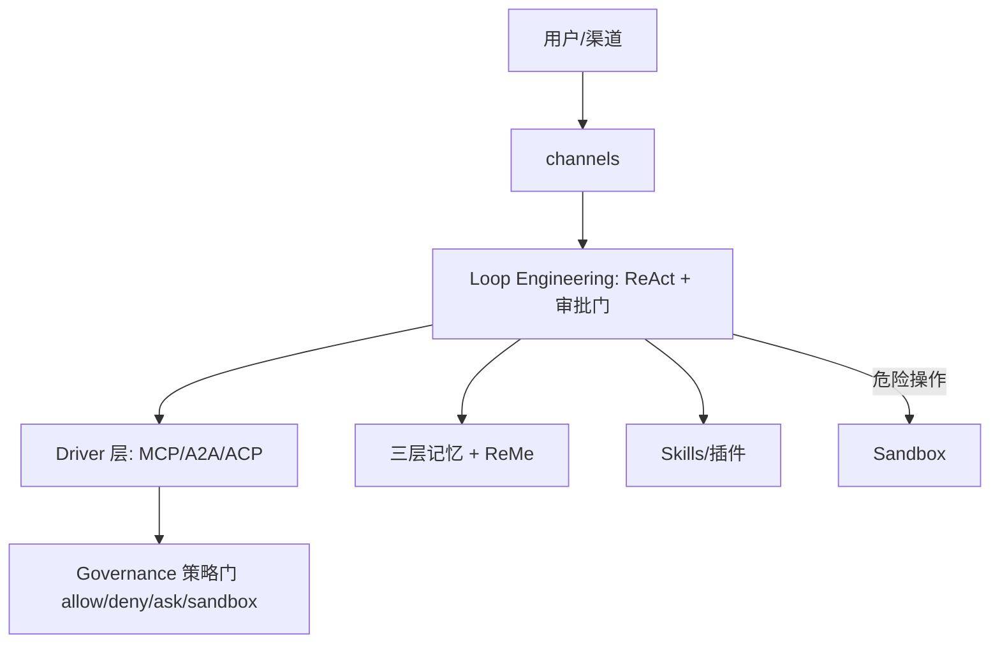

# Rank 86：agentscope-ai/QwenPaw 源码级调研报告

## 1. 项目概述与定位

- **项目名称**：QwenPaw（PyPI 包 `qwenpaw`；GitHub: https://github.com/agentscope-ai/QwenPaw ）
- **Star 数**：约 34.9k（快照值）
- **主要语言**：Python（≥3.11 <3.14）服务端 + 前端 Console / TUI / 桌面
- **一句话定位**：基于 AgentScope 2.0 重写的个人 AI 助手，主打"Agent OS"架构——本地或云端部署、Skills/插件扩展、全渠道接入，且"为你工作、随你成长"。
- **目标用户/场景**：想要一个 24/7、可本地部署、跨聊天渠道（钉钉/飞书/微信/Discord/Telegram/QQ）的个人助理；自动化定时任务、文档处理、信息聚合。
- **项目成熟度**：高且迭代极快（v2.0→v2.2.0），Apache 2.0，阿里通义实验室出品，pip/Docker 一键安装，配套本地小模型 QwenPaw-Flash（2B/4B/9B）。

## 2. 源码结构总览

> 说明：QwenPaw 以 pip 包分发，源码经 `pip install qwenpaw` 安装；本次以 README + v2.0 发布说明 + 架构说明为主要证据，未逐文件拉取源码树（仓库较大、Python 源码经打包发布）。

```
qwenpaw/
├── (Agent OS)
│   ├── Resources/    # 每个 Agent 的资源，透明落在磁盘上
│   ├── Governance/   # allow / deny / ask / sandbox 四级策略
│   └── Sandbox/      # 跨平台（macOS/Linux/Windows）内核级沙箱
├── drivers/          # 协议中立连接器层：MCP / A2A / ACP
│                     #   加密凭证 + 每调用一次策略门
├── memory/           # 三层记忆 + ReMe 自演化知识库
├── channels/         # 钉钉/飞书/微信/Discord/Telegram/iMessage/QQ
├── skills/ + plugins/  # 技能与插件市场
├── console/ + tui/   # Web Console 与全屏 TUI
└── session/          # 每轮持久化（Scroll Context）
```

**核心组件（README + 发布说明确认）**：三层记忆（live context / verbatim history / ReMe 知识库）、Driver 连接器层、Sandbox、Skills/插件、多渠道、定时调度。

**入口/启动**：`qwenpaw init --defaults` → `qwenpaw app` → 浏览器开 `127.0.0.1:8088` Console；或 Docker `agentscope/qwenpaw`。

## 3. 系统架构分析

**编排模式：ReAct + Loop Engineering（架构确认）**。基于 AgentScope 2.0 的 `ReActAgent`；v2.0 提出"Loop Engineering"——把 Agent 循环做成**可组合的模板**（Coding Mode、Mission Mode），并带**可组合的审批门（approval gates）**。

**核心组件——Agent OS 三柱（源码/发布说明确认）**：
1. **Resources**：每个 Agent 的资源透明落盘，不黑盒。
2. **Governance**：`allow / deny / ask / sandbox` 四级访问策略。
3. **Sandbox**：跨平台内核级沙箱执行危险操作。

**Driver 统一能力访问层（架构说明确认）**：协议中立的 MCP/A2A/ACP 连接器，凭证加密存储，**每次调用前过一道策略门**。这把"接外部能力"统一成一层。

**三层记忆（源码确认）**：
- live working context（当前工作上下文）
- full verbatim history（逐字历史）
- ReMe 自演化个人知识库（把对话/资源持续变成可读、可编辑、可搜索、可链接的 Markdown 记忆）

**Scroll Context（关键，发布说明确认）**：每轮都持久化；被挤出上下文的轮次**建索引、按需召回**——"nothing summarized away"，不靠摘要硬压。



## 4. 功能拆解

- **本地模型零依赖**：内置 QwenPaw Local runtime，配 QwenPaw-Flash（2B/4B/9B），无需 API Key；也可接 Ollama/LM Studio/14+ 云供应商。
- **安全（README 确认）**：内核级 Sandbox + Tool Guard + File Guard + Skill Scanner + Access Policy——危险命令执行前先拦。
- **多 Agent 并行**：spawn 独立 sub-agent，各有自己的记忆与技能；ACP（Agent Communication Protocol）跨系统编排。
- **Skills/插件市场**：定时调度、文档、浏览器、新闻等技能；插件市场；MCP 接入外部工具。
- **文件工作区**：统一导航/预览/编辑/diff/上传下载。
- **定时自动化**：news digest、报告生成、多渠道播报按计划跑。
- **多渠道**：一个实例接钉钉/飞书/微信/Discord/Telegram/iMessage/QQ。

## 5. 技术亮点与优势

1. **Agent OS 三柱（Resources/Governance/Sandbox）**：把"能力可管、资源透明、危险隔离"做成一等架构，而非事后补丁。
2. **Scroll Context vs 摘要**：长会话不靠摘要硬压——每轮落盘、挤出后建索引按需召回，信息不丢，工程上比"摘要压缩"更保真。
3. **ReMe 自演化记忆**：对话/资源持续转成可编辑 Markdown 知识库，且开源独立仓库（agentscope-ai/ReMe）。
4. **Driver 协议中立 + 每调用策略门**：MCP/A2A/ACP 统一接入，凭证加密、每次调用过策略，安全与扩展兼得。
5. **本地小模型**：自带 2B/4B/9B agent-tuned 模型，无云依赖也能跑——隐私与成本友好。

## 6. 稳定性机制【重点】

- **执行前拦截（README 确认）**：Kernel-level Sandbox + Tool Guard + File Guard + Access Policy，"dangerous commands are blocked before they run"——危险命令在执行前被拦，是前置防护。
- **四级治理（发布说明确认）**：`allow / deny / ask / sandbox`——每类操作按策略自动放行、拒绝、询问或丢进沙箱，而不是一刀切。
- **Scroll Context 防丢失（发布说明确认）**：每轮持久化，长会话不崩上下文；被挤出的轮次建索引可召回，避免"摘要吃掉关键信息"导致的连锁错误。
- **Skill Scanner（README 确认）**：加载技能前先扫描，防止恶意技能。
- **v2.2.0 "reliability improvements"**：发布说明明确把可靠性作为重点迭代项（但未展开具体实现）。

## 7. 高可用机制【重点】

- **多 Agent 隔离（README 确认）**：spawn 的 sub-agent 各有独立记忆与技能，一个子 Agent 出错不污染主 Agent——进程/数据级隔离。
- **多渠道接入**：一个实例同时挂多聊天渠道，渠道之间解耦。
- **本地/云端双模**：可全本地跑（无单点云依赖），也可上云；Docker 三卷分离（data/secrets/backups），备份独立卷。
- **统一模型路由（v2.2.0）**：unified model routing，模型供应商可切换/故障转移（架构说明确认）。
- **24/7 定时任务**：长时在线跑自动化，配合心跳/定时调度（架构说明确认）。
- **可观测**：Console 提供会话/任务视图；本次未深入其 metrics 管线。

## 8. 自我进化机制【重点】

- **ReMe 自演化知识库（README + 发布说明确认，核心亮点）**：持续把对话和资源转成"可读、可编辑、可搜索、可链接"的 Markdown 记忆——这是真正的**记忆沉淀回路**，且用户可人工干预修正。
- **记忆三层分离**：live context（工作态）/ verbatim history（逐字）/ ReMe（提炼）——既保工作效率又保长期知识，是成熟的记忆分层。
- **用户可编辑记忆**：ReMe 产出的是 Markdown，用户能直接改，避免模型记错无法纠正。
- **Agent 模式用户可编辑（v2.0.1）**：user-editable Agent Modes——用户把偏好固化成模式，半人工进化。
- **无自动评分/A-B**：未提及 LLM-as-judge 或基准回归；"进化"主要体现在记忆沉淀，而非行为自动调优。

## 9. openmate 可借鉴点【重点】

- **P0｜"前置拦截 + 四级治理"安全模型**：openmate 给工具/文件/命令做 `allow/deny/ask/sandbox` 分级，危险操作执行前先过策略门。比"跑完再后悔"安全得多。预期：本地桌面/手机端跑 AI 时不破坏用户文件。
- **P0｜Scroll Context：长会话"落盘 + 索引召回"而非摘要压缩**：openmate 长对话不要靠 LLM 摘要硬压历史（会丢信息），而是每轮落盘、挤出的轮次建索引、需要时按需召回原文。预期：长会话不丢关键事实、幻觉更少。
- **P0｜三层记忆分层**：openmate 明确分"当前工作上下文 / 逐字历史 / 提炼后的长期知识库"，三层职责不同、各自管理。预期：短期不爆上下文、长期知识可积累可维护。
- **P1｜ReMe 式"可编辑 Markdown 记忆"**：长期记忆落成用户能直接看/改的 Markdown，而非黑盒向量。预期：用户能纠正 AI 记错的事，信任度高。
- **P1｜Driver 协议中立连接器 + 每调用策略门**：openmate 接 MCP/A2A/插件时统一成一层，凭证加密、每次调用前过策略。预期：扩展能力与安全治理解耦、可叠加。
- **P2｜本地小模型兜底**：openmate 桌面端内置小模型做轻量任务/离线可用，不依赖云。预期：隐私、离线可用、成本低。

## 10. 源码验证标注

**源码直接阅读（raw.githubusercontent.com @main）**：
- `README.md` 前 ~4000 字节：产品定位、三层记忆、本地模型、安全五件套（Sandbox/Tool Guard/File Guard/Skill Scanner/Access Policy）、多 Agent/ACP、多渠道、安装方式、Docker 三卷分离。
- v2.0.0/v2.1.0/v2.2.0 发布说明条目（README 内 News 段）：Agent OS 三柱、Drivers、Loop Engineering、Scroll Context、ReMe v0.4、Console/TUI、统一模型路由。

**来自文档/推断**：
- Driver 层（DriverCard/DriverHandler/DriverManager/四维访问策略）、热插拔 MCP、Skill Hub/Claw Hub、定时心跳等细节来自已查证架构说明（JSON），未逐文件读 Python 源码。
- `qwenpaw` 以 pip 包分发，本次未拉取其安装目录下的 `.py` 源文件核验类名。

**源码不可得/未深入**：Agent OS 三柱与 Driver 层的 Python 实现文件、ReMe 集成代码未逐行展开；ReMe 作为独立仓库（agentscope-ai/ReMe）未单独调研。如需把 Scroll Context / 三层记忆落到 openmate，建议精读 QwenPaw 的 memory/ 与 ReMe。
