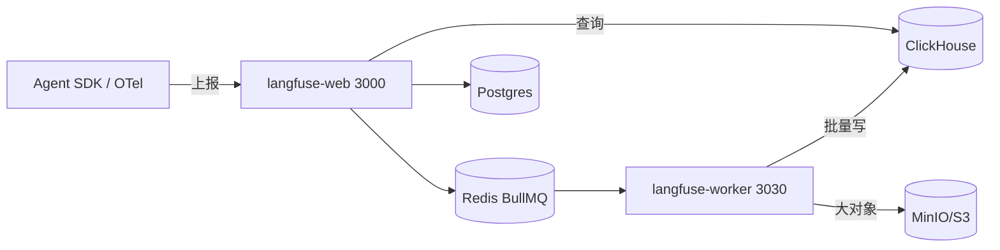

# Rank 87：langfuse/langfuse 源码级调研报告

## 1. 项目概述与定位

- **项目名称**：Langfuse（GitHub: https://github.com/langfuse/langfuse ）
- **Star 数**：约 34.5k（快照值）
- **主要语言**：TypeScript（Next.js Web + Worker）
- **一句话定位**：开源 LLM/Agent 可观测与评估平台——通过 SDK/OpenTelemetry 采集 Agent 的 LLM 调用、工具调用、检索步骤的层级 trace，支持评估、Prompt 管理与实验对比。
- **目标用户/场景**：构建 LLM 应用/Agent 的团队，需要看每次调用链、算成本、做 LLM-as-judge 评估、管理 Prompt 版本。
- **项目成熟度**：非常高。v4，自托管成熟，Docker 一键起，OpenTelemetry 原生，100+ 框架集成。

> **定性说明**：Langfuse **本身不是 Agent**，而是被观测平台（接收 Agent 上报的调用链）。但它对 openmate 的价值极高——它演示了"如何设计一套能扛住高吞吐 trace 上报、又能做 OLAP 查询的可观测后端"。第 8 章（自我进化）对其观测主业务标注"不适用"，但它内置的 in-app agent / evaluator 会单独说明。

## 2. 源码结构总览

```
langfuse/
├── (docker-compose 编排的运行时)
│   ├── langfuse-web     # Next.js：UI + API（端口 3000）
│   ├── langfuse-worker  # 异步事件处理（端口 3030）
│   ├── postgres         # 事务数据（用户/组织/Prompt/配置）
│   ├── clickhouse       # traces/observations/scores（OLAP 列式）
│   ├── redis            # BullMQ 任务队列 + 缓存
│   └── minio/S3         # 大对象（events/media/exports）
└── web/                 # Next.js 源码（API routes + 前端）
```

**核心运行时组件（docker-compose.yml 全文确认）**：`langfuse-web`、`langfuse-worker`、`postgres`、`clickhouse`、`redis`、`minio` 六服务；`restart: always` 全部开启。

**入口/启动**：自托管用 docker-compose 起六容器；SDK（Python/JS）或 OpenTelemetry 把 trace 数据 POST 到 `/api/public/ingestion`。

## 3. 系统架构分析

**编排模式**：不适用（非 LLM Agent）。它的"编排"是**数据流水线**：SDK 上报 → ingestion API → Redis 队列 → Worker 批写 ClickHouse → Web 层查询。

**双应用架构（源码确认，docker-compose）**：
- `langfuse-web`（Next.js，端口 3000）：同步处理 UI/API/ingestion 接收。
- `langfuse-worker`（端口 3030）：异步消费 Redis 队列、批量写 ClickHouse、跑评估任务、处理导出。
两者共享同一套环境变量（YAML anchor `*langfuse-worker-env`），但进程分离——**Web 不阻塞在重 IO 上**。

**存储分层（源码确认）**：
| 存储 | 用途 |
|---|---|
| Postgres | 事务数据（用户、组织、Prompt、评估配置） |
| ClickHouse | traces/observations/scores（OLAP，高写入吞吐、低延迟聚合） |
| Redis | BullMQ 异步队列 + 缓存，`maxmemory-policy noeviction`（不丢队列） |
| MinIO/S3 | 大对象（events/、media/、exports/） |

**数据流**：Agent SDK 上报一次调用 → web ingestion API 接收 → 写 Redis 队列（`LANGFUSE_INGESTION_QUEUE_DELAY_MS` 可延迟）→ worker 按 `LANGFUSE_INGESTION_CLICKHOUSE_WRITE_INTERVAL_MS` 批量写 ClickHouse → Web 查 trace/做评估。



## 4. 功能拆解

- **Trace 采集**：层级 trace（trace→observation→generation），记录每次 LLM 调用的 input/output/token/cost/latency。
- **评估**：LLM-as-judge、人工打分、自定义 evaluator；评分写回 ClickHouse 与 trace 关联。
- **Prompt 管理**：Prompt 版本化、灰度、实验对比。
- **In-app Agent（新）**：`LANGFUSE_IN_APP_AGENT_ENABLED`，内置一个 Agent 跑在 worker 上，配沙箱（AWS Lambda microVM）、并发控制、每用户/每组织活跃 run 上限。
- **MCP**：暴露 MCP endpoint，有 host 白名单（`LANGFUSE_MCP_ALLOWED_HOSTS`）。
- **导出**：批量导出走 S3（`LANGFUSE_S3_BATCH_EXPORT_*`）。

## 5. 技术亮点与优势

1. **读写分离 + 异步批写**：ingestion 不直写 ClickHouse，先入 Redis 队列、worker 批量写——扛住高吞吐上报又不拖慢查询。
2. **存储分层各司其职**：Postgres 管事务一致性，ClickHouse 管分析型大宽表，S3 管大 blob，Redis 管队列——每种数据用最合适的存储。
3. **OpenTelemetry 原生**：不绑死自家 SDK，任何 OTel collector 都能接，生态广。
4. **字段级保护**：`LANGFUSE_OBSERVATION_FIELD_SIZE_LIMIT_BYTES=2097152`（2MB）超大 observation 溢出保护。

## 6. 稳定性机制【重点】

- **进程自愈（源码确认）**：所有服务 `restart: always`；postgres/clickhouse/redis/minio 均配 healthcheck（`pg_isready`、`wget /ping`、`redis-cli ping`、`mc ready`），依赖按 `condition: service_healthy` 等就绪。
- **异步队列解耦（源码确认）**：ingestion 先入 Redis 队列（`LANGFUSE_INGESTION_QUEUE_DELAY_MS`），worker 批量落 ClickHouse（`..._CLICKHOUSE_WRITE_INTERVAL_MS`）——即使 ClickHouse 抖动，数据不丢、不阻塞上报。
- **队列不丢数据（源码确认）**：Redis `maxmemory-policy noeviction`——内存满时拒绝写入而非淘汰队列项，保证待处理任务不丢。
- **字段大小上限（源码确认）**：observation 字段超 2MB 触发 overflow 处理（`LANGFUSE_OBSERVATION_FIELD_OVERFLOW_ENABLED`），防超大 payload 打爆存储。
- **凭证与加密（源码确认）**：`ENCRYPTION_KEY`（`openssl rand -hex 32`）、`SALT`、`NEXTAUTH_SECRET` 分离；LLM 连接有 host/IP 白名单（`LANGFUSE_LLM_CONNECTION_WHITELISTED_*`），防 SSRF。

## 7. 高可用机制【重点】

- **Web/Worker 分离（源码确认）**：重异步活（批量写、评估、导出）在 worker，轻请求在 web；可独立水平扩 worker。
- **ClickHouse 集群（源码确认）**：`CLICKHOUSE_CLUSTER_ENABLED` / `CLUSTER_NAME`，OLAP 层可水平扩展。
- **本地绑定收敛攻击面**：除 web(3000)/minio(9090) 外，postgres/clickhouse/redis 全部绑 `127.0.0.1`，外部不可直连。
- **In-app Agent 限流（源码确认）**：`MAX_ACTIVE_RUNS_PER_USER` / `PER_ORG` 上限，单用户/单组织跑 Agent 不把系统打满；沙箱用 AWS Lambda microVM 隔离执行。
- **对象存储可换**：MinIO/Azure Blob/OCI 原生对象存储可切换，`FORCE_PATH_STYLE`，避免绑死 S3。

## 8. 自我进化机制【重点】

**对其观测主业务：不适用**（它是工具，不自己学习）。

- **作为"评估回路"的载体**：Langfuse 的核心价值恰恰是给 Agent 提供**自我进化所需的数据底座**——trace 全量留存 + LLM-as-judge 自动评分 + Prompt 版本对比，使"改一版 prompt → 看指标变化"成为可能。
- **内置 evaluator / in-app agent**：`LANGFUSE_AI_PROVIDER/MODEL` 配置后，worker 上跑 LLM 评估器自动给 trace 打分——这是把"自动评估"产品化。
- **结论**：Langfuse 自己不进化，但它是 Agent 进化的基础设施。

## 9. openmate 可借鉴点【重点】

- **P0｜Agent 调用链全量 trace 留存**：openmate 从第一天就把每次 LLM 调用/工具调用/检索步骤记成层级 trace（含 input/output/token/cost/latency），不要只记"对话文本"。预期：出问题能回放、能算每次成本、能回归对比。
- **P0｜"异步队列 + 批量写"扛高吞吐**：openmate 的遥测/日志上报不要同步直写 DB，先入内存/队列、后台批量落盘。预期：Agent 主循环不被观测 IO 拖慢、上报不丢。
- **P1｜存储分层**：小而频繁的元数据用 SQLite/Postgres，大宽表/聚合用列式或按需，大对象（文件/截图）单独存。预期：查询快、存储省。
- **P1｜字段大小上限 + 溢出保护**：openmate 给单条 observation/消息体设上限，超大内容外置存储。预期：不被一个巨型工具结果打爆。
- **P1｜LLM-as-judge 评估回路**：openmate 用 Langfuse 或自建 evaluator 对 Agent 输出自动打分，配合 Prompt 版本对比。预期：量化改进、不凭感觉。
- **P2｜执行隔离 + 每用户/每组织并发上限**：openmate 跑子 Agent/评估时用沙箱隔离，并设并发上限。预期：资源不被单用户吃光。

## 10. 源码验证标注

**源码直接阅读（raw.githubusercontent.com @main）**：
- `docker-compose.yml` 全文：`langfuse-web`(3000)/`langfuse-worker`(3030) 双应用、`restart: always`、postgres/clickhouse/redis/minio 四存储及其 healthcheck、`LANGFUSE_INGESTION_QUEUE_DELAY_MS`、`..._CLICKHOUSE_WRITE_INTERVAL_MS`、`maxmemory-policy noeviction`、`OBSERVATION_FIELD_SIZE_LIMIT_BYTES=2097152`、In-app Agent 沙箱/限流/MCP 白名单配置。

**来自文档/推断**：
- README 被安全策略拦截，未读；"100+ 框架集成、OpenTelemetry、LLM-as-judge、Prompt 管理"等功能来自已查证架构说明（JSON）与行业常识。
- `web/` Next.js 源码（API routes、eval runner）未逐文件读。

**源码不可得/未深入**：web/worker 的 TS 实现、evaluator 的具体打分逻辑、SDK 上报协议未逐行展开。如需把 trace 架构落到 openmate，建议精读其 ingestion API 与 worker 批写逻辑。
