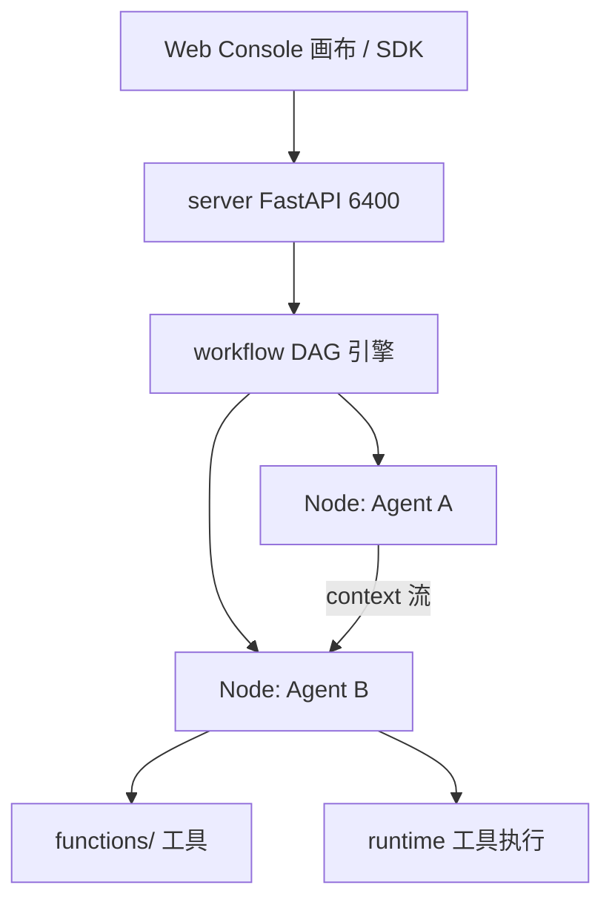

# Rank 89：OpenBMB/ChatDev 源码级调研报告

## 1. 项目概述与定位

- **项目名称**：ChatDev 2.0（代号 DevAll；GitHub: https://github.com/OpenBMB/ChatDev ）
- **Star 数**：约 33.9k（快照值）
- **主要语言**：Python（FastAPI 后端 + `runtime`）+ Vue 3（前端 Console）
- **一句话定位**：从"虚拟软件公司"演进为**零代码多 Agent 编排平台**——用户用可视化画布/YAML 定义 Agent、工作流、任务，编排数据可视化、3D 生成、deep research 等复杂场景。
- **目标用户/场景**：想零代码搭建定制多 Agent 系统的用户；二次开发者用 Python SDK 批量跑工作流。
- **项目成熟度**：非常高且学术背书强（NeurIPS 2025 论文）。2026-01 正式发布 2.0；v1.0（虚拟软件公司）移至 `chatdev1.0` 分支维护。PyPI 包 `chatdev`。

> **定性说明**：ChatDev 是"多 Agent 编排平台"的标杆——它把"多 Agent 协作"从硬编码链变成**可配置 DAG**，并沉淀了 MacNet（DAG 拓扑）、IER/经验协同学习、puppeteer（RL 学中央调度器）等一系进化研究。本报告以 2.0 主分支为主，兼顾其学术脉络。

## 2. 源码结构总览

```
ChatDev/
├── server/          # ★ FastAPI 后端（Web Console API）
├── runtime/         # ★ Agent 抽象 + 工具执行
│   └── sdk.py       #   run_workflow() 轻量 Python SDK
├── workflow/        # ★ 多 Agent 编排逻辑
├── entity/          #   驱动 workflow 的配置实体
├── functions/       #   自定义 Python 工具
├── frontend/        # Vue 3 + Vite Web Console（可视化画布）
├── yaml_instance/   # ★ 可运行工作流 YAML（demo_*、ChatDev_v1、GameDev_v1...）
├── WareHouse/       # Agent 产出物（代码/文档）
├── docs/user_guide/ # Workflow Authoring / Memory / Tooling 文档
└── server_main.py   # 入口：uv run python server_main.py --port 6400 --reload
```

**核心模块（README 开发者章节确认）**：`server/`（FastAPI）、`runtime/`（Agent 抽象+工具执行）、`workflow/`（编排）、`entity/`（配置驱动）、`functions/`（自定义工具）。

**入口/启动**：`make dev`（后端 6400 + 前端 5173）；或 `uv run python server_main.py` + `cd frontend && npm run dev`；Docker Compose 一键起。

## 3. 系统架构分析

**编排模式：可配置 DAG + 工作流节点（源码/架构确认）**。2.0 把多 Agent 协作从 v1 的固定"链"（CEO→CTO→Programmer→...）升级为**用户在画布上拖拽定义的 DAG**，每个节点是一个 Agent，节点间定义 context 流。

**三层（架构说明确认）**：
1. **Server 层**：FastAPI，提供 Web Console API、工作流管理。
2. **Runtime 层**：Agent 抽象与工具执行；`runtime/sdk.py` 的 `run_workflow()` 可编程执行 YAML。
3. **Workflow 层**：多 Agent 逻辑，由 `entity/` 配置 + `yaml_instance/*.yaml` 驱动。

**配置驱动（源码确认）**：工作流全部是 YAML（`yaml_instance/`），`make sync` 把 YAML 上传数据库，`make validate-yamls` 校验语法/schema——**工作流即数据**，改配置不改代码。

**Python SDK（源码确认）**：
```python
from runtime.sdk import run_workflow
result = run_workflow(yaml_file="yaml_instance/demo.yaml",
                      task_prompt="...", attachments=[...], variables={"API_KEY": "..."})
```
返回 `result.final_message.text_content()`——同步拿到最终节点输出。

**v1 链范式（历史，chatdev1.0 分支）**：CEO/CTO/Programmer/Tester 等角色在"专题讨论"中按 Phase 顺序交接，自动化设计→编码→测试→文档全软件生命周期。



**关键类/函数（README 确认）**：`run_workflow()`（`runtime/sdk.py`）；`server_main.py` 入口；`entity/` 配置实体；`yaml_instance/*.yaml` 工作流定义。

## 4. 功能拆解

- **可视化编排**：Vue 3 画布拖拽设计多 Agent 系统，配置节点参数、定义 context 流。
- **零代码执行**：Launch 工作流、看实时日志、检查中间产物、human-in-the-loop 反馈。
- **Python SDK 批量执行**：`run_workflow()` 编程式跑 YAML，拿结果。
- **开箱工作流模板**：数据可视化、Blender 3D 生成（需 blender-mcp）、游戏开发（ChatDev_v1/GameDev_v1）、deep research、地缘政治模拟。
- **工具扩展**：`functions/` 写自定义 Python 工具；MCP 接入外部工具（Blender-MCP）。
- **与 OpenClaw 集成**：外部 Agent 可调用或动态创建 ChatDev 工作流（`clawdhub install chatdev`）。
- **v1 历史能力**：增量开发（在已有代码上改）、Git 模式版本控制、Human-Agent 交互、Art 模式（设计 Agent 出图）。

## 5. 技术亮点与优势

1. **工作流即 YAML + 可视化画布**：把多 Agent 编排从代码变成可拖拽/可版本化的数据，零代码门槛。
2. **学术范式沉淀成工程**：MacNet（DAG 拓扑，千级 Agent 不爆上下文）、IER/经验协同学习、puppeteer（RL 学中央调度器）——把研究成果落地成可跑平台。
3. **SDK + Web 双入口**：既能可视化拖拽，也能 `run_workflow()` 脚本化批量跑。
4. **Docker 一致环境**：`docker compose up --build` 一键起，服务崩了自动重启。

## 6. 稳定性机制【重点】

- **YAML 校验前置（源码确认）**：`make validate-yamls` 跑全部工作流 YAML 的语法/schema 校验——把编排错误在启动前挡住，而非运行时炸。
- **reload 排除生成目录（源码确认）**：`server_main.py --reload` 只监听 server 源码目录，**agent 生成的 `WareHouse/` 不触发重启**——避免 Agent 写文件导致服务反复重启（这是个很实际的稳定性细节）。
- **服务自愈（源码确认）**：Docker Compose "services will automatically restart if they crash"。
- **Human-in-the-loop 门（README 确认）**：Launch 阶段可介入反馈，关键节点有人审——把多 Agent 跑偏在人工处拦下。
- **上下文隔离（MacNet，研究确认）**：DAG 拓扑让千级 Agent 通过"语言交互"协作而不超上下文上限——用拓扑设计规避单 Agent 上下文爆炸。
- **不足**：具体节点级重试/超时未在 README 展开；错误传播策略需读 `workflow/` 源码。

## 7. 高可用机制【重点】

- **前后端分离**：FastAPI(6400) + Vue(5173) 独立进程，前端崩不影响后端跑工作流。
- **配置与代码分离**：工作流在 `yaml_instance/`，可热更新（`make sync` 入库），改流程不重启服务逻辑。
- **Docker 水平/自愈**：compose 编排，崩了自动重启；文件变更容器内热加载（dev）。
- **SDK 可编程执行**：批量任务可脚本化调度，而非绑死 Web。
- **非集群化**：单机平台，未展示多节点分布式调度；高可用体现在"自愈 + 配置热更 + 前后端分离"。

## 8. 自我进化机制【重点】

这是 ChatDev 最有特色的部分——它的"进化"有清晰的学术脉络：

- **Experiential Co-Learning（经验协同学习，2023.12）**：instructor/assistant Agent 累积"shortcut-oriented experiences"，高效解决新任务、减少重复错误——**跨任务经验沉淀**。
- **IER（Iterative Experience Refinement，2024.05）**：对经验做**获取→利用→传播→消除**四步迭代，让解题路径越来越短——这是带"淘汰"的经验进化回路。
- **MacNet（2024.06）**：用 DAG 组织多 Agent 拓扑，支持千级 Agent 不超上下文——**拓扑级进化**（从链到 DAG）。
- **Puppeteer（2025.05，NeurIPS 2025）**：用**强化学习训练一个可学习的中央调度器**，动态激活/排序 Agent，构造高效上下文感知推理路径——**调度策略本身可学习**，这是真正意义上的自我进化。
- **结论**：在调研范围内，ChatDev 的自我进化研究最深——从"经验沉淀"到"RL 学调度器"都有实现分支（`puppeteer`/`macnet`/`ier` 分支）。

## 9. openmate 可借鉴点【重点】

- **P0｜工作流即 YAML/可配置 DAG，而非硬编码链**：openmate 编排多步骤/多 Agent 时，把流程写成数据（YAML/JSON），可视化或脚本都能驱动；改流程不改代码。预期：流程可版本化、可热更、用户可定制。
- **P0｜reload 排除"Agent 生成目录"**：openmate 开发期 watch 源码时，**不要 watch Agent 写出的产物目录**，否则写文件即重启。这个细节能省很多排障时间。
- **P0｜启动前校验所有工作流配置**：openmate 启动时跑一遍 YAML/schema 校验，把编排错误前置暴露。预期：配置错误不在运行时才炸。
- **P1｜Human-in-the-loop 门**：openmate 多步执行在关键节点插入人工确认/反馈。预期：跑偏可控、用户有掌控感。
- **P1｜经验沉淀 + 淘汰回路（IER）**：openmate 跑过的成功路径存为可复用经验，**定期淘汰不再有用的**，让任务越跑越短。预期：长期效率提升。
- **P2｜RL 学调度器（puppeteer）**：长期看，openmate 的"下一步激活哪个 Agent/工具"可学习优化，而非固定策略。预期：复杂任务调度自适应。

## 10. 源码验证标注

**源码直接阅读（raw.githubusercontent.com @main）**：
- `README.md` 前 ~4000 字节：2.0 DevAll 定位、`server/`+`runtime/`+`workflow/`+`entity/`+`functions/` 模块划分、`runtime/sdk.py` 的 `run_workflow()` 用法、`yaml_instance/` 工作流集合、`make sync`/`make validate-yamls`、`server_main.py --reload` 排除 WareHouse、Docker 自动重启、OpenClaw 集成、v1 历史功能时间线。
- News 段确认 MacNet（DAG 千级 Agent）、IER（经验四步）、Experiential Co-Learning、puppeteer（RL 中央调度器，NeurIPS 2025）各分支。

**来自文档/推断**：
- MAS Compilation Engine、cycle-aware Execution Engine、DevContext/Dot/Node 模型来自已查证架构说明（JSON），未逐文件读 `workflow/` 源码。
- 节点级重试/超时/错误传播具体实现未读。

**源码不可得/未深入**：`workflow/`、`entity/`、`runtime/` 的 Python 实现未逐行展开；`puppeteer`/`macnet`/`ier` 分支的具体算法未调研。如需把"可配置 DAG + 经验进化"落到 openmate，建议精读 `workflow/` 与一个 `yaml_instance/*.yaml`。
