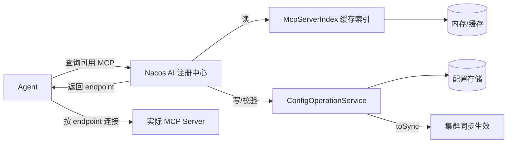

# Rank 91：alibaba/nacos 源码级调研报告

## 1. 项目概述与定位

- **项目名称**：Nacos（GitHub: https://github.com/alibaba/nacos ）
- **Star 数**：约 33.4k（快照值）
- **主要语言**：Java（Spring Cloud Alibaba 生态核心）
- **一句话定位**：原本是阿里开源的**动态服务发现 + 配置中心**（微服务基础设施），3.0 起扩展为 **AI 注册中心**——统一注册与发现 MCP Server / 工具 / Agent(A2A) / Prompt / Skill 等 AI 运行时资源。
- **目标用户/场景**：使用 Spring Cloud / Dubbo 的云原生团队；3.0 后面向**多 Agent 系统的治理方**——需要把散落的 MCP Server、AgentCard 集中注册、版本管理、权限控制与热更新的平台团队。
- **项目成熟度**：非常高。Apache 2.0，阿里长期维护，国内微服务事实标准之一；`ai/` 模块是 3.0 新能力，仍在快速迭代（测试文件如 `McpServerOperationServiceTest.java` 达 53KB，说明 MCP 注册逻辑覆盖充分）。
- **分类说明**：**非 Agent 项目**。Nacos 本身不跑 LLM、不做工具调用决策，而是作为 Agent 生态的"服务治理基础设施"被 Agent 查询调用。本报告重点分析其 AI 注册中心的源码设计，以及其久经考验的稳定性/高可用机制对 Agent 平台的借鉴价值。

## 2. 源码结构总览

```
nacos/
├── ai/                      # ★ 3.0 新增：AI / MCP 注册中心模块
│   └── src/main/java/com/alibaba/nacos/ai/
│       ├── service/         # ★ 核心业务服务
│       │   ├── McpServerOperationService.java     # MCP Server 增删改查
│       │   ├── McpToolOperationService.java      # 工具注册
│       │   ├── McpEndpointOperationService.java  # endpoint 转换(HTTP/RPC→MCP)
│       │   ├── McpServerSyncEffectService.java   # 发布后同步生效
│       │   └── ConfigQueryChainService.java       # 配置查询链
│       ├── index/          # ★ 索引层
│       │   ├── McpServerIndex.java               # 索引接口
│       │   ├── CachedMcpServerIndex.java         # 带缓存的索引
│       │   └── MemoryMcpCacheIndex.java          # 内存缓存索引
│       ├── remote/handler/ # 长连接/集群同步 handler
│       └── utils/          # McpConfigUtils / McpProtocolUtils / McpRequestUtil
├── address/                # 服务器地址管理
├── config/                # 原生配置中心模块（Nacos 的根基）
├── core/                   # 注册核心（Distro/Raft 一致性协议）
├── console/               # 控制台
└── api/                    # 对外 API 模型（com.alibaba.nacos.api.ai.model.mcp.*）
```

**核心源码文件（本次实际读取）**：`ai/src/main/java/com/alibaba/nacos/ai/service/McpServerOperationService.java`（全文）；从测试目录结构确认 `index/CachedMcpServerIndex.java`、`MemoryMcpCacheIndex.java`、`utils/McpConfigUtils.java`、`McpProtocolUtils.java` 的存在与职责。

**入口/启动**：标准 Spring Boot 应用，`Nacos` server 启动；MCP 注册能力通过 `console` 与 OpenAPI（`/v3/console/ai/mcp/...`）暴露，Agent 侧通过 SDK/HTTP 查询 MCP Server 元数据后再连接实际 MCP 端点。

**代码规模**：Nacos 为大型 Java 多模块项目（数十个子模块、数千个类），`ai/` 模块为其中新增子模块。

## 3. 系统架构分析

**编排模式：不适用**（非 Agent 运行时）。Nacos 是**元数据注册中心**，不做 ReAct/Plan 等推理编排；它回答的是"有哪些 MCP Server / Agent 可用、在哪、哪个版本"这类**服务发现**问题。

**核心架构思想（源码确认）：复用配置中心存储 AI 元数据**。从 `McpServerOperationService` 可清楚看到，一个 MCP Server 在 Nacos 中由**三份配置**表示（类注释原文）：
1. `McpServerVersionInfo`——MCP Server 版本信息（名称、ID、协议、能力、版本列表）；
2. `McpServerDetailInfo`（即 `McpServerStorageInfo`）——某版本的详细描述；
3. `McpToolSpecification`——该版本包含的工具信息。

`createMcpServer()` 中两次调用 `configOperationService.publishConfig(...)` 把这两份配置（版本索引 + 详细规格）写入 Nacos 配置中心，再调 `syncEffectService.toSync(...)` 让变更在集群内生效。**这意味着 AI 注册中心没有另起一套存储，而是把 MCP/Agent 元数据当作"配置"托管在成熟的配置中心上**——直接继承了 Nacos 配置中心的持久化、集群同步、灰度、监听推送能力。

**多版本模型（源码确认）**：`McpServerVersionInfo.versions` 是 `List<ServerVersionDetail>`，发布时遍历把目标版本 `setIs_latest(true)`、其余 `setIs_latest(false)`，并维护 `latestPublishedVersion` 指针。这是一个典型的**软件仓库式版本管理**（类似 npm/Docker registry 的 latest 指针）。

**索引与缓存分离（源码确认）**：
- 写路径走 `ConfigOperationService`（落库）；
- 读路径走 `McpServerIndex`（`CachedMcpServerIndex` / `MemoryMcpCacheIndex`）做按名称模糊搜索与按 ID 查询；
- 每次 DB 写操作后调 `invalidateCacheAfterDbOperation()` / `invalidateCacheAfterDbUpdateOperation()` 主动失效相关缓存（按 name 和 id 两个维度）。

**数据流**：


**关键类/函数（源码确认）**：
- `McpServerOperationService.createMcpServer()/updateMcpServer()/deleteMcpServer()`（`ai/.../service/McpServerOperationService.java`）；
- `resolveMcpServerId(namespaceId, name, id)`——按名称反查 ID；
- `invalidateCacheAfterDbOperation()/invalidateCacheAfterDbUpdateOperation()`——缓存失效；
- `endpointOperationService.createMcpServerEndpointServiceIfNecessary()`——把 MCP Server 关联到一个 Nacos 服务实例（实现存量 HTTP/RPC 服务零代码转 MCP）。

## 4. 功能拆解

- **MCP Registry**：注册 MCP Server（stdio / SSE / streamable-http 协议）、其工具清单（`McpToolSpecification`）、endpoint（`McpEndpointSpec`）、能力（`McpCapability`）。
- **存量服务转 MCP**：`McpEndpointOperationService` 把已注册的 HTTP/RPC 微服务关联为 MCP endpoint，无需为 AI 重写服务。
- **Agent / Prompt / Skill Registry**：同构思路（架构说明，文档确认）——A2A AgentCard 查询、Prompt 与 Skill 的版本化注册。
- **版本 / 标签 / 命名空间**：`namespaceId` 隔离多租户；版本列表 + `is_latest` 指针；`buildMcpServerVersionConfigTags` 打标签支持模糊检索。
- **控制面 OpenAPI + 控制台**：增删改查走 REST，console 提供可视化管理。

## 5. 技术亮点与优势

1. **AI 注册中心 = 配置中心的自然延伸**：不另造存储，把 MCP 元数据当配置托管，直接复用配置中心的持久化、长连接推送、灰度发布。源码上 `createMcpServer` 就是两次 `publishConfig`，成本极低。
2. **写后主动失效缓存的读优化**：`CachedMcpServerIndex` + `MemoryMcpCacheIndex` 提供高性能读，写后按 name/id 双维度 `removeMcpServerByName/ById` 失效，且失效本身包 try-catch 只 warn 不阻断主流程。
3. **强校验前置**：创建时强制 `version` 必填、自定义 ID 必须符合 UUID 模式、重名冲突抛 `RESOURCE_CONFLICT`、未找到抛 `MCP_SERVER_NOT_FOUND`——把脏数据挡在入口。
4. **久经考验的微服务一致性底座**：Nacos 原生提供 AP（Distro，临时实例）与 CP（Raft/JRaft，配置）两套一致性协议，这是它能做"注册中心"的根本。

## 6. 稳定性机制【重点】

> 说明：Nacos 不是 Agent，无 LLM/工具调用层面的错误处理。以下为其**作为注册中心基础设施**的稳定性设计。

- **参数强校验（源码确认）**：`createMcpServer` 中 `version` 为空抛 `PARAMETER_VALIDATE_ERROR`；自定义 `id` 不符合 UUID 正则抛错；重名抛 `RESOURCE_CONFLICT`（409）；`getMcpServerVersionInfo` 查不到抛 `MCP_SERVER_NOT_FOUND`（404）。错误码语义清晰。
- **缓存失效容错（源码确认）**：`invalidateCacheAfterDbOperation` 整个包在 `try { ... } catch (Exception e) { LOGGER.warn(...) }`——**缓存清理失败不回滚、不影响写操作成功**，只记录 warn。这是一种"最终一致优先于强一致"的稳健取舍。
- **写路径走配置中心事务**：两次 `publishConfig` 落库，`setUpdateForExist(FALSE)` 控制新建语义；删除时级联删工具（`toolOperationService.deleteMcpTool`）、删 endpoint、删 server spec config、删 version config，保证元数据不残留孤儿。
- **集群生效同步**：`syncEffectService.toSync(configForm, startOperationTime)` 记录开始时间并异步同步到集群，避免写操作阻塞在跨节点复制上。
- **底层一致性（架构确认，文档）**：配置存储走 JRaft 多数派提交保证持久化与一致性；临时实例走 Distro 协议最终一致，节点宕机不丢注册。

## 7. 高可用机制【重点】

> 说明：非 Agent，无熔断/背压等 Agent 运行时概念。以下为其分布式高可用设计。

- **AP/CP 双协议**：临时实例用 Distro（AP，高可用优先），配置用 Raft（CP，强一致优先）——按数据特性选一致性级别。
- **集群无单点**：Nacos server 以集群部署，任一节点宕机由其余节点接管；客户端内置负载均衡与失败转移。
- **读多写少的缓存架构**：`CachedMcpServerIndex` + `MemoryMcpCacheIndex` 把高频"查询可用 MCP"读请求挡在内存层，DB 仅承担写与缓存重建压力。
- **长连接推送**：配置/服务变更通过长连接实时推送给订阅方，避免客户端轮询。
- **可观测**：完整的 metrics、console 控制台、`Loggers` 分类日志体系（`address/misc/Loggers.java` 模式贯穿全项目）。

## 8. 自我进化机制【重点】

**不适用**。Nacos 是静态注册中心，本身**没有任何自反思、自反馈、自学习能力**：
- MCP Server / Agent 的注册信息靠人或 CI 主动上报，Nacos 不会自动发现新工具、不会评估工具质量、不会从调用结果优化注册项；
- 它不做 LLM 调用，无输出评分、无行为调整。
- 唯一接近"进化"的是**版本化 + 热更新**：`is_latest` 指针让注册项可灰度演进，但演进动作由人驱动，非自动。

## 9. openmate 可借鉴点【重点】

- **P0｜把"可调用能力"元数据当配置托管，而非另造数据库**：openmate 的工具/MCP/技能注册表，可仿 Nacos 用一份"配置存储 + 读缓存索引"结构。写：每次注册落一份带版本的 spec；读：走内存索引，写后按 name/id 双维度失效缓存。预期：注册表查询快、且天然支持版本与热更新。
- **P0｜写后主动失效缓存，且失效失败只 warn 不阻断**：openmate 工具列表在运行时常被高频读取，应缓存；每次工具变更后主动 invalidate，且 invalidate 包 try-catch，不因缓存清理异常拖垮主流程。预期：读性能与写可用性兼得。
- **P1｜注册即强校验前置**：注册工具/Agent 时强制必填项、ID 格式、重名冲突、版本必填，把错误挡在入口并返回语义化错误码（NOT_FOUND / CONFLICT / INVALID_PARAM）。预期：减少运行时"工具名拼错才报错"的延迟失败。
- **P1｜latest 指针 + 版本列表**：openmate 若支持多版本工具/prompt，维护 `versions[]` + `is_latest` 布尔 + `latestPublishedVersion` 指针，支持灰度切换旧版本回滚。预期：工具升级可灰度、可回退。
- **P2｜存量能力零改造接入**：openmate 若已有 HTTP API，可仿 `McpEndpointOperationService` 把现有 API 自动包装成 Agent 可调用的工具/endpoint，而不必为 Agent 重写。预期：复用已有后端能力。

## 10. 源码验证标注

**源码直接阅读（cdn.jsdelivr.net @master）**：
- `ai/src/main/java/com/alibaba/nacos/ai/service/McpServerOperationService.java` 全文：三份配置模型、`createMcpServer/updateMcpServer/deleteMcpServer`、UUID/版本/重名校验、`publishConfig` 落库、`syncEffectService.toSync`、`resolveMcpServerId`、`invalidateCacheAfterDbOperation/Update`（含 try-catch warn）、endpoint 关联逻辑。
- 测试目录结构确认 `index/CachedMcpServerIndex.java`、`MemoryMcpCacheIndex.java`、`utils/McpConfigUtils.java`、`McpProtocolUtils.java`、`remote/handler/*RequestHandler.java` 的存在与命名。
- `README.md` 确认 Nacos 四大原生功能定位。

**来自文档/推断**：
- Agent Registry / Prompt Registry / Skill Registry 的具体实现类未逐行读（本次仅深入 MCP 注册主服务），依据官方文档 `nacos.io/docs/v3.0/overview` 与已查证架构说明。
- Distro / JRaft 一致性协议的具体实现未在本次 `ai/` 模块展开，依据 Nacos 长期公开架构资料。
- `McpServerIndex` 接口内部结构、`syncEffectService.toSync` 的跨节点同步细节未逐行读。

**源码不可得/未深入**：`CachedMcpServerIndex` 内部缓存算法、`McpProtocolUtils` 的协议转换细节、`McpEndpointOperationService` 的存量服务转 MCP 完整实现，建议后续单独精读。
