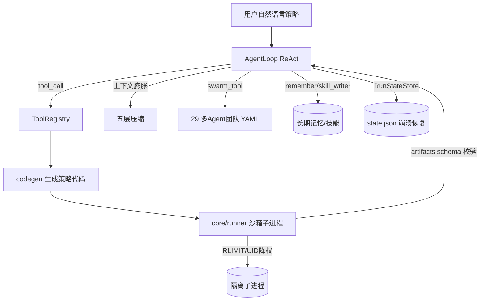

# Rank 92：HKUDS/Vibe-Trading 源码级调研报告

## 1. 项目概述与定位

- **项目名称**：Vibe-Trading（GitHub: https://github.com/HKUDS/Vibe-Trading ）
- **Star 数**：约 33.3k（快照值）
- **主要语言**：Python（CLI/TUI + FastAPI Web 服务 + MCP Server）
- **一句话定位**：港大数据科学实验室（HKUDS）出品的**个人量化交易 Agent**——用户用自然语言描述策略，Agent 自己写代码、拉市场数据、跑回测，并可调度 29 个预构建多 Agent 团队协作决策。
- **目标用户/场景**：个人/小型团队量化研究者；想用自然语言快速验证 A股/港美股/加密/期货/外汇策略，又要严格风控与可审计的场景。
- **项目成熟度**：高。模块化 Python 工程，测试覆盖广（`agent/tests/` 下 30+ 测试，含 `test_engine_robustness`、`test_path_safety`、`test_file_tool_sandbox_security`、`test_shadow_codegen_security`、`test_security_auth_api` 等安全专项），README 提供中/韩/英多语言。
- **分类**：领域 Agent 应用（金融/量化交易），编排模式 ReAct 内核 + Swarm 多 Agent。

## 2. 源码结构总览

```
Vibe-Trading/
├── agent/
│   ├── cli.py                 # ★ CLI 入口（100KB，命令行主控）
│   ├── mcp_server.py          # MCP Server 模式（把能力暴露给外部 Agent）
│   ├── SKILL.md               # agentskills.io 技能说明
│   └── src/
│       ├── agent/             # ★ ReAct 内核
│       │   ├── loop.py        # ★ AgentLoop 主循环（29KB）
│       │   ├── context.py    # ContextBuilder 上下文构建
│       │   ├── grounding.py   # GroundingLedger  grounding 台账
│       │   ├── memory.py      # WorkspaceMemory
│       │   ├── skills.py      # 技能加载
│       │   ├── tools.py      # ToolRegistry
│       │   ├── trace.py      # TraceWriter
│       │   └── progress.py   # HeartbeatTimer 心跳
│       ├── core/
│       │   ├── runner.py     # ★ 回测子进程沙箱执行器（9KB）
│       │   └── state.py       # RunStateStore 运行状态持久化
│       ├── preflight.py       # ★ 启动前置体检
│       ├── memory/persistent.py  # 跨会话长期记忆
│       ├── providers/         # LLM 适配（llm.py / chat.py / openai_codex / copilot）
│       ├── session/           # 会话事件/模型/搜索/服务
│       ├── backtest/         # 7 类回测引擎 + runner + validation
│       └── swarm/           # ★ 多 Agent：presets/*.yaml + tools/*
│           └── presets/      # 29 个团队（quant_strategy_desk / crypto_research_lab…）
├── frontend/                  # React/TSx（Agent.tsx 33KB）
└── README*.md
```

**核心源码文件（本次实际读取）**：`agent/src/agent/loop.py`（前 ~4000 行级字节）、`agent/src/preflight.py`（全文）、`agent/src/core/runner.py`（前 ~4000 字节）。从扁平文件清单确认 `memory/persistent.py`、`skills.py`、`swarm/tools/shadow_account_tool.py`、`remember_tool.py`、`skill_writer_tool.py`、`trade_journal_tool.py` 等存在与体积。

**入口/启动**：`cli.py` → 启动时先跑 `preflight.run_preflight()`（LLM 不通则阻塞启动）→ 进入 `AgentLoop`；Web 模式由 uvicorn workers 跑 `vibe-trading serve`。

## 3. 系统架构分析

**编排模式：ReAct（源码确认）**。`loop.py` 类注释首行即 `"""AgentLoop: ReAct core loop."""`。循环逻辑：把用户目标 + 工具 schema 送 LLM → 解析 tool_calls → 执行工具 → 结果回灌 → 再请求，直到完成。**连续只读工具并行**：注释明确 "Read/write batching: consecutive readonly tools run in parallel via threads"，实现用 `concurrent.futures`。

**五层上下文管理（源码确认，loop.py 模块 docstring）**——这是该项目最有特色的设计：
1. **Layer 1 microcompact**：内存压力下裁剪旧工具结果；
2. **Layer 2 context_collapse**：把超长文本块折叠，**不调 LLM、零成本**（`COLLAPSE_TEXT_MIN=2400`、head 900 / tail 500）；
3. **Layer 3 auto_compact**：调 LLM 做结构化摘要，并有 **token-budget tail 保护**（`TAIL_TOKEN_BUDGET=20_000`，保住尾部最近对话）；
4. **Layer 4 compact tool**：模型显式调用 compact 工具触发 L3；
5. **Layer 5 iterative update**：第 N 次压缩在旧摘要上增量更新，而非从零重写。

**代码生成 + 沙箱执行数据流（源码确认）**：Agent 生成 Python 策略代码 → `core/runner.py` 以**独立子进程 + 沙箱**执行 → 校验 artifacts（equity.csv / metrics.csv / trades.csv 等 schema）→ 结果回灌 ReAct 循环。



**关键类/函数（源码确认）**：`AgentLoop`（`agent/loop.py`）；`Runner`（`core/runner.py`）；`preflight.run_preflight()`；`RunStateStore`（`core/state.py`）；`WorkspaceMemory`；`GroundingLedger`；`TraceWriter`；`HeartbeatTimer`。

## 4. 功能拆解

- **自然语言→策略代码→回测**：Agent 写代码，经 7 类引擎验证（A股 akshare/tushare、港美股 yfinance、加密 ccxt/OKX、期货、外汇）。
- **多 Agent 团队（Swarm）**：`swarm/presets/*.yaml` 声明式定义团队（投资委员会、量化台、加密台、风控委员会…），`swarm_tool.py`（21KB）负责派发与协调。
- **影子账户 / 审计台账**：`shadow_account_tool.py`（12.5KB）模拟下单；`trade_journal_tool.py`/`trade_journal_parsers.py` 做交易日志与审计。
- **可进化技能**：`skill_writer_tool.py`（12.3KB）让 Agent 写新技能、`load_skill_tool.py` 加载技能、`remember_tool.py` 写入记忆、`session_search_tool.py` 跨会话检索。
- **MCP Server**：`mcp_server.py` 把整个 Agent 能力以 MCP 协议暴露给外部 Agent。
- **前端**：React 面板 `Agent.tsx`（33KB）可视化运行、对比、设置。

## 5. 技术亮点与优势

1. **五层渐进式上下文压缩（零成本优先）**：先做不花钱的 microcompact/collapse，实在不行才调 LLM 摘要，且摘要时保留尾部 token 预算——把"上下文爆炸"的成本压到最低，还支持增量更新摘要。
2. **生成代码的纵深沙箱**：`core/runner.py` 对 Agent 生成的策略代码做 UID 降权（`vibe-sandbox` 用户）+ `RLIMIT_AS`（4GB 虚存）+ `RLIMIT_NOFILE`（512）+ 隔离 HOME（只软链 cache/data-bridge/qveris，`.env`、sessions.db、live mandate 台账不可见）+ 环境变量 allowlist（不继承 LLM/券商/实盘凭证）。这是"Agent 能写代码"类应用的安全范本。
3. **确定性计算防重复**：`_verification_ledger` 从历史中提取已通过的 `calc`/`verify_market_cap`/`verify_valuation` 结果，压缩后重新附上，避免模型在上下文被清后把同一道计算题重跑 5–9 遍。
4. **token 成本精细化核算**：`_record_llm_usage` 逐轮记录 input/output/total + `cache_read_tokens`/`cache_creation_tokens`，原子写入 `llm_usage.json`（tmp + replace）。

## 6. 稳定性机制【重点】

- **启动前置体检（源码确认，preflight.py）**：`run_preflight()` 依次检查 LLM provider、OKX、yfinance、tushare、akshare、ccxt。每项返回 `CheckResult(name, status, message, impact, critical)`。**LLM 不通是 critical，阻塞启动**；数据源不通只是 warning（功能降级）。LLM 检查还会 TCP ping base_url（10s 超时），并对 openai-codex / copilot 走各自 OAuth 状态校验。
- **流式重试 + 指数退避（源码确认）**：`_stream_retry_backoff_s(streak)` 按连续失败次数翻倍（1s, 2s, 4s…），指数封顶 62 次、延迟封顶 `_stream_retry_max_delay_s()`，避免持续宕机时按固定节奏烧光重试预算。
- **LLM 调用级超时（源码确认）**：`_llm_timeout_seconds()` 给每次 LLM 调用设硬超时——否则 provider 静默卡死时 ReAct 循环或 auto-compact 会无限悬挂。
- **僵尸看门狗（源码确认）**：`_stall_timeout_seconds()`：一个 run 若长时间无前进（无 LLM 完成、无工具结果）就判为 zombie，显式失败而非永远 "running"。注释明确"心跳不算进展，挂起的工具仍在发心跳，正是看门狗要抓的"。
- **空响应兜底（源码确认）**：`MAX_CONSECUTIVE_EMPTY_RESPONSE_SKIPS=1`，LLM 偶发返回空时 nudge 重试一次，连续两次才判失败。
- **内容过滤熔断（源码确认）**：`compute_content_filter_warnings` + `MAX_CONSECUTIVE_CONTENT_FILTER_SKIPS`，被内容过滤连续拦截超限则终止。
- **原子写 + 运行状态持久化**：`_record_llm_usage` 用 `tmp_path.write_text` + `tmp_path.replace(path)` 原子替换，避免半写坏文件；`RunStateStore`（`core/state.py`）落 state.json 支撑崩溃恢复。
- **敏感信息脱敏**：`redact_payload` / `redact_tool_result` 对进入 trace 的载荷脱敏。

## 7. 高可用机制【重点】

- **生成代码进程隔离**：Agent 写的回测代码在独立子进程跑，崩溃/OOM（RLIMIT_AS 4GB）不拖垮主 Agent 循环；exit_code != 0 即 `success=False` 回传错误，不污染主流程。
- **避免 preexec_fn 多线程崩溃（源码确认）**：注释记录——`preexec_fn` 在 fork/exec 间跑 Python 字节码，父进程多线程（uvicorn workers + 后台 agent loop）时是 POSIX 未定义行为，aarch64/glibc2.34 会 SIGSEGV。改为 **exec 后在单子进程里执行 setrlimit 的 bootstrap**，跨平台安全。这是真实生产踩坑沉淀。
- **降级而非硬失败**：数据源不可达只是 `impact="xxx backtest unavailable"` warning；沙箱软链失败降级为 copy，copy 再失败也只是 loader 回退到实时抓取。
- **并行只读工具**：连续只读工具用线程池并行，加速长任务。
- **心跳**：`HeartbeatTimer` + `ProgressEvent` 让长时间运行对 UI 有进度反馈。
- **多数据源互为备份**：A股有 akshare/tushare/东财/新浪多通道，单源限流（各 `*_MIN_INTERVAL` 限流参数）可切换。

## 8. 自我进化机制【重点】

- **可写技能库（源码确认）**：`skill_writer_tool.py`（12.3KB）让 Agent 把验证过的策略/流程沉淀为新技能（写盘），`load_skill_tool.py` 后续按需加载——这是**技能级进化**。
- **跨会话长期记忆（源码确认）**：`remember_tool.py` + `memory/persistent.py`（7.9KB）+ `session_search_tool.py`（11.7KB）构成"记下来—跨会话检索"闭环；`WorkspaceMemory` 管理工作区短期记忆。
- **确定性结果台账（类反思）**：`_verification_ledger` 把"已验证过的计算"结构化保留，避免重复劳动，相当于对历史的反思性复用。
- **影子账户复盘**：`shadow_account_tool` + `trade_journal_tool` 把模拟交易结果落为可审计台账，供后续对照（用户反馈/结果闭环的基础）。
- **评估回路**：回测引擎产出 metrics（sharpe/max_drawdown/win_rate 等 schema 化指标），作为策略优劣的客观评分，Agent 据此迭代策略。
- **不足**：未见自动 A/B 测试或从用户点赞自动调 prompt 的闭环，进化主要靠"沉淀技能 + 记忆 + 回测指标"。

## 9. openmate 可借鉴点【重点】

- **P0｜五层渐进式上下文压缩，先免费后付费**：openmate 长会话必遇上下文爆炸。直接照搬策略：先做不调 LLM 的 microcompact（裁剪旧工具结果）和 context_collapse（折叠长文本），真不够再调 LLM 摘要；摘要时保留尾部 token 预算；多次摘要在旧摘要上增量更新。预期：成本大幅下降且不丢近期上下文。
- **P0｜三层超时：LLM 调用级 + 僵尸看门狗 + 流式指数退避**：openmate 的 Agent 循环必须给每次 LLM 调用设硬超时（防静默卡死），给整个 run 设无进展看门狗（防 zombie），流式失败按 1/2/4s 封顶退避。预期：杜绝"任务永远 running"。
- **P0｜执行 Agent 生成代码必须沙箱隔离**：openmate 若允许 Agent 写脚本/执行命令，照搬 runner.py：独立子进程 + 资源上限（内存/文件描述符）+ HOME 隔离 + 环境变量 allowlist（不把 API key/实盘凭证传给生成代码）+ 只暴露必要目录。预期：安全且崩溃隔离。
- **P1｜启动前置体检分级（critical vs warning）**：openmate 启动时检查模型连通性（不通阻塞）、各数据源/工具（不通降级 warning 并说明影响）。预期：用户一眼看清"哪些能用、哪些缺了会怎样"。
- **P1｜确定性结果台账防重复**：openmate 把已算出的关键结论（计算结果、外部查询）记成"已验证"行，压缩后重新附上，避免模型重复劳动。预期：省钱省时间。
- **P1｜原子写 + 结构化 token 账本**：openmate 的状态/用量文件用 tmp+rename 原子写；逐轮记 token（含 cache read/create）落盘。预期：不写坏文件、成本可审计。
- **P2｜技能自我沉淀**：让 Agent 把验证过的流程写成可加载技能，跨会话复用。预期：越用越强。

## 10. 源码验证标注

**源码直接阅读（raw.githubusercontent.com @main）**：
- `agent/src/preflight.py` 全文：`CheckResult`、`run_preflight()`、LLM/OKX/yfinance/tushare/akshare/ccxt 检查、critical 分级、TCP ping、oauth 状态。
- `agent/src/agent/loop.py` 前 ~4000 字节：五层上下文压缩 docstring、并行只读工具、`_stream_retry_backoff_s` 指数退避、`_llm_timeout_seconds`、`_stall_timeout_seconds` 僵尸看门狗、`MAX_CONSECUTIVE_EMPTY_RESPONSE_SKIPS`、内容过滤、原子写 `_record_llm_usage`、`_verification_ledger`、`_summary_chunks` 无损分块、常量（TAIL_TOKEN_BUDGET/COLLAPSE_*）。
- `agent/src/core/runner.py` 前 ~4000 字节：`vibe-sandbox` UID 降权、`_SANDBOX_HOME_REEXPOSE`、RLIMIT_AS/NOFILE、post-exec bootstrap（preexec_fn 踩坑注释）、环境 allowlist `_copy_runtime_env`、artifacts schema。
- 扁平文件清单确认 `memory/persistent.py`、`swarm/tools/{shadow_account,remember,skill_writer,trade_journal}_tool.py`、`swarm/presets/*.yaml`、`mcp_server.py`、`grounding.py`、`RunStateStore` 的存在与体积。

**来自文档/推断**：
- 29 个多 Agent 团队的具体角色分工、mandate 约束、sentinel kill switch 的实现细节，依据架构说明与工具文件命名（`swarm_tool.py`、preset YAML），未逐行读 `swarm/runtime.py` 与各 preset。
- 回测 7 引擎内部实现未展开。
- `skill_writer_tool`/`remember_tool` 的具体存储格式未逐行读。

**源码不可得/未深入**：`swarm/runtime.py`（worker 级 backoff）、`grounding.py`、`memory/persistent.py`、各 preset YAML 的角色定义，建议后续精读。
