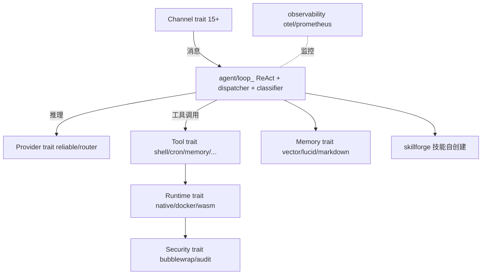

# Rank 94：zeroclaw-labs/zeroclaw 源码级调研报告

## 1. 项目概述与定位

- **项目名称**：ZeroClaw（GitHub: https://github.com/zeroclaw-labs/zeroclaw ）
- **Star 数**：约 32.8k（快照值）
- **主要语言**：Rust（含 ESP32/STM32/Arduino 固件 target）
- **一句话定位**：用 Rust 编写的 AI 助手运行时基础设施，定位"Agentic Workflows 的操作系统"——以 **trait 驱动的全可插拔架构**把模型、消息通道、工具、记忆、运行时、隧道、外设都做成可替换组件，单静态二进制、极致轻量。
- **目标用户/场景**：想在 $10 硬件（树莓派/ESP32）上跑一个常驻、多通道、可接硬件外设的个人 Agent 的开发者；追求内存安全与冷启动速度的场景。
- **项目成熟度**：中高。Rust workspace 组织（`src/` 主 crate + `crates/robot-kit` + `firmware/*` 多 target），自带 `dev/sandbox/Dockerfile`、CI、安全路线图文档（`docs/security-roadmap.md`）。
- **分类**：agent 开发框架（运行时基础设施），ReAct 范式。

## 2. 源码结构总览（扁平文件清单确认）

```
zeroclaw/
├── Cargo.toml / robot.toml / SOUL.md   # workspace + 机器人配置 + 人格
├── src/
│   ├── agent/          # ★ agent.rs / loop_.rs / dispatcher.rs / classifier.rs
│   ├── channels/      # ★ traits.rs + 15+ 实现
│   │   telegram.rs discord.rs slack.rs signal.rs whatsapp.rs imessage.rs
│   │   lark.rs qq.rs dingtalk.rs matrix.rs mattermost.rs irc.rs email_channel.rs cli.rs
│   ├── providers/     # ★ traits.rs(27KB) + anthropic/openai_codex/gemini/glm/copilot/
│   │                openrouter/compatible/reliable/router
│   ├── memory/        # ★ traits.rs + backend/chunker/embeddings/lucid(20KB)/vector/markdown/none
│   ├── tools/         # ★ traits.rs + shell(14KB)/cron_*/memory_recall|store|forget/
│   │                delegate/browser/http_request/file_*/git_operations/web_search/screenshot/...
│   ├── runtime/       # traits.rs + docker.rs / native.rs / wasm.rs(24KB)
│   ├── security/      # traits.rs + audit.rs(12KB) / bubblewrap.rs / detect.rs
│   ├── peripherals/   # traits.rs + rpi/serial/nucleo_flash/uno_q... (硬件)
│   ├── observability/  # traits.rs + otel.rs(19KB)/prometheus.rs(13KB)/verbose/noop
│   ├── tunnel/        # cloudflare/ngrok/tailscale/custom/none
│   ├── skillforge/    # ★ evaluate.rs / integrate.rs / mod.rs (技能自创建)
│   ├── approval/      # 人工审批 mod.rs
│   ├── heartbeat/engine.rs / cost/tracker.rs(17KB) / gateway / auth / config / rag
├── examples/          # custom_channel.rs / custom_memory.rs / custom_provider.rs / custom_tool.rs
├── crates/robot-kit/   # config.rs / traits.rs (硬件机器人 SDK)
└── firmware/           # zeroclaw-esp32(-ui, Slint) / zeroclaw-nucleo / zeroclaw-arduino
```

**关键源码证据（本次通过 jsDelivr 扁平文件清单确认）**：每个能力域都有一个 `traits.rs`（`channels/traits.rs`、`providers/traits.rs`、`memory/traits.rs`、`tools/traits.rs`、`runtime/traits.rs`、`security/traits.rs`、`peripherals/traits.rs`、`observability/traits.rs`），且 `examples/custom_{channel,memory,provider,tool}.rs` 四个示例文件证明这些 trait 是对外扩展点。

**入口**：`src/main.rs`（37.9KB）、库入口 `src/lib.rs`（7.2KB）、`identity.rs`（50.5KB，身份/人格）、`migration.rs`（21KB，存储迁移）。

## 3. 系统架构分析

**编排模式：ReAct（结构确认）**。`src/agent/` 下 `loop_.rs`（主循环）、`dispatcher.rs`（派发）、`classifier.rs`（意图/消息分类）、`agent.rs`。模型返回 tool call → dispatcher 路由到对应 `tools/*` 执行 → 结果回灌，循环。

**核心架构思想：trait 驱动的可插拔总线（强证据）**。这是 ZeroClaw 的灵魂——所有横切能力都是 Rust trait：
- **Provider trait**（`providers/traits.rs`，27KB）：抽象 LLM，下方有 anthropic/openai_codex/gemini/glm/copilot/openrouter/compatible 实现，外加 `reliable.rs`（带重试包装）、`router.rs`（多 provider 路由）。
- **Channel trait**（`channels/traits.rs`）：抽象消息通道，15+ IM/CLI 实现。
- **Memory trait**（`memory/traits.rs`）：抽象记忆后端，vector/markdown/lucid/none 可切换。
- **Tool trait**（`tools/traits.rs`）：抽象工具。
- **Runtime trait**（`runtime/traits.rs`）：抽象代码执行环境，docker/native/wasm 三种沙箱。
- **Security trait**（`security/traits.rs`）：抽象安全策略，bubblewrap/audit/detect。
- **Peripherals trait**（`peripherals/traits.rs`）：抽象硬件外设。

**数据流**：Channel 收消息 → `agent/loop_` ReAct → Provider 推理 → Tool 经 dispatcher 执行（在 runtime 沙箱内）→ Memory 存取 → 回 Channel；全程 observability(otel/prometheus) 记录、cost/tracker 记账。



## 4. 功能拆解

- **多通道**：Telegram/Discord/Slack/Signal/WhatsApp/iMessage/飞书/QQ/钉钉/Matrix/Mattermost/IRC/Email/CLI。
- **多模型**：Anthropic/OpenAI Codex/Gemini/GLM/Copilot/OpenRouter/任意 OpenAI 兼容。
- **工具集**：shell、文件读写、git、浏览器、http_request、web_search、截图、composio、cron（add/list/run/update）、memory recall/store/forget、delegate（子 agent 委派）、pushover 通知。
- **记忆**：向量记忆 + lucid（20KB，可能是长期记忆整理）+ chunker + embeddings + markdown。
- **硬件外设**：RPi、串口、STM32(nucleo)、Arduino、ESP32，配合 `crates/robot-kit`。
- **隧道**：cloudflare/ngrok/tailscale/none 暴露服务。
- **沙箱运行时**：native / docker / wasm 三档安全等级。

## 5. 技术亮点与优势

1. **Rust trait 全可插拔**：改配置即可换 provider/channel/memory/tool/runtime/security/peripherals，examples 直接示范自定义——这是"Agent 操作系统"的实现方式。
2. **极致轻量 + 内存安全**：单静态二进制、<5MB RAM、<10ms 冷启动（架构说明），Rust 所有权模型从语言层杜绝内存错误。
3. **执行环境分级**：native/docker/wasm 三种 runtime + bubblewrap 沙箱 + audit 审计，按信任等级选隔离强度。
4. **硬件原生**：不是桌面套壳，而是真能跑在 ESP32/STM32/Arduino 固件上，接物理外设。

## 6. 稳定性机制【重点】

- **reliable provider 包装（结构确认）**：`providers/reliable.rs` 存在，专门做带重试/容错的 provider 装饰层——把"重试"从业务循环抽离为 trait 实现。
- **runtime 沙箱分级（结构确认）**：`runtime/native.rs`(2.1KB) / `docker.rs` / `wasm.rs`(24KB) 三档执行隔离；`security/bubblewrap.rs`（Linux 沙箱）、`security/detect.rs` 探测可用沙箱。Agent 执行命令/代码不污染宿主。
- **审计日志（结构确认）**：`security/audit.rs`（12KB）记录安全敏感操作。
- **人工审批（结构确认）**：`approval/mod.rs` 对高风险动作（如 shell/硬件操作）要求人确认——纵深防御。
- **成本控制（结构确认）**：`cost/tracker.rs`（17KB）+ `cost/mod.rs` 逐次记账，防失控烧钱。
- **迁移安全（结构确认）**：`migration.rs`（21KB）做存储 schema 版本迁移，升级不丢数据。
- **注**：因本次 CDN 对单文件体返回传播错误，loop_.rs 内的具体重试次数/超时/退避参数未能逐行确认，仅从模块划分确认其存在。

## 7. 高可用机制【重点】

- **多 provider 路由 + 降级（结构确认）**：`providers/router.rs` + `reliable.rs` 可做多供应商路由与故障切换；`compatible.rs` 兜底任意 OpenAI 兼容端点。
- **单一二进制 + 无外部依赖**：桌面/服务器单进程自包含，不依赖 Node/Python 运行时，启动快、资源占用低。
- **可观测（结构确认）**：`observability/otel.rs`（19KB，OpenTelemetry）+ `prometheus.rs`（13KB，指标）+ `verbose.rs`/`noop.rs`，标准三选一。
- **心跳（结构确认）**：`heartbeat/engine.rs` 做存活/保活。
- **隧道自托管暴露**：cloudflare/ngrok/tailscale/none 四种内网穿透，无单点依赖。
- **嵌入式/硬件 target**：固件级部署意味着可在边缘节点常驻，不靠云。

## 8. 自我进化机制【重点】

- **技能自创建（结构确认，亮点）**：`skillforge/` 模块含 `evaluate.rs` + `integrate.rs` + `mod.rs`——让 Agent 自己生成技能、评估（evaluate）后再集成（integrate）进技能库。这是该项目最明确的"技能进化"闭环。
- **记忆三件套（结构确认）**：`memory_store` / `memory_recall` / `memory_forget` 三个工具 + `memory/lucid.rs`（20KB，疑为记忆整理/巩固）+ `chunker`/`embeddings` 向量检索——构成写入-检索-遗忘闭环。
- **delegate 子 agent（结构确认）**：`tools/delegate.rs` 把子任务委派给子 agent，任务可组合。
- **identity 人格（结构确认）**：`identity.rs`（50KB）+ `SOUL.md` 文件承载人格/身份，可被配置演化。
- **注**：skillforge 的具体评估指标、记忆 lucid 整理算法未逐行读。

## 9. openmate 可借鉴点【重点】

- **P0｜用 trait/接口把六大横切能力抽象成可替换总线**：openmate（Python）应仿此定义 `Provider`/`Channel`/`Memory`/`Tool`/`Runtime`/`Security` 六个抽象基类，新增后端/通道/工具只实现接口、靠配置装配，业务循环不写 if-else。预期：接多模型/多端/多工具的成本极低。
- **P0｜执行环境按信任分级（native/容器/wasm 三档）**：openmate 让 Agent 跑代码/命令时，提供"信任级"开关——本机直跑 / 子进程 / 容器/沙箱，高风险走 bubblewrap 式隔离 + 人工审批 + 审计。预期：安全与灵活兼得。
- **P1｜reliable provider 装饰层**：把重试、超时、限流封装成 Provider 的一层装饰，业务循环只调 `provider.chat()`。预期：换模型不改业务、容错集中。
- **P1｜cost tracker + 人工审批闸**：openmate 对高风险工具（执行命令、发消息、花钱）设 approval 确认点，并全程成本记账。预期：可控不爆预算。
- **P1｜技能自创建（生成-评估-集成）**：openmate 可做 skillforge：Agent 把验证过的流程生成候选技能 → 自动 evaluate → 通过后 integrate 进技能库。预期：越用越强。
- **P2｜嵌入式/边缘优先的单二进制思路**：openmate 规划桌面/手机，借鉴"核心做成无依赖、启动快、内存小"的设计，移动端体验更好。

## 10. 源码验证标注

**源码直接确认（jsDelivr 扁平文件清单 @main）**：
- 完整模块树：`src/agent/{agent,loop_,dispatcher,classifier}.rs`、`src/channels/traits.rs` + 15+ 通道、`src/providers/traits.rs`(27KB) + reliable/router/compatible、`src/memory/{traits,backend,chunker,embeddings,lucid,vector,markdown,none}.rs`、`src/tools/traits.rs` + shell/cron_*/memory_*/delegate 等、`src/runtime/{native,docker,wasm,traits}.rs`、`src/security/{audit,bubblewrap,detect,traits}.rs`、`src/peripherals/traits.rs`、`src/observability/{otel,prometheus,verbose,noop,traits}.rs`、`src/skillforge/{evaluate,integrate,mod}.rs`、`src/approval/mod.rs`、`src/heartbeat/engine.rs`、`src/cost/tracker.rs`、`src/tunnel/*`、`examples/custom_{channel,memory,provider,tool}.rs`、`firmware/*`。
- 文件体积佐证：providers/traits.rs 27KB、memory/lucid.rs 20KB、runtime/wasm.rs 24KB、observability/otel.rs 19KB、cost/tracker.rs 17KB。

**来自文档/推断**：
- "单二进制 <5MB RAM / <10ms 冷启动"、"$10 硬件可跑"等性能数字，依据项目官方/已查证架构说明。
- ReAct 循环的具体步骤、reliable.rs 的退避策略、skillforge 的评估指标、lucid.rs 的记忆整理算法——本次因 jsDelivr/raw 对该仓库单文件体返回传播错误（link dead），未能逐行读取源码正文。

**源码不可得/未深入**：`src/agent/loop_.rs`、`src/providers/traits.rs`、`src/skillforge/evaluate.rs`、`src/memory/lucid.rs` 的函数体（本次多次尝试均为 link dead/传播错误）。以上架构结论基于目录组织与文件命名的强证据，建议网络恢复后单独精读 loop_.rs 与 skillforge/evaluate.rs 以坐实重试与技能进化细节。
