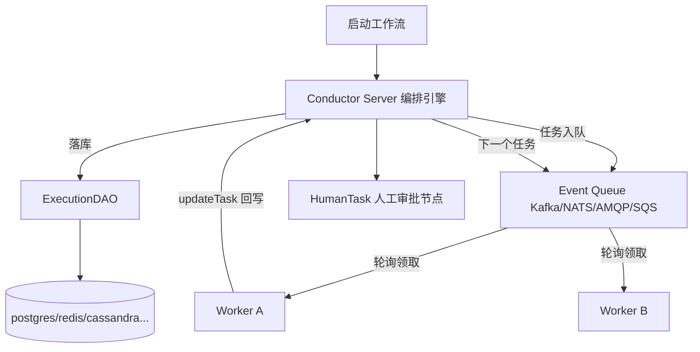

# Rank 96：conductor-oss/conductor 源码级调研报告

## 1. 项目概述与定位

- **项目名称**：Conductor（GitHub: https://github.com/conductor-oss/conductor ）
- **Star 数**：约 32.2k（快照值）
- **主要语言**：Java（Netflix 起源，多语言 Worker SDK）
- **一句话定位**：事件驱动的**持久化工作流引擎**（编排 DAG），3.x 起把"Agent 编排"做成一等公民——把每次 LLM 调用、工具调用、等待、重试、分支都当作**持久化工作流任务**运行。
- **目标用户/场景**：需要把 Agent 流程做成"崩溃自动恢复、失败自动重试、全程可观测"的生产级编排团队；已有 LangGraph/CrewAI/Google ADK/OpenAI Agent 想纳入工作流治理的团队。
- **项目成熟度**：非常高。Netflix 生产级基因，模块化 Maven 工程（postgres/redis/cassandra/sqlite/es6/es7/os 多种持久化 + amqp/kafka/nats/sqs 事件队列 contribs + grpc + java-sdk），测试以 Groovy Spock 集成测试为主（`test-harness/` 含大量 retry/rerun/restart 规格）。
- **分类**：多 Agent 编排平台，编排模式 Workflow-DAG。

## 2. 源码结构总览

```
conductor/
├── core/                # ★ 编排核心
│   └── src/main/java/com/netflix/conductor/
│       ├── dao/ExecutionDAO.java        # ★ 执行持久化接口
│       └── core/execution/mapper/      # EventTaskMapper / HumanTaskMapper
├── postgres-persistence/ # ★ 默认关系型持久化
├── redis-persistence/ / cassandra-persistence/ / sqlite-persistence/
├── es6-persistence/ / es7-persistence/ / os-persistence/   # 索引/搜索
├── amqp/                 # 队列 contribs（AMQPRetryPattern/RetryType）
├── grpc/ + grpc-server/  # gRPC workflow service
├── conductor-clients/java-sdk/   # Worker SDK（TaskRegistry / NonRetryableException）
└── docs/devguide/        # architecture（TaskFailure.png / tasklifecycle.md）
```

**核心源码文件（本次实际读取）**：`core/src/main/java/com/netflix/conductor/dao/ExecutionDAO.java`（全文）；从扁平清单确认 `NonRetryableException.java`、`HumanTaskMapper.java`、`AMQPRetryPattern.java`、`ConcurrentExecutionLimitDAO`、各 `*ExecutionDAO` 实现。

**入口/启动**：Conductor Server（Spring Boot）编排决策；Worker 端用 SDK 轮询 `getPendingTasksForTaskType` 领取任务执行。

## 3. 系统架构分析

**编排模式：Workflow-DAG（源码+架构确认）**。工作流定义是任务的有向无环图：fork/join/switch/do-while/event/human/sub-workflow 等系统任务节点。Server 维护 DAG 状态机，每完成一个任务就推进下游任务入队。

**核心架构思想：持久化即状态机（源码确认，ExecutionDAO）**。这是 Conductor 与内存态 Agent 框架的根本区别——**每个任务、每个工作流实例都落库**：
- `createWorkflow(WorkflowModel)` / `updateWorkflow` / `getWorkflow(includeTasks)`：工作流及其任务序列持久化；
- `createTasks(List<TaskModel>)` / `updateTask`：任务状态持久化；
- `getPendingTasksForTaskType(taskType)`：Worker 轮询领任务的来源；
- `getInProgressTaskCount` / `exceedsInProgressLimit`：并发上限控制。

**关键设计——任务幂等主键（源码确认，注释原文）**：`createTasks` 文档明确："For a given task reference name and retryCount should be considered unique/primary key"。即**同一 reference + 同一 retryCount 只落一条**，重试不会产生重复任务——这是崩溃恢复时不重复执行的关键。

**Server/Worker 分离**：Server 只做编排决策与持久化，不执行具体业务；Worker（用多语言 SDK 写）轮询领取 `in_progress` 任务执行后 `updateTask` 回写结果。



**关键类/函数（源码确认）**：`ExecutionDAO`（core/.../dao/ExecutionDAO.java）；`WorkflowModel`/`TaskModel`；`HumanTaskMapper`/`EventTaskMapper`；`NonRetryableException`（SDK）；`ConcurrentExecutionLimitDAO.exceedsLimit`。

## 4. 功能拆解

- **DAG 编排**：fork/join（含 permissive）、switch/decision、do-while/loop、sub-workflow、event task、human task、dynamic/fork、terminate。
- **Agent 作为任务（架构确认）**：把 LangGraph/CrewAI/Google ADK/OpenAI SDK 写的 Agent 编译为工作流任务，每次 LLM/工具调用都是持久化任务，可与分支/定时/人审组合。
- **人工审批**：`HumanTaskMapper` + `human-task.md`，工作流可暂停等人审。
- **事件触发**：`EventTaskMapper`，外部事件（Kafka/NATS/SQS）驱动工作流。
- **可插拔持久化/队列**：postgres/redis/cassandra/sqlite/es；kafka/nats/amqp/sqs。
- **重试/重跑/重启**：retry（按任务）、rerun（从某任务重跑）、restart（从失败处重启），测试规格专门覆盖。

## 5. 技术亮点与优势

1. **持久化即状态机，崩溃天然可恢复**：不像内存态 Agent 框架一崩全丢，Conductor 的每个任务都在 DB，Server 重启后从 `getPendingTasksForTaskType` 继续——这是把 Agent 流程"工程化"到生产级的核心。
2. **幂等重试主键**：referenceName+retryCount 唯一，重试/崩溃恢复不会重复执行副作用任务。
3. **Server/Worker 解耦 + 多语言 SDK**：编排与执行分离，Worker 可用任意语言写，水平扩展。
4. **成熟的工作流原语**：fork/join 并发、switch 分支、do-while 循环、human-in-loop、事件触发，二十年生产沉淀。

## 6. 稳定性机制【重点】

- **失败自动重试（源码确认）**：任务定义带重试策略；SDK 区分 `NonRetryableException`（不可重试，直接判失败）与可重试异常；`AMQPRetryPattern`/`RetryType` 定义重试模式。
- **幂等性（源码确认）**：`createTasks` 以 (referenceName, retryCount) 为主键，重复创建被唯一约束挡掉，重试不产生重复任务。
- **超时控制（架构/文档确认）**：`docs/devguide/how-tos/Tasks/task-timeouts.md` 专讲任务超时，任务可设超时，超时判失败走重试。
- **崩溃恢复（源码确认）**：工作流/任务全量落 `ExecutionDAO`；Server 宕机重启后，`getPendingTasksForTaskType` 重新派发 pending 任务，`test-harness` 的 `*RetrySpec`/`*RerunSpec`/`*RestartSpec` 大量覆盖恢复路径。
- **并发上限（源码确认）**：`ConcurrentExecutionLimitDAO.exceedsLimit(TaskModel)` + `getInProgressTaskCount`，防止某任务并发超限。
- **状态一致性**：postgres 实现用 `TransactionalFunction`/`ExecuteFunction` 包裹事务（`postgres/util/`），队列与持久化配合保证任务不漏不重。
- **TTL 清理（源码确认）**：`removeWorkflowWithExpiry(workflowId, ttlSeconds)` 自动清理过期工作流，防存储膨胀。

## 7. 高可用机制【重点】

- **Server 无状态化**：编排状态全在 DB，Server 可多实例水平扩展，前置负载均衡。
- **Worker 水平扩展**：Worker 轮询领任务，加 Worker 即加吞吐。
- **事件队列解耦**：Kafka/NATS/AMQP/SQS 作为任务队列，削峰填谷，Server 与 Worker 通过队列异步，不直连。
- **可插拔存储多副本**：redis/cassandra/postgres 各自带 HA 能力。
- **可观测**：`*Summary`（workflow_summary/task_summary）写入 ES/OS 供检索；QueueStats 监控队列深度；task lifecycle 文档完整。
- **去单点**：编排不依赖单节点内存，任一 Server 挂了其余节点从 DB 续跑。

## 8. 自我进化机制【重点】

**不适用/较弱**。Conductor 是确定性工作流引擎，**本身不做自反思/自学习**：
- 工作流由人或 Agent 用 SDK 定义，Conductor 忠实执行，不自动改 DAG；
- 它不评估任务输出好坏、不从失败自动优化策略。
- **最接近的"进化"是工程韧性而非智能进化**：重试、rerun/restart、human-in-loop 是"容错机制"，让流程能从失败中恢复，但不是自动变聪明。
- 当它编排 AI Agent 时，"进化"发生在被编排的 Agent 内部，Conductor 只负责把那次 LLM 调用持久化、可重试。

## 9. openmate 可借鉴点【重点】

- **P0｜把 Agent 的每一步都做成持久化任务（状态机落库）**：openmate 的 Agent 循环应把每轮 LLM 调用/工具调用记为带状态的持久化任务，而非只存对话历史。崩溃后能从"pending 任务"续跑。预期：长任务不再一崩全丢。
- **P0｜重试幂等：以 (步骤名, retryCount) 唯一**：openmate 设计任务表时，让同一逻辑步骤的多次重试靠 retryCount 区分主键，恢复时不重复执行有副作用的工具（如已下单不重复下单）。预期：恢复安全。
- **P0｜区分可重试 vs 不可重试异常**：openmate 的工具错误分两类——瞬时网络错误自动退避重试；业务/参数错误（NonRetryableException）直接失败不重试。预期：不浪费重试预算、不放大错误。
- **P1｜Server/Worker 分离 + 轮询领任务**：openmate 若做多端/多 Worker，编排内核独立，执行 Worker 轮询领任务、回写结果。预期：执行能力可水平扩展、可多语言。
- **P1｜human-in-loop 节点**：openmate 在高风险步骤（发消息/花钱/改系统）插入"等待人确认"的任务节点，工作流暂停等人审。预期：安全可控。
- **P2｜任务级超时 + 并发上限 + TTL 清理**：openmate 给每个工具调用设超时、给某工具设并发上限、过期 run 自动清理。预期：不卡死、不压垮下游、不膨胀存储。

## 10. 源码验证标注

**源码直接阅读**：
- `core/src/main/java/com/netflix/conductor/dao/ExecutionDAO.java` 全文：`createWorkflow/updateWorkflow/getWorkflow`、`createTasks/updateTask/removeTask`、`getPendingTasksForTaskType`、`getInProgressTaskCount`、(referenceName, retryCount) 唯一主键注释、`exceedsInProgressLimit`/`ConcurrentExecutionLimitDAO`、`removeWorkflowWithExpiry`、correlationId 检索。
- 扁平文件清单确认：`core/.../execution/mapper/{EventTaskMapper,HumanTaskMapper}.java`、SDK 的 `NonRetryableException.java`、`amqp/.../AMQPRetryPattern.java`/`RetryType.java`、postgres 的 `TransactionalFunction`/`ExecuteFunction`、各持久化实现、test-harness 的 `*RetrySpec/*RerunSpec/*RestartSpec`。

**来自文档/推断**：
- "Agent 编译为工作流任务"、支持 LangGraph/CrewAI/Google ADK/OpenAI SDK 接入，依据 `docs.conductor-oss.org/devguide/ai/conductor-agents.html` 与已查证架构说明，未逐行读 AI 集成代码。
- fork/join/switch/do-while 等系统任务的具体状态机实现、重试退避系数未逐行读。

**源码不可得/未深入**：`core/execution/` 下的执行引擎主循环（ExecutionService）、具体重试调度器、human-task 实现细节，本次未逐文件展开；建议后续精读 ExecutionService 与 TaskProcessor 以坐实 DAG 调度与重试参数。
