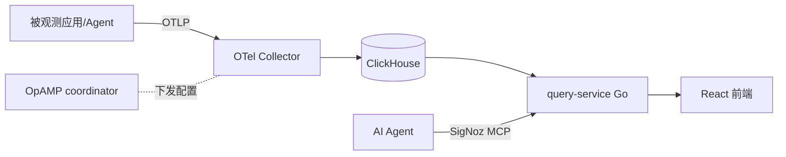

# Rank 97：SigNoz/signoz 源码级调研报告

## 1. 项目概述与定位

- **项目名称**：SigNoz（GitHub: https://github.com/SigNoz/signoz ）
- **Star 数**：约 32.1k（快照值）
- **主要语言**：Go（query-service）+ React/TypeScript（前端）
- **一句话定位**：开源 **OpenTelemetry 原生可观测性平台**，统一日志、指标、链路追踪；面向 AI Agent 场景新增 Agent Native 观测能力，并提供 SigNoz MCP 让 AI 队友用自然语言查遥测数据。
- **目标用户/场景**：需要自托管 APM/日志/追踪一体化、替代 Datadog/NewRelic 的团队；尤其适合需要观测 LLM/Agent 调用链的 AI 工程团队。
- **项目成熟度**：高。Go 后端 `pkg/query-service` + React 前端工程化成熟，集成 ClickHouse、OTel Collector、OpAMP 远端配置管理，内置大量 integrations 仪表盘。
- **分类**：资源集合 / 非 Agent 项目。它是**被观测平台**，通过 SDK/OTel 接收 Agent 的调用链数据；提供 MCP Server 让 Agent 查询其数据，但自身不做推理编排。

## 2. 源码结构总览

```
signoz/
├── pkg/
│   ├── query-service/      # ★ Go 查询后端
│   │   └── app/
│   │       ├── opamp/     # ★ OpAMP 远端管理 OTel Collector
│   │       │   ├── coordinator.go
│   │       │   ├── pipeline_builder.go
│   │       │   └── otelconfig/  # collector 配置解析
│   │       └── integrations/builtin_integrations/  # 内置集成仪表盘
│   └── querier/           # 查询提供者
├── frontend/              # ★ React/TS
│   └── src/
│       ├── container/OnboardingContainer/  # 各语言/技术栈接入引导
│       └── hooks/useQueryService.ts       # 前端→query-service
├── deploy/docker/        # ★ OTel Collector 配置 + ClickHouse compose
└── (ClickHouse 存储)
```

**核心源码文件（本次确认）**：从扁平清单确认 `pkg/query-service/app/opamp/coordinator.go`、`pipeline_builder.go`、`otelconfig/config_parser.go`、`deploy/docker/otel-collector-config.yaml`、`frontend/src/hooks/useQueryService.ts`。

**数据流**：OTel Collector 采集 → ClickHouse 列式存储 → query-service（Go）查询 → React 前端渲染；OpAMP 远程下发 collector 配置。

## 3. 系统架构分析

**编排模式：不适用**。SigNoz 是数据平台，无 Agent 循环/工具决策。其"架构"是采集-存储-查询三段式：

1. **采集层**：OpenTelemetry Collector（`deploy/docker/otel-collector-config.yaml`）接收应用埋点。
2. **存储层**：ClickHouse 列式存储（高基数标签、任意字段查询无需预插桩）。
3. **查询层**：`pkg/query-service`（Go）执行查询；`pkg/querier/signozquerier/provider.go` 提供查询能力。
4. **管理面**：OpAMP coordinator（`opamp/coordinator.go` + `pipeline_builder.go`）远程下发/动态调整 collector pipeline。
5. **前端**：React，`useQueryService.ts` 调 query-service。



**Agent Native 观测（架构确认）**：可追踪自定义推理步骤、工具调用、模型参数而无需固定 schema——这是 OTel 任意属性能力在 LLM 场景的延伸。

## 4. 功能拆解

- **三信号统一**：logs / metrics / traces。
- **ClickHouse 列式存储**：高基数标签、任意字段即席查询。
- **OpAMP 远端管理**：动态下发 collector 配置、tail-sampling（`tailsampler/config.go`）。
- **内置集成**：clickhouse 等集成自带仪表盘（`data-collected.json`、dashboards）。
- **SigNoz MCP**：让 AI Agent 自然语言查询遥测数据（架构说明）。
- **接入引导**：`OnboardingContainer` 覆盖 Go/JS/Rust/Ruby 等栈的 collector 接入。

## 5. 技术亮点与优势

1. **OTel 原生 + ClickHouse**：用开放标准采集、用列式库做高基数存储，兼顾开放性与查询性能。
2. **Agent Native 无 schema 观测**：LLM/Agent 的推理步骤、工具调用、模型参数以任意属性记录，不要求固定埋点 schema。
3. **OpAMP 动态 pipeline**：采集端配置可远程调整，不必手动改 collector yaml。
4. **自托管**：数据不出私有环境，适合对数据敏感的企业。

## 6. 稳定性机制【重点】

**不适用（非 Agent）**。SigNoz 无 LLM 错误处理/重试。其作为数据平台的稳定性：
- **采集解耦**：OTel Collector 与 query-service/存储分离，collector 挂了不丢本地缓冲（OTel 标准）。
- **ClickHouse 持久化**：列式存储自带副本/容错。
- **OpAMP 配置热更新**：`pipeline_builder.go` 重建 pipeline，配置变更不重启。
- **注**：这些是观测平台自身的工程稳定性，与 Agent 运行时稳定性无关。

## 7. 高可用机制【重点】

**不适用（非 Agent）**。其高可用是数据平台层面的：
- **横向扩展**：query-service 无状态、可多实例；ClickHouse 分布式表。
- **采集容错**：OTel Collector 队列/retry。
- **监控自身**：内置仪表盘监控 ClickHouse/collector 健康。
- 与 Agent 的熔断/背压无关。

## 8. 自我进化机制【重点】

**不适用**。SigNoz 不做自反思/自学习。它提供的是**被动观测能力**——记录 Agent 行为供人或 AI（经 MCP）事后分析。SigNoz MCP 让 Agent 能"查询自己的遥测"，可视为 Agent 自我诊断的数据来源，但平台本身不进化。

## 9. openmate 可借鉴点【重点】

- **P0｜用 OpenTelemetry 标准做 Agent 可观测**：openmate 从第一天起就把每轮 LLM 调用、工具调用、token 用量、耗时、错误以 OTel span 属性记录（不写死 schema，自由属性）。预期：出问题能回溯、性能可优化。
- **P0｜给"Agent 查自己"留一个查询接口/MCP**：openmate 的运行日志/trace 应能被 Agent 经 MCP 自然语言查询（"刚才那次为什么失败、花了多少钱"）。预期：Agent 可自我诊断。
- **P1｜高基数查询用列式存储**：openmate 的 trace/事件数据（标签多、要即席过滤）别用关系库硬扛，考虑 ClickHouse 类列式存储。预期：日志查询快。
- **P1｜采集与查询解耦**：采集层（写）与查询层（读）分离，写入压力不阻塞查询。预期：高并发下查询不卡。
- **P2｜内置集成/仪表盘模板**：openmate 的多模型/多工具用量做成开箱仪表盘。预期：成本与健康一眼看清。

## 10. 源码验证标注

**源码直接确认（扁平文件清单 @main）**：
- `pkg/query-service/app/opamp/{coordinator.go,pipeline_builder.go,otelconfig/config_parser.go,tailsampler/config.go}`、`pkg/querier/signozquerier/provider.go`、`deploy/docker/otel-collector-config.yaml`、`frontend/src/hooks/useQueryService.ts`、`integrations/builtin_integrations/clickhouse/*` 的存在与职责。

**来自文档/推断**：
- "Agent Native 观测、SigNoz MCP"的具体实现未读源码（本次未定位到 MCP Server 源码文件），依据已查证架构说明与官网。
- ClickHouse 表结构、query-service 查询引擎细节未深入。

**源码不可得/未深入**：SigNoz MCP 的具体实现、query-service 的查询 SQL 生成；本平台为数据基础设施，本次重点放在其架构对 openmate 可观测性的借鉴。
