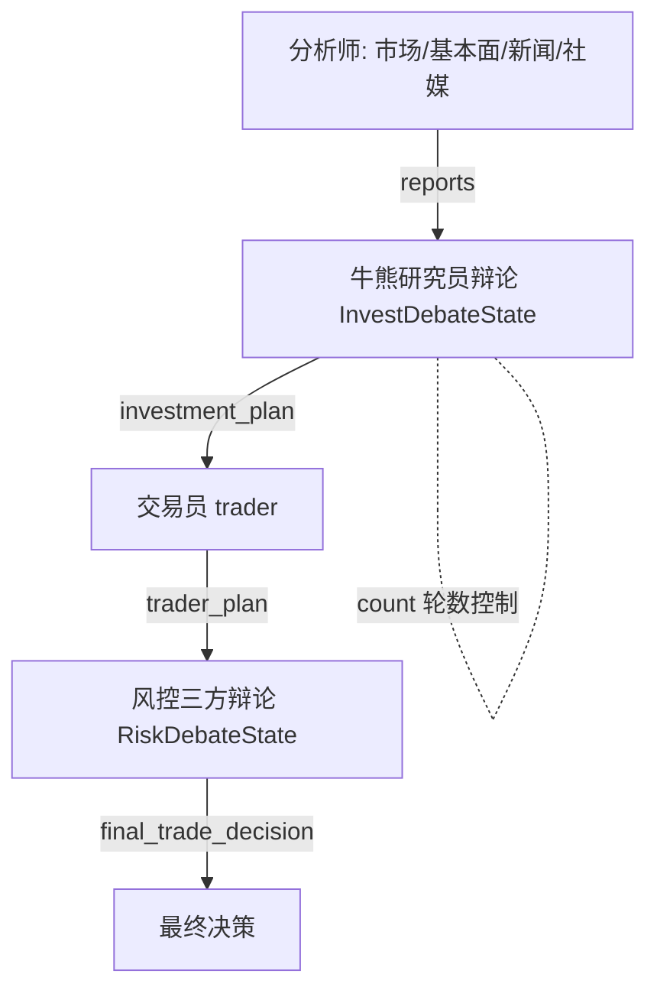

# Rank 98：hsliuping/TradingAgents-CN 源码级调研报告

## 1. 项目概述与定位

- **项目名称**：TradingAgents-CN（GitHub: https://github.com/hsliuping/TradingAgents-CN ）
- **Star 数**：约 31.8k（快照值）
- **主要语言**：Python（FastAPI+Uvicorn 后端 + Vue3/Vite/Element Plus 前端 + MongoDB+Redis）
- **一句话定位**：基于 TauricResearch TradingAgents 的**中文金融交易多智能体框架**，用分层多 Agent 辩论 + 风控委员会做股票交易决策。
- **目标用户/场景**：A股/港股/美股量化研究者；想用多 Agent 辩论模拟卖方研究、买方决策、风控审批全流程。
- **项目成熟度**：v1.1 后从 Streamlit 单体升级为 FastAPI+Vue3+MongoDB+Redis 的 RESTful+WebSocket 架构，Docker 多架构部署，`docs/agents/*` 有详尽中文设计文档。
- **分类**：领域 Agent 应用，编排模式 Multi-Agent 协作（LangGraph StateGraph）。

## 2. 源码结构总览

```
tradingagents/
├── agents/               # ★ 多 Agent 层
│   ├── analysts/         # 分析师团队
│   │   china_market_analyst.py / fundamentals_analyst.py(21KB)
│   │   market_analyst.py(21KB) / news_analyst.py / social_media_analyst.py
│   ├── researchers/      # 研究员辩论
│   │   bull_researcher.py / bear_researcher.py
│   ├── risk_mgmt/       # 风控委员会辩论
│   │   aggressive_debator.py / conservative_debator.py / neutral_debator.py
│   ├── managers/        # research_manager.py / risk_manager.py
│   ├── trader/trader.py # 交易员
│   └── utils/
│       agent_states.py   # ★ LangGraph 状态定义（本次读取）
│       agent_utils.py(48KB) # 工具/构建块
│       memory.py(19.5KB)   # 记忆
├── dataflows/           # ★ 数据层
│   interface.py(58KB)   # 数据接口门面
│   cache_manager.py / db_cache_manager.py(20KB) / adaptive_cache.py(14KB) / integrated_cache.py
│   akshare_utils / tushare_adapter / yfin_utils / hk_stock_utils / finnhub_utils...
├── config/              # mongodb_storage / database_manager / config_manager
└── web/                 # utils: redis_session_manager / smart_session_manager / progress_tracker / thread_tracker
```

**核心源码文件（本次实际读取）**：`tradingagents/agents/utils/agent_states.py`（全文）。从扁平清单确认各 Agent、缓存层、会话管理器。

## 3. 系统架构分析

**编排模式：Multi-Agent 协作 + 辩论（源码确认，agent_states.py）**。基于 LangGraph `StateGraph` + `MessagesState`，定义三套状态：

1. **`InvestDebateState`**（研究员团队辩论）：`bull_history` / `bear_history` / `judge_decision` / `count`——看涨与看跌研究员辩论，judge 裁决，`count` 控制轮数。
2. **`RiskDebateState`**（风控团队辩论）：`risky_history` / `safe_history` / `neutral_history` + `latest_speaker` + `judge_decision`——激进/保守/中立三方辩论。
3. **`AgentState(MessagesState)`**（主流程）：`company_of_interest` / `trade_date` → 各分析师产出 `market_report`/`sentiment_report`/`news_report`/`fundamentals_report` → `investment_debate_state` → `investment_plan` → `trader_investment_plan` → `risk_debate_state` → `final_trade_decision`。

**分层流程**：分析师团队采集数据→研究员团队（牛/熊辩论）→交易员综合决策→风控团队（激进/保守/中立辩论）→最终决策。



**关键类/状态（源码确认）**：`AgentState`、`InvestDebateState`、`RiskDebateState`（agent_states.py）；`bull_researcher`/`bear_researcher`；`aggressive/conservative/neutral_debator`；`trader`；`research_manager`/`risk_manager`。

## 4. 功能拆解

- **多源数据接入**：akshare/tushare/yfinance/finnhub/新浪/同花顺等，A股/港股/美股。
- **多层缓存**：`cache_manager` + `db_cache_manager`(MongoDB) + `adaptive_cache` + `integrated_cache`，避免重复拉数据。
- **会话持久化**：`redis_session_manager` / `smart_session_manager` / `file_session_manager`。
- **进度追踪**：`progress_tracker` + `thread_tracker`（WebSocket 推送进度）。
- **报告导出**：`report_exporter`。
- **文档完备**：`docs/agents/*` 中文设计文档。

## 5. 技术亮点与优势

1. **辩论式多 Agent**：牛熊研究员辩论 + 风控三方辩论，用对抗性提升决策质量，而非单 Agent 自说自话。
2. **分层职责清晰**：分析师（数据）→研究员（辩论）→交易员（决策）→风控（审批），角色解耦。
3. **数据缓存工程化**：4 层缓存 + 多数据源冗余，兼顾数据新鲜度与 API 限额。
4. **中文/A股本地化**：china_market_analyst、akshare/tushare/tdx/新浪，针对 A股生态优化。

## 6. 稳定性机制【重点】

- **死循环防护（源码确认，亮点）**：`AgentState` 显式声明 `market_tool_call_count` / `news_tool_call_count` / `sentiment_tool_call_count` / `fundamentals_tool_call_count`，注释原文 "🔧 死循环修复: 工具调用计数器"——给每个分析师的工具调用设上限，防止 LLM 反复调同一工具卡死。
- **辩论轮数控制（源码确认）**：`InvestDebateState.count` / `RiskDebateState.count` 限制辩论轮数，防牛熊/三方无限对话。
- **进度/线程追踪（结构确认）**：`progress_tracker` + `thread_tracker` 跟踪运行进度，便于中断与恢复。
- **会话持久化**：Redis/MongoDB 存会话，崩溃可恢复。
- **统一日志（结构确认）**：`logging_init.get_logger` + `tool_logging`，全流程可审计。
- **数据校验（结构确认）**：`stock_validator.py` 校验股票代码/数据。

## 7. 高可用机制【重点】

- **多数据源互为备份**：A股有 akshare/tushare/tdx/新浪/东财多通道，单源限流可切换（`data_source_manager`）。
- **缓存降级**：`adaptive_cache`/`integrated_cache` 在数据源不可用时用缓存数据。
- **异步进度**：WebSocket + thread_tracker，长任务不阻塞 UI。
- **容器化**：docker-compose 多架构部署。
- **注**：单用户研究场景，非集群化编排，高可用偏客户端与数据层。

## 8. 自我进化机制【重点】

- **辩论即反思**：牛熊研究员辩论、风控三方辩论本质是"多视角自我批评"，judge 综合裁决——结构内嵌的对抗性反思。
- **记忆管理（结构确认）**：`agents/utils/memory.py`（19.5KB）管理跨分析师的报告记忆。
- **数据缓存算经验沉淀**：4 层缓存把已拉取的数据沉淀复用，避免重复计算。
- **不足**：未见自动评估/从交易结果自动调整 prompt 的闭环；进化主要靠"多视角辩论 + 缓存"。

## 9. openmate 可借鉴点【重点】

- **P0｜工具调用计数器防死循环**：openmate 的多步 Agent 必须给每类工具/每轮设调用次数上限（`tool_call_count`），超限强制收敛。预期：杜绝"反复调同一工具卡死"。
- **P0｜辩论/多视角评审作为内置反思**：openmate 可在关键决策前引入"正方/反方/裁判"或"激进/保守/中立"多视角辩论，judge 综合。预期：决策更稳健、少踩单边偏见。
- **P1｜分层角色解耦**：采集/分析/决策/审批分角色，每角色产出结构化报告供下游。预期：可单独替换、可观测每步。
- **P1｜轮数上限 + 进度追踪**：对话/辩论设最大轮数，配合 progress_tracker 让用户看到进度、可中断。预期：不无限跑。
- **P2｜多数据源 + 多层缓存降级**：openmate 接外部数据时多源冗余 + 缓存，单源挂了用缓存顶。预期：数据层韧性。

## 10. 源码验证标注

**源码直接阅读**：
- `tradingagents/agents/utils/agent_states.py` 全文：`InvestDebateState`/`RiskDebateState`/`AgentState` 字段、牛熊/三方辩论结构、各 report 字段、"死循环修复: 工具调用计数器"四个 `*_tool_call_count`。
- 扁平清单确认 analysts/researchers/risk_mgmt/managers/trader 各文件、dataflows 四层缓存、web/utils 会话与进度管理。

**来自文档/推断**：
- FastAPI+Vue3+MongoDB+Redis 具体实现、WebSocket 推送细节，依据已查证架构说明与 docs/architecture，未逐行读 web/ 后端。
- `agent_utils.py`(48KB) 的工具构建块、`memory.py` 的记忆算法未逐行读。

**源码不可得/未深入**：`dataflows/interface.py`(58KB) 的数据门面、各 Agent 的 prompt 与辩论循环细节，建议后续精读 bull/bear 与 risk debator 的循环函数。
