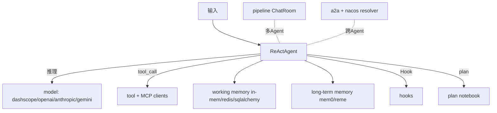

# Rank 99：agentscope-ai/agentscope 源码级调研报告

## 1. 项目概述与定位

- **项目名称**：AgentScope（GitHub: https://github.com/agentscope-ai/agentscope ）
- **Star 数**：约 31.5k（快照值）
- **主要语言**：Python（阿里通义实验室出品）
- **一句话定位**：生产级 Agent 开发框架，2.0 强调"借力模型推理能力而非硬约束编排"，以 ReAct 为首选范式，提供消息/记忆/工具/MCP/多 Agent/规划/服务化全套构建块。
- **目标用户/场景**：要把 Agent 做成可服务化、多租户、可观测应用的 Python 团队；需要多模型（DashScope/OpenAI/Anthropic/Gemini）统一接入。
- **项目成熟度**：高。2.0 版本成熟，模块化 `src/agentscope/`，测试覆盖广（`react_agent_test`、`memory_test`、`hook_test`、`mcp_*_client_test`、`memory_compression_test` 等），中英文双语教程。
- **分类**：agent 开发框架，ReAct 范式。

## 2. 源码结构总览（扁平文件清单确认）

```
src/agentscope/
├── agent/                # ★ 核心 Agent
│   ├── _react_agent.py(44KB)   # ★ ReAct 主循环
│   ├── _react_agent_base.py
│   ├── _agent_base.py(25KB)    # Agent 基类
│   ├── _agent_meta.py / _a2a_agent.py / _realtime_agent.py / _user_agent.py / _user_input.py
├── memory/               # ★ 双层记忆
│   ├── _working_memory/  # _base / _in_memory / _redis(28KB) / _sqlalchemy(29KB)
│   └── _long_term_memory/  # _mem0(27KB) / _reme(personal/task/tool) / _base
├── mcp/                  # ★ MCP 客户端
│   _client_base / _http_stateful_client / _http_stateless_client /
│   _stateful_client_base / _stdio_stateful_client / _mcp_function
├── hooks/ / types/_hook.py     # ★ Hook 机制
├── a2a/                  # Agent-to-Agent（含 _nacos_resolver / _well_known_resolver）
├── pipeline/             # 多 Agent：_chat_room / _functional / _class / _msghub
├── plan/                 # 任务规划：_plan_model / _plan_notebook / storage
├── session/              # _json_session / _session_base（会话持久化）
├── model/                # _dashscope/_openai/_anthropic/_gemini/_model_base/_model_usage
├── tool/                 # _async_wrapper / _coding / _response
├── token/                # _token_base / _anthropic_token_counter
├── tracing/ / evaluate/_benchmark_base / rag/ / embedding/
└── realtime/ / tts/
```

**核心源码文件（本次确认）**：从扁平清单确认 `agent/_react_agent.py`(43.9KB)、`memory/_working_memory/{_in_memory,_redis,_sqlalchemy}.py`、`memory/_long_term_memory/_mem0/` 与 `_reme/`、`mcp/*client*`、`a2a/_nacos_resolver.py`、`plan/*`、`session/_json_session.py` 的存在与体积。

## 3. 系统架构分析

**编排模式：ReAct（架构+结构确认）**。`_react_agent.py` 44KB 为核心——模型驱动循环：组装消息→模型推理→若有 tool_calls 则执行→结果回灌→继续，直到无工具调用。2.0 理念是"把推理交给模型，框架只提供工具/记忆/Hook"。

**双层记忆架构（源码结构确认）**：
- **工作记忆**（`_working_memory/`）：会话内上下文，三后端可换——`_in_memory_memory`、`_redis_memory`(28KB)、`_sqlalchemy_memory`(29KB)；有 `memory_compression` 测试覆盖上下文压缩。
- **长期记忆**（`_long_term_memory/`）：跨会话，内置两套实现——`_mem0`(27KB) 与 `_reme`，后者细分 `personal`/`task`/`tool` 三类长期记忆。

**MCP 接入（结构确认）**：`mcp/` 区分 `_http_stateful` / `_http_stateless` / `_stdio_stateful` 三种客户端，`_mcp_function` 把 MCP 工具包装成框架工具——统一接入而非各写适配器。

**多 Agent / 规划 / A2A**：`pipeline/`（ChatRoom 群聊）、`plan/`（计划模型+notebook）、`a2a/`（Agent 间通信，含 Nacos 服务发现 resolver）。



**关键类/文件（结构确认）**：`ReActAgent`（`_react_agent.py`）；`AgentBase`（`_agent_base.py`）；工作/长期记忆基类；MCP 各 client；Hook 类型（`types/_hook.py`）。

## 4. 功能拆解

- **ReActAgent**：并行工具调用、异步执行、实时打断/恢复、结构化输出、Hook。
- **记忆**：工作记忆三后端 + 长期记忆 mem0/reme（personal/task/tool）。
- **MCP**：统一多协议客户端（HTTP 有/无状态、stdio）。
- **多 Agent**：pipeline ChatRoom；Agent Team（Leader 派发 subagent，架构说明）。
- **规划**：plan_model/plan_notebook。
- **服务化**：FastAPI 多租户多会话（架构说明），session/_json_session 持久化。
- **生态**：Agent Skill（examples/agent_skill 用 SKILL.md 标准）、tracing、benchmark。

## 5. 技术亮点与优势

1. **双层记忆抽象**：工作记忆（会话内，可换 redis/sqlalchemy）与长期记忆（mem0/reme，分 personal/task/tool）分离，接口统一。
2. **多模型统一**：dashscope/openai/anthropic/gemini 同构接入，`_model_usage` 统一用量。
3. **MCP 多态客户端**：HTTP 有/无状态、stdio 三种都覆盖，适配不同 MCP Server。
4. **Hook + 规划 + 服务化**：生产级三件套齐全，不是玩具框架。

## 6. 稳定性机制【重点】

- **会话持久化（结构确认）**：`session/_json_session.py` + `_session_base` 把会话状态落盘，支持打断/恢复（interrupt/resume）。
- **记忆后端可换（结构确认）**：工作记忆可选 redis/sqlalchemy，进程重启不丢会话上下文。
- **上下文压缩（结构确认）**：`tests/memory_compression_test.py` 覆盖工作记忆压缩，长会话可控。
- **Hook 机制（结构确认）**：`hooks/` + `types/_hook.py` 允许在调用前后插入校验/重试/日志逻辑（教程 task_hook.py 8KB）。
- **token 计数（结构确认）**：`token/_anthropic_token_counter.py` 精确计 token，防上下文溢出。
- **注**：本次 CDN 对 `_react_agent.py`(44KB) 正文返回 link dead，具体最大轮数/超时/重试参数未逐行确认。

## 7. 高可用机制【重点】

- **异步执行（结构确认）**：`tool/_async_wrapper.py` 包装异步工具，ReActAgent 支持并行工具调用与异步执行。
- **多会话服务化（架构确认）**：FastAPI 多租户多会话，配合 redis/sqlalchemy 工作记忆，可水平扩展。
- **实时打断/恢复（架构确认）**：ReActAgent 支持实时打断与恢复，长任务可中断续跑。
- **可观测**：`tracing/` 模块 + AgentScope Studio 可视化追踪。
- **多模型冗余**：`model/` 多家 provider，可切换。

## 8. 自我进化机制【重点】

- **长期记忆是核心进化机制（结构确认）**：`_reme` 把记忆分 **personal（用户画像）/task（任务经验）/tool（工具使用经验）** 三类——这是"越用越懂你、越用越会用工具"的结构化沉淀；mem0 实现自动提取记忆。
- **Agent Skill（结构确认）**：examples/agent_skill 用 SKILL.md 标准把能力沉淀为可加载技能。
- **Hook 反馈**：Hook 可在每步后记录/调整，是反馈注入点。
- **benchmark 评估（结构确认）**：`evaluate/_benchmark_base.py` 提供自动评估基类。
- **不足**：未见自动 A/B 或在线权重调整，进化以"记忆沉淀 + 技能 + 评估基类"为主。

## 9. openmate 可借鉴点【重点】

- **P0｜工作记忆与长期记忆分层 + 接口统一**：openmate 应把"会话内上下文"和"跨会话长期记忆"分成两层，长期记忆再分用户画像/任务经验/工具经验三类。预期：长会话不爆、跨会话有积累。
- **P0｜会话可持久化 + 可打断恢复**：openmate 用 session 落盘，支持运行中打断、之后续跑。预期：长任务不丢、用户随时介入。
- **P1｜MCP 客户端分协议覆盖（HTTP 有/无状态 + stdio）**：openmate 接 MCP Server 时按其协议选 client，别只支持一种。预期：兼容生态。
- **P1｜Hook 机制做横切**：openmate 在 ReAct 循环前后挂 Hook（校验/重试/日志/脱敏），业务循环保持干净。预期：关注点分离。
- **P1｜精确 token 计数 + 上下文压缩**：openmate 内置 token counter，超长时压缩工作记忆。预期：不把上下文顶爆。
- **P2｜技能用 SKILL.md 标准沉淀**：openmate 的 Agent 把验证过的流程写成 SKILL.md 技能，跨 Agent 复用。预期：能力可积累可移植。

## 10. 源码验证标注

**源码直接确认（jsDelivr 扁平文件清单 @main）**：
- `agent/_react_agent.py`(43.9KB)、`_agent_base.py`(25KB)、`_a2a_agent.py`、`_realtime_agent.py`；
- `memory/_working_memory/{_in_memory,_redis(28KB),_sqlalchemy(29KB)}.py`；`memory/_long_term_memory/{_mem0(27KB),_reme(personal/task/tool)}.py`；
- `mcp/{_http_stateful,_http_stateless,_stdio_stateful,_mcp_function}.py`；`hooks/`、`a2a/_nacos_resolver.py`、`plan/`、`session/_json_session.py`、`token/_anthropic_token_counter.py`、`tool/_async_wrapper.py`、`pipeline/`、`tracing/`；
- 测试 `memory_compression_test.py`、`mcp_sse/streamable_http_client_test.py`。

**来自文档/推断**：
- "并行工具调用、异步执行、实时打断/恢复、结构化输出、Hook、Agent Team（Leader 派发 subagent）、FastAPI 多租户"等，依据官方文档与 PyPI 2.0 说明及已查证架构。
- ReAct 主循环的具体最大轮数、重试/超时、记忆压缩算法——本次因 CDN/raw 对 `_react_agent.py` 正文返回 link dead（传播/限流），未逐行读取。

**源码不可得/未深入**：`_react_agent.py`、`_agent_base.py`、`_reme/_reme_long_term_memory_base.py` 的函数体；建议网络恢复后精读 ReActAgent 主循环与 reme 记忆整理算法。
