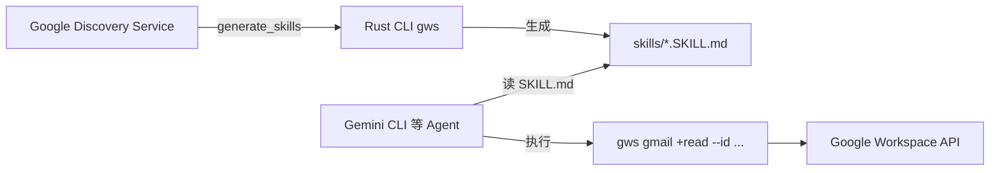

# Rank 100：googleworkspace/cli 源码级调研报告

## 1. 项目概述与定位

- **项目名称**：Google Workspace CLI（GitHub: https://github.com/googleworkspace/cli ）
- **Star 数**：约 31.0k（快照值）
- **主要语言**：Rust
- **一句话定位**：用 Rust 编写的统一命令行工具，覆盖 Drive/Gmail/Calendar/Sheets/Docs/Chat/Admin 等服务；通过 Google Discovery Service **动态生成命令**，并自带 AI Agent Skills（SKILL.md 标准），让 Gemini CLI 等 Agent 能按需操作 Workspace。
- **目标用户/场景**：用命令行/Agent 自动化办公套件的开发者；想把 Workspace 操作作为 Agent 工具集的团队。
- **项目成熟度**：Google 官方出品，Rust crate（`crates/google-workspace-cli`），changesets 管理版本，skills 持续增补（metadata.version 0.22.5）。
- **分类**：其他（工具/技能供给侧），非 Agent 运行时。它把 CLI 能力 + SKILL.md 技能提供给外部 Agent。

## 2. 源码结构总览

```
googleworkspace/cli/
├── crates/google-workspace-cli/src/
│   ├── main.rs
│   ├── formatter.rs
│   ├── generate_skills.rs   # ★ 45.8KB，从 Discovery Service 动态生成 SKILL.md
│   └── helpers/             # calendar.rs / drive.rs / gmail/forward.rs(36KB)
├── skills/                  # ★ AI Agent Skills（SKILL.md 标准）
│   ├── gws-*                # 单服务/单操作技能（gws-gmail-read/send/reply...）
│   └── recipe-*             # 跨服务工作流配方（recipe-find-free-time...）
├── docs/skills.md           # 13KB，技能说明
└── .agent/skills/vhs.md
```

**核心源码文件（本次实际读取）**：`skills/gws-gmail-read/SKILL.md`（全文）；从扁平清单确认 `generate_skills.rs`(45.8KB)、各 `gws-*/SKILL.md`、`recipe-*/SKILL.md`、`helpers/*`。

## 3. 系统架构分析

**编排模式：不适用（技能驱动/工具供给）**。它不是 Agent，不做 ReAct 循环。架构是两层：
1. **CLI 命令层**（Rust）：`gws <service> +<action>` 子命令，命令由 Google Discovery Service 动态生成（非硬编码每个 API）。
2. **Skill 层**（SKILL.md）：每个操作对应一份 SKILL.md，frontmatter 描述何时用 + 怎么调 CLI。

**SKILL.md 格式（源码确认，样例全文）**：
- YAML frontmatter：`name`、`description`、`metadata.version`、`openclaw.category`/`requires.bins: [gws]`/`cliHelp`；
- 正文：`## Usage`（`gws gmail +read --id <ID>`）、`## Flags`（表格：必需/默认/说明）、`## Examples`、`## Tips`、`## See Also`；
- 前置：PREREQUISITE 指向 `gws-shared/SKILL.md`（auth/全局标志/安全规则），并提示"如缺失运行 `gws generate-skills` 生成"。

**关键设计**：技能由 CLI 自身 `generate_skills` 命令**从 Discovery Service 动态生成**，而非手写——API 变了技能自动更新。



## 4. 功能拆解

- **全服务覆盖**：gmail（read/send/reply/forward/triage/watch）、calendar（agenda/insert）、drive、docs、sheets、chat、classroom、forms、keep、admin-reports。
- **recipe 跨服务配方**：`recipe-find-free-time`、`recipe-create-vacation-responder`、`recipe-share-doc-and-notify` 等组合多个操作的工作流技能。
- **统一鉴权/安全**：`gws-shared/SKILL.md` 集中 auth 与全局安全规则；每命令支持 `--dry-run`。
- **输出灵活**：`--format text/json`，可 `| jq`。

## 5. 技术亮点与优势

1. **动态生成而非硬编码**：`generate_skills.rs`(45.8KB) 从 Discovery Service 反射出命令与 SKILL.md，API 演进零手工维护。
2. **SKILL.md 标准即插即用**：frontmatter 带 `requires.bins`/`cliHelp`，Gemini CLI/Claude Code 等按标准加载。
3. **`+action` 命令族**：`gws gmail +read` 形式，按操作而非按 REST 端点组织，对 Agent 友好。
4. **dry-run 安全默认**：每条命令支持 `--dry-run` 预览请求不执行。

## 6. 稳定性机制【重点】

**不适用（非 Agent）**。它是 CLI/技能供给，无 LLM 循环。
- 其稳定性体现在工具侧：`--dry-run` 让 Agent 先预览；`--format json` 结构化输出便于程序化解析；`gws-shared` 集中鉴权避免散落密钥。
- 技能由 CLI 生成保证与实际命令一致，减少"文档与实际不符"。

## 7. 高可用机制【重点】

**不适用**。CLI 工具，无服务端高可用；命令失败由底层 Google API 重试，输出 `--format json` 便于 Agent 判断错误。

## 8. 自我进化机制【重点】

**不适用**。技能是 CLI 从 Discovery Service 生成的静态产物，不自动学习；但"动态生成"本身保证了技能随 API 更新而不腐化——是工程上的"自动同步"而非智能进化。

## 9. openmate 可借鉴点【重点】

- **P0｜工具/Skill 从 API 描述动态生成，而非手写**：openmate 接多工具时，仿 `generate_skills.rs` 从 OpenAPI/Discovery 描述自动生成 SKILL.md（含 usage/flags/examples）。预期：工具更新不用手改技能、永不脱节。
- **P0｜SKILL.md 带 `requires.bins`/`cliHelp` 元数据**：openmate 的技能声明依赖哪个二进制/命令帮助入口，Agent 可自校验环境。预期：环境不匹配提前报错。
- **P1｜统一鉴权/安全规则抽到共享 skill**：openmate 把 auth/全局 flag/安全规则放 `*-shared/SKILL.md`，各业务技能引用。预期：不重复、不散落密钥。
- **P1｜每条工具支持 `--dry-run`**：openmate 的写操作工具支持 dry-run 预览，Agent 可先试后执行。预期：降低误操作风险。
- **P2｜跨服务 recipe 配方技能**：openmate 把多步组合操作写成 recipe SKILL.md，复用。预期：复杂流程一键化。

## 10. 源码验证标注

**源码直接阅读**：
- `skills/gws-gmail-read/SKILL.md` 全文：frontmatter（name/description/metadata.version/openclaw.category/requires.bins/cliHelp）、Usage/Flags/Examples/Tips 小节、`--dry-run`、`gws-shared` 引用、`gws generate-skills` 提示。
- 扁平清单确认 `crates/google-workspace-cli/src/generate_skills.rs`(45.8KB)、`helpers/{calendar,drive,gmail/forward}.rs`、`skills/gws-*` 与 `recipe-*` 各 SKILL.md。

**来自文档/推断**：
- "基于 Google Discovery Service 动态构建命令"、"Gemini CLI Agent Skills"依据已查证架构说明与 `generate_skills.rs` 命名/体积，未逐行读该 45KB 生成器。
- Rust CLI 的具体命令注册/鉴权实现未读。

**源码不可得/未深入**：`generate_skills.rs` 的生成算法、CLI 主流程；本仓库为工具/技能供给侧，本次重点在其 SKILL.md 供给范式对 openmate 的借鉴。
