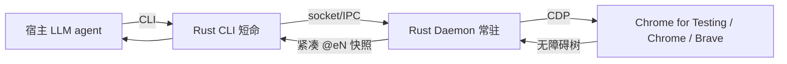

# Agent Browser

## 概述

Agent Browser 是一个浏览器自动化Agent。

**仓库**: https://github.com/vercel-labs/agent-browser | **语言**: Python

## 核心架构

agent-browser 本身**不做 LLM 编排**，它是被外部 agent 调用的能力层。其内部架构是 client-daemon：

- **Rust CLI（瘦客户端）**：每次 `agent-browser ` 起一个短命进程，解析命令、把请求转发给 daemon，打印结果。
- **Rust Daemon（常驻服务）**：持有与 Chrome 的 CDP 连接，跨命令复用浏览器实例与 session。

**数据流**：宿主 agent 决定 → `agent-browser open `（CLI→daemon→CDP→Chrome 导航）→ `snapshot`（daemon 经 CDP 取无障碍树，生成带 `@eN` 引用的紧凑树）→ agent 读树决策 → `click @e2` / `fill @e3 "..."`（daemon 用引用回算坐标或语义定位执行）→ 页面变化后重新 snapshot。

**核心交互范式**（README:85-93、1724-1730）：
```
open  → snapshot（拿 @e1/@e2/...）→ click @e1 / fill @e2 → 页面变了再 snapshot
```
引用 `@eN` 与截图标注 `[N]` 一一对应（README:980 "Each label [N] corresponds to ref @eN"），文本流与视觉流共用同一套 ref。



---

## 关键技术

1. **accessibility-tree 快照 + `@eN` 引用是 token 压缩的关键**：不把整页 DOM 吐给 LLM，而是无障碍语义树 + 短引用，几 MB 页面压到几百 token，LLM 据此操作——比 dump HTML 省一两个数量级 token。
2. **纯 Rust + 直连 CDP，无 Node/Playwright 运行时**：启动快、内存小、跨平台原生单二进制，daemon 常驻避免浏览器冷启动。这是相对 Playwright/Puppeteer 系的核心差异化。
3. **标签句柄永不复用 + targetId 跨重启稳定**：tab id 形如 `t1/t2/t3`，session 内不复用（README:368）；CDP targetId 跨 daemon 重启仍稳定，多 session 协同一个浏览器时用 targetId 而不是 `t`。
4. **点击失败早报遮挡元素**：点击被 consent banner/modal 遮挡时，错误直接告诉你 "covered by ``"，并提示先 dismiss 再重新 snapshot——把常见的"点不动"变成可执行的下一步（README:95、1232）。
5. **`read` 主动适配 agent 友好文档**：优先 markdown、试探 `.md`、沿目录找 `llms.txt`，再回落正文提取——为"agent 读文档"专门设计。

---

## 对openmate的启示

1. **Stable a11y refs (`@eN`) + mandatory re-snapshot after mutation** — simpler than selector repair.
2. **Occlusion-aware click failures** with covering-element report.
3. **`read` command tuned for LLMs** (llms.txt discovery, markdown preference, outline mode).
4. **Dual tab identity** (`tN` session-scoped + CDP targetId durable).
5. **Session inheritance on new tabs** (UA, cookies, routes before first paint).
6. **`diff snapshot` as first-class** — step-to-step change detection.
7. **WebMCP with untrusted-hint protocol** — page can claim readOnly; host decides.
8. **Native Rust daemon, no 

- **P0**: 评估其工具集成方案对openmate工具层的参考价值
- **P1**: 研究其插件/扩展机制
- **P2**: 关注其性能优化和部署方案

## 参考来源

- 豆包（062_agent-browser.md）
- MiMo报告（agent-browser.md）
