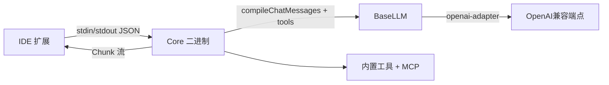

# Continue

## 概述

Continue 是一个AI编程助手（IDE插件）。

**仓库**: https://github.com/continuedev/continue | **语言**: TypeScript

## 核心架构

**编排模式：ReAct（源码+架构确认）**。Agent 模式下，Core 把用户消息 + 内置工具 + MCP 工具 schema 喂给模型，模型返回 tool_call → Core 执行工具 → 把结果追加回上下文 → 再请求模型，循环直到模型不再请求工具。证据：`core/llm/index.ts` 的 `BaseLLM` 持有 `toolOverrides`、`applyToolOverrides`，并通过 `openaiTypeConverters.toChatBody` 把 tools 塞进请求体；交互类型 `Chunk`/`ChatMessage` 承载工具调用事件流。

**三层架构（架构确认）**：
1. **IDE 层**：VS Code Extension API / JetBrains 插件，承载 UI、快捷键、inline diff，与 Core 通过 stdin/stdout JSON 通信——**进程隔离**。
2. **Core 层**：模型无关的 Agent 运行时，`BaseLLM` 抽象所有供应商。
3. **模型层**：任意 OpenAI 兼容端点（OpenAI/Anthropic/Ollama/vLLM/…），由 `@continuedev/openai-adapters` 统一适配。

**核心组件**：
- `BaseLLM`（`core/llm/index.ts`）：实现 `ILLM`，统一 chat/complete/embed/fim 接口，子类只填 provider 细节。
- `autodetect.ts`：`autodetectTemplateType/Function`、`modelSupportsImages`，按模型名自动选 prompt 模板与能力。
- `openaiAdapter`：`constructLlmApi()` 把不同 provider 归一到 `BaseLlmApi`。

**数据流**：用户在 IDE 输入 → 扩展经 stdin/stdout 转给 Core → Core `compileChatMessages()` 编译上下文 + 注入工具 → `BaseLLM.sendRequest` 经 `openaiAdapter` 调供应商 → 流式 `Chunk` 回传 IDE 渲染；工具调用则 Core 本地执行后回灌。

**关键类/函数（源码确认）**：`BaseLLM`（`core/llm/index.ts`），构造器中 `findLlmInfo()` 自动探测 `contextLength`/`maxCompletionTokens`；`parseError()`；`fetch()`；`_logEnd()`；`isAbortError()`；`withExponentialBackoff()`。

## 关键技术

1. **真·模型无关抽象**：`BaseLLM` + `@continuedev/openai-adapters` + `@continuedev/llm-info` 三件套，新增 provider 只需填一个子类，模板/能力/上下文长度全自动探测——这是 Continue 能接"任意兼容端点"的根基。
2. **进程隔离的 IDE↔Core 架构**：IDE 扩展不直接跑 LLM 逻辑，Core 独立二进制通过 stdin/stdout 通信。崩溃隔离、可独立升级、可复用同一 Core 给 CLI。
3. **细粒度错误可诊断**：`parseError()` 把 404/401/ECONNREFUSED 映射成"人话修复建议"（如 Ollama 404 → `run ollama `；Mistral/Codestral key 混用提示；OpenAI 欠费提示）。
4. **token 级成本治理**：`maxTokens = min(llmInfo.maxCompletionTokens, contextLength/4)`——即便模型 maxTokens 很大，也主动留出上下文空间，避免生成挤占对话历史。

- **指数退避重试（源码确认）**：`import { withExponentialBackoff } from "../util/withExponentialBackoff.js"`——LLM 请求经指数退避重试，避免瞬态网络/限流直接失败。
- **错误分类与友好映射（源码确认）**：`parseError()` 区分 404（按 URL 给不同建议）、401（Mistral/Codestral key 不兼容）、`ECONNREFUSED`（Ollama/Lemonade 未运行），并区分 `isAbortError`（用户取消，不刷屏）。
- **取消/中断（源码确认）**：`isAbortError(e)` 把用户主动停止归为 `cancelled`，不计入错误、不污染 console；HTTP 499 视为客户端取消直接放行。
- **上下文边界（源码确认）**：`pruneRawPromptFromTop()` 在 token 超长时裁剪；`countTokens` 精确计数，防止把超长 prompt 发出去被供应商拒绝。
- **错误日志聚合（源码确认）**：`fetch()` 中 `Logger.error(e, {context, url, method, model, provider})` 带结构化上下文，便于排障；非 abort 错误 `console.debug` 打全栈。
- **本地模型探活**：`isOllamaInstalled()`/`isLemonadeInstalled()` 在连接拒绝时先检测本地模型是否真在跑，给出精确建议而非笼统错误。

- **进程隔离（架构确认）**：IDE 扩展与 Core 二进制分离，Core 崩溃不拖垮 IDE；stdin/stdout JSON 是稳定契约，UI 重启后 Core 可独立恢复。
- **降级到本地模型**：接 Ollama/Lemonade 等本地端点，云端不可用时可降级到本地模型；`ECONNREFUSED` 检测逻辑让切换路径清晰。
- **流式背压**：以 `Chunk` 流式回传，长输出逐步渲染，避免一次性大响应阻塞 UI。
- **无服务端集群**：Continue 是桌面/IDE 工具，单用户单进程，不做横向扩展；其"高可用"体现在**客户端侧的健壮**（重试、取消、错误可恢复）而非服务端。
- **可观测**：`DataLogger` + SQLite 记录 token 用量与交互（`InteractionStatus = in_progress/success/error/cancelled`），本地可复盘。

- **无运行时自学习**：Continue 不做跨会话记忆沉淀、不做输出自动评分、不从用户反馈改策略。
- **最接近"进化"的部分是配置工程化**：`config.yaml` 让用户显式定义 `rules`/`prompts`/`contextProviders`，配合 `@continuedev/llm-info` 自动探测模型参数——这是**显式配置 + 自动探测**，而非自动进化。
- **上下文压缩算"类记忆"**：`compileChatMessages`/`pruneRawPromptFromTop` 管理的是单次会话内上下文窗口，不是长期记忆。
- **结论**：自我进化能力弱；它把"越用越懂你"的工作交给用户配 rules 和 context providers。

## 对openmate的启示

| 维度 | Continue 的做法 | 可借鉴点 |
|------|----------------|----------|
| **核心-宿主分离** | `core/` 包独立于所有宿主 | OpenMate 的 Agent 引擎应与 UI 解耦 |
| **协议层设计** | 三端独立消息协议 | 用类型安全的协议替代直接函数调用 |
| **增量索引** | 内容寻址 + 标签系统 | 面向大仓库的必要优化 |
| **补全管线** | 6 阶段精细管线 | 质量优于速度的补全策略 |
| **工具策略** | 独立的权限控制层 | Agent 安全执行的关键 |
| **CLI Headless** | 自动 TTY 检测 | 生产级 CLI 的标准做法 |
| **多模型适配** | OpenAI 格式 + 适配器 | 业界标准，降低切换成本 |
| **MCP 集成** | 原生支持 Model Context Protocol | 工具标准化的最佳路径 |

*分析基于 continuedev/continue 仓库 main 分支源码（21,569 commits, Apache-2.0 License）*

- **P0**: 评估其架构模式对openmate核心框架的参考价值
- **P1**: 研究其API设计和扩展机制
- **P2**: 关注其社区生态和集成方案

## 参考来源

- 我们（49-continue.md）
- 豆包（084_continue.md）
- MiMo报告（continue.md）
