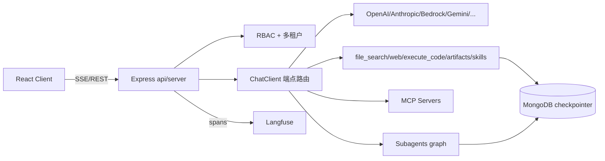

# LibreChat

## 概述

LibreChat 是一个开源AI聊天平台。

**仓库**: https://github.com/danny-avila/LibreChat | **语言**: Python

## 核心架构

LibreChat 的 agent 能力不是单一循环，而是分层：

1. **对话层（ReAct）**：前端发消息 → 后端 `ChatClient` 抽象选定端点客户端 → 模型 function calling 决定是否调用 `tools`（file_search/web_search/execute_code/artifacts/mcp/skills）→ 工具结果回灌 → 流式回吐。yaml:272 明确原生工具键为 `artifacts, execute_code, web_search, file_search, skills`。
2. **Agents Endpoint（graph + subagents）**：yaml:630 的能力清单 `["deferred_tools","execute_code","file_search","web_search","artifacts","subagents","actions","context","skills","memory","ask_user_question","tools","chain","ocr"]` 表明 agent 运行时是一个**有环的执行图**（`chain`、`deferred_tools`、`run_in_background`），支持把任务委托给子 agent（`subagents`），并能向用户提问（`ask_user_question`）、调用动作（`actions`）。
3. **子 agent 委托**：yaml:609-611 `maxSubagents`（默认 10，硬上限 50，示例配 20）——支持扁平列表与 graph 两种子 agent 定义。

**数据流**：用户消息 → Express 鉴权/限流 → 选定 endpoint & agent spec → 装配工具目录（含 MCP tools、skills catalog）→ 模型流式决策 → 工具/子 agent 执行（必要时 pause 等人审，见 §6 checkpointer）→ 结果回写 MongoDB 对话 → 流式渲染 + Langfuse span 上报。

**关键抽象**：端点客户端统一在 `api/app/clients/`（`ChatClient` 抽象）；运行时配置在 `api/config/`；agent 持久化用 MongoDB checkpointer。

---

## 关键技术

1. **把"对话应用"工程化为"agent 平台"**：从 capabilities 白名单到 checkpointer、toolApproval、managementApi OIDC，整套是面向多租户生产部署设计的，而非玩具 demo。
2. **MCP 安全分层做得极细**：remote MCP 有 SSRF block、域名限制、trust checkbox 警告文案（yaml:305-314，多语言）、每 server timeout/proxy——把第三方工具的供应链风险当成一级公民处理。
3. **子 agent 间文件共享有 TTL 与配额**：yaml:615-620 `fileSharing`：输入只读、输出私有直到显式 publish、`maxFiles:100`、`maxPrivateBytes:256MiB`、`ttlMs` 上限 24h——多 agent 数据交换带生命周期治理。
4. **工具审批（toolApproval）规则引擎**：yaml:703-709，`allow/deny/ask` 三段模式匹配（如 `mcp:trusted-server:read_*` allow、`mcp:*:delete_*` deny、`mcp:*:*` ask），且 **deny 永远优先**——人机协同的权限闸门。
5. **定时任务的 admission 并发模型**：yaml:226-232 `admissionConcurrency/fireConcurrency/mcpPreflightConcurrency/mcpPreflightTimeoutMs` 把"定时触发→MCP 预检→实际执行"拆成三段限流，避免多副本/多 agent 同时点火打爆上游。

---

## 对openmate的启示

> 供 openmate 参考：**可恢复流（resumable streams）、中止/审批、并发限制、缓存命名空间**
> 调研日期：2026-09-13
> 资料来源：jsDelivr 实拉 `danny-avila/LibreChat@main`（GitHub raw 超时，改 CDN）
> 版本锚点：根 `package.json` → `"name": "LibreChat"`, `"version": "v0.8.8-rc3"`, `"packageManager": "npm@11.13.0"`

---

LibreChat 是本批项目里 **唯一把「流中止 + 恢复 + 计费防双花 + 并发限制」做成生产级** 的代码库。openmate 若做多通道 IM，会频繁遇到：

- 用户在 Telegram 发 `/stop`
- 通道断线后重连需要续传
- 同一用户多端并发发消息
- 中止后仍要记账、清理半成品、通知前端 final

这些场景的正确解法都能在上述已验证源码里找到对应常量与控制流。优先实现顺序：

1. streamId=conversationId + ABORT_KEYS 10min
2. abort 五步协议
3. collectedUsage 防双花
4. PENDING_REQ 并发计数
5. 命名空间 TTL 表
6. capabilities 列表化（P2）

- **P0**: 评估其架构模式对openmate核心框架的参考价值
- **P1**: 研究其API设计和扩展机制
- **P2**: 关注其社区生态和集成方案

## 参考来源

- 我们（35-librechat.md）
- 豆包（061_LibreChat.md）
- MiMo报告（librechat-l1.md）
- MiMo卡片（librechat.md）
