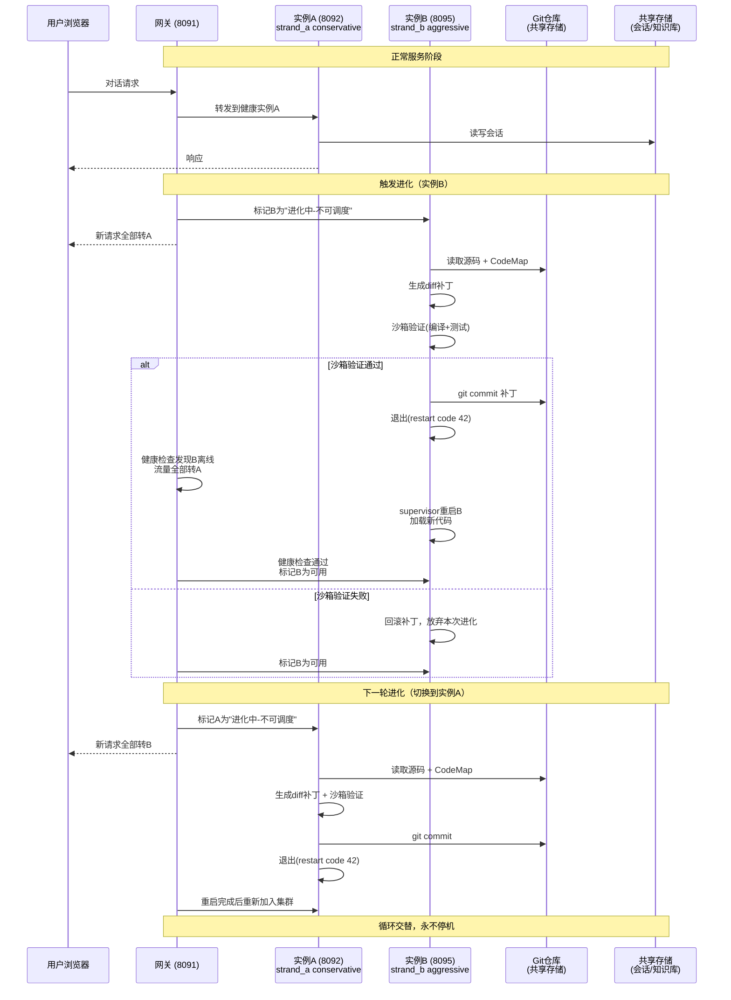
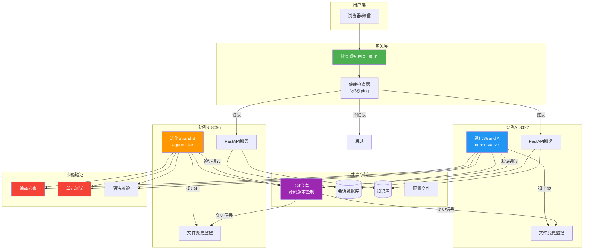

# OpenMate 双实例滚动进化架构

## 关键机制

### 1. 流量摘除
进化前，网关标记目标实例为"不可调度"，所有新请求路由到另一个实例。

### 2. 沙箱预校验
代码修改后，先在本地跑：语法检查 → 编译检查 → 单元测试。全部通过才git commit并重启。

### 3. 进化并发锁
全局文件锁 `data/evolution.lock`，同时只允许一个实例执行进化任务。

### 4. Git回滚
每次进化一个commit。重启后健康检查失败 → `git reset --hard HEAD~1` → 再次启动。

### 5. 共享存储
会话、知识库、配置不绑定实例本地磁盘，重启不丢数据。
